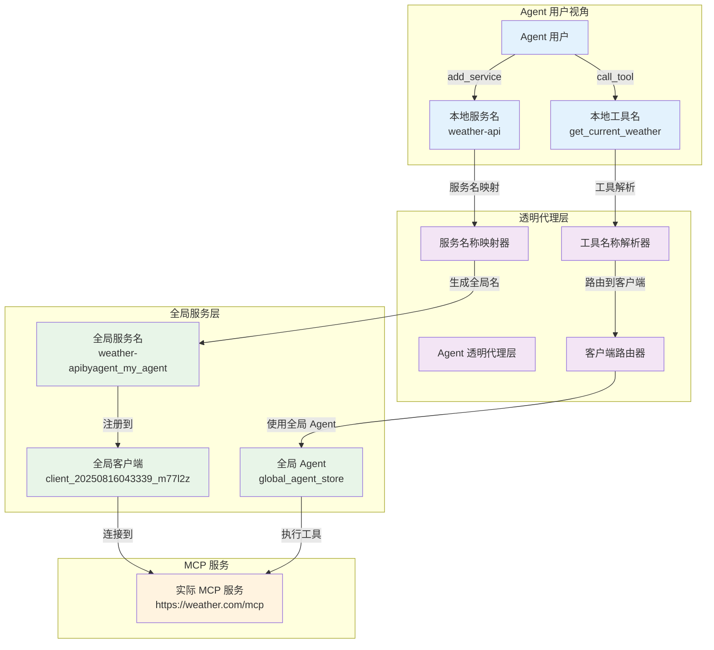
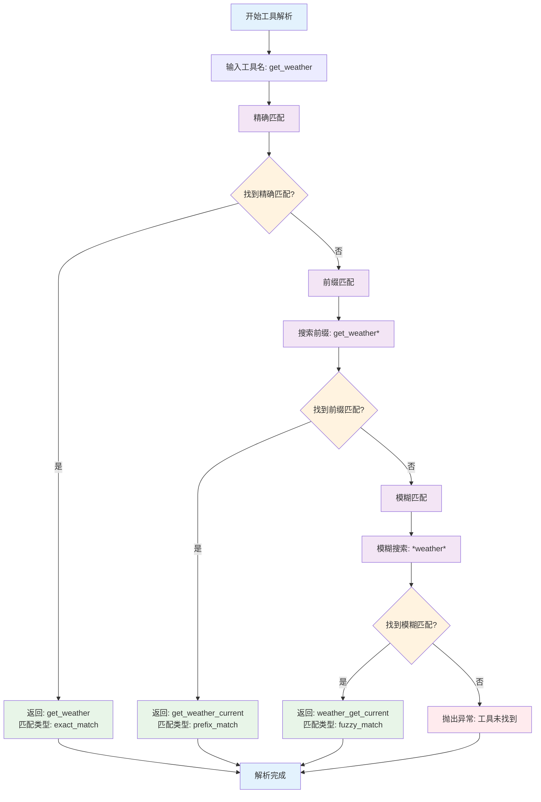
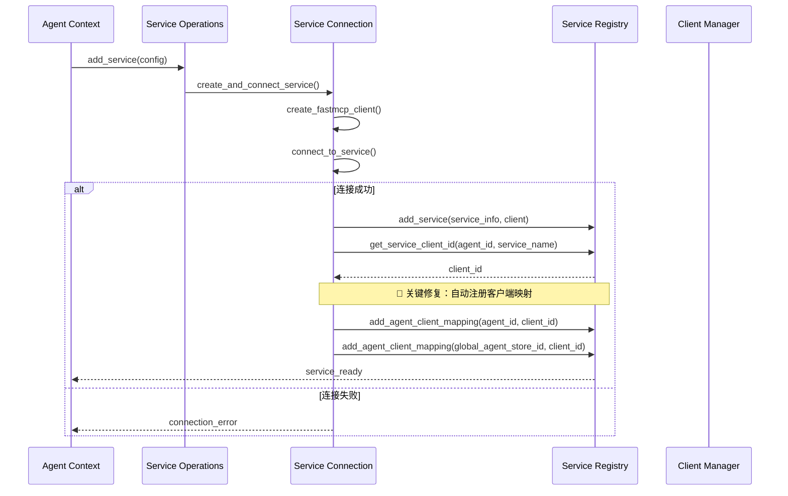

# Agent 透明代理机制

深入了解 MCPStore 的 Agent 透明代理机制，掌握多智能体场景下的服务隔离和工具调用。

## 🎯 Agent 透明代理概述

Agent 透明代理是 MCPStore 的核心创新功能，为多智能体系统提供完全隔离的服务空间，同时保持简洁的用户接口。

### 核心特性

- **🔒 完全隔离**: 每个 Agent 拥有独立的服务空间
- **🎭 透明代理**: Agent 无需关心底层服务名称映射
- **🧠 智能解析**: 支持多种工具名称匹配策略
- **⚡ 高性能**: 缓存优先，毫秒级响应
- **🔄 自动管理**: 自动处理客户端注册和映射

## 🏗️ 透明代理架构



## 🔧 服务名称映射机制

### 映射规则

Agent 透明代理使用以下规则进行服务名称映射：

```python
# 本地服务名 → 全局服务名
local_name = "weather-api"
agent_id = "my_agent"
global_name = f"{local_name}byagent_{agent_id}"
# 结果: "weather-apibyagent_my_agent"
```

### 映射示例

```python
from mcpstore import MCPStore

store = MCPStore.setup_store()

# Agent A 添加服务
agent_a = store.for_agent("research_agent")
agent_a.add_service({
    "name": "arxiv-api",  # 本地名称
    "url": "https://arxiv.example.com/mcp"
})
# 实际注册为: "arxiv-apibyagent_research_agent"

# Agent B 添加同名服务
agent_b = store.for_agent("analysis_agent")
agent_b.add_service({
    "name": "arxiv-api",  # 相同的本地名称
    "url": "https://different-arxiv.com/mcp"
})
# 实际注册为: "arxiv-apibyagent_analysis_agent"

# 两个 Agent 完全隔离，互不影响
print("Agent A 服务:", agent_a.list_services())  # 只看到 "arxiv-api"
print("Agent B 服务:", agent_b.list_services())  # 只看到 "arxiv-api"
print("Store 服务:", store.for_store().list_services())  # 看到两个全局名称
```

## 🎯 智能工具名称解析

### 解析策略

Agent 透明代理支持三种工具名称解析策略：

1. **精确匹配** (Exact Match)
2. **前缀匹配** (Prefix Match)  
3. **模糊匹配** (Fuzzy Match)

```python
class ToolResolution:
    """工具解析结果"""
    def __init__(self, tool_name: str, service_name: str, match_type: str):
        self.tool_name = tool_name      # 解析后的工具名
        self.service_name = service_name # 目标服务名
        self.match_type = match_type    # 匹配类型
```

### 解析流程



### 解析示例

```python
# 假设 Agent 有以下工具：
# - weather_get_current
# - weather_get_forecast  
# - calc_add
# - calc_multiply

agent = store.for_agent("my_agent")

# 1. 精确匹配
result1 = agent.call_tool("calc_add", {"a": 1, "b": 2})
# 解析: calc_add (exact_match)

# 2. 前缀匹配
result2 = agent.call_tool("weather_get", {"city": "北京"})
# 解析: weather_get_current (prefix_match)

# 3. 模糊匹配
result3 = agent.call_tool("forecast", {"city": "上海"})
# 解析: weather_get_forecast (fuzzy_match)

# 4. 未找到
try:
    result4 = agent.call_tool("unknown_tool", {})
except Exception as e:
    print(f"工具未找到: {e}")
```

## 🔗 客户端管理机制

### Agent 客户端映射

Agent 透明代理自动管理 Agent 与客户端的映射关系：

```python
# Agent 客户端映射结构
agent_clients = {
    "research_agent": ["client_001", "client_002"],
    "analysis_agent": ["client_003"],
    "global_agent_store": ["client_001", "client_002", "client_003"]
}
```

### 自动注册流程



## ⚡ 性能优化

### 缓存策略

Agent 透明代理采用多层缓存优化性能：

```python
# 1. 工具解析缓存
tool_resolution_cache = {
    "agent_id:tool_name": ToolResolution(...)
}

# 2. 服务映射缓存  
service_mapping_cache = {
    "agent_id:local_service": "global_service"
}

# 3. 客户端映射缓存
agent_clients_cache = {
    "agent_id": ["client_id1", "client_id2"]
}
```

### 性能指标

- **工具列表查询**: < 10ms (缓存命中)
- **工具名称解析**: < 5ms (缓存命中)
- **服务名称映射**: < 1ms (内存查找)
- **工具调用延迟**: 与直接调用相同

## 🔒 安全和隔离

### 隔离边界

```python
# Agent A 的隔离边界
agent_a = store.for_agent("agent_a")
agent_a_services = agent_a.list_services()    # 只看到 Agent A 的服务
agent_a_tools = agent_a.list_tools()          # 只看到 Agent A 的工具

# Agent B 的隔离边界
agent_b = store.for_agent("agent_b")
agent_b_services = agent_b.list_services()    # 只看到 Agent B 的服务
agent_b_tools = agent_b.list_tools()          # 只看到 Agent B 的工具

# 完全隔离：Agent A 无法访问 Agent B 的资源
assert len(set(agent_a_services) & set(agent_b_services)) == 0
```

### 权限控制

- **服务访问**: Agent 只能访问自己注册的服务
- **工具调用**: Agent 只能调用自己服务中的工具
- **配置隔离**: 每个 Agent 的配置完全独立
- **数据隔离**: Agent 数据存储完全分离

## 🚀 最佳实践

### 1. Agent 命名规范

```python
# 推荐：使用描述性的 Agent ID
research_agent = store.for_agent("research_agent")
analysis_agent = store.for_agent("analysis_agent")
data_processing_agent = store.for_agent("data_processing_agent")

# 避免：使用通用或模糊的 ID
# bad_agent = store.for_agent("agent1")
# bad_agent = store.for_agent("temp")
```

### 2. 服务命名规范

```python
# 推荐：使用清晰的本地服务名
agent.add_service({
    "name": "weather-api",      # 清晰的功能描述
    "url": "https://weather.example.com/mcp"
})

agent.add_service({
    "name": "database-query",   # 明确的用途
    "command": "python",
    "args": ["db_service.py"]
})
```

### 3. 工具调用最佳实践

```python
# 推荐：使用具体的工具名称
result = agent.call_tool("get_current_weather", {"city": "北京"})

# 可接受：使用前缀（依赖智能解析）
result = agent.call_tool("get_weather", {"city": "北京"})

# 避免：过于模糊的工具名称
# result = agent.call_tool("weather", {"city": "北京"})
```

## 🔧 故障排除

### 常见问题

1. **工具未找到**
   ```python
   # 检查工具是否存在
   tools = agent.list_tools()
   print("可用工具:", [t['name'] for t in tools])
   ```

2. **服务连接失败**
   ```python
   # 检查服务状态
   services = agent.list_services()
   for service in services:
       status = agent.get_service_status(service['name'])
       print(f"服务 {service['name']} 状态: {status}")
   ```

3. **客户端映射问题**
   ```python
   # 检查客户端映射（调试模式）
   store = MCPStore.setup_store(debug=True)
   # 查看日志中的客户端注册信息
   ```

### 调试技巧

```python
# 启用调试模式
store = MCPStore.setup_store(debug=True)

# 查看详细的工具解析过程
agent = store.for_agent("debug_agent")
result = agent.call_tool("partial_tool_name", {})
# 日志会显示完整的解析过程
```

## 相关文档

- [核心概念](concepts.md) - 理解设计理念
- [系统架构](architecture.md) - 详细架构设计
- [Context 类](../api-reference/context-class.md) - API 参考

## 下一步

- 学习 [多智能体最佳实践](best-practices.md)
- 了解 [性能优化技巧](performance-optimization.md)
- 掌握 [监控和调试方法](monitoring.md)

---

**更新时间**: 2025-01-16  
**版本**: 1.0.0
