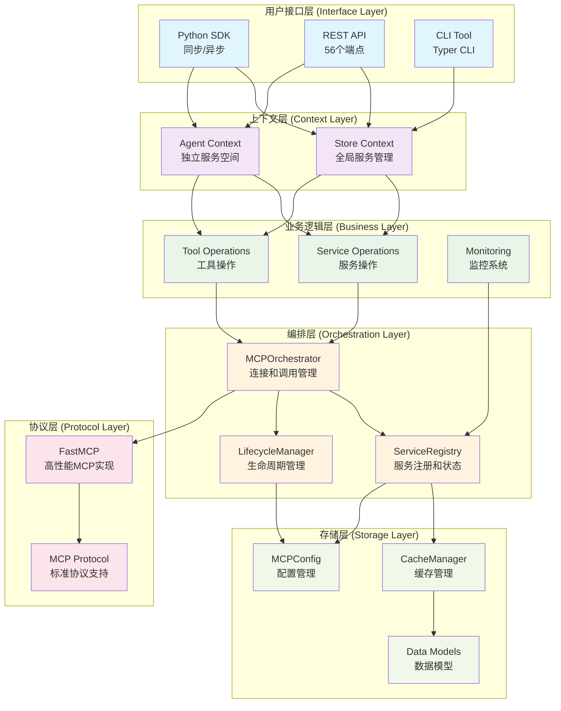
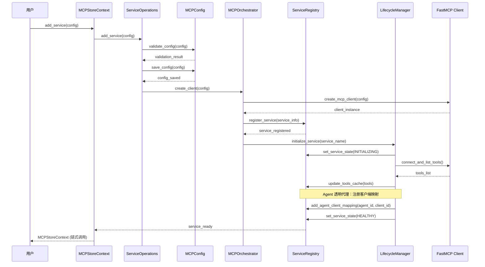
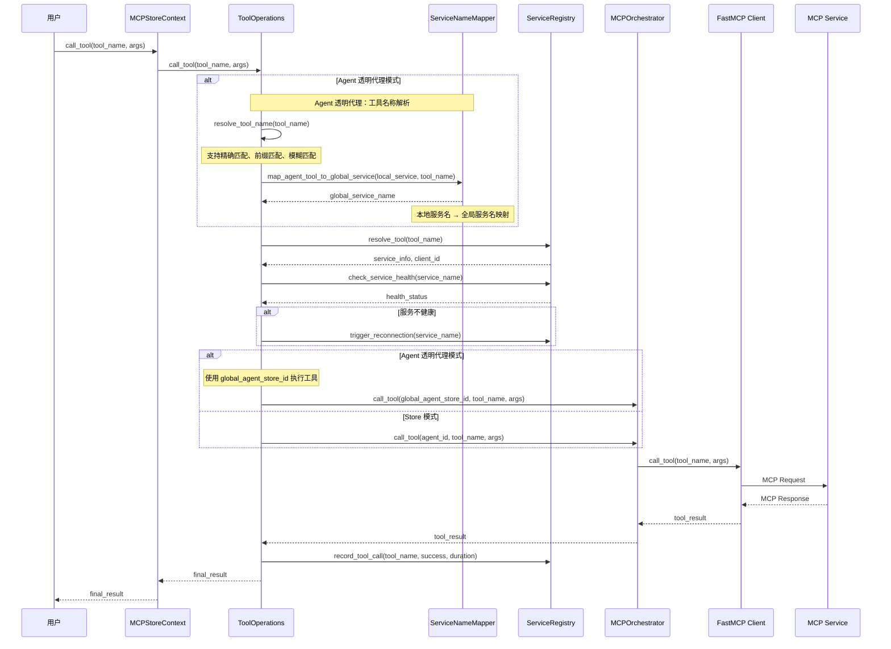
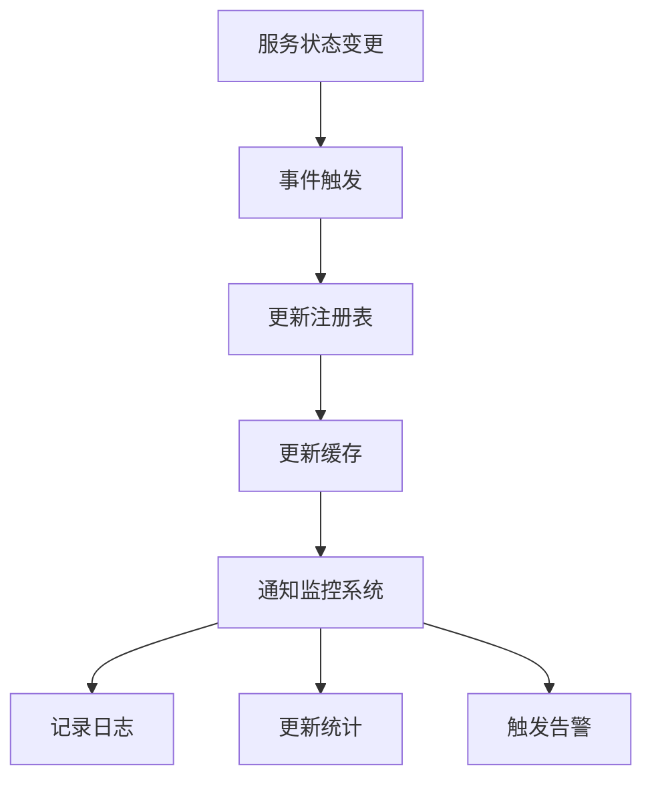
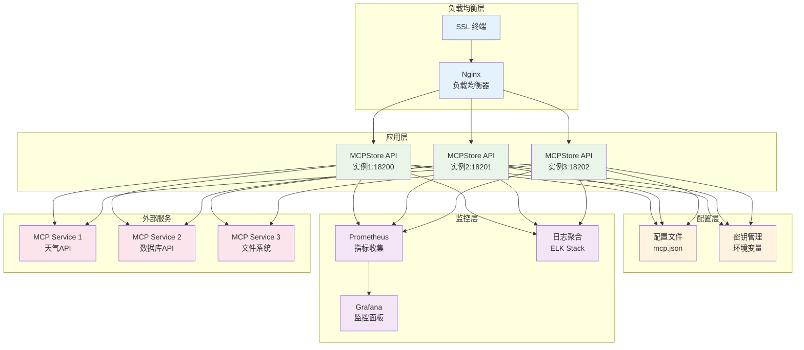

# 系统架构

深入了解 MCPStore 的系统架构设计，掌握企业级 MCP 工具管理平台的技术实现。

## 🏗️ 整体架构概览

MCPStore 采用现代化的分层架构设计，确保可扩展性、可维护性和高性能：



## 🎯 核心组件详解

### 1. MCPStore 主类 (Entry Point)

MCPStore 是系统的主入口，采用静态工厂模式：

```python
class MCPStore:
    """智能体工具服务存储主类"""
    
    @staticmethod
    def setup_store(mcp_config_file=None, debug=False, monitoring=None) -> MCPStore:
        """静态工厂方法，推荐的初始化方式"""
        
    def for_store(self) -> MCPStoreContext:
        """获取 Store 级别上下文"""
        
    def for_agent(self, agent_id: str) -> MCPStoreContext:
        """获取 Agent 级别上下文"""
        
    def start_api_server(self, host="0.0.0.0", port=18200):
        """启动内置 HTTP API 服务器"""
```

**设计特点**:
- **单例模式**: 每个配置文件对应一个实例
- **延迟初始化**: 组件按需创建和缓存
- **数据空间隔离**: 支持多项目独立配置

### 2. 上下文层 (Context Layer)

#### MCPStoreContext 类

上下文层是 MCPStore 的核心创新，提供统一的操作接口：

```python
class MCPStoreContext:
    """MCPStore 操作上下文"""
    
    def __init__(self, store: MCPStore, context_type: ContextType, agent_id: str = None):
        self.context_type = context_type  # STORE 或 AGENT
        self.agent_id = agent_id
        self._service_mapper = ServiceNameMapper()  # 服务名称映射
        
    # 服务操作
    def add_service(self, config) -> 'MCPStoreContext'
    def list_services(self) -> List[ServiceInfo]
    def restart_service(self, name: str) -> bool
    
    # 工具操作  
    def list_tools(self) -> List[ToolInfo]
    def call_tool(self, tool_name: str, args: dict) -> Any
    
    # LangChain 集成
    def for_langchain(self) -> 'LangChainAdapter'
```

#### 上下文切换机制

```python
# Store 模式：全局服务管理
store_context = store.for_store()
store_context.add_service({"name": "global-service", "url": "https://api.com/mcp"})

# Agent 模式：独立服务空间  
agent_context = store.for_agent("agent1")
agent_context.add_service({"name": "agent-service", "url": "https://agent.com/mcp"})

# 服务名称自动映射
# Store 看到: ["global-service", "agent-servicebyagent1"]
# Agent 看到: ["agent-service"]  # 隐藏后缀
```

### 3. 业务逻辑层 (Business Layer)

业务逻辑层采用模块化设计，每个模块负责特定功能：

#### 服务操作模块 (service_operations.py)

```python
class ServiceOperations:
    """服务操作业务逻辑"""
    
    def add_service(self, config, json_file=None):
        """添加服务，支持多种配置格式"""
        
    def list_services(self) -> List[ServiceInfo]:
        """获取服务列表（缓存查询）"""
        
    def get_service_info(self, name: str):
        """获取服务详细信息"""
        
    def batch_add_services(self, services: List):
        """批量添加服务"""
```

#### 工具操作模块 (tool_operations.py)

```python
class ToolOperations:
    """工具操作业务逻辑 - 支持 Agent 透明代理"""

    def list_tools(self) -> List[ToolInfo]:
        """获取工具列表（缓存查询）"""

    def call_tool(self, tool_name: str, args: dict):
        """调用工具（统一接口，支持 Agent 透明代理）"""

    def _resolve_tool_name(self, tool_name: str) -> ToolResolution:
        """智能工具名称解析：精确匹配 → 前缀匹配 → 模糊匹配"""

    def _map_agent_tool_to_global_service(self, local_service: str, tool_name: str) -> str:
        """Agent 透明代理：本地服务名映射到全局服务名"""

    def get_tools_with_stats(self) -> Dict[str, Any]:
        """获取工具列表和统计信息"""
```

#### 监控操作模块 (monitoring_operations.py)

```python
class MonitoringOperations:
    """监控系统业务逻辑"""
    
    def check_services(self) -> Dict[str, Any]:
        """执行服务健康检查"""
        
    def get_system_stats(self) -> Dict[str, Any]:
        """获取系统统计信息"""
```

### 4. 编排层 (Orchestration Layer)

#### MCPOrchestrator 编排器

编排器负责管理 MCP 连接和调用：

```python
class MCPOrchestrator:
    """MCP 编排器 - 连接和调用管理"""
    
    def __init__(self):
        self.clients: Dict[str, Any] = {}  # 客户端连接池
        self.connection_manager = ConnectionManager()
        
    async def call_tool(self, client_id: str, tool_name: str, args: dict):
        """调用工具（异步）"""
        
    def restart_service(self, service_name: str, agent_id: str = None) -> bool:
        """重启服务"""
        
    def get_client_tools(self, client_id: str) -> List[ToolInfo]:
        """获取客户端工具列表"""
```

#### ServiceRegistry 服务注册表

服务注册表管理服务状态和元数据，支持 Agent 客户端映射：

```python
class ServiceRegistry:
    """服务注册表 - 服务状态管理和 Agent 客户端映射"""

    def __init__(self):
        self.services: Dict[str, ServiceInfo] = {}
        self.tools: Dict[str, List[ToolInfo]] = {}
        self.agent_clients: Dict[str, List[str]] = {}  # Agent-Client 映射

    def register_service(self, service_info: ServiceInfo):
        """注册服务"""

    def update_service_status(self, service_name: str, status: ServiceConnectionState):
        """更新服务状态"""

    def add_agent_client_mapping(self, agent_id: str, client_id: str):
        """添加 Agent-Client 映射（支持 Agent 透明代理）"""

    def get_agent_clients(self, agent_id: str) -> List[str]:
        """获取 Agent 的客户端列表"""

    def get_all_services(self) -> List[ServiceInfo]:
        """获取所有服务（缓存查询）"""
```

### 5. 数据管理层 (Data Management)

#### 配置管理

```python
class MCPConfig:
    """MCP 配置管理器"""
    
    def __init__(self, config_file: str):
        self.config_file = config_file
        self.data_dir = Path(config_file).parent  # 数据空间目录
        
    def load_config(self) -> Dict[str, Any]:
        """加载配置文件"""
        
    def save_config(self, config: Dict[str, Any]):
        """保存配置文件"""
        
    def validate_config(self, config: Dict[str, Any]) -> bool:
        """验证配置格式"""
```

#### 客户端管理（已精简）

```python
# 单源模式：不再使用分片文件，映射仅存于内存缓存
class ClientManager:
    """客户端管理器（兼容保留）"""

    def __init__(self, data_dir: Path):
        pass  # 不再依赖 agent_clients.json 或 client_services.json

    # Agent-Client 映射统一交由 ServiceRegistry 内存缓存维护
```

## 🔄 数据流架构

### 服务注册流程



### 工具调用流程



## 🚀 性能优化架构

### 1. 缓存优先设计

MCPStore 采用缓存优先的架构：

```python
# 查询操作：直接从缓存返回
services = store.for_store().list_services()  # < 100ms
tools = store.for_store().list_tools()        # < 100ms

# 管理操作：触发缓存更新
store.for_store().add_service(config)         # 更新缓存
store.for_store().restart_service(name)       # 更新状态
```

### 2. 异步优先架构

所有 I/O 操作都提供异步版本：

```python
# 同步版本（内部调用异步）
result = store.for_store().call_tool(name, args)

# 异步版本（直接异步调用）
result = await store.for_store().call_tool_async(name, args)
```

### 3. 连接池管理

```python
class ConnectionManager:
    """连接池管理器"""
    
    def __init__(self):
        self.http_pool = HTTPConnectionPool()
        self.stdio_pool = StdioConnectionPool()
        
    def get_connection(self, service_config):
        """获取连接（复用现有连接）"""
        
    def cleanup_idle_connections(self):
        """清理空闲连接"""
```

## 🔐 安全架构

### 1. 多层隔离机制

```python
# 数据空间隔离
project_a = MCPStore.setup_store("project_a/mcp.json")
project_b = MCPStore.setup_store("project_b/mcp.json")

# Agent 级别隔离
agent1 = store.for_agent("agent1")  # 独立服务空间
agent2 = store.for_agent("agent2")  # 独立服务空间

# 配置文件隔离
# project_a/ 和 project_b/ 完全独立
```

### 2. 权限控制

```python
class ServiceNameMapper:
    """服务名称映射器 - 实现访问控制"""
    
    def map_to_global_name(self, local_name: str, agent_id: str) -> str:
        """本地名称 → 全局名称"""
        
    def map_to_local_name(self, global_name: str, agent_id: str) -> str:
        """全局名称 → 本地名称"""
        
    def filter_agent_services(self, services: List[ServiceInfo], agent_id: str):
        """过滤 Agent 可访问的服务"""
```

## 📊 监控架构

### 分层监控策略

```python
class MonitoringSystem:
    """分层监控系统"""
    
    def __init__(self, config: dict):
        self.health_monitor = HealthMonitor(config["health_check_seconds"])
        self.tools_monitor = ToolsUpdateMonitor(config["tools_update_hours"])
        
    def start_monitoring(self):
        """启动监控系统"""
        self.health_monitor.start()    # 30秒间隔健康检查
        self.tools_monitor.start()     # 2小时间隔工具更新
```

### 监控数据流



## 🔌 扩展架构

### 插件化设计

MCPStore 支持多种插件扩展：

```python
# 配置插件
class ConfigPlugin:
    def load_config(self, path: str) -> dict
    def validate_config(self, config: dict) -> bool

# 传输插件  
class TransportPlugin:
    def create_client(self, config: dict) -> Any
    def call_tool(self, client: Any, name: str, args: dict) -> Any

# 监控插件
class MonitoringPlugin:
    def on_service_status_change(self, service: str, status: str)
    def on_tool_call(self, tool: str, args: dict, result: Any)
```

### 适配器架构

```python
class LangChainAdapter:
    """LangChain 适配器"""
    
    def list_tools(self) -> List[Tool]:
        """转换为 LangChain Tool 对象"""
        
    def _enhance_description(self, tool_info: ToolInfo) -> str:
        """增强工具描述"""
        
    def _convert_schema(self, input_schema: dict) -> Type[BaseModel]:
        """转换参数 Schema"""
```

## 🚀 部署架构

### 单机部署

```python
# 开发环境
store = MCPStore.setup_store(debug=True)
store.start_api_server(host="127.0.0.1", port=8080, reload=True)

# 生产环境
store = MCPStore.setup_store(
    mcp_config_file="production/mcp.json",
    monitoring={
        "health_check_seconds": 60,
        "tools_update_hours": 4
    }
)
store.start_api_server(host="0.0.0.0", port=18200)
```

### 容器化部署

```dockerfile
FROM python:3.11-slim

WORKDIR /app
COPY requirements.txt .
RUN pip install -r requirements.txt

COPY . .
EXPOSE 18200

CMD ["python", "-m", "mcpstore.cli", "run", "api", "--host", "0.0.0.0"]
```

### 微服务架构



```yaml
# docker-compose.yml
version: '3.8'
services:
  mcpstore-api:
    build: .
    ports:
      - "18200:18200"
    volumes:
      - ./config:/app/config
    environment:
      - MCPSTORE_CONFIG=/app/config/mcp.json

  nginx:
    image: nginx:alpine
    ports:
      - "80:80"
    volumes:
      - ./nginx.conf:/etc/nginx/nginx.conf
```

## 📈 可扩展性考虑

### 水平扩展

- **无状态设计**: API 服务器无状态，支持负载均衡
- **配置外部化**: 配置文件和数据目录可外部挂载
- **连接池**: 支持连接复用和池化管理

### 垂直扩展

- **异步处理**: 高并发异步 I/O
- **缓存优化**: 多层缓存减少延迟
- **资源管理**: 智能资源分配和清理

## 相关文档

- [核心概念](concepts.md) - 理解设计理念
- [最佳实践](best-practices.md) - 架构使用指南
- [插件开发](plugin-development.md) - 扩展开发

## 下一步

- 学习 [插件开发方法](plugin-development.md)
- 掌握 [最佳实践指南](best-practices.md)
- 了解 [自定义适配器](custom-adapters.md)
