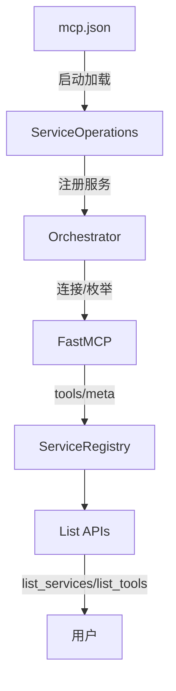

# 缓存架构（Registry 为唯一权威）

本页描述最新缓存机制：所有查询均来源于内存“注册表缓存”（ServiceRegistry），不再回退分片文件。

## 🧱 缓存层次
- Registry 缓存（权威）：
  - 服务元数据（状态、端点、名称映射）
  - 工具定义（工具列表与元信息）
  - Agent 映射（仅内存，不再持久化分片）
- 运行期统计：
  - 调用次数、成功率、时延分布
  - 失败计数、连续失败次数（供生命周期使用）

## 🔁 缓存更新触发
- 注册/重连：连接成功后由 Orchestrator._update_service_cache() 全量写入工具定义与映射
- 工具变化（运行期）：ToolsUpdateMonitor 检测到差异 → 触发 ServiceContentManager.force_update_service_content() → 全量刷新 tool_cache
- add_service/update/delete：更新 mcp.json 后由 UnifiedMCPSyncManager 同步并驱动注册/重连，刷新缓存
- 工具调用：记录统计数据但不改变定义缓存

## 🚫 不再存在
- agent_clients.json / client_services.json 分片文件
- 从分片文件回退读取的逻辑

## 🧪 一致性策略
- 单源 mcp.json + 运行期内存缓存
- 启动顺序：mcp.json → 注册 → FastMCP 连接 → Registry 缓存
- 若缓存缺失：属于未初始化/失败状态，通过生命周期机制处理（不回退磁盘分片）

## 🧭 查询路径
- list_services(): Registry.services
- list_tools(): Registry.tools
- get_service_info(): Registry.services[name]

更新时间：2025-08-18

