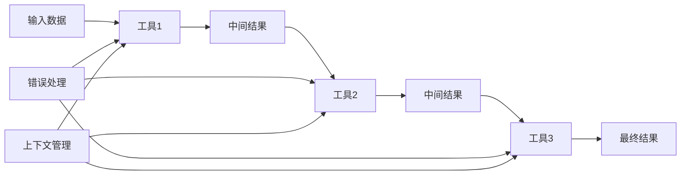

# 链式调用机制

## 📋 概述

MCPStore 的链式调用机制允许您将多个工具调用串联起来，形成复杂的工作流。通过链式调用，可以实现数据在工具间的流转，构建强大的自动化流程。

## 🏗️ 链式调用架构



## 🔧 基础链式调用

### 简单链式调用

```python
from mcpstore import MCPStore

# 初始化 MCPStore
store = MCPStore()

# 添加服务
store.add_service({
    "mcpServers": {
        "filesystem": {
            "command": "npx",
            "args": ["-y", "@modelcontextprotocol/server-filesystem", "/tmp"]
        }
    }
})

# 基础链式调用示例
def simple_file_chain(store, content, filename):
    """简单的文件处理链"""
    
    # 步骤1: 写入文件
    write_result = store.call_tool("write_file", {
        "path": f"/tmp/{filename}",
        "content": content
    })
    
    if not write_result.get("success"):
        raise Exception(f"写入文件失败: {write_result}")
    
    # 步骤2: 读取文件验证
    read_result = store.call_tool("read_file", {
        "path": f"/tmp/{filename}"
    })
    
    if not read_result.get("success"):
        raise Exception(f"读取文件失败: {read_result}")
    
    # 步骤3: 获取文件信息
    stat_result = store.call_tool("get_file_info", {
        "path": f"/tmp/{filename}"
    })
    
    return {
        "write_result": write_result,
        "read_result": read_result,
        "stat_result": stat_result,
        "content_verified": read_result.get("content") == content
    }

# 使用简单链式调用
try:
    result = simple_file_chain(store, "Hello, World!", "test.txt")
    print(f"✅ 链式调用成功: {result['content_verified']}")
except Exception as e:
    print(f"❌ 链式调用失败: {e}")
```

### 链式调用类

```python
class ToolChain:
    """工具链类"""
    
    def __init__(self, store):
        self.store = store
        self.steps = []
        self.context = {}
        self.results = []
    
    def add_step(self, tool_name, arguments=None, transform=None, condition=None):
        """添加链式步骤
        
        Args:
            tool_name: 工具名称
            arguments: 工具参数（可以是函数，用于动态生成）
            transform: 结果转换函数
            condition: 执行条件函数
        """
        step = {
            "tool_name": tool_name,
            "arguments": arguments or {},
            "transform": transform,
            "condition": condition
        }
        self.steps.append(step)
        return self
    
    def execute(self, initial_context=None):
        """执行工具链"""
        if initial_context:
            self.context.update(initial_context)
        
        self.results = []
        
        for i, step in enumerate(self.steps):
            try:
                # 检查执行条件
                if step["condition"] and not step["condition"](self.context):
                    print(f"⏭️ 跳过步骤 {i+1}: 条件不满足")
                    continue
                
                # 准备参数
                if callable(step["arguments"]):
                    arguments = step["arguments"](self.context)
                else:
                    arguments = step["arguments"]
                
                print(f"🔧 执行步骤 {i+1}: {step['tool_name']}")
                
                # 调用工具
                result = self.store.call_tool(step["tool_name"], arguments)
                
                # 转换结果
                if step["transform"]:
                    result = step["transform"](result, self.context)
                
                # 保存结果
                self.results.append(result)
                
                # 更新上下文
                self.context[f"step_{i+1}_result"] = result
                self.context["last_result"] = result
                
                print(f"✅ 步骤 {i+1} 完成")
                
            except Exception as e:
                print(f"❌ 步骤 {i+1} 失败: {e}")
                self.results.append({"error": str(e)})
                
                # 可以选择继续或停止
                if self._should_stop_on_error(step, e):
                    raise e
        
        return self.results
    
    def _should_stop_on_error(self, step, error):
        """判断是否应该在错误时停止"""
        # 可以根据步骤配置或错误类型决定
        return True  # 默认停止

# 使用工具链
chain = ToolChain(store)

# 构建文件处理链
chain.add_step(
    "write_file",
    arguments=lambda ctx: {
        "path": f"/tmp/{ctx['filename']}",
        "content": ctx["content"]
    }
).add_step(
    "read_file", 
    arguments=lambda ctx: {"path": f"/tmp/{ctx['filename']}"},
    transform=lambda result, ctx: {
        **result,
        "content_match": result.get("content") == ctx["content"]
    }
).add_step(
    "list_directory",
    arguments={"path": "/tmp"},
    condition=lambda ctx: ctx["last_result"].get("content_match", False)
)

# 执行链
try:
    results = chain.execute({
        "filename": "chain_test.txt",
        "content": "This is a chain test!"
    })
    print(f"🎯 链式调用完成，共 {len(results)} 个步骤")
except Exception as e:
    print(f"💥 链式调用失败: {e}")
```

## 🔄 高级链式调用

### 并行链式调用

```python
import threading
from concurrent.futures import ThreadPoolExecutor, as_completed

class ParallelToolChain:
    """并行工具链"""
    
    def __init__(self, store, max_workers=3):
        self.store = store
        self.max_workers = max_workers
        self.parallel_groups = []
        self.sequential_steps = []
    
    def add_parallel_group(self, steps):
        """添加并行执行组"""
        self.parallel_groups.append(steps)
        return self
    
    def add_sequential_step(self, tool_name, arguments=None):
        """添加顺序执行步骤"""
        self.sequential_steps.append({
            "tool_name": tool_name,
            "arguments": arguments or {}
        })
        return self
    
    def execute(self, context=None):
        """执行并行链"""
        context = context or {}
        all_results = []
        
        # 执行并行组
        for group_index, group in enumerate(self.parallel_groups):
            print(f"🔀 执行并行组 {group_index + 1}")
            
            with ThreadPoolExecutor(max_workers=self.max_workers) as executor:
                # 提交所有并行任务
                future_to_step = {}
                for step in group:
                    future = executor.submit(
                        self._execute_step, 
                        step, 
                        context.copy()
                    )
                    future_to_step[future] = step
                
                # 收集结果
                group_results = []
                for future in as_completed(future_to_step):
                    step = future_to_step[future]
                    try:
                        result = future.result()
                        group_results.append(result)
                        print(f"✅ 并行步骤完成: {step['tool_name']}")
                    except Exception as e:
                        print(f"❌ 并行步骤失败: {step['tool_name']} - {e}")
                        group_results.append({"error": str(e)})
                
                all_results.append(group_results)
                
                # 更新上下文
                context[f"parallel_group_{group_index + 1}"] = group_results
        
        # 执行顺序步骤
        for step_index, step in enumerate(self.sequential_steps):
            print(f"➡️ 执行顺序步骤 {step_index + 1}: {step['tool_name']}")
            
            try:
                result = self._execute_step(step, context)
                all_results.append(result)
                context[f"sequential_step_{step_index + 1}"] = result
                print(f"✅ 顺序步骤完成: {step['tool_name']}")
                
            except Exception as e:
                print(f"❌ 顺序步骤失败: {step['tool_name']} - {e}")
                all_results.append({"error": str(e)})
                break
        
        return all_results
    
    def _execute_step(self, step, context):
        """执行单个步骤"""
        arguments = step["arguments"]
        if callable(arguments):
            arguments = arguments(context)
        
        return self.store.call_tool(step["tool_name"], arguments)

# 使用并行链
parallel_chain = ParallelToolChain(store, max_workers=3)

# 添加并行文件操作组
parallel_chain.add_parallel_group([
    {
        "tool_name": "write_file",
        "arguments": {"path": "/tmp/file1.txt", "content": "Content 1"}
    },
    {
        "tool_name": "write_file", 
        "arguments": {"path": "/tmp/file2.txt", "content": "Content 2"}
    },
    {
        "tool_name": "write_file",
        "arguments": {"path": "/tmp/file3.txt", "content": "Content 3"}
    }
])

# 添加顺序验证步骤
parallel_chain.add_sequential_step(
    "list_directory",
    {"path": "/tmp"}
)

# 执行并行链
results = parallel_chain.execute()
print(f"🎯 并行链完成，结果: {len(results)} 组")
```

### 条件分支链

```python
class ConditionalChain:
    """条件分支链"""
    
    def __init__(self, store):
        self.store = store
        self.branches = {}
        self.default_branch = None
    
    def add_branch(self, condition, steps, name=None):
        """添加条件分支
        
        Args:
            condition: 条件函数，接收上下文，返回布尔值
            steps: 该分支的步骤列表
            name: 分支名称
        """
        branch_name = name or f"branch_{len(self.branches) + 1}"
        self.branches[branch_name] = {
            "condition": condition,
            "steps": steps
        }
        return self
    
    def set_default_branch(self, steps):
        """设置默认分支"""
        self.default_branch = steps
        return self
    
    def execute(self, context=None):
        """执行条件链"""
        context = context or {}
        
        # 查找匹配的分支
        selected_branch = None
        selected_name = None
        
        for branch_name, branch in self.branches.items():
            if branch["condition"](context):
                selected_branch = branch["steps"]
                selected_name = branch_name
                break
        
        # 如果没有匹配的分支，使用默认分支
        if selected_branch is None:
            if self.default_branch:
                selected_branch = self.default_branch
                selected_name = "default"
            else:
                raise Exception("没有匹配的分支且未设置默认分支")
        
        print(f"🎯 选择分支: {selected_name}")
        
        # 执行选中的分支
        results = []
        for i, step in enumerate(selected_branch):
            try:
                print(f"🔧 执行分支步骤 {i+1}: {step['tool_name']}")
                
                arguments = step["arguments"]
                if callable(arguments):
                    arguments = arguments(context)
                
                result = self.store.call_tool(step["tool_name"], arguments)
                results.append(result)
                
                # 更新上下文
                context[f"branch_step_{i+1}"] = result
                context["last_result"] = result
                
                print(f"✅ 分支步骤 {i+1} 完成")
                
            except Exception as e:
                print(f"❌ 分支步骤 {i+1} 失败: {e}")
                results.append({"error": str(e)})
                break
        
        return {
            "selected_branch": selected_name,
            "results": results
        }

# 使用条件分支链
conditional_chain = ConditionalChain(store)

# 添加文件大小检查分支
conditional_chain.add_branch(
    condition=lambda ctx: ctx.get("file_size", 0) > 1000,
    steps=[
        {
            "tool_name": "write_file",
            "arguments": lambda ctx: {
                "path": f"/tmp/large_{ctx['filename']}",
                "content": ctx["content"]
            }
        }
    ],
    name="large_file"
).add_branch(
    condition=lambda ctx: ctx.get("file_size", 0) <= 1000,
    steps=[
        {
            "tool_name": "write_file", 
            "arguments": lambda ctx: {
                "path": f"/tmp/small_{ctx['filename']}",
                "content": ctx["content"]
            }
        }
    ],
    name="small_file"
).set_default_branch([
    {
        "tool_name": "write_file",
        "arguments": lambda ctx: {
            "path": f"/tmp/default_{ctx['filename']}",
            "content": ctx["content"]
        }
    }
])

# 执行条件链
test_context = {
    "filename": "test.txt",
    "content": "A" * 500,  # 500字符
    "file_size": 500
}

result = conditional_chain.execute(test_context)
print(f"🎯 条件链完成，选择分支: {result['selected_branch']}")
```

## 🔄 链式调用模式

### 管道模式

```python
class Pipeline:
    """管道模式链式调用"""
    
    def __init__(self, store):
        self.store = store
        self.processors = []
    
    def add_processor(self, processor):
        """添加处理器"""
        self.processors.append(processor)
        return self
    
    def process(self, initial_data):
        """处理数据"""
        data = initial_data
        
        for i, processor in enumerate(self.processors):
            try:
                print(f"🔄 管道步骤 {i+1}: {processor.__name__}")
                data = processor(self.store, data)
                print(f"✅ 管道步骤 {i+1} 完成")
            except Exception as e:
                print(f"❌ 管道步骤 {i+1} 失败: {e}")
                raise e
        
        return data

# 定义处理器函数
def write_to_file(store, data):
    """写入文件处理器"""
    result = store.call_tool("write_file", {
        "path": data["file_path"],
        "content": data["content"]
    })
    
    return {
        **data,
        "write_result": result,
        "file_written": True
    }

def read_and_verify(store, data):
    """读取验证处理器"""
    result = store.call_tool("read_file", {
        "path": data["file_path"]
    })
    
    return {
        **data,
        "read_result": result,
        "content_verified": result.get("content") == data["content"]
    }

def get_file_stats(store, data):
    """获取文件统计处理器"""
    result = store.call_tool("get_file_info", {
        "path": data["file_path"]
    })
    
    return {
        **data,
        "stats_result": result,
        "file_size": result.get("size", 0)
    }

# 使用管道
pipeline = Pipeline(store)
pipeline.add_processor(write_to_file) \
        .add_processor(read_and_verify) \
        .add_processor(get_file_stats)

# 处理数据
initial_data = {
    "file_path": "/tmp/pipeline_test.txt",
    "content": "Pipeline test content"
}

try:
    final_data = pipeline.process(initial_data)
    print(f"🎯 管道处理完成: {final_data['content_verified']}")
except Exception as e:
    print(f"💥 管道处理失败: {e}")
```

### 工作流模式

```python
from enum import Enum

class WorkflowStatus(Enum):
    PENDING = "pending"
    RUNNING = "running"
    COMPLETED = "completed"
    FAILED = "failed"
    CANCELLED = "cancelled"

class WorkflowStep:
    """工作流步骤"""
    
    def __init__(self, name, tool_name, arguments=None, dependencies=None):
        self.name = name
        self.tool_name = tool_name
        self.arguments = arguments or {}
        self.dependencies = dependencies or []
        self.status = WorkflowStatus.PENDING
        self.result = None
        self.error = None

class Workflow:
    """工作流引擎"""
    
    def __init__(self, store):
        self.store = store
        self.steps = {}
        self.execution_order = []
    
    def add_step(self, step):
        """添加工作流步骤"""
        self.steps[step.name] = step
        return self
    
    def execute(self, context=None):
        """执行工作流"""
        context = context or {}
        
        # 计算执行顺序
        self._calculate_execution_order()
        
        print(f"🚀 开始执行工作流，共 {len(self.execution_order)} 个步骤")
        
        for step_name in self.execution_order:
            step = self.steps[step_name]
            
            try:
                # 检查依赖
                if not self._check_dependencies(step):
                    step.status = WorkflowStatus.FAILED
                    step.error = "依赖步骤未完成"
                    print(f"❌ 步骤 {step_name} 依赖检查失败")
                    continue
                
                # 执行步骤
                print(f"🔧 执行步骤: {step_name}")
                step.status = WorkflowStatus.RUNNING
                
                # 准备参数
                arguments = step.arguments
                if callable(arguments):
                    arguments = arguments(context)
                
                # 调用工具
                result = self.store.call_tool(step.tool_name, arguments)
                
                step.result = result
                step.status = WorkflowStatus.COMPLETED
                
                # 更新上下文
                context[step_name] = result
                
                print(f"✅ 步骤 {step_name} 完成")
                
            except Exception as e:
                step.status = WorkflowStatus.FAILED
                step.error = str(e)
                print(f"❌ 步骤 {step_name} 失败: {e}")
                
                # 可以选择继续或停止
                if self._should_stop_on_failure(step):
                    break
        
        return self._get_workflow_result()
    
    def _calculate_execution_order(self):
        """计算执行顺序（拓扑排序）"""
        visited = set()
        order = []
        
        def visit(step_name):
            if step_name in visited:
                return
            
            visited.add(step_name)
            step = self.steps[step_name]
            
            # 先访问依赖
            for dep in step.dependencies:
                if dep in self.steps:
                    visit(dep)
            
            order.append(step_name)
        
        for step_name in self.steps:
            visit(step_name)
        
        self.execution_order = order
    
    def _check_dependencies(self, step):
        """检查步骤依赖"""
        for dep_name in step.dependencies:
            if dep_name not in self.steps:
                return False
            
            dep_step = self.steps[dep_name]
            if dep_step.status != WorkflowStatus.COMPLETED:
                return False
        
        return True
    
    def _should_stop_on_failure(self, step):
        """判断是否应该在失败时停止"""
        # 可以根据步骤配置决定
        return True  # 默认停止
    
    def _get_workflow_result(self):
        """获取工作流结果"""
        completed = sum(1 for step in self.steps.values() if step.status == WorkflowStatus.COMPLETED)
        failed = sum(1 for step in self.steps.values() if step.status == WorkflowStatus.FAILED)
        
        return {
            "total_steps": len(self.steps),
            "completed": completed,
            "failed": failed,
            "success_rate": completed / len(self.steps) * 100,
            "steps": {name: {
                "status": step.status.value,
                "result": step.result,
                "error": step.error
            } for name, step in self.steps.items()}
        }

# 使用工作流
workflow = Workflow(store)

# 添加工作流步骤
workflow.add_step(WorkflowStep(
    name="create_directory",
    tool_name="create_directory",
    arguments={"path": "/tmp/workflow_test"}
))

workflow.add_step(WorkflowStep(
    name="write_config",
    tool_name="write_file",
    arguments={
        "path": "/tmp/workflow_test/config.txt",
        "content": "workflow configuration"
    },
    dependencies=["create_directory"]
))

workflow.add_step(WorkflowStep(
    name="write_data",
    tool_name="write_file", 
    arguments={
        "path": "/tmp/workflow_test/data.txt",
        "content": "workflow data"
    },
    dependencies=["create_directory"]
))

workflow.add_step(WorkflowStep(
    name="list_files",
    tool_name="list_directory",
    arguments={"path": "/tmp/workflow_test"},
    dependencies=["write_config", "write_data"]
))

# 执行工作流
result = workflow.execute()
print(f"🎯 工作流完成，成功率: {result['success_rate']:.1f}%")
```

## 🔗 相关文档

- [工具使用概览](../tools/usage/tool-usage-overview.md)
- [批量调用](../tools/usage/batch-call.md)
- [错误处理](error-handling.md)
- [性能优化](performance.md)

## 📚 最佳实践

1. **模块化设计**：将复杂流程分解为独立的步骤
2. **错误处理**：为每个步骤提供适当的错误处理
3. **上下文管理**：合理管理步骤间的数据传递
4. **依赖管理**：明确定义步骤间的依赖关系
5. **并行优化**：识别可以并行执行的步骤
6. **监控日志**：记录链式调用的执行过程和结果

---

**更新时间**: 2025-01-09  
**版本**: 1.0.0
