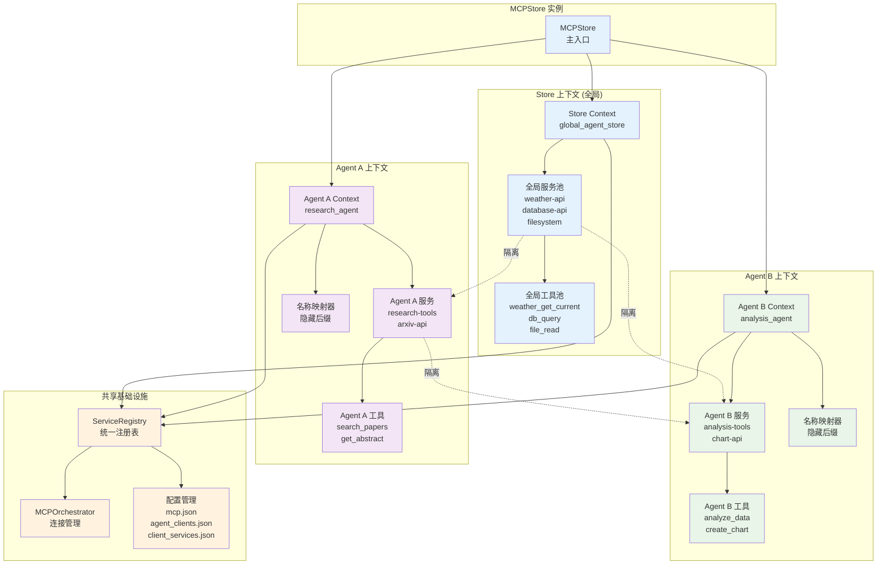
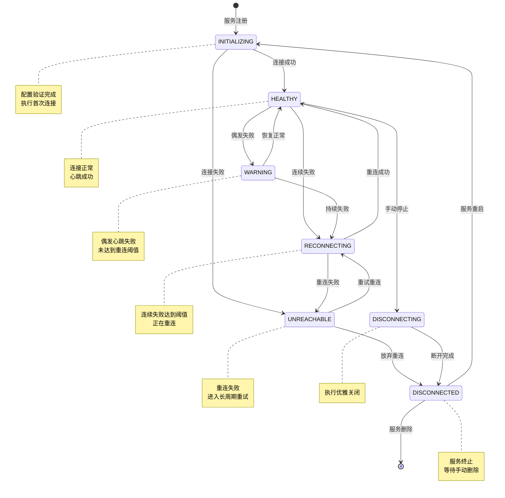
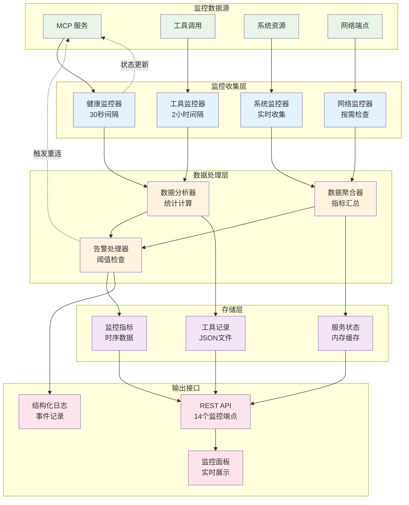

# 核心概念

深入理解 MCPStore 的核心概念和设计理念，掌握智能体工具服务存储的本质。

## 🎯 MCPStore 的核心使命

MCPStore 是一个**智能体工具服务存储**，旨在解决智能体与外部工具集成的复杂性：

- **简化集成**: 将复杂的 MCP 协议封装为简单易用的接口
- **统一管理**: 提供集中式的服务和工具管理
- **上下文隔离**: 支持多智能体场景下的服务隔离
- **生产就绪**: 企业级的监控、错误处理和性能优化

## 🏗️ 核心架构概念

### 1. 分层架构设计

MCPStore 采用现代化的分层架构：

```
┌─────────────────────────────────────┐
│           用户接口层                 │
│  Python SDK  │  REST API  │  CLI   │
├─────────────────────────────────────┤
│           上下文层                   │
│  Store Context  │  Agent Context   │
├─────────────────────────────────────┤
│           业务逻辑层                 │
│ Service Ops │ Tool Ops │ Monitoring│
├─────────────────────────────────────┤
│           编排层                     │
│  MCPOrchestrator  │  ServiceRegistry│
├─────────────────────────────────────┤
│           协议层                     │
│      FastMCP  │  MCP Protocol      │
└─────────────────────────────────────┘
```

### 2. 上下文切换机制

MCPStore 的核心创新是**上下文切换**机制：



#### Store 上下文 (全局模式)
```python
store = MCPStore.setup_store()
store_context = store.for_store()  # 全局服务管理
```

- **适用场景**: 单一应用、全局工具集
- **服务范围**: 所有注册的服务
- **命名规则**: 使用完整服务名（包括后缀）

#### Agent 上下文 (透明代理模式)
```python
store = MCPStore.setup_store()
agent_context = store.for_agent("my_agent")  # 独立服务空间
```

- **适用场景**: 多智能体系统、服务隔离
- **服务范围**: 仅该 Agent 的服务
- **命名规则**: 使用本地服务名（隐藏后缀）
- **透明代理**: 自动映射本地服务名到全局服务名
- **工具解析**: 支持精确匹配、前缀匹配、模糊匹配
- **客户端管理**: 自动注册客户端到 Agent 客户端缓存

### 3. 数据空间隔离

每个 MCPStore 实例支持独立的数据空间：

```python
# 项目A的独立数据空间
project_a = MCPStore.setup_store(mcp_config_file="project_a/mcp.json")

# 项目B的独立数据空间
project_b = MCPStore.setup_store(mcp_config_file="project_b/mcp.json")
```

**隔离特性**:
- 独立的配置文件管理
- 独立的服务注册表
- 独立的监控和日志
- 完全的数据隔离

## 🔧 服务生命周期管理

### 服务连接状态

MCPStore 定义了完整的服务生命周期状态：

```python
class ServiceConnectionState(str, Enum):
    INITIALIZING = "initializing"      # 初始化中
    HEALTHY = "healthy"                # 健康
    WARNING = "warning"                # 警告
    RECONNECTING = "reconnecting"      # 重连中
    UNREACHABLE = "unreachable"        # 不可达
    DISCONNECTING = "disconnecting"    # 断开中
    DISCONNECTED = "disconnected"      # 已断开
```



### 智能监控系统

MCPStore 实现了分层监控策略：



#### 健康检查层 (30秒间隔)
- 快速检测服务可用性
- 及时发现连接问题
- 触发自动重连机制

#### 工具更新层 (2小时间隔)
- 检测服务工具变更
- 更新工具注册表
- 保持工具信息同步

#### 配置示例
```python
monitoring_config = {
    "health_check_seconds": 30,        # 健康检查间隔
    "tools_update_hours": 2,           # 工具更新间隔
    "reconnection_seconds": 60,        # 重连间隔
    "enable_tools_update": True,       # 启用工具更新
    "enable_reconnection": True,       # 启用自动重连
    "update_tools_on_reconnection": True  # 重连时更新工具
}

store = MCPStore.setup_store(monitoring=monitoring_config)
```

## 🛠️ 工具调用机制

### 统一工具接口

MCPStore 提供统一的工具调用接口：

```python
# 同步调用
result = store.for_store().call_tool("tool_name", {"param": "value"})

# 异步调用
result = await store.for_store().call_tool_async("tool_name", {"param": "value"})

# 向后兼容
result = store.for_store().use_tool("tool_name", {"param": "value"})
```

### Agent 透明代理工具名称映射

在 Agent 透明代理模式下，MCPStore 实现智能工具名称解析和服务映射：

```python
# Store 模式：显示完整名称
store_tools = store.for_store().list_tools()
# 结果: ["weather_get_current", "weather_get_currentbyagent1", "calc_add"]

# Agent 模式：显示本地名称（透明代理）
agent_tools = store.for_agent("agent1").list_tools()
# 结果: ["weather_get_current", "calc_add"]  # 隐藏后缀

# Agent 透明代理工具调用流程：
# 1. 工具名称解析：精确匹配 → 前缀匹配 → 模糊匹配
# 2. 服务名称映射：本地服务名 → 全局服务名
# 3. 客户端路由：使用 global_agent_store_id 执行
# 4. 结果返回：透明返回给 Agent
```

## 🔗 链式调用设计

MCPStore 支持优雅的链式调用：

```python
# 服务注册 → 工具获取 → LangChain 转换
tools = (store.for_store()
         .add_service({"name": "weather", "url": "https://weather.com/mcp"})
         .add_service({"name": "calc", "command": "npx", "args": ["-y", "calc-mcp"]})
         .for_langchain()
         .list_tools())

# Agent 级别链式调用
result = (store.for_agent("my_agent")
          .add_service({"name": "agent_tool", "url": "https://agent.com/mcp"})
          .call_tool("agent_tool", {"param": "value"}))
```

## 🧠 LangChain 集成架构

### LangChainAdapter 设计

MCPStore 提供专门的 LangChain 适配器：

```python
class LangChainAdapter:
    """智能转换 MCP 工具为 LangChain Tool 对象"""

    def list_tools(self) -> List[Tool]:
        """转换为 LangChain Tool 列表"""

    def _enhance_description(self, tool_info) -> str:
        """增强工具描述，添加参数说明"""

    def _convert_schema(self, input_schema) -> Type[BaseModel]:
        """转换 inputSchema 为 Pydantic 模型"""
```

### 智能转换特性

1. **描述增强**: 自动添加参数说明到工具描述
2. **Schema 转换**: 将 JSON Schema 转换为 Pydantic 模型
3. **错误处理**: 统一的错误处理和异常捕获
4. **性能优化**: 智能缓存和批量转换

## 📊 缓存优先架构

### 查询与管理分离

MCPStore 采用缓存优先的设计：

```python
# 查询操作：直接从缓存返回，响应时间 < 100ms
services = store.for_store().list_services()  # 缓存查询
tools = store.for_store().list_tools()        # 缓存查询

# 管理操作：由生命周期管理器处理
store.for_store().add_service(config)         # 触发管理操作
store.for_store().restart_service(name)       # 触发管理操作
```

### 智能缓存更新

- **事件驱动**: 服务状态变更时自动更新缓存
- **定时同步**: 定期同步服务和工具信息
- **手动刷新**: 支持手动触发缓存更新

## 🔐 安全和隔离机制

### Agent 级别隔离

```python
# Agent A 的服务
agent_a = store.for_agent("agent_a")
agent_a.add_service({"name": "private_tool", "url": "https://a.com/mcp"})

# Agent B 无法访问 Agent A 的服务
agent_b = store.for_agent("agent_b")
agent_b_services = agent_b.list_services()  # 不包含 private_tool
```

### 配置文件隔离

```python
# 不同项目使用不同的配置文件
project1_store = MCPStore.setup_store(mcp_config_file="project1/mcp.json")
project2_store = MCPStore.setup_store(mcp_config_file="project2/mcp.json")

# 完全独立的数据空间
# project1/ 和 project2/ 目录下有独立的：
# - mcp.json (服务配置)
# - agent_clients.json (Agent-Client 映射)
# - client_services.json (Client-Service 映射)
```

## 🚀 性能优化策略

### 1. 延迟初始化

```python
# 上下文实例按需创建
store_context = store.for_store()      # 首次调用时创建
agent_context = store.for_agent("id")  # 首次调用时创建
```

### 2. 连接池管理

- 复用 HTTP 连接
- 智能连接超时
- 自动连接清理

### 3. 异步优先

```python
# 所有同步方法都有异步版本
await store.for_store().add_service_async(config)
await store.for_store().call_tool_async(name, args)
await store.for_store().list_tools_async()
```

## 🔄 错误处理和恢复

### 分层错误处理

1. **协议层**: FastMCP 错误处理
2. **编排层**: 连接错误和重试
3. **业务层**: 参数验证和业务逻辑错误
4. **接口层**: HTTP 状态码和响应格式

### 自动恢复机制

```python
# 自动重连配置
monitoring = {
    "reconnection_seconds": 60,           # 重连间隔
    "enable_reconnection": True,          # 启用自动重连
    "update_tools_on_reconnection": True  # 重连时更新工具
}
```

## 📈 可扩展性设计

### 插件化架构

MCPStore 支持插件扩展：

- **配置插件**: 支持不同的配置格式
- **传输插件**: 支持新的传输协议
- **监控插件**: 自定义监控和告警
- **适配器插件**: 集成其他 AI 框架

### 模块化重构

MCPStore 采用模块化设计：

```
core/context/
├── base_context.py          # 基础上下文
├── service_operations.py    # 服务操作
├── tool_operations.py       # 工具操作
├── service_management.py    # 服务管理
├── langchain_integration.py # LangChain 集成
├── async_operations.py      # 异步操作
├── monitoring_operations.py # 监控操作
└── reset_operations.py      # 重置操作
```

## 🎯 设计原则

### 1. 用户体验优先

- **简单易用**: 最少的代码实现最多的功能
- **链式调用**: 流畅的 API 设计
- **智能默认**: 合理的默认配置

### 2. 企业级可靠性

- **错误恢复**: 自动重试和故障转移
- **监控告警**: 完整的监控体系
- **性能优化**: 缓存和异步处理

### 3. 扩展性和兼容性

- **向后兼容**: 保持 API 稳定性
- **插件化**: 支持功能扩展
- **标准兼容**: 遵循 MCP 协议标准

## 相关文档

- [系统架构](architecture.md) - 详细的架构设计
- [最佳实践](best-practices.md) - 使用最佳实践
- [插件开发](plugin-development.md) - 扩展开发指南

## 下一步

- 深入了解 [系统架构设计](architecture.md)
- 学习 [插件开发方法](plugin-development.md)
- 掌握 [最佳实践指南](best-practices.md)
