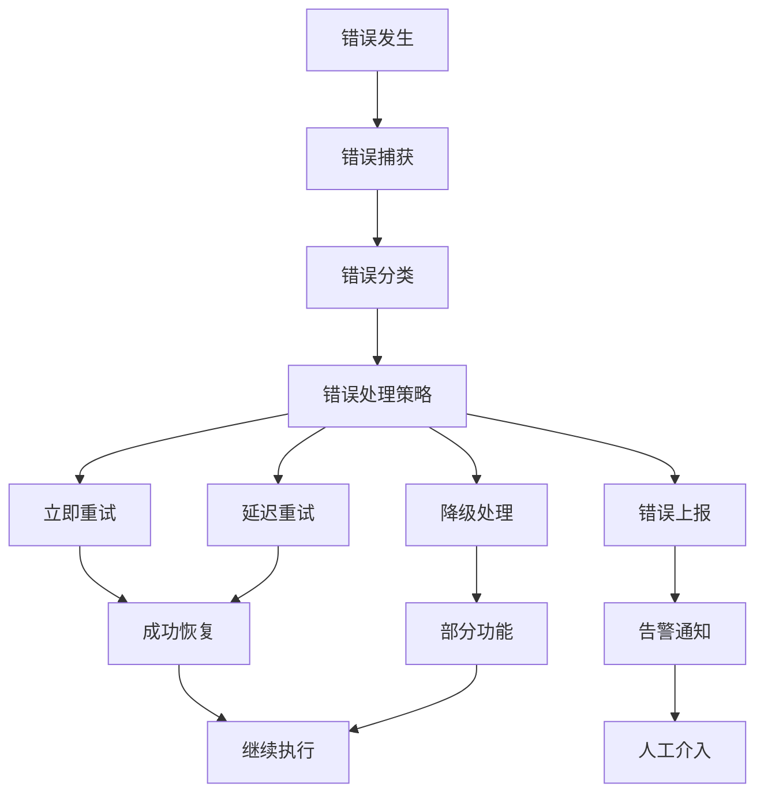

# 错误处理机制

## 📋 概述

MCPStore 提供了完善的错误处理机制，包括异常分类、错误恢复、重试策略和错误日志记录。通过统一的错误处理框架，确保系统的稳定性和可靠性。

## 🏗️ 错误处理架构



## 🔧 异常类型体系

### 核心异常类

```python
class MCPStoreError(Exception):
    """MCPStore 基础异常类"""
    
    def __init__(self, message, error_code=None, details=None):
        super().__init__(message)
        self.message = message
        self.error_code = error_code
        self.details = details or {}
        self.timestamp = time.time()

class ServiceError(MCPStoreError):
    """服务相关异常"""
    pass

class ServiceNotFoundError(ServiceError):
    """服务不存在异常"""
    
    def __init__(self, service_name):
        super().__init__(
            f"Service '{service_name}' not found",
            error_code="SERVICE_NOT_FOUND",
            details={"service_name": service_name}
        )

class ServiceStartError(ServiceError):
    """服务启动异常"""
    
    def __init__(self, service_name, reason):
        super().__init__(
            f"Failed to start service '{service_name}': {reason}",
            error_code="SERVICE_START_FAILED",
            details={"service_name": service_name, "reason": reason}
        )

class ServiceStopError(ServiceError):
    """服务停止异常"""
    pass

class ServiceTimeoutError(ServiceError):
    """服务超时异常"""
    pass

class ToolError(MCPStoreError):
    """工具相关异常"""
    pass

class ToolNotFoundError(ToolError):
    """工具不存在异常"""
    
    def __init__(self, tool_name, service_name=None):
        message = f"Tool '{tool_name}' not found"
        if service_name:
            message += f" in service '{service_name}'"
        
        super().__init__(
            message,
            error_code="TOOL_NOT_FOUND",
            details={"tool_name": tool_name, "service_name": service_name}
        )

class ToolExecutionError(ToolError):
    """工具执行异常"""
    
    def __init__(self, tool_name, reason, output=None):
        super().__init__(
            f"Tool '{tool_name}' execution failed: {reason}",
            error_code="TOOL_EXECUTION_FAILED",
            details={
                "tool_name": tool_name,
                "reason": reason,
                "output": output
            }
        )

class ConfigurationError(MCPStoreError):
    """配置异常"""
    pass

class ConnectionError(MCPStoreError):
    """连接异常"""
    pass
```

### 异常使用示例

```python
from mcpstore.exceptions import *

def safe_service_operation(store, service_name, operation):
    """安全的服务操作"""
    try:
        if operation == "start":
            return store.start_service(service_name)
        elif operation == "stop":
            return store.stop_service(service_name)
        elif operation == "restart":
            return store.restart_service(service_name)
        else:
            raise ValueError(f"Unknown operation: {operation}")
            
    except ServiceNotFoundError as e:
        print(f"❌ 服务不存在: {e.details['service_name']}")
        return False
        
    except ServiceStartError as e:
        print(f"❌ 服务启动失败: {e.details['reason']}")
        return False
        
    except ServiceTimeoutError as e:
        print(f"⏰ 服务操作超时: {e.message}")
        return False
        
    except ServiceError as e:
        print(f"💥 服务操作失败: {e.message}")
        return False
        
    except Exception as e:
        print(f"🔥 未知错误: {e}")
        return False

# 使用示例
success = safe_service_operation(store, "filesystem", "start")
```

## 🔄 重试机制

### 基础重试装饰器

```python
import time
import random
from functools import wraps

def retry(max_attempts=3, delay=1.0, backoff=2.0, jitter=True, exceptions=(Exception,)):
    """重试装饰器
    
    Args:
        max_attempts: 最大重试次数
        delay: 初始延迟时间（秒）
        backoff: 退避倍数
        jitter: 是否添加随机抖动
        exceptions: 需要重试的异常类型
    """
    def decorator(func):
        @wraps(func)
        def wrapper(*args, **kwargs):
            last_exception = None
            
            for attempt in range(max_attempts):
                try:
                    return func(*args, **kwargs)
                    
                except exceptions as e:
                    last_exception = e
                    
                    if attempt == max_attempts - 1:
                        # 最后一次尝试，抛出异常
                        raise e
                    
                    # 计算延迟时间
                    wait_time = delay * (backoff ** attempt)
                    
                    if jitter:
                        # 添加随机抖动（±25%）
                        jitter_range = wait_time * 0.25
                        wait_time += random.uniform(-jitter_range, jitter_range)
                    
                    print(f"🔄 第 {attempt + 1} 次尝试失败，{wait_time:.1f}s 后重试: {e}")
                    time.sleep(wait_time)
                
                except Exception as e:
                    # 不在重试范围内的异常，直接抛出
                    raise e
            
            # 理论上不会到达这里
            raise last_exception
        
        return wrapper
    return decorator

# 使用重试装饰器
@retry(max_attempts=3, delay=1.0, exceptions=(ServiceStartError, ServiceTimeoutError))
def start_service_with_retry(store, service_name):
    """带重试的服务启动"""
    return store.start_service(service_name)

# 使用示例
try:
    success = start_service_with_retry(store, "filesystem")
    print(f"✅ 服务启动成功: {success}")
except Exception as e:
    print(f"❌ 服务启动最终失败: {e}")
```

### 高级重试策略

```python
from enum import Enum
from typing import Callable, Optional

class RetryStrategy(Enum):
    FIXED = "fixed"           # 固定间隔
    LINEAR = "linear"         # 线性增长
    EXPONENTIAL = "exponential"  # 指数退避
    FIBONACCI = "fibonacci"   # 斐波那契数列

class RetryConfig:
    """重试配置"""
    
    def __init__(
        self,
        max_attempts: int = 3,
        strategy: RetryStrategy = RetryStrategy.EXPONENTIAL,
        base_delay: float = 1.0,
        max_delay: float = 60.0,
        jitter: bool = True,
        exceptions: tuple = (Exception,),
        should_retry: Optional[Callable] = None
    ):
        self.max_attempts = max_attempts
        self.strategy = strategy
        self.base_delay = base_delay
        self.max_delay = max_delay
        self.jitter = jitter
        self.exceptions = exceptions
        self.should_retry = should_retry

class RetryManager:
    """重试管理器"""
    
    def __init__(self, config: RetryConfig):
        self.config = config
    
    def execute(self, func, *args, **kwargs):
        """执行带重试的函数"""
        last_exception = None
        
        for attempt in range(self.config.max_attempts):
            try:
                result = func(*args, **kwargs)
                
                # 检查是否需要重试（即使没有异常）
                if self.config.should_retry and self.config.should_retry(result):
                    if attempt < self.config.max_attempts - 1:
                        delay = self._calculate_delay(attempt)
                        print(f"🔄 结果不满足条件，{delay:.1f}s 后重试")
                        time.sleep(delay)
                        continue
                
                return result
                
            except self.config.exceptions as e:
                last_exception = e
                
                if attempt == self.config.max_attempts - 1:
                    raise e
                
                delay = self._calculate_delay(attempt)
                print(f"🔄 第 {attempt + 1} 次尝试失败，{delay:.1f}s 后重试: {e}")
                time.sleep(delay)
            
            except Exception as e:
                # 不在重试范围内的异常
                raise e
        
        raise last_exception
    
    def _calculate_delay(self, attempt: int) -> float:
        """计算延迟时间"""
        if self.config.strategy == RetryStrategy.FIXED:
            delay = self.config.base_delay
            
        elif self.config.strategy == RetryStrategy.LINEAR:
            delay = self.config.base_delay * (attempt + 1)
            
        elif self.config.strategy == RetryStrategy.EXPONENTIAL:
            delay = self.config.base_delay * (2 ** attempt)
            
        elif self.config.strategy == RetryStrategy.FIBONACCI:
            fib_sequence = [1, 1]
            for i in range(2, attempt + 2):
                fib_sequence.append(fib_sequence[i-1] + fib_sequence[i-2])
            delay = self.config.base_delay * fib_sequence[attempt]
        
        else:
            delay = self.config.base_delay
        
        # 限制最大延迟
        delay = min(delay, self.config.max_delay)
        
        # 添加随机抖动
        if self.config.jitter:
            jitter_range = delay * 0.1
            delay += random.uniform(-jitter_range, jitter_range)
        
        return max(0, delay)

# 使用高级重试
def check_service_health(store, service_name):
    """检查服务健康状态"""
    status = store.get_service_status(service_name)
    return status == "running"

# 配置重试策略
retry_config = RetryConfig(
    max_attempts=5,
    strategy=RetryStrategy.EXPONENTIAL,
    base_delay=1.0,
    max_delay=30.0,
    exceptions=(ServiceError, ConnectionError),
    should_retry=lambda result: not result  # 结果为 False 时重试
)

retry_manager = RetryManager(retry_config)

# 执行带重试的健康检查
try:
    is_healthy = retry_manager.execute(check_service_health, store, "filesystem")
    print(f"✅ 服务健康状态: {is_healthy}")
except Exception as e:
    print(f"❌ 健康检查失败: {e}")
```

## 🛡️ 降级处理

### 服务降级策略

```python
class FallbackStrategy:
    """降级策略基类"""
    
    def execute(self, original_func, *args, **kwargs):
        """执行降级逻辑"""
        raise NotImplementedError

class CacheFallback(FallbackStrategy):
    """缓存降级策略"""
    
    def __init__(self, cache_duration=300):
        self.cache = {}
        self.cache_duration = cache_duration
    
    def execute(self, original_func, *args, **kwargs):
        """使用缓存数据"""
        cache_key = self._generate_cache_key(original_func.__name__, args, kwargs)
        
        if cache_key in self.cache:
            cached_data, timestamp = self.cache[cache_key]
            if time.time() - timestamp < self.cache_duration:
                print(f"📦 使用缓存数据: {original_func.__name__}")
                return cached_data
        
        # 缓存过期或不存在
        raise Exception("No valid cache available")
    
    def _generate_cache_key(self, func_name, args, kwargs):
        """生成缓存键"""
        return f"{func_name}:{hash(str(args) + str(kwargs))}"

class DefaultValueFallback(FallbackStrategy):
    """默认值降级策略"""
    
    def __init__(self, default_value):
        self.default_value = default_value
    
    def execute(self, original_func, *args, **kwargs):
        """返回默认值"""
        print(f"🔄 使用默认值: {self.default_value}")
        return self.default_value

class AlternativeServiceFallback(FallbackStrategy):
    """备用服务降级策略"""
    
    def __init__(self, alternative_service):
        self.alternative_service = alternative_service
    
    def execute(self, original_func, *args, **kwargs):
        """使用备用服务"""
        print(f"🔄 切换到备用服务: {self.alternative_service}")
        # 这里实现切换到备用服务的逻辑
        return None

class FallbackManager:
    """降级管理器"""
    
    def __init__(self):
        self.strategies = []
    
    def add_strategy(self, strategy: FallbackStrategy):
        """添加降级策略"""
        self.strategies.append(strategy)
    
    def execute_with_fallback(self, func, *args, **kwargs):
        """执行带降级的函数"""
        # 首先尝试正常执行
        try:
            result = func(*args, **kwargs)
            
            # 如果成功，更新缓存
            for strategy in self.strategies:
                if isinstance(strategy, CacheFallback):
                    cache_key = strategy._generate_cache_key(func.__name__, args, kwargs)
                    strategy.cache[cache_key] = (result, time.time())
            
            return result
            
        except Exception as original_error:
            print(f"⚠️ 原始调用失败: {original_error}")
            
            # 尝试降级策略
            for i, strategy in enumerate(self.strategies):
                try:
                    result = strategy.execute(func, *args, **kwargs)
                    print(f"✅ 降级策略 {i+1} 成功")
                    return result
                    
                except Exception as fallback_error:
                    print(f"❌ 降级策略 {i+1} 失败: {fallback_error}")
                    continue
            
            # 所有降级策略都失败
            raise original_error

# 使用降级处理
def get_service_tools(store, service_name):
    """获取服务工具列表"""
    return store.list_tools(service_name=service_name)

# 配置降级策略
fallback_manager = FallbackManager()
fallback_manager.add_strategy(CacheFallback(cache_duration=600))  # 10分钟缓存
fallback_manager.add_strategy(DefaultValueFallback([]))  # 空列表作为默认值

# 执行带降级的操作
try:
    tools = fallback_manager.execute_with_fallback(get_service_tools, store, "filesystem")
    print(f"🛠️ 获取到工具: {len(tools)} 个")
except Exception as e:
    print(f"❌ 所有策略都失败: {e}")
```

## 📊 错误监控和报告

### 错误收集器

```python
import json
from collections import defaultdict, deque
from datetime import datetime

class ErrorCollector:
    """错误收集器"""
    
    def __init__(self, max_errors=1000):
        self.max_errors = max_errors
        self.errors = deque(maxlen=max_errors)
        self.error_stats = defaultdict(int)
        self.error_trends = defaultdict(lambda: deque(maxlen=100))
    
    def collect_error(self, error, context=None):
        """收集错误信息"""
        error_info = {
            'timestamp': time.time(),
            'datetime': datetime.now().isoformat(),
            'error_type': type(error).__name__,
            'error_message': str(error),
            'error_code': getattr(error, 'error_code', None),
            'details': getattr(error, 'details', {}),
            'context': context or {}
        }
        
        self.errors.append(error_info)
        self.error_stats[error_info['error_type']] += 1
        self.error_trends[error_info['error_type']].append(error_info['timestamp'])
        
        # 触发错误处理
        self._handle_error(error_info)
    
    def _handle_error(self, error_info):
        """处理错误"""
        # 记录日志
        print(f"🔥 错误收集: {error_info['error_type']} - {error_info['error_message']}")
        
        # 检查错误频率
        error_type = error_info['error_type']
        recent_errors = [
            ts for ts in self.error_trends[error_type]
            if time.time() - ts < 300  # 最近5分钟
        ]
        
        if len(recent_errors) > 10:  # 5分钟内超过10次同类错误
            print(f"🚨 错误频率过高: {error_type} ({len(recent_errors)} 次/5分钟)")
    
    def get_error_summary(self, hours=24):
        """获取错误摘要"""
        cutoff_time = time.time() - hours * 3600
        recent_errors = [e for e in self.errors if e['timestamp'] > cutoff_time]
        
        summary = {
            'total_errors': len(recent_errors),
            'error_types': defaultdict(int),
            'error_codes': defaultdict(int),
            'hourly_distribution': defaultdict(int)
        }
        
        for error in recent_errors:
            summary['error_types'][error['error_type']] += 1
            
            if error['error_code']:
                summary['error_codes'][error['error_code']] += 1
            
            hour = int((error['timestamp'] % 86400) // 3600)
            summary['hourly_distribution'][hour] += 1
        
        return summary
    
    def export_errors(self, filename=None):
        """导出错误数据"""
        if not filename:
            filename = f"errors_{datetime.now().strftime('%Y%m%d_%H%M%S')}.json"
        
        export_data = {
            'export_time': datetime.now().isoformat(),
            'total_errors': len(self.errors),
            'errors': list(self.errors),
            'statistics': dict(self.error_stats)
        }
        
        with open(filename, 'w', encoding='utf-8') as f:
            json.dump(export_data, f, indent=2, ensure_ascii=False)
        
        print(f"📁 错误数据已导出到: {filename}")
        return filename

# 全局错误收集器
error_collector = ErrorCollector()

# 错误处理装饰器
def collect_errors(context=None):
    """错误收集装饰器"""
    def decorator(func):
        @wraps(func)
        def wrapper(*args, **kwargs):
            try:
                return func(*args, **kwargs)
            except Exception as e:
                error_collector.collect_error(e, context)
                raise e
        return wrapper
    return decorator

# 使用错误收集
@collect_errors(context={"operation": "service_management"})
def managed_start_service(store, service_name):
    """带错误收集的服务启动"""
    return store.start_service(service_name)

# 使用示例
try:
    success = managed_start_service(store, "nonexistent_service")
except Exception as e:
    print(f"操作失败，错误已记录: {e}")

# 查看错误摘要
summary = error_collector.get_error_summary()
print(f"📊 错误摘要: {summary}")
```

## 🔗 相关文档

- [监控系统](monitoring.md)
- [性能优化](performance.md)
- [服务管理](../services/management/service-management.md)
- [健康检查](../services/lifecycle/health-check.md)

## 📚 最佳实践

1. **异常分类**：使用明确的异常类型，便于错误处理
2. **重试策略**：根据错误类型选择合适的重试策略
3. **降级处理**：为关键功能提供降级方案
4. **错误监控**：建立完善的错误收集和分析机制
5. **日志记录**：详细记录错误上下文信息
6. **用户友好**：提供清晰的错误信息和解决建议

---

**更新时间**: 2025-01-09  
**版本**: 1.0.0
