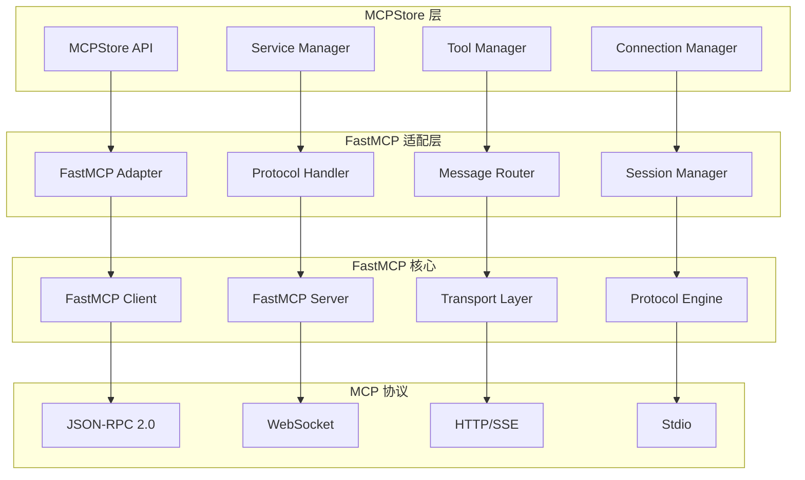

# FastMCP 深度集成

## 📋 概述

MCPStore 基于 FastMCP 构建，提供了与 FastMCP 的深度集成。本文档详细介绍如何充分利用 FastMCP 的高级特性，以及如何在 MCPStore 中扩展和自定义 FastMCP 功能。

**最新更新**: Agent 透明代理机制已完全集成 FastMCP，支持智能工具解析、自动客户端管理和高性能代理执行。

## 🏗️ FastMCP 集成架构



## 🔧 FastMCP 客户端集成

### 高级客户端配置

```python
from fastmcp import FastMCPClient
from fastmcp.transport import StdioTransport, WebSocketTransport
from fastmcp.protocol import MCPProtocol
import asyncio

class AdvancedFastMCPClient:
    """高级 FastMCP 客户端"""
    
    def __init__(self, service_config):
        self.service_config = service_config
        self.client = None
        self.transport = None
        self.protocol = None
        self.session_id = None
        
        # 高级配置
        self.retry_config = {
            'max_retries': 3,
            'retry_delay': 1.0,
            'exponential_backoff': True
        }
        
        self.timeout_config = {
            'connect_timeout': 30.0,
            'request_timeout': 60.0,
            'keepalive_timeout': 300.0
        }
        
        # 事件处理器
        self.event_handlers = {}
        
    async def initialize(self):
        """初始化客户端"""
        # 创建传输层
        self.transport = await self._create_transport()
        
        # 创建协议层
        self.protocol = MCPProtocol(
            transport=self.transport,
            timeout=self.timeout_config['request_timeout']
        )
        
        # 创建客户端
        self.client = FastMCPClient(
            protocol=self.protocol,
            retry_config=self.retry_config
        )
        
        # 设置事件处理器
        self._setup_event_handlers()
        
        # 建立连接
        await self.client.connect()
        
        # 初始化会话
        self.session_id = await self._initialize_session()
        
        print(f"✅ FastMCP 客户端初始化完成，会话ID: {self.session_id}")
    
    async def _create_transport(self):
        """创建传输层"""
        transport_type = self.service_config.get('transport', 'stdio')
        
        if transport_type == 'stdio':
            return StdioTransport(
                command=self.service_config['command'],
                args=self.service_config.get('args', []),
                env=self.service_config.get('env', {}),
                timeout=self.timeout_config['connect_timeout']
            )
        
        elif transport_type == 'websocket':
            return WebSocketTransport(
                url=self.service_config['url'],
                headers=self.service_config.get('headers', {}),
                timeout=self.timeout_config['connect_timeout']
            )
        
        else:
            raise ValueError(f"Unsupported transport type: {transport_type}")
    
    def _setup_event_handlers(self):
        """设置事件处理器"""
        # 连接事件
        self.client.on('connected', self._on_connected)
        self.client.on('disconnected', self._on_disconnected)
        self.client.on('error', self._on_error)
        
        # 协议事件
        self.client.on('notification', self._on_notification)
        self.client.on('request', self._on_request)
        
        # 工具事件
        self.client.on('tool_list_changed', self._on_tool_list_changed)
        self.client.on('resource_updated', self._on_resource_updated)
    
    async def _initialize_session(self):
        """初始化会话"""
        # 发送初始化请求
        init_result = await self.client.initialize({
            'protocolVersion': '2024-11-05',
            'capabilities': {
                'tools': {},
                'resources': {},
                'prompts': {},
                'logging': {}
            },
            'clientInfo': {
                'name': 'MCPStore',
                'version': '1.0.0'
            }
        })
        
        return init_result.get('sessionId')
    
    async def call_tool_advanced(self, tool_name, arguments, **options):
        """高级工具调用"""
        # 构造调用请求
        request = {
            'method': 'tools/call',
            'params': {
                'name': tool_name,
                'arguments': arguments
            }
        }
        
        # 添加高级选项
        if 'timeout' in options:
            request['timeout'] = options['timeout']
        
        if 'priority' in options:
            request['priority'] = options['priority']
        
        if 'trace_id' in options:
            request['trace_id'] = options['trace_id']
        
        # 执行调用
        try:
            result = await self.client.request(request)
            
            # 处理结果
            return self._process_tool_result(result)
            
        except Exception as e:
            # 错误处理
            return self._handle_tool_error(tool_name, arguments, e)
    
    def _process_tool_result(self, result):
        """处理工具结果"""
        if result.get('isError'):
            return {
                'success': False,
                'error': result.get('content', [{}])[0].get('text', 'Unknown error'),
                'error_code': result.get('errorCode')
            }
        else:
            content = result.get('content', [])
            if content:
                return {
                    'success': True,
                    'result': content[0].get('text', ''),
                    'metadata': result.get('metadata', {})
                }
            else:
                return {
                    'success': True,
                    'result': None
                }
    
    def _handle_tool_error(self, tool_name, arguments, error):
        """处理工具错误"""
        error_info = {
            'success': False,
            'tool_name': tool_name,
            'arguments': arguments,
            'error': str(error),
            'error_type': type(error).__name__
        }
        
        # 触发错误事件
        self._trigger_event('tool_error', error_info)
        
        return error_info
    
    # 事件处理器
    async def _on_connected(self, event):
        """连接建立事件"""
        print(f"🔗 FastMCP 客户端已连接")
        self._trigger_event('connected', event)
    
    async def _on_disconnected(self, event):
        """连接断开事件"""
        print(f"🔌 FastMCP 客户端已断开")
        self._trigger_event('disconnected', event)
    
    async def _on_error(self, event):
        """错误事件"""
        print(f"❌ FastMCP 客户端错误: {event}")
        self._trigger_event('error', event)
    
    async def _on_notification(self, notification):
        """通知事件"""
        print(f"📢 收到通知: {notification}")
        self._trigger_event('notification', notification)
    
    async def _on_request(self, request):
        """请求事件"""
        print(f"📨 收到请求: {request}")
        self._trigger_event('request', request)
    
    async def _on_tool_list_changed(self, event):
        """工具列表变更事件"""
        print(f"🛠️ 工具列表已更新")
        self._trigger_event('tool_list_changed', event)
    
    async def _on_resource_updated(self, event):
        """资源更新事件"""
        print(f"📦 资源已更新: {event}")
        self._trigger_event('resource_updated', event)
    
    def on(self, event_name, handler):
        """注册事件处理器"""
        if event_name not in self.event_handlers:
            self.event_handlers[event_name] = []
        self.event_handlers[event_name].append(handler)
    
    def _trigger_event(self, event_name, event_data):
        """触发事件"""
        handlers = self.event_handlers.get(event_name, [])
        for handler in handlers:
            try:
                if asyncio.iscoroutinefunction(handler):
                    asyncio.create_task(handler(event_data))
                else:
                    handler(event_data)
            except Exception as e:
                print(f"⚠️ 事件处理器错误: {e}")
    
    async def close(self):
        """关闭客户端"""
        if self.client:
            await self.client.close()
        if self.transport:
            await self.transport.close()

# 使用高级 FastMCP 客户端
async def test_advanced_client():
    """测试高级客户端"""
    
    service_config = {
        'transport': 'stdio',
        'command': 'npx',
        'args': ['-y', '@modelcontextprotocol/server-filesystem', '/tmp']
    }
    
    client = AdvancedFastMCPClient(service_config)
    
    # 注册事件处理器
    client.on('connected', lambda event: print("🎉 客户端连接成功"))
    client.on('tool_error', lambda error: print(f"🚨 工具错误: {error}"))
    
    try:
        # 初始化客户端
        await client.initialize()
        
        # 高级工具调用
        result = await client.call_tool_advanced(
            'read_file',
            {'path': '/tmp/test.txt'},
            timeout=30.0,
            priority='high',
            trace_id='test-trace-001'
        )
        
        print(f"📄 工具调用结果: {result}")
        
    finally:
        await client.close()

# 运行测试
# asyncio.run(test_advanced_client())
```

### FastMCP 服务器集成

```python
from fastmcp import FastMCPServer
from fastmcp.tools import Tool
from fastmcp.resources import Resource
import asyncio

class MCPStoreServer:
    """MCPStore 服务器"""
    
    def __init__(self, mcpstore):
        self.mcpstore = mcpstore
        self.server = FastMCPServer(
            name="MCPStore Server",
            version="1.0.0"
        )
        
        # 注册工具和资源
        self._register_tools()
        self._register_resources()
        self._setup_handlers()
    
    def _register_tools(self):
        """注册工具"""
        
        # 获取服务列表工具
        @self.server.tool("list_services")
        async def list_services() -> str:
            """列出所有可用的服务"""
            services = self.mcpstore.list_services()
            return f"可用服务: {[s['name'] for s in services]}"
        
        # 获取工具列表工具
        @self.server.tool("list_tools")
        async def list_tools(service_name: str = None) -> str:
            """列出工具"""
            tools = self.mcpstore.list_tools(service_name=service_name)
            return f"可用工具: {[t['name'] for t in tools]}"
        
        # 调用工具
        @self.server.tool("call_tool")
        async def call_tool(tool_name: str, arguments: dict) -> str:
            """调用指定工具"""
            try:
                result = self.mcpstore.call_tool(tool_name, arguments)
                return f"工具调用成功: {result}"
            except Exception as e:
                return f"工具调用失败: {str(e)}"
        
        # 批量调用工具
        @self.server.tool("batch_call")
        async def batch_call(calls: list) -> str:
            """批量调用工具"""
            try:
                results = self.mcpstore.batch_call(calls)
                successful = sum(1 for r in results if r.get('success'))
                return f"批量调用完成: {successful}/{len(results)} 成功"
            except Exception as e:
                return f"批量调用失败: {str(e)}"
    
    def _register_resources(self):
        """注册资源"""
        
        # 服务状态资源
        @self.server.resource("services/status")
        async def services_status() -> dict:
            """获取服务状态"""
            services = self.mcpstore.list_services()
            status_info = {}
            
            for service in services:
                try:
                    status = self.mcpstore.get_service_status(service['name'])
                    status_info[service['name']] = status
                except Exception as e:
                    status_info[service['name']] = f"error: {str(e)}"
            
            return status_info
        
        # 工具统计资源
        @self.server.resource("tools/statistics")
        async def tools_statistics() -> dict:
            """获取工具统计信息"""
            tools = self.mcpstore.list_tools()
            
            stats = {
                'total_tools': len(tools),
                'tools_by_service': {},
                'tools_by_category': {}
            }
            
            for tool in tools:
                service_name = tool.get('service_name', 'unknown')
                category = tool.get('category', 'uncategorized')
                
                stats['tools_by_service'][service_name] = stats['tools_by_service'].get(service_name, 0) + 1
                stats['tools_by_category'][category] = stats['tools_by_category'].get(category, 0) + 1
            
            return stats
    
    def _setup_handlers(self):
        """设置处理器"""
        
        @self.server.request_handler("custom/health_check")
        async def health_check(request):
            """健康检查处理器"""
            return {
                'status': 'healthy',
                'timestamp': time.time(),
                'services_count': len(self.mcpstore.list_services()),
                'tools_count': len(self.mcpstore.list_tools())
            }
        
        @self.server.notification_handler("custom/service_update")
        async def service_update(notification):
            """服务更新通知处理器"""
            service_name = notification.get('service_name')
            action = notification.get('action')
            
            print(f"📢 服务更新通知: {service_name} - {action}")
            
            # 可以在这里触发相应的操作
            if action == 'restart':
                try:
                    self.mcpstore.restart_service(service_name)
                    print(f"✅ 服务 {service_name} 重启成功")
                except Exception as e:
                    print(f"❌ 服务 {service_name} 重启失败: {e}")
    
    async def start(self, transport_config):
        """启动服务器"""
        await self.server.start(transport_config)
        print(f"🚀 MCPStore 服务器已启动")
    
    async def stop(self):
        """停止服务器"""
        await self.server.stop()
        print(f"🛑 MCPStore 服务器已停止")

# 使用 MCPStore 服务器
async def run_mcpstore_server():
    """运行 MCPStore 服务器"""
    from mcpstore import MCPStore
    
    # 初始化 MCPStore
    store = MCPStore()
    store.add_service({
        "mcpServers": {
            "filesystem": {
                "command": "npx",
                "args": ["-y", "@modelcontextprotocol/server-filesystem", "/tmp"]
            }
        }
    })
    
    # 创建服务器
    server = MCPStoreServer(store)
    
    # 配置传输
    transport_config = {
        'type': 'stdio'  # 或 'websocket', 'http'
    }
    
    try:
        await server.start(transport_config)
        
        # 保持服务器运行
        await asyncio.Event().wait()
        
    except KeyboardInterrupt:
        print("🔌 收到中断信号")
    finally:
        await server.stop()

# 运行服务器
# asyncio.run(run_mcpstore_server())
```

## 🎭 Agent 透明代理 FastMCP 集成

### Agent 透明代理架构

MCPStore 的 Agent 透明代理机制与 FastMCP 深度集成，提供无缝的多智能体支持：

```python
from fastmcp import FastMCPClient
from mcpstore.core.registry.core_registry import ServiceRegistry
from mcpstore.core.orchestrator.service_connection import ServiceConnectionManager

class AgentTransparentProxy:
    """Agent 透明代理 FastMCP 集成"""

    def __init__(self, store, agent_id: str):
        self.store = store
        self.agent_id = agent_id
        self.global_agent_store_id = store.client_manager.global_agent_store_id
        self.registry = store.registry

    async def create_agent_service(self, service_config: dict):
        """为 Agent 创建透明代理服务"""

        # 1. 生成全局服务名
        local_name = service_config['name']
        global_name = f"{local_name}byagent_{self.agent_id}"

        # 2. 创建 FastMCP 客户端
        fastmcp_client = await self._create_fastmcp_client(service_config)

        # 3. 注册到全局服务注册表
        await self.registry.add_service(
            agent_id=self.global_agent_store_id,  # 使用全局 Agent ID
            service_name=global_name,
            service_config=service_config,
            client=fastmcp_client
        )

        # 4. 建立 Agent 客户端映射
        client_id = self.registry.get_service_client_id(
            self.global_agent_store_id,
            global_name
        )

        if client_id:
            # 注册到当前 Agent
            self.registry.add_agent_client_mapping(self.agent_id, client_id)
            # 注册到全局 Agent Store
            self.registry.add_agent_client_mapping(self.global_agent_store_id, client_id)

        return global_name, client_id

    async def _create_fastmcp_client(self, service_config: dict):
        """创建 FastMCP 客户端"""

        if 'url' in service_config:
            # HTTP/WebSocket 传输
            from fastmcp.transport import WebSocketTransport
            transport = WebSocketTransport(
                url=service_config['url'],
                timeout=30.0
            )
        else:
            # Stdio 传输
            from fastmcp.transport import StdioTransport
            transport = StdioTransport(
                command=service_config['command'],
                args=service_config.get('args', []),
                env=service_config.get('env', {}),
                timeout=30.0
            )

        # 创建 FastMCP 客户端
        client = FastMCPClient(transport=transport)

        # 设置事件处理器
        client.on('connected', self._on_client_connected)
        client.on('disconnected', self._on_client_disconnected)
        client.on('error', self._on_client_error)

        return client

    async def call_tool_transparent(self, tool_name: str, args: dict):
        """透明代理工具调用"""

        # 1. 智能工具名称解析
        resolution = await self._resolve_tool_name(tool_name)

        # 2. 映射到全局服务
        global_service_name = await self._map_to_global_service(
            resolution.service_name,
            resolution.tool_name
        )

        # 3. 获取 FastMCP 客户端
        client_id = self.registry.get_service_client_id(
            self.global_agent_store_id,  # 使用全局 Agent ID
            global_service_name
        )

        if not client_id:
            raise ValueError(f"No client found for service {global_service_name}")

        # 4. 执行 FastMCP 工具调用
        fastmcp_client = self.registry.get_client(client_id)

        try:
            result = await fastmcp_client.call_tool(
                name=resolution.tool_name,
                arguments=args,
                raise_on_error=True  # FastMCP 错误处理
            )

            return {
                'success': True,
                'result': self._extract_tool_result(result),
                'metadata': {
                    'tool_name': tool_name,
                    'resolved_tool': resolution.tool_name,
                    'service_name': global_service_name,
                    'match_type': resolution.match_type,
                    'agent_id': self.agent_id
                }
            }

        except Exception as e:
            return {
                'success': False,
                'error': str(e),
                'metadata': {
                    'tool_name': tool_name,
                    'agent_id': self.agent_id,
                    'error_type': type(e).__name__
                }
            }

    async def _resolve_tool_name(self, tool_name: str):
        """智能工具名称解析"""
        # 获取 Agent 的工具列表
        agent_tools = await self._get_agent_tools()

        # 1. 精确匹配
        for tool_info in agent_tools:
            if tool_info['name'] == tool_name:
                return ToolResolution(
                    tool_name=tool_info['name'],
                    service_name=tool_info['service_name'],
                    match_type='exact_match'
                )

        # 2. 前缀匹配
        for tool_info in agent_tools:
            if tool_info['name'].startswith(tool_name):
                return ToolResolution(
                    tool_name=tool_info['name'],
                    service_name=tool_info['service_name'],
                    match_type='prefix_match'
                )

        # 3. 模糊匹配
        for tool_info in agent_tools:
            if tool_name.lower() in tool_info['name'].lower():
                return ToolResolution(
                    tool_name=tool_info['name'],
                    service_name=tool_info['service_name'],
                    match_type='fuzzy_match'
                )

        raise ValueError(f"Tool '{tool_name}' not found for agent '{self.agent_id}'")

    async def _map_to_global_service(self, local_service: str, tool_name: str) -> str:
        """映射本地服务名到全局服务名"""
        return f"{local_service}byagent_{self.agent_id}"

    async def _get_agent_tools(self):
        """获取 Agent 的工具列表"""
        # 从注册表获取 Agent 的工具
        return self.registry.get_agent_tools(self.agent_id)

    def _extract_tool_result(self, fastmcp_result):
        """提取 FastMCP 工具结果"""
        if hasattr(fastmcp_result, 'content') and fastmcp_result.content:
            # 提取第一个内容项的文本
            first_content = fastmcp_result.content[0]
            if hasattr(first_content, 'text'):
                return first_content.text
            elif isinstance(first_content, dict) and 'text' in first_content:
                return first_content['text']

        return str(fastmcp_result)

    # FastMCP 事件处理器
    async def _on_client_connected(self, event):
        """客户端连接事件"""
        print(f"🔗 Agent {self.agent_id} FastMCP 客户端已连接")

    async def _on_client_disconnected(self, event):
        """客户端断开事件"""
        print(f"🔌 Agent {self.agent_id} FastMCP 客户端已断开")

    async def _on_client_error(self, event):
        """客户端错误事件"""
        print(f"❌ Agent {self.agent_id} FastMCP 客户端错误: {event}")

class ToolResolution:
    """工具解析结果"""
    def __init__(self, tool_name: str, service_name: str, match_type: str):
        self.tool_name = tool_name
        self.service_name = service_name
        self.match_type = match_type

# 使用 Agent 透明代理
async def demo_agent_transparent_proxy():
    """演示 Agent 透明代理"""
    from mcpstore import MCPStore

    # 初始化 MCPStore
    store = MCPStore.setup_store(debug=True)

    # 创建 Agent 透明代理
    agent_proxy = AgentTransparentProxy(store, "demo_agent")

    # 添加服务（透明代理）
    global_name, client_id = await agent_proxy.create_agent_service({
        "name": "weather-api",
        "url": "https://weather.example.com/mcp"
    })

    print(f"✅ 服务已注册: {global_name} (客户端: {client_id})")

    # 透明代理工具调用
    result = await agent_proxy.call_tool_transparent(
        "get_weather",  # 可能需要智能解析
        {"city": "北京"}
    )

    print(f"🎯 工具调用结果: {result}")

# 运行演示
# asyncio.run(demo_agent_transparent_proxy())
```

## 🔄 FastMCP 协议扩展

### 自定义协议扩展

```python
from fastmcp.protocol import MCPProtocol
from fastmcp.messages import Request, Response, Notification

class ExtendedMCPProtocol(MCPProtocol):
    """扩展的 MCP 协议"""
    
    def __init__(self, *args, **kwargs):
        super().__init__(*args, **kwargs)
        
        # 注册自定义方法
        self.register_method('mcpstore/batch_call', self._handle_batch_call)
        self.register_method('mcpstore/service_status', self._handle_service_status)
        self.register_method('mcpstore/tool_search', self._handle_tool_search)
        
        # 注册自定义通知
        self.register_notification('mcpstore/service_changed', self._handle_service_changed)
        self.register_notification('mcpstore/tool_updated', self._handle_tool_updated)
    
    async def _handle_batch_call(self, request: Request) -> Response:
        """处理批量调用请求"""
        calls = request.params.get('calls', [])
        
        results = []
        for call in calls:
            try:
                # 执行单个调用
                tool_result = await self._execute_tool_call(
                    call.get('tool_name'),
                    call.get('arguments', {})
                )
                results.append({
                    'success': True,
                    'result': tool_result
                })
            except Exception as e:
                results.append({
                    'success': False,
                    'error': str(e)
                })
        
        return Response(
            id=request.id,
            result={
                'results': results,
                'total': len(calls),
                'successful': sum(1 for r in results if r['success'])
            }
        )
    
    async def _handle_service_status(self, request: Request) -> Response:
        """处理服务状态请求"""
        service_name = request.params.get('service_name')
        
        try:
            # 获取服务状态
            status = await self._get_service_status(service_name)
            
            return Response(
                id=request.id,
                result={
                    'service_name': service_name,
                    'status': status,
                    'timestamp': time.time()
                }
            )
        except Exception as e:
            return Response(
                id=request.id,
                error={
                    'code': -32000,
                    'message': f"Failed to get service status: {str(e)}"
                }
            )
    
    async def _handle_tool_search(self, request: Request) -> Response:
        """处理工具搜索请求"""
        query = request.params.get('query', '')
        filters = request.params.get('filters', {})
        
        try:
            # 执行工具搜索
            tools = await self._search_tools(query, filters)
            
            return Response(
                id=request.id,
                result={
                    'query': query,
                    'filters': filters,
                    'tools': tools,
                    'count': len(tools)
                }
            )
        except Exception as e:
            return Response(
                id=request.id,
                error={
                    'code': -32000,
                    'message': f"Tool search failed: {str(e)}"
                }
            )
    
    async def _handle_service_changed(self, notification: Notification):
        """处理服务变更通知"""
        service_name = notification.params.get('service_name')
        change_type = notification.params.get('change_type')
        
        print(f"📢 服务变更通知: {service_name} - {change_type}")
        
        # 触发相应的处理逻辑
        if change_type == 'added':
            await self._on_service_added(service_name)
        elif change_type == 'removed':
            await self._on_service_removed(service_name)
        elif change_type == 'updated':
            await self._on_service_updated(service_name)
    
    async def _handle_tool_updated(self, notification: Notification):
        """处理工具更新通知"""
        tool_name = notification.params.get('tool_name')
        service_name = notification.params.get('service_name')
        
        print(f"🛠️ 工具更新通知: {tool_name} @ {service_name}")
        
        # 刷新工具缓存
        await self._refresh_tool_cache(service_name)
    
    # 辅助方法
    async def _execute_tool_call(self, tool_name, arguments):
        """执行工具调用"""
        # 这里应该调用实际的工具执行逻辑
        pass
    
    async def _get_service_status(self, service_name):
        """获取服务状态"""
        # 这里应该调用实际的状态获取逻辑
        pass
    
    async def _search_tools(self, query, filters):
        """搜索工具"""
        # 这里应该调用实际的工具搜索逻辑
        pass
    
    async def _on_service_added(self, service_name):
        """服务添加处理"""
        pass
    
    async def _on_service_removed(self, service_name):
        """服务移除处理"""
        pass
    
    async def _on_service_updated(self, service_name):
        """服务更新处理"""
        pass
    
    async def _refresh_tool_cache(self, service_name):
        """刷新工具缓存"""
        pass

# 使用扩展协议
class MCPStoreWithExtendedProtocol:
    """使用扩展协议的 MCPStore"""
    
    def __init__(self, mcpstore):
        self.mcpstore = mcpstore
        self.protocol = None
    
    async def initialize_with_extended_protocol(self, transport):
        """使用扩展协议初始化"""
        self.protocol = ExtendedMCPProtocol(transport)
        
        # 设置协议处理器
        self._setup_protocol_handlers()
        
        await self.protocol.start()
    
    def _setup_protocol_handlers(self):
        """设置协议处理器"""
        # 将 MCPStore 方法绑定到协议处理器
        self.protocol._execute_tool_call = self._execute_tool_call
        self.protocol._get_service_status = self._get_service_status
        self.protocol._search_tools = self._search_tools
    
    async def _execute_tool_call(self, tool_name, arguments):
        """执行工具调用"""
        return self.mcpstore.call_tool(tool_name, arguments)
    
    async def _get_service_status(self, service_name):
        """获取服务状态"""
        return self.mcpstore.get_service_status(service_name)
    
    async def _search_tools(self, query, filters):
        """搜索工具"""
        # 实现工具搜索逻辑
        tools = self.mcpstore.list_tools()
        
        # 简单的查询过滤
        filtered_tools = []
        for tool in tools:
            if query.lower() in tool.get('name', '').lower() or \
               query.lower() in tool.get('description', '').lower():
                filtered_tools.append(tool)
        
        return filtered_tools
```

## 🔗 相关文档

- [系统架构概览](../architecture/overview.md)
- [服务架构设计](../services/architecture.md)
- [LangChain 集成](langchain-integration.md)
- [性能优化指南](performance.md)

## 📚 FastMCP 集成最佳实践

1. **协议扩展**：合理扩展 MCP 协议，添加自定义功能
2. **事件处理**：充分利用 FastMCP 的事件机制
3. **错误处理**：实现完善的协议级错误处理
4. **性能优化**：使用 FastMCP 的高级特性优化性能
5. **兼容性**：确保扩展功能与标准 MCP 协议兼容
6. **监控日志**：记录协议交互和性能指标
7. **Agent 透明代理**：利用透明代理机制实现多智能体隔离
8. **智能工具解析**：合理使用工具名称解析策略
9. **客户端管理**：正确处理 Agent 客户端映射和注册
10. **错误恢复**：实现 Agent 级别的错误处理和恢复机制

---

**更新时间**: 2025-01-09  
**版本**: 1.0.0
