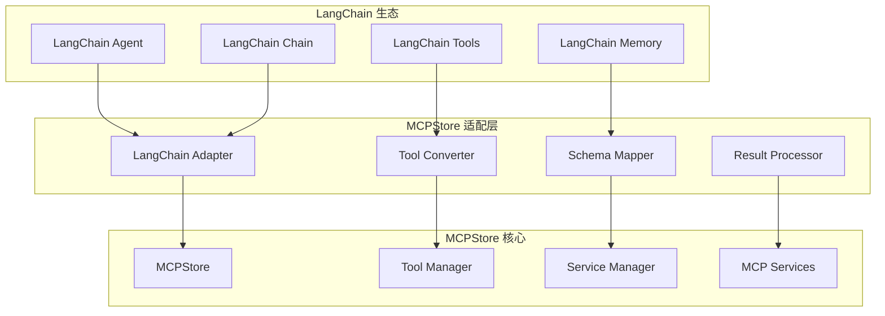

# LangChain 集成指南

## 📋 概述

MCPStore 提供了与 LangChain 的深度集成，允许您将 MCP 工具无缝集成到 LangChain 的工作流中。通过这种集成，您可以在 LangChain 的 Agent 和 Chain 中使用 MCPStore 管理的所有工具。

## 🏗️ 集成架构



## 🔧 基础集成

### MCPStore LangChain 适配器

```python
from langchain.tools import BaseTool
from langchain.agents import initialize_agent, AgentType
from langchain.llms import OpenAI
from langchain.schema import AgentAction, AgentFinish
from typing import Optional, Type, Any, Dict, List
import json

class MCPStoreLangChainAdapter:
    """MCPStore LangChain 适配器"""
    
    def __init__(self, mcpstore):
        self.mcpstore = mcpstore
        self.langchain_tools = []
        self._convert_tools()
    
    def _convert_tools(self):
        """将 MCPStore 工具转换为 LangChain 工具"""
        mcp_tools = self.mcpstore.list_tools()
        
        for tool_info in mcp_tools:
            langchain_tool = self._create_langchain_tool(tool_info)
            self.langchain_tools.append(langchain_tool)
    
    def _create_langchain_tool(self, tool_info):
        """创建 LangChain 工具"""
        
        class MCPTool(BaseTool):
            name = tool_info['name']
            description = tool_info.get('description', f"MCP tool: {tool_info['name']}")
            
            def __init__(self, mcpstore, tool_info):
                super().__init__()
                self.mcpstore = mcpstore
                self.tool_info = tool_info
            
            def _run(self, **kwargs) -> str:
                """执行工具"""
                try:
                    # 调用 MCPStore 工具
                    result = self.mcpstore.call_tool(
                        self.tool_info['name'], 
                        kwargs
                    )
                    
                    # 处理结果
                    if isinstance(result, dict):
                        return json.dumps(result, ensure_ascii=False, indent=2)
                    else:
                        return str(result)
                        
                except Exception as e:
                    return f"Error executing tool {self.name}: {str(e)}"
            
            async def _arun(self, **kwargs) -> str:
                """异步执行工具"""
                # 对于异步执行，可以使用线程池
                import asyncio
                loop = asyncio.get_event_loop()
                return await loop.run_in_executor(None, self._run, **kwargs)
        
        return MCPTool(self.mcpstore, tool_info)
    
    def get_langchain_tools(self) -> List[BaseTool]:
        """获取 LangChain 工具列表"""
        return self.langchain_tools
    
    def refresh_tools(self):
        """刷新工具列表"""
        self.langchain_tools.clear()
        self._convert_tools()

# 使用适配器
from mcpstore import MCPStore

# 初始化 MCPStore
store = MCPStore()
store.add_service({
    "mcpServers": {
        "filesystem": {
            "command": "npx",
            "args": ["-y", "@modelcontextprotocol/server-filesystem", "/tmp"]
        }
    }
})

# 创建适配器
adapter = MCPStoreLangChainAdapter(store)
langchain_tools = adapter.get_langchain_tools()

print(f"🔧 转换了 {len(langchain_tools)} 个工具到 LangChain")
```

### LangChain Agent 集成

```python
from langchain.agents import initialize_agent, AgentType
from langchain.llms import OpenAI
from langchain.memory import ConversationBufferMemory

class MCPStoreLangChainAgent:
    """MCPStore LangChain Agent"""
    
    def __init__(self, mcpstore, llm=None, agent_type=AgentType.ZERO_SHOT_REACT_DESCRIPTION):
        self.mcpstore = mcpstore
        self.adapter = MCPStoreLangChainAdapter(mcpstore)
        
        # 初始化 LLM
        if llm is None:
            llm = OpenAI(temperature=0)
        self.llm = llm
        
        # 初始化记忆
        self.memory = ConversationBufferMemory(
            memory_key="chat_history",
            return_messages=True
        )
        
        # 创建 Agent
        self.agent = initialize_agent(
            tools=self.adapter.get_langchain_tools(),
            llm=self.llm,
            agent=agent_type,
            memory=self.memory,
            verbose=True,
            handle_parsing_errors=True
        )
    
    def run(self, query: str) -> str:
        """运行 Agent"""
        try:
            result = self.agent.run(query)
            return result
        except Exception as e:
            return f"Agent execution failed: {str(e)}"
    
    def add_custom_tool(self, tool_name: str, tool_func, description: str):
        """添加自定义工具"""
        
        class CustomTool(BaseTool):
            name = tool_name
            description = description
            
            def _run(self, **kwargs) -> str:
                try:
                    result = tool_func(**kwargs)
                    return str(result)
                except Exception as e:
                    return f"Error: {str(e)}"
            
            async def _arun(self, **kwargs) -> str:
                return self._run(**kwargs)
        
        # 添加到工具列表
        custom_tool = CustomTool()
        self.agent.tools.append(custom_tool)
        
        print(f"✅ 添加自定义工具: {tool_name}")
    
    def refresh_tools(self):
        """刷新工具"""
        self.adapter.refresh_tools()
        
        # 重新初始化 Agent
        self.agent = initialize_agent(
            tools=self.adapter.get_langchain_tools(),
            llm=self.llm,
            agent=self.agent.agent_type,
            memory=self.memory,
            verbose=True
        )

# 使用 MCPStore LangChain Agent
agent = MCPStoreLangChainAgent(store)

# 测试 Agent
queries = [
    "列出 /tmp 目录下的文件",
    "创建一个名为 test.txt 的文件，内容是 'Hello LangChain'",
    "读取刚才创建的 test.txt 文件的内容"
]

for query in queries:
    print(f"\n🤖 查询: {query}")
    result = agent.run(query)
    print(f"📝 结果: {result}")
```

## 🔗 高级集成功能

### 自定义 LangChain Chain

```python
from langchain.chains.base import Chain
from langchain.schema import BasePromptTemplate
from langchain.prompts import PromptTemplate
from typing import Dict, List

class MCPStoreChain(Chain):
    """MCPStore 自定义链"""
    
    mcpstore: Any
    prompt: BasePromptTemplate
    llm: Any
    output_key: str = "result"
    
    class Config:
        arbitrary_types_allowed = True
    
    @property
    def input_keys(self) -> List[str]:
        """输入键"""
        return ["task", "context"]
    
    @property
    def output_keys(self) -> List[str]:
        """输出键"""
        return [self.output_key]
    
    def _call(self, inputs: Dict[str, Any]) -> Dict[str, Any]:
        """执行链"""
        task = inputs["task"]
        context = inputs.get("context", {})
        
        # 1. 分析任务，确定需要的工具
        tools_needed = self._analyze_task(task)
        
        # 2. 执行工具调用
        tool_results = self._execute_tools(tools_needed, context)
        
        # 3. 使用 LLM 处理结果
        final_result = self._process_results(task, tool_results)
        
        return {self.output_key: final_result}
    
    def _analyze_task(self, task: str) -> List[Dict]:
        """分析任务，确定需要的工具"""
        # 使用 LLM 分析任务
        analysis_prompt = PromptTemplate(
            input_variables=["task", "available_tools"],
            template="""
            任务: {task}
            
            可用工具: {available_tools}
            
            请分析这个任务需要使用哪些工具，以什么顺序执行，需要什么参数。
            返回 JSON 格式的工具调用计划。
            """
        )
        
        # 获取可用工具
        available_tools = [tool['name'] for tool in self.mcpstore.list_tools()]
        
        # 生成分析
        analysis_input = analysis_prompt.format(
            task=task,
            available_tools=", ".join(available_tools)
        )
        
        analysis_result = self.llm(analysis_input)
        
        # 解析分析结果
        try:
            import json
            tools_plan = json.loads(analysis_result)
            return tools_plan
        except:
            # 如果解析失败，返回空计划
            return []
    
    def _execute_tools(self, tools_plan: List[Dict], context: Dict) -> List[Dict]:
        """执行工具调用"""
        results = []
        
        for tool_call in tools_plan:
            try:
                tool_name = tool_call.get('tool_name')
                arguments = tool_call.get('arguments', {})
                
                # 替换上下文变量
                arguments = self._substitute_context(arguments, context)
                
                # 执行工具
                result = self.mcpstore.call_tool(tool_name, arguments)
                
                results.append({
                    'tool_name': tool_name,
                    'arguments': arguments,
                    'result': result,
                    'success': True
                })
                
                # 更新上下文
                context[f"{tool_name}_result"] = result
                
            except Exception as e:
                results.append({
                    'tool_name': tool_call.get('tool_name'),
                    'arguments': tool_call.get('arguments', {}),
                    'error': str(e),
                    'success': False
                })
        
        return results
    
    def _substitute_context(self, arguments: Dict, context: Dict) -> Dict:
        """替换上下文变量"""
        import re
        
        def replace_vars(obj):
            if isinstance(obj, str):
                # 替换 ${variable} 格式的变量
                pattern = r'\$\{([^}]+)\}'
                
                def replacer(match):
                    var_name = match.group(1)
                    return str(context.get(var_name, match.group(0)))
                
                return re.sub(pattern, replacer, obj)
            elif isinstance(obj, dict):
                return {k: replace_vars(v) for k, v in obj.items()}
            elif isinstance(obj, list):
                return [replace_vars(item) for item in obj]
            else:
                return obj
        
        return replace_vars(arguments)
    
    def _process_results(self, task: str, tool_results: List[Dict]) -> str:
        """处理工具结果"""
        # 构造结果处理提示
        results_prompt = PromptTemplate(
            input_variables=["task", "tool_results"],
            template="""
            原始任务: {task}
            
            工具执行结果: {tool_results}
            
            请根据工具执行结果，生成对原始任务的完整回答。
            """
        )
        
        # 格式化工具结果
        formatted_results = []
        for result in tool_results:
            if result['success']:
                formatted_results.append(f"工具 {result['tool_name']}: 成功 - {result['result']}")
            else:
                formatted_results.append(f"工具 {result['tool_name']}: 失败 - {result['error']}")
        
        # 生成最终结果
        final_input = results_prompt.format(
            task=task,
            tool_results="\n".join(formatted_results)
        )
        
        return self.llm(final_input)

# 使用自定义链
from langchain.llms import OpenAI

custom_chain = MCPStoreChain(
    mcpstore=store,
    llm=OpenAI(temperature=0),
    prompt=PromptTemplate(input_variables=["task"], template="{task}")
)

# 测试自定义链
result = custom_chain({
    "task": "创建一个报告文件，包含当前目录的文件列表",
    "context": {"output_dir": "/tmp"}
})

print(f"🔗 自定义链结果: {result['result']}")
```

### 工具组合和工作流

```python
from langchain.chains import SequentialChain
from langchain.chains.llm import LLMChain

class MCPStoreWorkflow:
    """MCPStore 工作流"""
    
    def __init__(self, mcpstore, llm):
        self.mcpstore = mcpstore
        self.llm = llm
        self.workflows = {}
    
    def create_workflow(self, name: str, steps: List[Dict]):
        """创建工作流"""
        chains = []
        
        for i, step in enumerate(steps):
            step_name = f"step_{i+1}"
            
            if step['type'] == 'tool_call':
                # 工具调用步骤
                chain = self._create_tool_chain(step_name, step)
            elif step['type'] == 'llm_process':
                # LLM 处理步骤
                chain = self._create_llm_chain(step_name, step)
            else:
                raise ValueError(f"Unknown step type: {step['type']}")
            
            chains.append(chain)
        
        # 创建顺序链
        workflow = SequentialChain(
            chains=chains,
            input_variables=["input"],
            output_variables=[f"step_{len(steps)}_output"],
            verbose=True
        )
        
        self.workflows[name] = workflow
        return workflow
    
    def _create_tool_chain(self, step_name: str, step_config: Dict):
        """创建工具调用链"""
        
        class ToolCallChain(Chain):
            mcpstore: Any
            tool_name: str
            arguments_template: Dict
            
            @property
            def input_keys(self) -> List[str]:
                return ["input"]
            
            @property
            def output_keys(self) -> List[str]:
                return [f"{step_name}_output"]
            
            def _call(self, inputs: Dict[str, Any]) -> Dict[str, Any]:
                # 处理参数模板
                arguments = self._process_arguments(inputs)
                
                # 调用工具
                result = self.mcpstore.call_tool(self.tool_name, arguments)
                
                return {f"{step_name}_output": result}
            
            def _process_arguments(self, inputs: Dict) -> Dict:
                """处理参数模板"""
                import re
                
                def substitute_vars(obj):
                    if isinstance(obj, str):
                        # 替换变量
                        for key, value in inputs.items():
                            obj = obj.replace(f"{{{key}}}", str(value))
                        return obj
                    elif isinstance(obj, dict):
                        return {k: substitute_vars(v) for k, v in obj.items()}
                    else:
                        return obj
                
                return substitute_vars(self.arguments_template)
        
        return ToolCallChain(
            mcpstore=self.mcpstore,
            tool_name=step_config['tool_name'],
            arguments_template=step_config.get('arguments', {})
        )
    
    def _create_llm_chain(self, step_name: str, step_config: Dict):
        """创建 LLM 处理链"""
        prompt = PromptTemplate(
            input_variables=step_config.get('input_variables', ['input']),
            template=step_config['prompt_template']
        )
        
        return LLMChain(
            llm=self.llm,
            prompt=prompt,
            output_key=f"{step_name}_output"
        )
    
    def run_workflow(self, workflow_name: str, input_data: Dict) -> Dict:
        """运行工作流"""
        if workflow_name not in self.workflows:
            raise ValueError(f"Workflow {workflow_name} not found")
        
        workflow = self.workflows[workflow_name]
        return workflow(input_data)

# 创建工作流
workflow_manager = MCPStoreWorkflow(store, OpenAI(temperature=0))

# 定义文件处理工作流
file_processing_steps = [
    {
        'type': 'tool_call',
        'tool_name': 'read_file',
        'arguments': {'path': '{file_path}'}
    },
    {
        'type': 'llm_process',
        'prompt_template': '分析以下文件内容并生成摘要:\n\n{step_1_output}\n\n摘要:',
        'input_variables': ['step_1_output']
    },
    {
        'type': 'tool_call',
        'tool_name': 'write_file',
        'arguments': {
            'path': '{output_path}',
            'content': '{step_2_output}'
        }
    }
]

# 创建工作流
workflow = workflow_manager.create_workflow('file_processing', file_processing_steps)

# 运行工作流
result = workflow_manager.run_workflow('file_processing', {
    'input': 'process file',
    'file_path': '/tmp/input.txt',
    'output_path': '/tmp/summary.txt'
})

print(f"🔄 工作流结果: {result}")
```

## 🔗 相关文档

- [工具管理系统](../tools/management/tool-management.md)
- [链式调用机制](chaining.md)
- [FastMCP 集成](fastmcp-integration.md)
- [完整示例集合](../examples/complete-examples.md)

## 📚 集成最佳实践

1. **工具转换**：确保 MCP 工具正确转换为 LangChain 工具格式
2. **错误处理**：在 LangChain 集成中实现完善的错误处理
3. **性能优化**：使用批量调用和缓存提高性能
4. **工作流设计**：合理设计工具组合和执行顺序
5. **状态管理**：正确管理工作流中的状态和上下文
6. **监控日志**：记录 LangChain 集成的执行过程和结果

---

**更新时间**: 2025-01-09  
**版本**: 1.0.0
