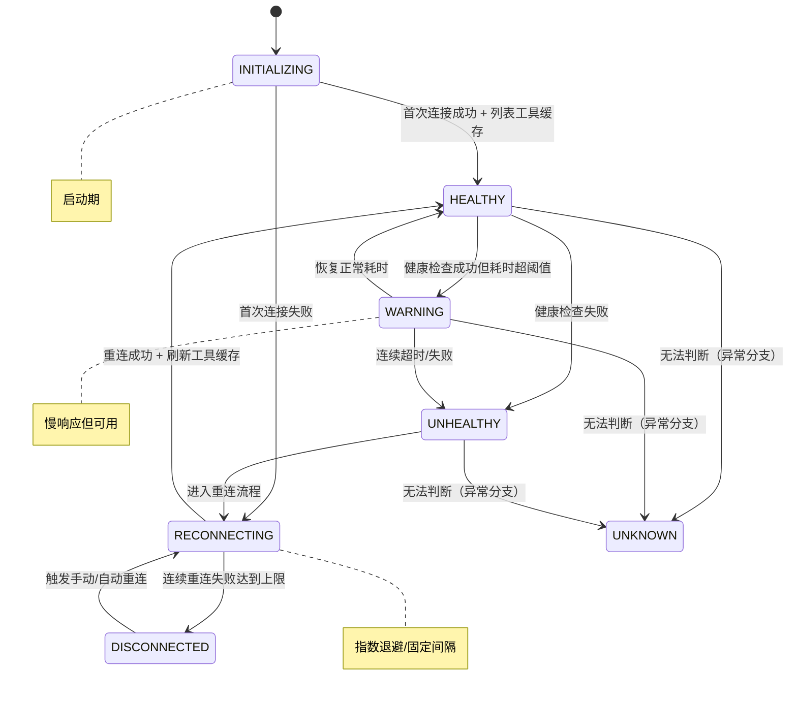
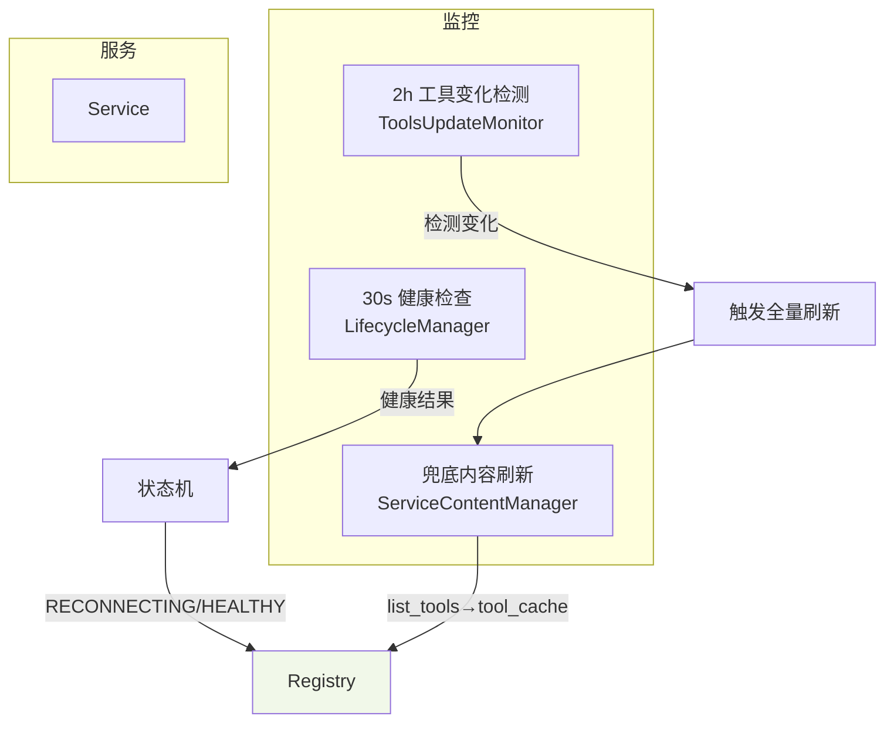

# 生命周期管理（7 状态）

本页基于最新代码实现，系统性说明 MCPStore 的服务生命周期管理：状态机、检测节奏、与缓存/持久化的关系，以及错误恢复策略。

## 🎯 设计目标
- 精细化状态：比“健康/不健康”更细，便于可视化与运维决策
- 稳定恢复：断连与失败后自动切换到重连模式
- 低噪声日志：失败预期路径仅告警，不刷屏 error

## 🧬 状态模型（7 状态）

状态含义：
- INITIALIZING：刚注册/刚启动，进行首次连接和工具拉取
- HEALTHY：健康可用
- WARNING：可用但慢（耗时超过阈值）
- UNHEALTHY：检查失败
- RECONNECTING：断线重连中
- DISCONNECTED：多次失败后暂停一段时间
- UNKNOWN：无法判断（异常兜底）

## ⏱️ 检测与刷新节奏
- 健康检查：默认每 30 秒（ServiceLifecycleManager）
- 工具刷新：默认每 2 小时（ToolsUpdateMonitor），或在重连成功后立刻刷新（update_tools_on_reconnection）
- 兜底刷新：ServiceContentManager 周期轮询（间隔对齐 timing.tools_update_interval_seconds）

## 🔁 生命周期与缓存/持久化的关系
- 缓存：所有“列表/查询类”接口（服务/工具）均来自“注册表缓存（内存）”。
- 持久化：仅 mcp.json 单源存储服务配置；不再有 agent_clients.json/client_services.json 分片文件。
- 启动重建：缓存为内存数据，进程重启后会按 mcp.json 重新注册并拉取工具生成缓存。

## 🔧 关键实现要点（与代码一致）
- RECONNECTING 作为明确状态贯穿于连接异常与恢复路径
- 连接失败日志级别统一为 warning（非致命预期路径）
- 工具发现和列表读取只依赖缓存；不回退分片文件
- 注册/更新服务后：写回 mcp.json → 驱动生命周期初始化 → 刷新缓存

## 🆕 新增组件（重构后）
- **HealthStatusBridge**：健康检查状态到生命周期状态的映射桥梁，确保状态转换的准确性
- **UnifiedServiceStateManager**：统一状态管理接口，提供状态设置、查询、转换验证等功能
- **增强版健康检查处理**：`handle_health_check_result_enhanced()` 支持丰富的状态信息传递

详见：
- [健康状态桥梁机制](health-status-bridge.md)
- [统一状态管理器](unified-state-manager.md)

## 🔌 与 FastMCP 的协作
- 连接与工具枚举通过 FastMCP 客户端执行
- call_tool 支持 raise_on_error 控制（默认 True），生命周期按实际错误计入健康统计

## 📎 API/SDK 使用要点
- list_services/list_tools：永远从缓存返回
- get_service_status：返回 7 状态之一
- restart_service：触发重连与状态机推进

## ✅ 差异对比（旧 → 新）
- 配置来源：mcp.json 单源（旧：可能混用分片文件）
- 回退策略：无分片回退（旧：回退到 agent_clients）
- 日志级别：连接失败 warning（旧：error 较多）

更新时间：2025-08-18

