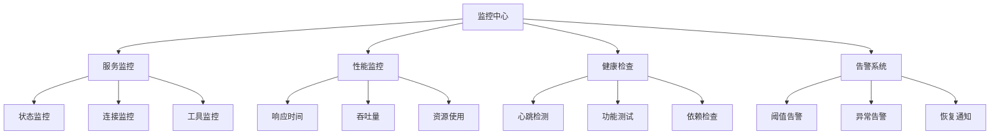

# 高级监控系统

## 📋 概述

MCPStore 提供了完整的监控系统，用于实时跟踪服务状态、性能指标和系统健康度。监控系统采用分层架构，支持多种监控策略和告警机制。

## 🏗️ 监控架构



## 🔧 监控配置

### 基础监控配置

```python
from mcpstore import MCPStore
from mcpstore.monitoring import MonitoringConfig, AlertConfig

# 创建监控配置
monitoring_config = MonitoringConfig(
    # 基础设置
    enabled=True,
    check_interval=30,  # 检查间隔（秒）
    
    # 健康检查设置
    health_check_timeout=10,
    health_check_retries=3,
    
    # 性能监控设置
    performance_monitoring=True,
    metrics_retention_days=7,
    
    # 告警设置
    alerts_enabled=True,
    alert_cooldown=300,  # 告警冷却时间（秒）
)

# 初始化 MCPStore 并启用监控
store = MCPStore(monitoring_config=monitoring_config)
```

### 高级监控配置

```python
# 详细的监控配置
advanced_config = MonitoringConfig(
    # 服务级别监控
    service_monitoring={
        'status_check_interval': 15,
        'connection_timeout': 5,
        'max_consecutive_failures': 3
    },
    
    # 性能监控
    performance_monitoring={
        'response_time_threshold': 1.0,  # 响应时间阈值（秒）
        'cpu_threshold': 80,             # CPU使用率阈值（%）
        'memory_threshold': 85,          # 内存使用率阈值（%）
        'disk_threshold': 90             # 磁盘使用率阈值（%）
    },
    
    # 工具监控
    tool_monitoring={
        'call_timeout': 30,
        'error_rate_threshold': 0.1,     # 错误率阈值（10%）
        'slow_call_threshold': 5.0       # 慢调用阈值（秒）
    },
    
    # 数据收集
    data_collection={
        'metrics_buffer_size': 1000,
        'log_level': 'INFO',
        'export_format': 'json'
    }
)

store = MCPStore(monitoring_config=advanced_config)
```

## 📊 监控指标

### 服务级别指标

```python
class ServiceMetrics:
    """服务监控指标"""
    
    def __init__(self, service_name):
        self.service_name = service_name
        self.status = "unknown"
        self.uptime = 0
        self.last_check_time = None
        self.consecutive_failures = 0
        self.total_requests = 0
        self.failed_requests = 0
        self.avg_response_time = 0
        self.last_error = None

# 获取服务指标
def get_service_metrics(store, service_name):
    """获取服务监控指标"""
    try:
        # 基础状态信息
        status = store.get_service_status(service_name)
        info = store.get_service_info(service_name)
        
        # 性能指标
        metrics = store.get_service_metrics(service_name)
        
        return {
            'service_name': service_name,
            'status': status,
            'uptime': info.get('uptime', 0),
            'tools_count': len(info.get('tools', [])),
            'active_connections': info.get('active_connections', 0),
            'total_calls': metrics.get('total_calls', 0),
            'failed_calls': metrics.get('failed_calls', 0),
            'avg_response_time': metrics.get('avg_response_time', 0),
            'last_activity': metrics.get('last_activity'),
            'error_rate': metrics.get('error_rate', 0)
        }
        
    except Exception as e:
        return {
            'service_name': service_name,
            'status': 'error',
            'error': str(e)
        }

# 使用示例
metrics = get_service_metrics(store, "filesystem")
print(f"服务状态: {metrics['status']}")
print(f"运行时间: {metrics['uptime']}s")
print(f"错误率: {metrics['error_rate']:.2%}")
```

### 系统级别指标

```python
import psutil
import time

class SystemMetrics:
    """系统监控指标"""
    
    @staticmethod
    def get_cpu_usage():
        """获取CPU使用率"""
        return psutil.cpu_percent(interval=1)
    
    @staticmethod
    def get_memory_usage():
        """获取内存使用情况"""
        memory = psutil.virtual_memory()
        return {
            'total': memory.total,
            'available': memory.available,
            'used': memory.used,
            'percentage': memory.percent
        }
    
    @staticmethod
    def get_disk_usage(path='/'):
        """获取磁盘使用情况"""
        disk = psutil.disk_usage(path)
        return {
            'total': disk.total,
            'used': disk.used,
            'free': disk.free,
            'percentage': (disk.used / disk.total) * 100
        }
    
    @staticmethod
    def get_network_stats():
        """获取网络统计"""
        stats = psutil.net_io_counters()
        return {
            'bytes_sent': stats.bytes_sent,
            'bytes_recv': stats.bytes_recv,
            'packets_sent': stats.packets_sent,
            'packets_recv': stats.packets_recv
        }

# 系统监控示例
def monitor_system_resources():
    """监控系统资源"""
    print("📊 系统资源监控:")
    print("-" * 40)
    
    # CPU使用率
    cpu_usage = SystemMetrics.get_cpu_usage()
    print(f"🖥️  CPU使用率: {cpu_usage:.1f}%")
    
    # 内存使用情况
    memory = SystemMetrics.get_memory_usage()
    print(f"💾 内存使用率: {memory['percentage']:.1f}%")
    print(f"   已用: {memory['used'] / 1024**3:.1f}GB")
    print(f"   可用: {memory['available'] / 1024**3:.1f}GB")
    
    # 磁盘使用情况
    disk = SystemMetrics.get_disk_usage()
    print(f"💿 磁盘使用率: {disk['percentage']:.1f}%")
    print(f"   已用: {disk['used'] / 1024**3:.1f}GB")
    print(f"   可用: {disk['free'] / 1024**3:.1f}GB")

monitor_system_resources()
```

## 🚨 告警系统

### 告警配置

```python
from enum import Enum

class AlertLevel(Enum):
    INFO = "info"
    WARNING = "warning"
    ERROR = "error"
    CRITICAL = "critical"

class AlertRule:
    """告警规则"""
    
    def __init__(self, name, condition, level, message, cooldown=300):
        self.name = name
        self.condition = condition  # 告警条件函数
        self.level = level
        self.message = message
        self.cooldown = cooldown
        self.last_triggered = 0

class AlertManager:
    """告警管理器"""
    
    def __init__(self):
        self.rules = []
        self.handlers = []
        self.alert_history = []
    
    def add_rule(self, rule):
        """添加告警规则"""
        self.rules.append(rule)
    
    def add_handler(self, handler):
        """添加告警处理器"""
        self.handlers.append(handler)
    
    def check_alerts(self, metrics):
        """检查告警条件"""
        current_time = time.time()
        
        for rule in self.rules:
            try:
                if rule.condition(metrics):
                    # 检查冷却时间
                    if current_time - rule.last_triggered > rule.cooldown:
                        alert = {
                            'rule_name': rule.name,
                            'level': rule.level,
                            'message': rule.message,
                            'timestamp': current_time,
                            'metrics': metrics
                        }
                        
                        self._trigger_alert(alert)
                        rule.last_triggered = current_time
                        
            except Exception as e:
                print(f"⚠️ 检查告警规则 {rule.name} 时发生错误: {e}")
    
    def _trigger_alert(self, alert):
        """触发告警"""
        self.alert_history.append(alert)
        
        # 调用所有告警处理器
        for handler in self.handlers:
            try:
                handler(alert)
            except Exception as e:
                print(f"⚠️ 告警处理器执行失败: {e}")

# 告警处理器示例
def console_alert_handler(alert):
    """控制台告警处理器"""
    level_icons = {
        AlertLevel.INFO: "ℹ️",
        AlertLevel.WARNING: "⚠️", 
        AlertLevel.ERROR: "❌",
        AlertLevel.CRITICAL: "🚨"
    }
    
    icon = level_icons.get(alert['level'], "📢")
    timestamp = time.strftime("%Y-%m-%d %H:%M:%S", time.localtime(alert['timestamp']))
    
    print(f"{icon} [{timestamp}] {alert['level'].value.upper()}: {alert['message']}")

def email_alert_handler(alert):
    """邮件告警处理器"""
    # 这里实现邮件发送逻辑
    print(f"📧 发送邮件告警: {alert['message']}")

# 使用告警系统
alert_manager = AlertManager()

# 添加告警规则
alert_manager.add_rule(AlertRule(
    name="service_down",
    condition=lambda m: m.get('status') != 'running',
    level=AlertLevel.ERROR,
    message="服务 {service_name} 已停止运行"
))

alert_manager.add_rule(AlertRule(
    name="high_error_rate",
    condition=lambda m: m.get('error_rate', 0) > 0.1,
    level=AlertLevel.WARNING,
    message="服务 {service_name} 错误率过高: {error_rate:.2%}"
))

alert_manager.add_rule(AlertRule(
    name="slow_response",
    condition=lambda m: m.get('avg_response_time', 0) > 5.0,
    level=AlertLevel.WARNING,
    message="服务 {service_name} 响应时间过慢: {avg_response_time:.2f}s"
))

# 添加告警处理器
alert_manager.add_handler(console_alert_handler)
alert_manager.add_handler(email_alert_handler)
```

## 📈 实时监控仪表板

### 监控仪表板

```python
import threading
import time
from datetime import datetime, timedelta

class MonitoringDashboard:
    """监控仪表板"""
    
    def __init__(self, store):
        self.store = store
        self.alert_manager = AlertManager()
        self.monitoring = False
        self.monitor_thread = None
        self.metrics_history = {}
        
        # 设置告警规则
        self._setup_alert_rules()
    
    def _setup_alert_rules(self):
        """设置默认告警规则"""
        # 服务状态告警
        self.alert_manager.add_rule(AlertRule(
            name="service_down",
            condition=lambda m: m.get('status') not in ['running', 'starting'],
            level=AlertLevel.ERROR,
            message=f"服务已停止运行"
        ))
        
        # 性能告警
        self.alert_manager.add_rule(AlertRule(
            name="high_response_time",
            condition=lambda m: m.get('avg_response_time', 0) > 3.0,
            level=AlertLevel.WARNING,
            message=f"响应时间过慢"
        ))
        
        # 添加控制台告警处理器
        self.alert_manager.add_handler(console_alert_handler)
    
    def start_monitoring(self, interval=30):
        """开始监控"""
        self.monitoring = True
        self.monitor_thread = threading.Thread(
            target=self._monitoring_loop,
            args=(interval,)
        )
        self.monitor_thread.start()
        print(f"📊 监控仪表板已启动 (间隔: {interval}s)")
    
    def stop_monitoring(self):
        """停止监控"""
        self.monitoring = False
        if self.monitor_thread:
            self.monitor_thread.join()
        print("📊 监控仪表板已停止")
    
    def _monitoring_loop(self, interval):
        """监控循环"""
        while self.monitoring:
            try:
                # 获取所有服务
                services = self.store.list_services()
                
                for service in services:
                    service_name = service['name']
                    
                    # 收集指标
                    metrics = get_service_metrics(self.store, service_name)
                    
                    # 存储历史数据
                    if service_name not in self.metrics_history:
                        self.metrics_history[service_name] = []
                    
                    metrics['timestamp'] = time.time()
                    self.metrics_history[service_name].append(metrics)
                    
                    # 保留最近24小时的数据
                    cutoff_time = time.time() - 24 * 3600
                    self.metrics_history[service_name] = [
                        m for m in self.metrics_history[service_name]
                        if m['timestamp'] > cutoff_time
                    ]
                    
                    # 检查告警
                    self.alert_manager.check_alerts(metrics)
                
                time.sleep(interval)
                
            except Exception as e:
                print(f"⚠️ 监控循环中发生错误: {e}")
                time.sleep(interval)
    
    def print_dashboard(self):
        """打印监控仪表板"""
        print("\n" + "="*60)
        print("📊 MCPStore 监控仪表板")
        print("="*60)
        print(f"⏰ 更新时间: {datetime.now().strftime('%Y-%m-%d %H:%M:%S')}")
        print()
        
        # 系统概览
        services = self.store.list_services()
        running_count = 0
        total_tools = 0
        
        for service in services:
            try:
                status = self.store.get_service_status(service['name'])
                if status == 'running':
                    running_count += 1
                
                info = self.store.get_service_info(service['name'])
                total_tools += len(info.get('tools', []))
                
            except:
                pass
        
        print(f"🔍 系统概览:")
        print(f"   服务总数: {len(services)}")
        print(f"   运行中: {running_count}")
        print(f"   工具总数: {total_tools}")
        print()
        
        # 服务详情
        print("🔧 服务状态:")
        print("-" * 40)
        
        for service in services:
            service_name = service['name']
            
            try:
                metrics = get_service_metrics(self.store, service_name)
                
                status_icon = {
                    'running': '✅',
                    'stopped': '⏹️',
                    'error': '❌',
                    'starting': '🔄'
                }.get(metrics['status'], '❓')
                
                print(f"{status_icon} {service_name}")
                print(f"   状态: {metrics['status']}")
                print(f"   工具数: {metrics.get('tools_count', 0)}")
                print(f"   错误率: {metrics.get('error_rate', 0):.1%}")
                
                if metrics.get('avg_response_time'):
                    print(f"   响应时间: {metrics['avg_response_time']:.2f}s")
                
                print()
                
            except Exception as e:
                print(f"❌ {service_name}: 获取状态失败 - {e}")
                print()
        
        # 最近告警
        recent_alerts = [
            alert for alert in self.alert_manager.alert_history
            if time.time() - alert['timestamp'] < 3600  # 最近1小时
        ]
        
        if recent_alerts:
            print("🚨 最近告警:")
            print("-" * 40)
            for alert in recent_alerts[-5:]:  # 显示最近5条
                timestamp = time.strftime(
                    "%H:%M:%S", 
                    time.localtime(alert['timestamp'])
                )
                print(f"[{timestamp}] {alert['level'].value}: {alert['message']}")
            print()

# 使用监控仪表板
dashboard = MonitoringDashboard(store)
dashboard.start_monitoring(interval=10)

# 定期打印仪表板
for _ in range(6):  # 运行1分钟
    time.sleep(10)
    dashboard.print_dashboard()

dashboard.stop_monitoring()
```

## 📊 监控数据导出

### 数据导出功能

```python
import json
import csv
from datetime import datetime

class MonitoringExporter:
    """监控数据导出器"""
    
    def __init__(self, dashboard):
        self.dashboard = dashboard
    
    def export_to_json(self, filename=None):
        """导出为JSON格式"""
        if not filename:
            filename = f"monitoring_data_{datetime.now().strftime('%Y%m%d_%H%M%S')}.json"
        
        export_data = {
            'export_time': datetime.now().isoformat(),
            'services': self.dashboard.metrics_history,
            'alerts': self.dashboard.alert_manager.alert_history
        }
        
        with open(filename, 'w', encoding='utf-8') as f:
            json.dump(export_data, f, indent=2, ensure_ascii=False)
        
        print(f"📁 监控数据已导出到: {filename}")
        return filename
    
    def export_to_csv(self, service_name, filename=None):
        """导出服务指标为CSV格式"""
        if service_name not in self.dashboard.metrics_history:
            print(f"❌ 服务 {service_name} 没有监控数据")
            return None
        
        if not filename:
            filename = f"metrics_{service_name}_{datetime.now().strftime('%Y%m%d_%H%M%S')}.csv"
        
        metrics_data = self.dashboard.metrics_history[service_name]
        
        if not metrics_data:
            print(f"❌ 服务 {service_name} 没有监控数据")
            return None
        
        # 获取所有字段
        fieldnames = set()
        for metrics in metrics_data:
            fieldnames.update(metrics.keys())
        
        fieldnames = sorted(list(fieldnames))
        
        with open(filename, 'w', newline='', encoding='utf-8') as f:
            writer = csv.DictWriter(f, fieldnames=fieldnames)
            writer.writeheader()
            writer.writerows(metrics_data)
        
        print(f"📁 服务 {service_name} 指标已导出到: {filename}")
        return filename

# 使用数据导出
exporter = MonitoringExporter(dashboard)
exporter.export_to_json()
exporter.export_to_csv("filesystem")
```

## 🔗 相关文档

- [健康检查机制](../services/lifecycle/health-check.md)
- [服务管理概述](../services/management/service-management.md)
- [性能优化](performance.md)
- [错误处理](error-handling.md)

## 📚 最佳实践

1. **合理设置监控间隔**：平衡监控精度和系统开销
2. **分层监控策略**：服务级、工具级、系统级监控
3. **告警规则优化**：避免告警风暴，设置合理阈值
4. **数据保留策略**：定期清理历史数据，控制存储空间
5. **监控数据可视化**：使用图表展示趋势和异常
6. **自动化响应**：结合告警实现自动故障恢复

---

**更新时间**: 2025-01-09  
**版本**: 1.0.0
