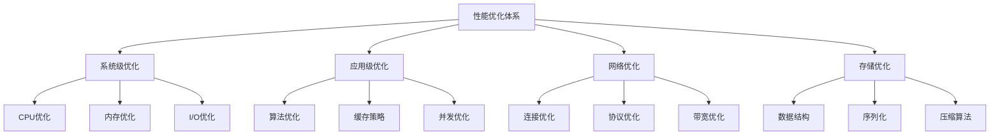

# 性能优化深度指南

## 📋 概述

本文档提供了 MCPStore 性能优化的深度指南，涵盖系统级优化、应用级优化、网络优化等多个层面的优化策略和实践方法。

## 🏗️ 性能优化体系



## 🚀 系统级性能优化

### CPU 优化策略

```python
import multiprocessing
import threading
from concurrent.futures import ThreadPoolExecutor, ProcessPoolExecutor
import asyncio

class CPUOptimizer:
    """CPU优化器"""
    
    def __init__(self):
        self.cpu_count = multiprocessing.cpu_count()
        self.thread_pool = None
        self.process_pool = None
        self.async_semaphore = None
    
    def optimize_thread_pool(self, max_workers=None):
        """优化线程池配置"""
        if max_workers is None:
            # I/O密集型任务：CPU核心数 * 2-4
            max_workers = self.cpu_count * 3
        
        self.thread_pool = ThreadPoolExecutor(
            max_workers=max_workers,
            thread_name_prefix="mcpstore-worker"
        )
        
        print(f"🔧 线程池优化: {max_workers} 个工作线程")
        return self.thread_pool
    
    def optimize_process_pool(self, max_workers=None):
        """优化进程池配置"""
        if max_workers is None:
            # CPU密集型任务：CPU核心数
            max_workers = self.cpu_count
        
        self.process_pool = ProcessPoolExecutor(
            max_workers=max_workers
        )
        
        print(f"🔧 进程池优化: {max_workers} 个工作进程")
        return self.process_pool
    
    def optimize_async_concurrency(self, max_concurrent=None):
        """优化异步并发数"""
        if max_concurrent is None:
            # 异步任务：CPU核心数 * 10-50
            max_concurrent = self.cpu_count * 20
        
        self.async_semaphore = asyncio.Semaphore(max_concurrent)
        
        print(f"🔧 异步并发优化: {max_concurrent} 个并发任务")
        return self.async_semaphore
    
    def cpu_intensive_task_optimizer(self, task_func, data_chunks):
        """CPU密集型任务优化"""
        with self.process_pool as executor:
            futures = [executor.submit(task_func, chunk) for chunk in data_chunks]
            results = [future.result() for future in futures]
        
        return results
    
    def io_intensive_task_optimizer(self, task_func, task_args_list):
        """I/O密集型任务优化"""
        with self.thread_pool as executor:
            futures = [executor.submit(task_func, *args) for args in task_args_list]
            results = [future.result() for future in futures]
        
        return results

# 使用CPU优化器
cpu_optimizer = CPUOptimizer()
thread_pool = cpu_optimizer.optimize_thread_pool()
process_pool = cpu_optimizer.optimize_process_pool()
```

### 内存优化策略

```python
import gc
import sys
import weakref
from collections import deque
import psutil

class MemoryOptimizer:
    """内存优化器"""
    
    def __init__(self):
        self.memory_threshold = 0.8  # 80%内存使用率阈值
        self.gc_threshold = (700, 10, 10)  # 垃圾回收阈值
        self.object_pools = {}
        self.weak_references = weakref.WeakValueDictionary()
    
    def optimize_garbage_collection(self):
        """优化垃圾回收"""
        # 设置垃圾回收阈值
        gc.set_threshold(*self.gc_threshold)
        
        # 启用垃圾回收调试
        # gc.set_debug(gc.DEBUG_STATS)
        
        print(f"🗑️ 垃圾回收优化: 阈值 {self.gc_threshold}")
    
    def create_object_pool(self, name, factory, max_size=100):
        """创建对象池"""
        self.object_pools[name] = ObjectPool(factory, max_size)
        print(f"🏊 对象池创建: {name} (最大 {max_size} 个对象)")
    
    def get_from_pool(self, pool_name):
        """从对象池获取对象"""
        pool = self.object_pools.get(pool_name)
        if pool:
            return pool.get()
        return None
    
    def return_to_pool(self, pool_name, obj):
        """返回对象到池"""
        pool = self.object_pools.get(pool_name)
        if pool:
            pool.put(obj)
    
    def monitor_memory_usage(self):
        """监控内存使用"""
        process = psutil.Process()
        memory_info = process.memory_info()
        memory_percent = process.memory_percent()
        
        if memory_percent > self.memory_threshold * 100:
            print(f"⚠️ 内存使用率过高: {memory_percent:.1f}%")
            self.trigger_memory_cleanup()
        
        return {
            'rss': memory_info.rss,
            'vms': memory_info.vms,
            'percent': memory_percent
        }
    
    def trigger_memory_cleanup(self):
        """触发内存清理"""
        print("🧹 开始内存清理...")
        
        # 强制垃圾回收
        collected = gc.collect()
        print(f"   垃圾回收: 清理 {collected} 个对象")
        
        # 清理对象池
        for name, pool in self.object_pools.items():
            cleaned = pool.cleanup()
            print(f"   对象池 {name}: 清理 {cleaned} 个对象")
        
        # 清理弱引用
        self.weak_references.clear()
        print("   弱引用: 已清理")

class ObjectPool:
    """对象池实现"""
    
    def __init__(self, factory, max_size=100):
        self.factory = factory
        self.max_size = max_size
        self.pool = deque()
        self.created_count = 0
        self.reused_count = 0
    
    def get(self):
        """获取对象"""
        if self.pool:
            obj = self.pool.popleft()
            self.reused_count += 1
            return obj
        else:
            obj = self.factory()
            self.created_count += 1
            return obj
    
    def put(self, obj):
        """放回对象"""
        if len(self.pool) < self.max_size:
            # 重置对象状态
            if hasattr(obj, 'reset'):
                obj.reset()
            self.pool.append(obj)
    
    def cleanup(self):
        """清理池"""
        cleaned = len(self.pool)
        self.pool.clear()
        return cleaned
    
    def get_stats(self):
        """获取统计信息"""
        return {
            'pool_size': len(self.pool),
            'created_count': self.created_count,
            'reused_count': self.reused_count,
            'reuse_rate': self.reused_count / (self.created_count + self.reused_count) if (self.created_count + self.reused_count) > 0 else 0
        }

# 使用内存优化器
memory_optimizer = MemoryOptimizer()
memory_optimizer.optimize_garbage_collection()

# 创建对象池
def create_result_object():
    return {'data': None, 'status': 'ready'}

memory_optimizer.create_object_pool('results', create_result_object, max_size=50)
```

## ⚡ 应用级性能优化

### 智能缓存系统

```python
import time
import hashlib
import pickle
from functools import wraps
from typing import Any, Optional, Callable

class IntelligentCache:
    """智能缓存系统"""
    
    def __init__(self, max_size=1000, default_ttl=300):
        self.max_size = max_size
        self.default_ttl = default_ttl
        self.cache = {}
        self.access_times = {}
        self.hit_count = 0
        self.miss_count = 0
    
    def get(self, key: str) -> Optional[Any]:
        """获取缓存"""
        if key in self.cache:
            value, expiry = self.cache[key]
            
            if time.time() < expiry:
                self.access_times[key] = time.time()
                self.hit_count += 1
                return value
            else:
                # 缓存过期
                del self.cache[key]
                del self.access_times[key]
        
        self.miss_count += 1
        return None
    
    def set(self, key: str, value: Any, ttl: Optional[int] = None) -> None:
        """设置缓存"""
        if ttl is None:
            ttl = self.default_ttl
        
        expiry = time.time() + ttl
        
        # 检查缓存大小
        if len(self.cache) >= self.max_size:
            self._evict_lru()
        
        self.cache[key] = (value, expiry)
        self.access_times[key] = time.time()
    
    def _evict_lru(self):
        """LRU淘汰策略"""
        if not self.access_times:
            return
        
        # 找到最久未访问的键
        lru_key = min(self.access_times, key=self.access_times.get)
        
        # 删除缓存项
        del self.cache[lru_key]
        del self.access_times[lru_key]
    
    def clear(self):
        """清空缓存"""
        self.cache.clear()
        self.access_times.clear()
    
    def get_stats(self):
        """获取缓存统计"""
        total_requests = self.hit_count + self.miss_count
        hit_rate = self.hit_count / total_requests if total_requests > 0 else 0
        
        return {
            'size': len(self.cache),
            'max_size': self.max_size,
            'hit_count': self.hit_count,
            'miss_count': self.miss_count,
            'hit_rate': hit_rate,
            'usage_rate': len(self.cache) / self.max_size
        }

def cache_result(cache: IntelligentCache, ttl: Optional[int] = None, key_func: Optional[Callable] = None):
    """缓存装饰器"""
    def decorator(func):
        @wraps(func)
        def wrapper(*args, **kwargs):
            # 生成缓存键
            if key_func:
                cache_key = key_func(*args, **kwargs)
            else:
                cache_key = _generate_cache_key(func.__name__, args, kwargs)
            
            # 尝试从缓存获取
            cached_result = cache.get(cache_key)
            if cached_result is not None:
                return cached_result
            
            # 执行函数并缓存结果
            result = func(*args, **kwargs)
            cache.set(cache_key, result, ttl)
            
            return result
        
        return wrapper
    return decorator

def _generate_cache_key(func_name: str, args: tuple, kwargs: dict) -> str:
    """生成缓存键"""
    key_data = {
        'func': func_name,
        'args': args,
        'kwargs': kwargs
    }
    
    # 序列化并生成哈希
    serialized = pickle.dumps(key_data, protocol=pickle.HIGHEST_PROTOCOL)
    return hashlib.md5(serialized).hexdigest()

# 使用智能缓存
intelligent_cache = IntelligentCache(max_size=500, default_ttl=600)

@cache_result(intelligent_cache, ttl=300)
def expensive_operation(param1, param2):
    """模拟耗时操作"""
    time.sleep(1)  # 模拟耗时
    return f"Result for {param1} and {param2}"

# 测试缓存效果
start_time = time.time()
result1 = expensive_operation("test", "data")  # 第一次调用，会缓存
result2 = expensive_operation("test", "data")  # 第二次调用，从缓存获取
end_time = time.time()

print(f"⚡ 缓存测试完成，耗时: {end_time - start_time:.2f}s")
print(f"📊 缓存统计: {intelligent_cache.get_stats()}")
```

### 批量操作优化

```python
class BatchOptimizer:
    """批量操作优化器"""
    
    def __init__(self, store):
        self.store = store
        self.batch_size = 20
        self.max_concurrent = 5
        self.operation_queue = []
    
    def add_operation(self, operation_type, tool_name, arguments):
        """添加操作到队列"""
        self.operation_queue.append({
            'type': operation_type,
            'tool_name': tool_name,
            'arguments': arguments,
            'timestamp': time.time()
        })
    
    def optimize_batch_execution(self):
        """优化批量执行"""
        if not self.operation_queue:
            return []
        
        # 按操作类型分组
        grouped_operations = self._group_operations()
        
        # 优化执行顺序
        optimized_groups = self._optimize_execution_order(grouped_operations)
        
        # 并行执行
        results = self._execute_parallel_batches(optimized_groups)
        
        # 清空队列
        self.operation_queue.clear()
        
        return results
    
    def _group_operations(self):
        """按操作类型分组"""
        groups = {}
        
        for operation in self.operation_queue:
            op_type = operation['type']
            if op_type not in groups:
                groups[op_type] = []
            groups[op_type].append(operation)
        
        return groups
    
    def _optimize_execution_order(self, grouped_operations):
        """优化执行顺序"""
        # 定义操作优先级
        priority_order = ['read', 'write', 'delete', 'create']
        
        optimized_groups = []
        for op_type in priority_order:
            if op_type in grouped_operations:
                # 按批次大小分割
                operations = grouped_operations[op_type]
                for i in range(0, len(operations), self.batch_size):
                    batch = operations[i:i + self.batch_size]
                    optimized_groups.append((op_type, batch))
        
        return optimized_groups
    
    def _execute_parallel_batches(self, optimized_groups):
        """并行执行批次"""
        from concurrent.futures import ThreadPoolExecutor, as_completed
        
        all_results = []
        
        with ThreadPoolExecutor(max_workers=self.max_concurrent) as executor:
            # 提交批次任务
            future_to_batch = {}
            for op_type, batch in optimized_groups:
                future = executor.submit(self._execute_batch, op_type, batch)
                future_to_batch[future] = (op_type, batch)
            
            # 收集结果
            for future in as_completed(future_to_batch):
                op_type, batch = future_to_batch[future]
                try:
                    batch_results = future.result()
                    all_results.extend(batch_results)
                    print(f"✅ 批次完成: {op_type} ({len(batch)} 个操作)")
                except Exception as e:
                    print(f"❌ 批次失败: {op_type} - {e}")
        
        return all_results
    
    def _execute_batch(self, op_type, batch):
        """执行单个批次"""
        batch_calls = []
        
        for operation in batch:
            batch_calls.append({
                'tool_name': operation['tool_name'],
                'arguments': operation['arguments']
            })
        
        # 执行批量调用
        return self.store.batch_call(batch_calls)

# 使用批量优化器
batch_optimizer = BatchOptimizer(store)

# 添加多个操作
for i in range(50):
    batch_optimizer.add_operation('read', 'read_file', {'path': f'/tmp/file_{i}.txt'})
    batch_optimizer.add_operation('write', 'write_file', {
        'path': f'/tmp/output_{i}.txt',
        'content': f'Content {i}'
    })

# 优化执行
start_time = time.time()
results = batch_optimizer.optimize_batch_execution()
execution_time = time.time() - start_time

print(f"⚡ 批量优化完成: {len(results)} 个操作，耗时 {execution_time:.2f}s")
```

## 🌐 网络性能优化

### 连接池优化

```python
import queue
import threading
import time
from contextlib import contextmanager

class OptimizedConnectionPool:
    """优化的连接池"""
    
    def __init__(self, service_config, min_size=2, max_size=10, max_idle_time=300):
        self.service_config = service_config
        self.min_size = min_size
        self.max_size = max_size
        self.max_idle_time = max_idle_time
        
        # 连接管理
        self.active_connections = set()
        self.idle_connections = queue.Queue()
        self.connection_count = 0
        self.lock = threading.RLock()
        
        # 性能统计
        self.stats = {
            'created': 0,
            'reused': 0,
            'closed': 0,
            'timeouts': 0
        }
        
        # 初始化最小连接数
        self._initialize_pool()
        
        # 启动清理线程
        self.cleanup_thread = threading.Thread(target=self._cleanup_idle_connections, daemon=True)
        self.cleanup_thread.start()
    
    def _initialize_pool(self):
        """初始化连接池"""
        for _ in range(self.min_size):
            try:
                connection = self._create_connection()
                self.idle_connections.put((connection, time.time()))
            except Exception as e:
                print(f"⚠️ 初始化连接失败: {e}")
    
    def _create_connection(self):
        """创建新连接"""
        with self.lock:
            if self.connection_count >= self.max_size:
                raise Exception("连接池已满")
            
            # 这里应该是实际的连接创建逻辑
            connection = MockConnection(self.service_config)
            self.connection_count += 1
            self.stats['created'] += 1
            
            return connection
    
    @contextmanager
    def get_connection(self, timeout=30):
        """获取连接（上下文管理器）"""
        connection = None
        start_time = time.time()
        
        try:
            # 尝试从空闲连接获取
            try:
                connection, _ = self.idle_connections.get_nowait()
                self.stats['reused'] += 1
            except queue.Empty:
                # 创建新连接
                if self.connection_count < self.max_size:
                    connection = self._create_connection()
                else:
                    # 等待连接释放
                    try:
                        connection, _ = self.idle_connections.get(timeout=timeout)
                        self.stats['reused'] += 1
                    except queue.Empty:
                        self.stats['timeouts'] += 1
                        raise Exception("获取连接超时")
            
            # 验证连接有效性
            if not self._validate_connection(connection):
                connection = self._create_connection()
            
            # 添加到活跃连接
            with self.lock:
                self.active_connections.add(connection)
            
            yield connection
            
        finally:
            # 释放连接
            if connection:
                self._release_connection(connection)
    
    def _release_connection(self, connection):
        """释放连接"""
        with self.lock:
            if connection in self.active_connections:
                self.active_connections.remove(connection)
                
                # 验证连接状态
                if self._validate_connection(connection):
                    # 返回空闲池
                    self.idle_connections.put((connection, time.time()))
                else:
                    # 关闭无效连接
                    self._close_connection(connection)
    
    def _validate_connection(self, connection):
        """验证连接有效性"""
        try:
            return connection.is_alive()
        except:
            return False
    
    def _close_connection(self, connection):
        """关闭连接"""
        try:
            connection.close()
            with self.lock:
                self.connection_count -= 1
                self.stats['closed'] += 1
        except:
            pass
    
    def _cleanup_idle_connections(self):
        """清理空闲连接"""
        while True:
            try:
                current_time = time.time()
                connections_to_close = []
                
                # 检查空闲连接
                temp_connections = []
                while not self.idle_connections.empty():
                    try:
                        connection, idle_time = self.idle_connections.get_nowait()
                        
                        if current_time - idle_time > self.max_idle_time:
                            connections_to_close.append(connection)
                        else:
                            temp_connections.append((connection, idle_time))
                    except queue.Empty:
                        break
                
                # 重新放回未过期的连接
                for conn_info in temp_connections:
                    self.idle_connections.put(conn_info)
                
                # 关闭过期连接
                for connection in connections_to_close:
                    self._close_connection(connection)
                
                time.sleep(60)  # 每分钟清理一次
                
            except Exception as e:
                print(f"⚠️ 连接清理失败: {e}")
                time.sleep(60)
    
    def get_stats(self):
        """获取连接池统计"""
        with self.lock:
            return {
                'active_connections': len(self.active_connections),
                'idle_connections': self.idle_connections.qsize(),
                'total_connections': self.connection_count,
                'max_size': self.max_size,
                'min_size': self.min_size,
                'usage_rate': self.connection_count / self.max_size,
                **self.stats
            }

class MockConnection:
    """模拟连接类"""
    
    def __init__(self, config):
        self.config = config
        self.created_time = time.time()
        self.alive = True
    
    def is_alive(self):
        """检查连接是否存活"""
        return self.alive
    
    def close(self):
        """关闭连接"""
        self.alive = False

# 使用优化的连接池
pool = OptimizedConnectionPool(
    service_config={'host': 'localhost', 'port': 8080},
    min_size=3,
    max_size=15,
    max_idle_time=600
)

# 测试连接池性能
def test_connection_pool_performance():
    """测试连接池性能"""
    start_time = time.time()
    
    # 模拟并发连接使用
    def use_connection(pool, operation_id):
        try:
            with pool.get_connection() as conn:
                # 模拟操作
                time.sleep(0.1)
                return f"Operation {operation_id} completed"
        except Exception as e:
            return f"Operation {operation_id} failed: {e}"
    
    # 并发测试
    from concurrent.futures import ThreadPoolExecutor
    
    with ThreadPoolExecutor(max_workers=10) as executor:
        futures = [executor.submit(use_connection, pool, i) for i in range(100)]
        results = [future.result() for future in futures]
    
    end_time = time.time()
    
    # 统计结果
    successful = sum(1 for r in results if "completed" in r)
    failed = len(results) - successful
    
    print(f"⚡ 连接池性能测试完成:")
    print(f"   总操作: {len(results)}")
    print(f"   成功: {successful}")
    print(f"   失败: {failed}")
    print(f"   耗时: {end_time - start_time:.2f}s")
    print(f"   连接池统计: {pool.get_stats()}")

test_connection_pool_performance()
```

## 📊 性能监控和分析

### 性能分析器

```python
import cProfile
import pstats
import io
from functools import wraps
import time

class PerformanceProfiler:
    """性能分析器"""
    
    def __init__(self):
        self.profiles = {}
        self.timing_data = {}
    
    def profile_function(self, func_name=None):
        """函数性能分析装饰器"""
        def decorator(func):
            name = func_name or func.__name__
            
            @wraps(func)
            def wrapper(*args, **kwargs):
                # 创建性能分析器
                profiler = cProfile.Profile()
                
                # 开始分析
                profiler.enable()
                start_time = time.time()
                
                try:
                    result = func(*args, **kwargs)
                    return result
                finally:
                    # 停止分析
                    end_time = time.time()
                    profiler.disable()
                    
                    # 保存分析结果
                    self._save_profile(name, profiler, end_time - start_time)
            
            return wrapper
        return decorator
    
    def _save_profile(self, name, profiler, execution_time):
        """保存分析结果"""
        # 保存性能分析数据
        s = io.StringIO()
        ps = pstats.Stats(profiler, stream=s)
        ps.sort_stats('cumulative')
        ps.print_stats(20)  # 显示前20个函数
        
        self.profiles[name] = s.getvalue()
        
        # 保存时间数据
        if name not in self.timing_data:
            self.timing_data[name] = []
        
        self.timing_data[name].append(execution_time)
    
    def get_profile_report(self, func_name):
        """获取性能分析报告"""
        if func_name in self.profiles:
            timing_data = self.timing_data.get(func_name, [])
            
            report = {
                'function_name': func_name,
                'call_count': len(timing_data),
                'total_time': sum(timing_data),
                'average_time': sum(timing_data) / len(timing_data) if timing_data else 0,
                'min_time': min(timing_data) if timing_data else 0,
                'max_time': max(timing_data) if timing_data else 0,
                'profile_details': self.profiles[func_name]
            }
            
            return report
        
        return None
    
    def get_summary_report(self):
        """获取汇总报告"""
        summary = {}
        
        for func_name, timing_data in self.timing_data.items():
            summary[func_name] = {
                'call_count': len(timing_data),
                'total_time': sum(timing_data),
                'average_time': sum(timing_data) / len(timing_data),
                'min_time': min(timing_data),
                'max_time': max(timing_data)
            }
        
        return summary

# 使用性能分析器
profiler = PerformanceProfiler()

@profiler.profile_function("tool_call_operation")
def optimized_tool_call(store, tool_name, arguments):
    """优化的工具调用"""
    return store.call_tool(tool_name, arguments)

# 测试性能分析
for i in range(10):
    try:
        result = optimized_tool_call(store, "list_directory", {"path": "/tmp"})
    except:
        pass

# 获取性能报告
report = profiler.get_profile_report("tool_call_operation")
if report:
    print(f"📊 性能分析报告:")
    print(f"   函数: {report['function_name']}")
    print(f"   调用次数: {report['call_count']}")
    print(f"   平均耗时: {report['average_time']:.4f}s")
    print(f"   最小耗时: {report['min_time']:.4f}s")
    print(f"   最大耗时: {report['max_time']:.4f}s")

# 获取汇总报告
summary = profiler.get_summary_report()
print(f"\n📈 性能汇总:")
for func_name, stats in summary.items():
    print(f"   {func_name}: {stats['call_count']} 次调用, 平均 {stats['average_time']:.4f}s")
```

## 🔗 相关文档

- [性能优化指南](performance.md)
- [监控系统](monitoring.md)
- [系统架构概览](../architecture/overview.md)
- [错误处理机制](error-handling.md)

## 📚 性能优化最佳实践

1. **系统级优化**：合理配置CPU、内存和I/O资源
2. **应用级优化**：使用缓存、对象池和批量操作
3. **网络优化**：连接池、协议优化和带宽管理
4. **监控分析**：持续监控性能指标，及时发现瓶颈
5. **渐进优化**：从最大的性能瓶颈开始，逐步优化
6. **测试验证**：每次优化后都要进行性能测试验证

---

**更新时间**: 2025-01-09  
**版本**: 1.0.0
