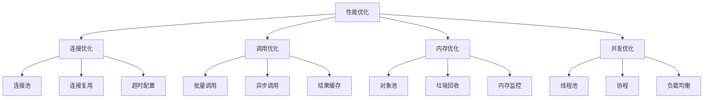

# 性能优化指南

## 📋 概述

MCPStore 的性能优化涵盖服务启动、工具调用、连接管理、内存使用等多个方面。通过合理的配置和优化策略，可以显著提升系统的响应速度和吞吐量。

## 🏗️ 性能优化架构



## 🚀 连接优化

### 连接池配置

```python
from mcpstore import MCPStore
from mcpstore.config import ConnectionPoolConfig

# 连接池配置
pool_config = ConnectionPoolConfig(
    # 基础配置
    min_connections=2,      # 最小连接数
    max_connections=10,     # 最大连接数
    max_idle_time=300,      # 最大空闲时间（秒）
    
    # 超时配置
    connection_timeout=30,   # 连接超时
    read_timeout=60,        # 读取超时
    write_timeout=30,       # 写入超时
    
    # 重试配置
    max_retries=3,          # 最大重试次数
    retry_delay=1.0,        # 重试延迟
    
    # 健康检查
    health_check_interval=60,  # 健康检查间隔
    health_check_timeout=5     # 健康检查超时
)

# 使用连接池配置
store = MCPStore(connection_pool_config=pool_config)
```

### 连接复用策略

```python
class ConnectionManager:
    """连接管理器"""
    
    def __init__(self, store):
        self.store = store
        self.connection_cache = {}
        self.connection_stats = {}
    
    def get_optimized_connection(self, service_name):
        """获取优化的连接"""
        
        # 检查缓存的连接
        if service_name in self.connection_cache:
            connection = self.connection_cache[service_name]
            
            # 验证连接有效性
            if self._is_connection_healthy(connection):
                self._update_connection_stats(service_name, "reused")
                return connection
            else:
                # 清理无效连接
                del self.connection_cache[service_name]
        
        # 创建新连接
        connection = self._create_new_connection(service_name)
        self.connection_cache[service_name] = connection
        self._update_connection_stats(service_name, "created")
        
        return connection
    
    def _is_connection_healthy(self, connection):
        """检查连接健康状态"""
        try:
            # 发送心跳检查
            response = connection.ping(timeout=2)
            return response.get("status") == "ok"
        except:
            return False
    
    def _create_new_connection(self, service_name):
        """创建新连接"""
        return self.store._get_service_connection(service_name)
    
    def _update_connection_stats(self, service_name, action):
        """更新连接统计"""
        if service_name not in self.connection_stats:
            self.connection_stats[service_name] = {
                "created": 0,
                "reused": 0,
                "failed": 0
            }
        
        self.connection_stats[service_name][action] += 1
    
    def get_connection_stats(self):
        """获取连接统计"""
        return self.connection_stats
    
    def cleanup_idle_connections(self, max_idle_time=300):
        """清理空闲连接"""
        current_time = time.time()
        to_remove = []
        
        for service_name, connection in self.connection_cache.items():
            if hasattr(connection, 'last_used'):
                if current_time - connection.last_used > max_idle_time:
                    to_remove.append(service_name)
        
        for service_name in to_remove:
            del self.connection_cache[service_name]
            print(f"🧹 清理空闲连接: {service_name}")

# 使用连接管理器
conn_manager = ConnectionManager(store)

# 定期清理空闲连接
import threading
def cleanup_worker():
    while True:
        time.sleep(60)  # 每分钟检查一次
        conn_manager.cleanup_idle_connections()

cleanup_thread = threading.Thread(target=cleanup_worker, daemon=True)
cleanup_thread.start()
```

## ⚡ 调用优化

### 批量调用优化

```python
class OptimizedBatchCaller:
    """优化的批量调用器"""
    
    def __init__(self, store, batch_size=10, max_workers=5):
        self.store = store
        self.batch_size = batch_size
        self.max_workers = max_workers
        self.call_queue = []
        self.results_cache = {}
    
    def add_call(self, tool_name, arguments, cache_key=None):
        """添加调用到队列"""
        call = {
            "tool_name": tool_name,
            "arguments": arguments,
            "cache_key": cache_key
        }
        self.call_queue.append(call)
    
    def execute_batch(self):
        """执行批量调用"""
        if not self.call_queue:
            return []
        
        # 检查缓存
        cached_results = []
        uncached_calls = []
        
        for call in self.call_queue:
            if call["cache_key"] and call["cache_key"] in self.results_cache:
                cached_results.append(self.results_cache[call["cache_key"]])
                print(f"📦 使用缓存结果: {call['tool_name']}")
            else:
                uncached_calls.append(call)
        
        # 分批处理未缓存的调用
        batch_results = []
        for i in range(0, len(uncached_calls), self.batch_size):
            batch = uncached_calls[i:i + self.batch_size]
            batch_result = self._execute_batch_chunk(batch)
            batch_results.extend(batch_result)
        
        # 更新缓存
        for call, result in zip(uncached_calls, batch_results):
            if call["cache_key"]:
                self.results_cache[call["cache_key"]] = result
        
        # 合并结果
        all_results = cached_results + batch_results
        
        # 清空队列
        self.call_queue = []
        
        return all_results
    
    def _execute_batch_chunk(self, batch):
        """执行批量调用块"""
        from concurrent.futures import ThreadPoolExecutor, as_completed
        
        results = [None] * len(batch)
        
        with ThreadPoolExecutor(max_workers=self.max_workers) as executor:
            # 提交任务
            future_to_index = {}
            for i, call in enumerate(batch):
                future = executor.submit(
                    self.store.call_tool,
                    call["tool_name"],
                    call["arguments"]
                )
                future_to_index[future] = i
            
            # 收集结果
            for future in as_completed(future_to_index):
                index = future_to_index[future]
                try:
                    result = future.result()
                    results[index] = result
                except Exception as e:
                    results[index] = {"error": str(e)}
        
        return results

# 使用优化的批量调用
batch_caller = OptimizedBatchCaller(store, batch_size=5, max_workers=3)

# 添加多个调用
for i in range(20):
    batch_caller.add_call(
        "read_file",
        {"path": f"/tmp/file_{i}.txt"},
        cache_key=f"read_file_{i}"  # 使用缓存键
    )

# 执行批量调用
start_time = time.time()
results = batch_caller.execute_batch()
execution_time = time.time() - start_time

print(f"⚡ 批量调用完成: {len(results)} 个调用，耗时 {execution_time:.2f}s")
```

### 异步调用优化

```python
import asyncio
from concurrent.futures import ThreadPoolExecutor

class AsyncToolCaller:
    """异步工具调用器"""
    
    def __init__(self, store, max_concurrent=10):
        self.store = store
        self.max_concurrent = max_concurrent
        self.semaphore = asyncio.Semaphore(max_concurrent)
        self.executor = ThreadPoolExecutor(max_workers=max_concurrent)
    
    async def call_tool_async(self, tool_name, arguments):
        """异步调用工具"""
        async with self.semaphore:
            loop = asyncio.get_event_loop()
            
            # 在线程池中执行同步调用
            result = await loop.run_in_executor(
                self.executor,
                self.store.call_tool,
                tool_name,
                arguments
            )
            
            return result
    
    async def batch_call_async(self, calls):
        """异步批量调用"""
        tasks = []
        
        for call in calls:
            task = self.call_tool_async(
                call["tool_name"],
                call["arguments"]
            )
            tasks.append(task)
        
        # 并发执行所有任务
        results = await asyncio.gather(*tasks, return_exceptions=True)
        
        # 处理异常
        processed_results = []
        for result in results:
            if isinstance(result, Exception):
                processed_results.append({"error": str(result)})
            else:
                processed_results.append(result)
        
        return processed_results
    
    def close(self):
        """关闭执行器"""
        self.executor.shutdown(wait=True)

# 使用异步调用
async def async_example():
    async_caller = AsyncToolCaller(store, max_concurrent=5)
    
    # 准备调用列表
    calls = [
        {"tool_name": "read_file", "arguments": {"path": f"/tmp/file_{i}.txt"}}
        for i in range(10)
    ]
    
    # 异步批量调用
    start_time = time.time()
    results = await async_caller.batch_call_async(calls)
    execution_time = time.time() - start_time
    
    print(f"🚀 异步调用完成: {len(results)} 个调用，耗时 {execution_time:.2f}s")
    
    async_caller.close()

# 运行异步示例
# asyncio.run(async_example())
```

## 💾 内存优化

### 对象池管理

```python
from collections import deque
import weakref

class ObjectPool:
    """对象池"""
    
    def __init__(self, factory, max_size=100):
        self.factory = factory
        self.max_size = max_size
        self.pool = deque()
        self.active_objects = weakref.WeakSet()
    
    def get_object(self):
        """获取对象"""
        if self.pool:
            obj = self.pool.popleft()
            self._reset_object(obj)
        else:
            obj = self.factory()
        
        self.active_objects.add(obj)
        return obj
    
    def return_object(self, obj):
        """归还对象"""
        if obj in self.active_objects and len(self.pool) < self.max_size:
            self.pool.append(obj)
    
    def _reset_object(self, obj):
        """重置对象状态"""
        if hasattr(obj, 'reset'):
            obj.reset()
    
    def get_stats(self):
        """获取池统计"""
        return {
            "pool_size": len(self.pool),
            "active_objects": len(self.active_objects),
            "max_size": self.max_size
        }

# 结果对象工厂
class ToolResult:
    def __init__(self):
        self.reset()
    
    def reset(self):
        self.tool_name = None
        self.arguments = None
        self.result = None
        self.error = None
        self.execution_time = 0

def result_factory():
    return ToolResult()

# 使用对象池
result_pool = ObjectPool(result_factory, max_size=50)

def optimized_call_tool(store, tool_name, arguments):
    """使用对象池的优化调用"""
    result_obj = result_pool.get_object()
    
    try:
        start_time = time.time()
        
        result_obj.tool_name = tool_name
        result_obj.arguments = arguments
        result_obj.result = store.call_tool(tool_name, arguments)
        result_obj.execution_time = time.time() - start_time
        
        return result_obj
        
    except Exception as e:
        result_obj.error = str(e)
        result_obj.execution_time = time.time() - start_time
        return result_obj
    
    finally:
        # 注意：在实际使用后需要手动归还对象
        pass

# 使用示例
result = optimized_call_tool(store, "read_file", {"path": "/tmp/test.txt"})
print(f"调用结果: {result.result}")

# 使用完毕后归还对象
result_pool.return_object(result)
```

### 内存监控

```python
import psutil
import gc

class MemoryMonitor:
    """内存监控器"""
    
    def __init__(self, threshold_mb=500):
        self.threshold_mb = threshold_mb
        self.threshold_bytes = threshold_mb * 1024 * 1024
        self.monitoring = False
        self.stats = []
    
    def start_monitoring(self, interval=30):
        """开始内存监控"""
        self.monitoring = True
        
        def monitor_loop():
            while self.monitoring:
                self._collect_memory_stats()
                time.sleep(interval)
        
        monitor_thread = threading.Thread(target=monitor_loop, daemon=True)
        monitor_thread.start()
        print(f"📊 内存监控已启动 (阈值: {self.threshold_mb}MB)")
    
    def stop_monitoring(self):
        """停止内存监控"""
        self.monitoring = False
        print("📊 内存监控已停止")
    
    def _collect_memory_stats(self):
        """收集内存统计"""
        process = psutil.Process()
        memory_info = process.memory_info()
        
        stats = {
            "timestamp": time.time(),
            "rss_mb": memory_info.rss / 1024 / 1024,
            "vms_mb": memory_info.vms / 1024 / 1024,
            "percent": process.memory_percent(),
            "gc_objects": len(gc.get_objects())
        }
        
        self.stats.append(stats)
        
        # 保留最近100个数据点
        if len(self.stats) > 100:
            self.stats = self.stats[-100:]
        
        # 检查内存使用
        if memory_info.rss > self.threshold_bytes:
            self._handle_high_memory(stats)
    
    def _handle_high_memory(self, stats):
        """处理高内存使用"""
        print(f"⚠️ 内存使用过高: {stats['rss_mb']:.1f}MB")
        
        # 触发垃圾回收
        collected = gc.collect()
        print(f"🗑️ 垃圾回收: 清理了 {collected} 个对象")
        
        # 可以在这里添加其他内存优化措施
        self._optimize_memory()
    
    def _optimize_memory(self):
        """内存优化措施"""
        # 清理缓存
        if hasattr(self, 'store') and hasattr(self.store, 'clear_cache'):
            self.store.clear_cache()
            print("🧹 已清理缓存")
        
        # 强制垃圾回收
        for generation in range(3):
            gc.collect(generation)
    
    def get_memory_summary(self):
        """获取内存摘要"""
        if not self.stats:
            return None
        
        recent_stats = self.stats[-10:]  # 最近10个数据点
        
        return {
            "current_rss_mb": recent_stats[-1]["rss_mb"],
            "current_percent": recent_stats[-1]["percent"],
            "avg_rss_mb": sum(s["rss_mb"] for s in recent_stats) / len(recent_stats),
            "max_rss_mb": max(s["rss_mb"] for s in recent_stats),
            "gc_objects": recent_stats[-1]["gc_objects"]
        }

# 使用内存监控
memory_monitor = MemoryMonitor(threshold_mb=200)
memory_monitor.start_monitoring(interval=10)

# 运行一段时间后查看摘要
time.sleep(30)
summary = memory_monitor.get_memory_summary()
if summary:
    print(f"💾 内存摘要: 当前 {summary['current_rss_mb']:.1f}MB, 平均 {summary['avg_rss_mb']:.1f}MB")

memory_monitor.stop_monitoring()
```

## 🔧 性能调优配置

### 全局性能配置

```python
class PerformanceConfig:
    """性能配置"""
    
    def __init__(self):
        # 连接配置
        self.connection_pool_size = 10
        self.connection_timeout = 30
        self.read_timeout = 60
        
        # 调用配置
        self.default_batch_size = 10
        self.max_concurrent_calls = 20
        self.call_timeout = 30
        
        # 缓存配置
        self.enable_result_cache = True
        self.cache_size = 1000
        self.cache_ttl = 300
        
        # 内存配置
        self.memory_threshold_mb = 500
        self.gc_threshold = 1000
        
        # 监控配置
        self.enable_performance_monitoring = True
        self.monitoring_interval = 30

def apply_performance_config(store, config):
    """应用性能配置"""
    
    # 配置连接池
    store.configure_connection_pool(
        size=config.connection_pool_size,
        timeout=config.connection_timeout
    )
    
    # 配置缓存
    if config.enable_result_cache:
        store.enable_result_cache(
            size=config.cache_size,
            ttl=config.cache_ttl
        )
    
    # 配置监控
    if config.enable_performance_monitoring:
        store.enable_performance_monitoring(
            interval=config.monitoring_interval
        )
    
    print("⚡ 性能配置已应用")

# 使用性能配置
perf_config = PerformanceConfig()
apply_performance_config(store, perf_config)
```

### 性能基准测试

```python
class PerformanceBenchmark:
    """性能基准测试"""
    
    def __init__(self, store):
        self.store = store
        self.results = {}
    
    def run_benchmark(self, test_name, test_func, iterations=100):
        """运行基准测试"""
        print(f"🏃 运行基准测试: {test_name}")
        
        times = []
        errors = 0
        
        for i in range(iterations):
            try:
                start_time = time.time()
                test_func()
                end_time = time.time()
                times.append(end_time - start_time)
            except Exception as e:
                errors += 1
                print(f"❌ 测试迭代 {i+1} 失败: {e}")
        
        if times:
            self.results[test_name] = {
                "iterations": len(times),
                "errors": errors,
                "avg_time": sum(times) / len(times),
                "min_time": min(times),
                "max_time": max(times),
                "total_time": sum(times),
                "success_rate": len(times) / iterations * 100
            }
        
        return self.results[test_name]
    
    def print_results(self):
        """打印测试结果"""
        print("\n📊 性能基准测试结果:")
        print("=" * 60)
        
        for test_name, result in self.results.items():
            print(f"\n🔍 {test_name}:")
            print(f"   迭代次数: {result['iterations']}")
            print(f"   成功率: {result['success_rate']:.1f}%")
            print(f"   平均时间: {result['avg_time']*1000:.2f}ms")
            print(f"   最小时间: {result['min_time']*1000:.2f}ms")
            print(f"   最大时间: {result['max_time']*1000:.2f}ms")
            print(f"   总时间: {result['total_time']:.2f}s")

# 定义测试函数
def test_simple_call():
    """简单调用测试"""
    store.call_tool("list_directory", {"path": "/tmp"})

def test_batch_call():
    """批量调用测试"""
    calls = [
        {"tool_name": "list_directory", "arguments": {"path": "/tmp"}}
        for _ in range(5)
    ]
    store.batch_call(calls)

# 运行基准测试
benchmark = PerformanceBenchmark(store)

benchmark.run_benchmark("简单调用", test_simple_call, iterations=50)
benchmark.run_benchmark("批量调用", test_batch_call, iterations=20)

benchmark.print_results()
```

## 🔗 相关文档

- [监控系统](monitoring.md)
- [错误处理](error-handling.md)
- [批量调用](../tools/usage/batch-call.md)
- [链式调用](chaining.md)

## 📚 最佳实践

1. **连接管理**：使用连接池，避免频繁创建连接
2. **批量操作**：合并多个调用，减少网络开销
3. **异步处理**：使用异步调用提高并发性能
4. **缓存策略**：缓存频繁访问的结果
5. **内存管理**：监控内存使用，及时清理资源
6. **性能监控**：建立性能基准，持续优化

---

**更新时间**: 2025-01-09  
**版本**: 1.0.0
