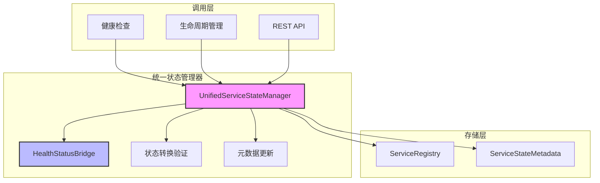

# 统一状态管理器

本页详细说明 MCPStore 中 `UnifiedServiceStateManager` 的设计和实现，该组件提供统一的状态管理接口，简化组件间的状态操作。

## 🎯 设计目标

- **统一接口**：提供一致的状态设置和查询接口
- **异常安全**：完善的错误处理和安全回退机制
- **状态验证**：智能的状态转换验证
- **元数据管理**：自动维护状态相关的元数据

## 🏗️ 架构设计



## 🔧 核心功能

### 1. 基于健康信息的状态设置

根据健康检查结果自动设置服务状态，包含完整的异常处理。

```python
def set_service_state_with_health_info(
    self, agent_id: str, service_name: str, 
    health_result: HealthCheckResult
) -> ServiceConnectionState:
    """
    根据健康检查结果设置服务状态
    
    特性：
    - 自动映射健康状态到生命周期状态
    - 更新状态元数据
    - 异常安全回退
    """
```

**异常处理机制**：
- ✅ 捕获状态映射异常
- ✅ 提供 `DISCONNECTED` 安全回退状态
- ✅ 详细的错误日志记录

### 2. 直接状态设置

用于非健康检查的状态变更，如手动操作或系统事件。

```python
def set_service_state_direct(
    self, agent_id: str, service_name: str, 
    state: ServiceConnectionState, 
    error_message: Optional[str] = None
) -> None:
    """
    直接设置服务状态
    
    特性：
    - 直接状态设置，无映射转换
    - 自动更新状态进入时间
    - 可选的错误信息记录
    """
```

### 3. 完整状态信息查询

提供服务的完整状态和元数据信息。

```python
def get_service_state_info(
    self, agent_id: str, service_name: str
) -> Dict[str, Any]:
    """
    获取服务的完整状态信息
    
    返回：
    - 基本状态信息
    - 健康和可用性判断
    - 完整的元数据
    """
```

### 4. 带验证的状态转换

执行状态转换并验证转换的合理性。

```python
def transition_service_state(
    self, agent_id: str, service_name: str, 
    target_state: ServiceConnectionState,
    reason: Optional[str] = None
) -> bool:
    """
    执行状态转换（带验证）
    
    特性：
    - 验证转换的合理性
    - 记录转换原因
    - 返回转换结果
    """
```

### 5. 状态重置

将服务状态重置到初始状态。

```python
def reset_service_state(
    self, agent_id: str, service_name: str
) -> None:
    """
    重置服务状态到初始状态
    
    特性：
    - 重置到 INITIALIZING 状态
    - 清空错误计数和消息
    - 重置元数据
    """
```

## 🔄 状态转换验证

### 转换规则表

| 当前状态 | 允许转换到 | 说明 |
|----------|------------|------|
| `None` | `INITIALIZING`, `DISCONNECTED` | 初始状态只能进入这两种状态 |
| `INITIALIZING` | `HEALTHY`, `RECONNECTING`, `DISCONNECTED` | 初始化完成后的可能状态 |
| `HEALTHY` | `WARNING`, `RECONNECTING`, `DISCONNECTING` | 健康状态的降级路径 |
| `WARNING` | `HEALTHY`, `RECONNECTING`, `DISCONNECTING` | 警告状态的恢复或降级 |
| `RECONNECTING` | `HEALTHY`, `WARNING`, `UNREACHABLE`, `DISCONNECTED` | 重连结果 |
| `UNREACHABLE` | `RECONNECTING`, `HEALTHY`, `DISCONNECTED` | 不可达状态的恢复 |
| `DISCONNECTING` | `DISCONNECTED` | 断开过程的终点 |
| `DISCONNECTED` | `INITIALIZING` | 断开后重新开始 |

**特殊规则**：
- 任何状态都可以强制转换到 `DISCONNECTED` 和 `INITIALIZING`
- 状态转换验证可以防止不合理的状态跳跃

### 验证实现

```python
def _is_valid_transition(
    self, from_state: Optional[ServiceConnectionState], 
    to_state: ServiceConnectionState
) -> bool:
    # 从 None 状态只能转换到 INITIALIZING 或 DISCONNECTED
    if from_state is None:
        return to_state in [ServiceConnectionState.INITIALIZING, ServiceConnectionState.DISCONNECTED]
    
    # 任何状态都可以转换到 DISCONNECTED 和 INITIALIZING（强制转换）
    if to_state in [ServiceConnectionState.DISCONNECTED, ServiceConnectionState.INITIALIZING]:
        return True
    
    # 其他转换规则
    valid_transitions = {
        # ... 完整的转换规则表 ...
    }
    
    allowed_transitions = valid_transitions.get(from_state, [])
    return to_state in allowed_transitions
```

## 📊 状态分类和判断

### 健康状态判断

```python
def _is_state_healthy(self, state: Optional[ServiceConnectionState]) -> bool:
    """判断状态是否为健康状态"""
    if not state:
        return False
    return state in [ServiceConnectionState.HEALTHY, ServiceConnectionState.WARNING]
```

### 可用状态判断

```python
def _is_state_available(self, state: Optional[ServiceConnectionState]) -> bool:
    """判断状态是否为可用状态"""
    if not state:
        return False
    return state in [
        ServiceConnectionState.HEALTHY, 
        ServiceConnectionState.WARNING,
        ServiceConnectionState.INITIALIZING
    ]
```

## 🚀 使用示例

### 基于健康检查的状态更新

```python
from mcpstore.core.lifecycle.unified_state_manager import UnifiedServiceStateManager
from mcpstore.core.lifecycle.health_manager import HealthCheckResult, HealthStatus

# 初始化状态管理器
state_manager = UnifiedServiceStateManager(registry)

# 创建健康检查结果
health_result = HealthCheckResult(
    status=HealthStatus.WARNING,
    response_time=2.5,
    timestamp=1642784400.0,
    error_message=None
)

# 根据健康检查结果设置状态
lifecycle_state = state_manager.set_service_state_with_health_info(
    "agent1", "weather-service", health_result
)
print(f"设置的生命周期状态: {lifecycle_state.value}")
```

### 直接状态设置

```python
# 直接设置状态（如手动操作）
state_manager.set_service_state_direct(
    "agent1", "weather-service", 
    ServiceConnectionState.DISCONNECTED,
    "手动断开连接"
)
```

### 状态转换验证

```python
# 尝试状态转换
success = state_manager.transition_service_state(
    "agent1", "weather-service",
    ServiceConnectionState.HEALTHY,
    "服务恢复正常"
)

if success:
    print("状态转换成功")
else:
    print("状态转换验证失败，转换被拒绝")
```

### 获取完整状态信息

```python
# 获取服务的完整状态信息
state_info = state_manager.get_service_state_info("agent1", "weather-service")

print(f"服务名称: {state_info['service_name']}")
print(f"当前状态: {state_info['state']}")
print(f"是否健康: {state_info['healthy']}")
print(f"是否可用: {state_info['available']}")
print(f"最后检查: {state_info.get('last_health_check')}")
print(f"响应时间: {state_info.get('last_response_time')}s")
print(f"连续失败: {state_info.get('consecutive_failures')}")
```

### 状态重置

```python
# 重置服务状态
state_manager.reset_service_state("agent1", "weather-service")
print("服务状态已重置到 INITIALIZING")
```

### 获取统计信息

```python
# 获取状态管理统计
stats = state_manager.get_statistics()

print(f"总Agent数: {stats['total_agents']}")
print(f"健康服务数: {stats['health_summary']['healthy']}")
print(f"可用服务数: {stats['health_summary']['available']}")
print(f"总服务数: {stats['health_summary']['total']}")

# 状态分布
for state, count in stats['state_distribution'].items():
    print(f"{state}: {count} 个服务")
```

## ⚡ 性能和安全特性

### 1. 异常安全
- **安全回退**：状态映射失败时自动设置为 `DISCONNECTED`
- **详细日志**：所有异常都有详细的错误信息和上下文
- **继续运行**：单个服务的状态问题不会影响其他服务

### 2. 状态一致性
- **原子操作**：状态设置和元数据更新在同一操作中完成
- **验证机制**：防止无效的状态转换
- **元数据同步**：状态变更时自动更新相关元数据

### 3. 性能优化
- **直接注册表访问**：避免中间层开销
- **选择性更新**：只更新必要的元数据字段
- **批量操作支持**：支持批量状态查询和统计

## 🔮 扩展性

### 自定义状态管理器

```python
class CustomUnifiedStateManager(UnifiedServiceStateManager):
    def set_service_state_with_health_info(self, agent_id: str, service_name: str, 
                                         health_result: HealthCheckResult) -> ServiceConnectionState:
        # 自定义状态设置逻辑
        custom_logic()
        
        # 调用父类方法
        return super().set_service_state_with_health_info(agent_id, service_name, health_result)
    
    def _is_valid_transition(self, from_state: Optional[ServiceConnectionState], 
                           to_state: ServiceConnectionState) -> bool:
        # 自定义转换规则
        if self._custom_transition_rule(from_state, to_state):
            return True
        
        # 使用默认规则
        return super()._is_valid_transition(from_state, to_state)
```

### 监听状态变更

```python
class StateChangeListener:
    def on_state_changed(self, agent_id: str, service_name: str, 
                        old_state: ServiceConnectionState, 
                        new_state: ServiceConnectionState):
        # 处理状态变更事件
        self._handle_state_change(agent_id, service_name, old_state, new_state)

# 集成到状态管理器
class ExtendedStateManager(UnifiedServiceStateManager):
    def __init__(self, registry, listeners=None):
        super().__init__(registry)
        self.listeners = listeners or []
    
    def set_service_state_direct(self, agent_id: str, service_name: str, 
                               state: ServiceConnectionState, 
                               error_message: Optional[str] = None) -> None:
        old_state = self.registry.get_service_state(agent_id, service_name)
        
        # 执行状态设置
        super().set_service_state_direct(agent_id, service_name, state, error_message)
        
        # 通知监听器
        for listener in self.listeners:
            listener.on_state_changed(agent_id, service_name, old_state, state)
```

## 📝 最佳实践

1. **使用健康信息设置**：优先使用 `set_service_state_with_health_info` 方法
2. **处理异常**：始终检查返回值和处理可能的异常
3. **记录转换原因**：在 `transition_service_state` 中提供有意义的原因
4. **定期获取统计**：使用 `get_statistics` 监控整体状态分布
5. **验证转换**：依赖内置的转换验证，避免强制无效转换

## 相关文档

- [健康状态桥梁机制](health-status-bridge.md) - 状态映射机制
- [生命周期管理](lifecycle.md) - 完整的7状态生命周期
- [服务注册流程](../services/registration/register-service.md) - 服务注册流程

更新时间：2025-01-15
