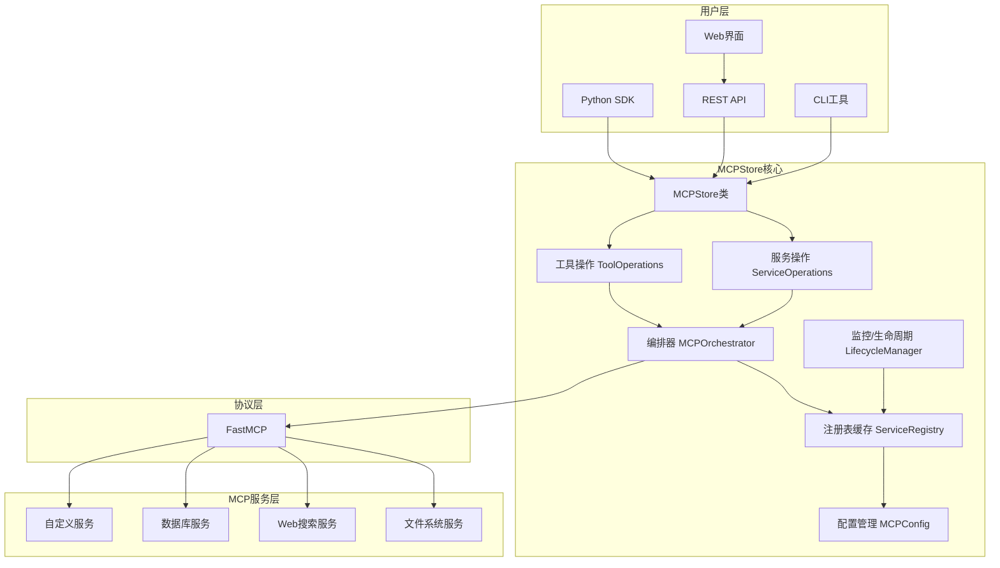
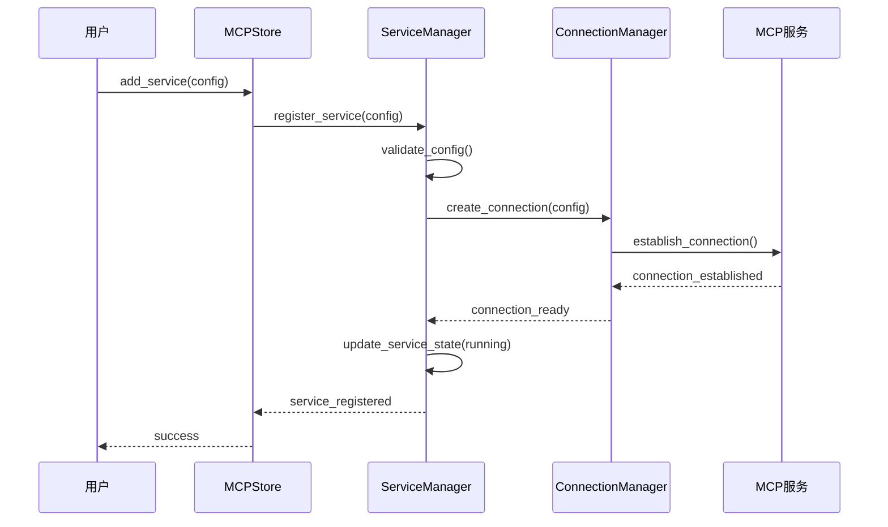
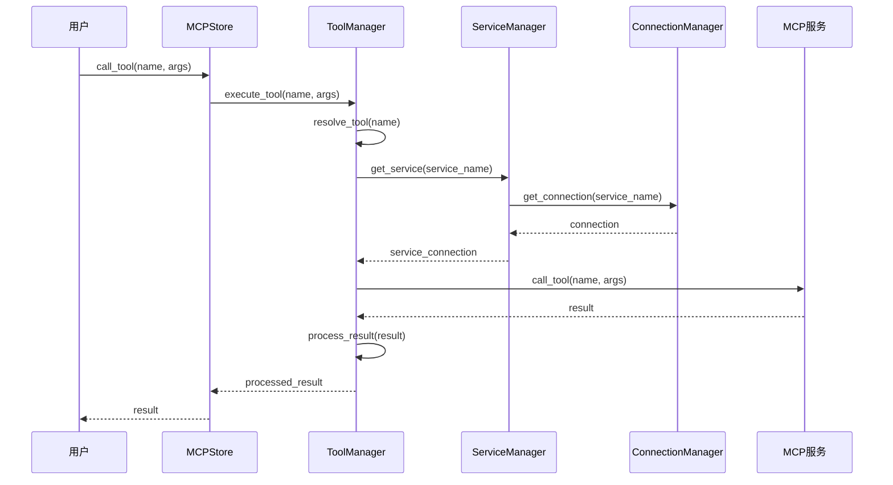

# 系统架构概览

## 📋 概述

MCPStore 是一个基于 Model Context Protocol (MCP) 的企业级智能体工具服务存储平台。它提供了统一的接口来管理多个 MCP 服务，支持工具的发现、调用和链式组合，并通过 Agent 透明代理机制实现多智能体场景下的完全隔离和智能工具调用。

## 🏗️ 整体架构



## 🔧 核心组件

### MCPStore 核心类

```python
class MCPStore:
    """MCPStore 核心类"""
    
    def __init__(self, config=None):
        # 核心管理器
        self.service_manager = ServiceManager()
        self.tool_manager = ToolManager()
        self.connection_manager = ConnectionManager()
        self.config_manager = ConfigManager(config)
        
        # 中间层组件
        self.fastmcp_adapter = FastMCPAdapter()
        self.cache_layer = CacheLayer()
        self.monitoring_system = MonitoringSystem()
        
        # 初始化
        self._initialize_components()
    
    def _initialize_components(self):
        """初始化各个组件"""
        # 设置组件间的依赖关系
        self.service_manager.set_connection_manager(self.connection_manager)
        self.tool_manager.set_service_manager(self.service_manager)
        self.monitoring_system.set_managers(
            self.service_manager,
            self.tool_manager,
            self.connection_manager
        )
```

### 服务管理器

```python
class ServiceManager:
    """服务管理器 - 负责MCP服务的生命周期管理"""
    
    def __init__(self):
        self.services = {}  # 服务注册表
        self.service_configs = {}  # 服务配置
        self.service_states = {}  # 服务状态
        self.connection_manager = None
    
    def add_service(self, config):
        """添加服务"""
        # 1. 验证配置
        # 2. 创建服务实例
        # 3. 注册到服务表
        # 4. 初始化连接
        pass
    
    def start_service(self, service_name):
        """启动服务"""
        # 1. 检查服务状态
        # 2. 建立连接
        # 3. 验证服务可用性
        # 4. 更新服务状态
        pass
    
    def stop_service(self, service_name):
        """停止服务"""
        # 1. 优雅关闭连接
        # 2. 清理资源
        # 3. 更新服务状态
        pass
```

### 工具管理器

```python
class ToolManager:
    """工具管理器 - 负责工具的发现、调用和管理"""
    
    def __init__(self):
        self.tools_registry = {}  # 工具注册表
        self.tool_cache = {}  # 工具缓存
        self.service_manager = None
    
    def discover_tools(self, service_name=None):
        """发现工具"""
        # 1. 从服务获取工具列表
        # 2. 解析工具定义
        # 3. 更新工具注册表
        # 4. 缓存工具信息
        pass
    
    def call_tool(self, tool_name, arguments):
        """调用工具"""
        # 1. 查找工具定义
        # 2. 验证参数
        # 3. 路由到对应服务
        # 4. 执行调用
        # 5. 处理结果
        pass
    
    def batch_call(self, calls):
        """批量调用工具"""
        # 1. 分组调用（按服务）
        # 2. 并行执行
        # 3. 聚合结果
        pass
```

### 连接管理器

```python
class ConnectionManager:
    """连接管理器 - 负责与MCP服务的连接管理"""
    
    def __init__(self):
        self.connections = {}  # 连接池
        self.connection_configs = {}  # 连接配置
        self.health_checker = HealthChecker()
    
    def create_connection(self, service_name, config):
        """创建连接"""
        # 1. 解析连接配置
        # 2. 建立连接
        # 3. 验证连接
        # 4. 添加到连接池
        pass
    
    def get_connection(self, service_name):
        """获取连接"""
        # 1. 从连接池获取
        # 2. 检查连接健康状态
        # 3. 必要时重新连接
        pass
    
    def close_connection(self, service_name):
        """关闭连接"""
        # 1. 优雅关闭
        # 2. 清理资源
        # 3. 从连接池移除
        pass
```

## 🔄 数据流架构

### 服务注册流程



### 工具调用流程



## 🏛️ 分层架构

### 表示层 (Presentation Layer)

```python
# REST API 层
class MCPStoreAPI:
    """REST API 接口"""
    
    def __init__(self, mcpstore):
        self.mcpstore = mcpstore
        self.app = FastAPI()
        self._setup_routes()
    
    def _setup_routes(self):
        """设置API路由"""
        self.app.post("/services")(self.add_service)
        self.app.get("/services")(self.list_services)
        self.app.post("/tools/call")(self.call_tool)
        # ... 更多路由

# CLI 层
class MCPStoreCLI:
    """命令行接口"""
    
    def __init__(self, mcpstore):
        self.mcpstore = mcpstore
        self.parser = self._create_parser()
    
    def _create_parser(self):
        """创建命令行解析器"""
        # 定义命令和参数
        pass
```

### 业务逻辑层 (Business Logic Layer)

```python
# 服务业务逻辑
class ServiceBusinessLogic:
    """服务业务逻辑"""
    
    def __init__(self, service_manager):
        self.service_manager = service_manager
    
    def register_service_with_validation(self, config):
        """带验证的服务注册"""
        # 1. 配置验证
        # 2. 依赖检查
        # 3. 资源分配
        # 4. 注册服务
        pass
    
    def intelligent_service_discovery(self):
        """智能服务发现"""
        # 1. 扫描可用服务
        # 2. 自动配置
        # 3. 健康检查
        pass

# 工具业务逻辑
class ToolBusinessLogic:
    """工具业务逻辑"""
    
    def __init__(self, tool_manager):
        self.tool_manager = tool_manager
    
    def smart_tool_routing(self, tool_name, arguments):
        """智能工具路由"""
        # 1. 工具解析
        # 2. 负载均衡
        # 3. 故障转移
        pass
    
    def tool_composition(self, workflow):
        """工具组合"""
        # 1. 工作流解析
        # 2. 依赖分析
        # 3. 执行计划
        pass
```

### 数据访问层 (Data Access Layer)

```python
# 配置数据访问
class ConfigDataAccess:
    """配置数据访问"""
    
    def __init__(self, storage_backend):
        self.storage = storage_backend
    
    def save_service_config(self, service_name, config):
        """保存服务配置"""
        pass
    
    def load_service_config(self, service_name):
        """加载服务配置"""
        pass

# 状态数据访问
class StateDataAccess:
    """状态数据访问"""
    
    def __init__(self, storage_backend):
        self.storage = storage_backend
    
    def save_service_state(self, service_name, state):
        """保存服务状态"""
        pass
    
    def load_service_state(self, service_name):
        """加载服务状态"""
        pass
```

## 🔌 插件架构

### 插件接口

```python
class MCPStorePlugin:
    """MCPStore 插件基类"""
    
    def __init__(self, name, version):
        self.name = name
        self.version = version
    
    def initialize(self, mcpstore):
        """插件初始化"""
        pass
    
    def on_service_added(self, service_name, config):
        """服务添加事件"""
        pass
    
    def on_tool_called(self, tool_name, arguments, result):
        """工具调用事件"""
        pass
    
    def cleanup(self):
        """插件清理"""
        pass

class PluginManager:
    """插件管理器"""
    
    def __init__(self):
        self.plugins = {}
        self.event_handlers = {}
    
    def load_plugin(self, plugin_class, *args, **kwargs):
        """加载插件"""
        plugin = plugin_class(*args, **kwargs)
        self.plugins[plugin.name] = plugin
        self._register_event_handlers(plugin)
    
    def trigger_event(self, event_name, *args, **kwargs):
        """触发事件"""
        handlers = self.event_handlers.get(event_name, [])
        for handler in handlers:
            handler(*args, **kwargs)
```

## 🔐 安全架构

### 安全层

```python
class SecurityManager:
    """安全管理器"""
    
    def __init__(self):
        self.auth_provider = None
        self.permission_manager = PermissionManager()
        self.audit_logger = AuditLogger()
    
    def authenticate(self, credentials):
        """身份认证"""
        pass
    
    def authorize(self, user, action, resource):
        """权限授权"""
        pass
    
    def audit_log(self, user, action, resource, result):
        """审计日志"""
        pass

class PermissionManager:
    """权限管理器"""
    
    def __init__(self):
        self.permissions = {}
        self.roles = {}
    
    def check_permission(self, user, action, resource):
        """检查权限"""
        pass
    
    def grant_permission(self, user, permission):
        """授予权限"""
        pass
```

## 📊 监控架构

### 监控系统

```python
class MonitoringSystem:
    """监控系统"""
    
    def __init__(self):
        self.metrics_collector = MetricsCollector()
        self.alert_manager = AlertManager()
        self.dashboard = MonitoringDashboard()
    
    def collect_metrics(self):
        """收集指标"""
        pass
    
    def check_alerts(self):
        """检查告警"""
        pass
    
    def update_dashboard(self):
        """更新仪表板"""
        pass

class MetricsCollector:
    """指标收集器"""
    
    def __init__(self):
        self.metrics = {}
    
    def collect_service_metrics(self, service_name):
        """收集服务指标"""
        pass
    
    def collect_tool_metrics(self, tool_name):
        """收集工具指标"""
        pass
```

## 🔗 相关文档

- [服务管理概述](../services/management/service-management.md)
- [工具管理架构](../tools/tool-architecture.md)
- [高级监控系统](../advanced/monitoring.md)
- [性能优化指南](../advanced/performance.md)

## 📚 设计原则

1. **模块化设计**：各组件职责清晰，低耦合高内聚
2. **可扩展性**：支持插件机制，易于扩展功能
3. **可靠性**：完善的错误处理和故障恢复机制
4. **性能优化**：连接池、缓存、异步处理等优化策略
5. **安全性**：身份认证、权限控制、审计日志
6. **可观测性**：全面的监控、日志和指标收集

---

**更新时间**: 2025-01-09  
**版本**: 1.0.0
