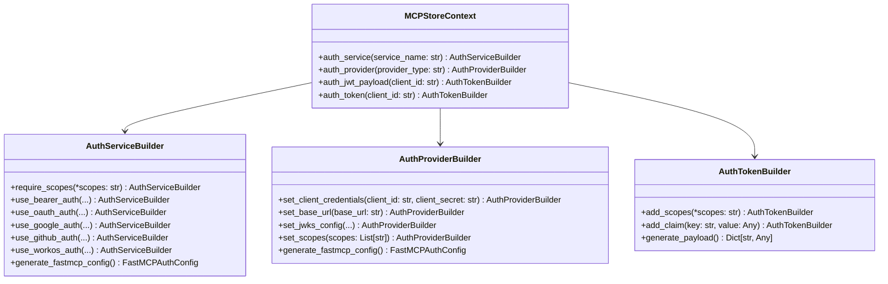

# 📚 认证 API 参考

本文档提供 MCPStore 认证系统的完整 API 参考。

## 🏗️ 类结构概览



## 🎯 核心类 API

### MCPStoreContext 认证方法

#### `auth_service(service_name: str) -> AuthServiceBuilder`

创建服务认证构建器，用于配置单个服务的认证保护。

**参数:**
- `service_name` (str): 服务名称

**返回:**
- `AuthServiceBuilder`: 服务认证构建器实例

**示例:**
```python
store = MCPStore()
auth_builder = store.for_store().auth_service("payment-api")
```

---

#### `auth_provider(provider_type: str) -> AuthProviderBuilder`

创建认证提供者构建器，用于配置全局认证提供者。

**参数:**
- `provider_type` (str): 认证提供者类型 (`"bearer"`, `"google"`, `"github"`, `"workos"`, `"oauth"`)

**返回:**
- `AuthProviderBuilder`: 认证提供者构建器实例

**示例:**
```python
provider_builder = store.for_store().auth_provider("google")
```

---

#### `auth_jwt_payload(client_id: str) -> AuthTokenBuilder`

创建 JWT Payload 构建器，用于生成 FastMCP JWT token 的 payload 配置。

**参数:**
- `client_id` (str): 客户端ID（用户ID）

**返回:**
- `AuthTokenBuilder`: Token 构建器实例

**示例:**
```python
token_builder = store.for_store().auth_jwt_payload("user123")
```

---

#### `auth_token(client_id: str) -> AuthTokenBuilder`

创建 Token 构建器的别名方法，功能与 `auth_jwt_payload` 相同。

**参数:**
- `client_id` (str): 客户端ID

**返回:**
- `AuthTokenBuilder`: Token 构建器实例

## 🔧 AuthServiceBuilder API

### 方法列表

#### `require_scopes(*scopes: str) -> AuthServiceBuilder`

设置服务要求的权限范围。

**参数:**
- `*scopes` (str): 可变数量的权限范围字符串

**返回:**
- `AuthServiceBuilder`: 返回自身，支持链式调用

**示例:**
```python
auth_builder.require_scopes("read", "write", "execute")
```

---

#### `use_bearer_auth(jwks_uri: str, issuer: str, audience: str, algorithm: str = "RS256") -> AuthServiceBuilder`

配置 Bearer Token (JWT) 认证。

**参数:**
- `jwks_uri` (str): JWKS 密钥集合 URI
- `issuer` (str): JWT 发行者
- `audience` (str): JWT 受众
- `algorithm` (str, 可选): 签名算法，默认 "RS256"

**返回:**
- `AuthServiceBuilder`: 返回自身，支持链式调用

**示例:**
```python
auth_builder.use_bearer_auth(
    jwks_uri="https://auth.company.com/.well-known/jwks.json",
    issuer="https://auth.company.com",
    audience="my-service"
)
```

---

#### `use_oauth_auth(client_id: str, client_secret: str, base_url: str, provider: str = "custom") -> AuthServiceBuilder`

配置 OAuth 认证。

**参数:**
- `client_id` (str): OAuth 客户端 ID
- `client_secret` (str): OAuth 客户端密钥
- `base_url` (str): 服务器基础 URL
- `provider` (str, 可选): 提供者类型，默认 "custom"

**返回:**
- `AuthServiceBuilder`: 返回自身，支持链式调用

**示例:**
```python
auth_builder.use_oauth_auth(
    client_id="oauth_client_id",
    client_secret="oauth_secret",
    base_url="https://myapp.com"
)
```

---

#### `use_google_auth(client_id: str, client_secret: str, base_url: str, required_scopes: List[str] = None) -> AuthServiceBuilder`

配置 Google OAuth 认证。

**参数:**
- `client_id` (str): Google OAuth 客户端 ID
- `client_secret` (str): Google OAuth 客户端密钥
- `base_url` (str): 服务器基础 URL
- `required_scopes` (List[str], 可选): 必需的权限范围

**返回:**
- `AuthServiceBuilder`: 返回自身，支持链式调用

**示例:**
```python
auth_builder.use_google_auth(
    client_id="google_client_id",
    client_secret="google_secret",
    base_url="https://myapp.com",
    required_scopes=["openid", "email", "profile"]
)
```

---

#### `use_github_auth(client_id: str, client_secret: str, base_url: str, required_scopes: List[str] = None) -> AuthServiceBuilder`

配置 GitHub OAuth 认证。

**参数:**
- `client_id` (str): GitHub OAuth 客户端 ID
- `client_secret` (str): GitHub OAuth 客户端密钥
- `base_url` (str): 服务器基础 URL
- `required_scopes` (List[str], 可选): 必需的权限范围

**返回:**
- `AuthServiceBuilder`: 返回自身，支持链式调用

**示例:**
```python
auth_builder.use_github_auth(
    client_id="github_client_id",
    client_secret="github_secret",
    base_url="https://myapp.com",
    required_scopes=["read:user", "user:email"]
)
```

---

#### `use_workos_auth(authkit_domain: str, base_url: str) -> AuthServiceBuilder`

配置 WorkOS 企业认证。

**参数:**
- `authkit_domain` (str): AuthKit 域名
- `base_url` (str): 服务器基础 URL

**返回:**
- `AuthServiceBuilder`: 返回自身，支持链式调用

**示例:**
```python
auth_builder.use_workos_auth(
    authkit_domain="your-domain.authkit.com",
    base_url="https://enterprise.myapp.com"
)
```

---

#### `generate_fastmcp_config() -> Optional[FastMCPAuthConfig]`

生成 FastMCP 认证配置。

**返回:**
- `Optional[FastMCPAuthConfig]`: FastMCP 认证配置对象，如果未配置认证提供者则返回 None

**示例:**
```python
config = auth_builder.generate_fastmcp_config()
print(f"Provider: {config.provider_class}")
print(f"Import: {config.import_path}")
```

## 🌐 AuthProviderBuilder API

### 方法列表

#### `set_client_credentials(client_id: str, client_secret: str) -> AuthProviderBuilder`

设置 OAuth 客户端凭据。

**参数:**
- `client_id` (str): 客户端 ID
- `client_secret` (str): 客户端密钥

**返回:**
- `AuthProviderBuilder`: 返回自身，支持链式调用

**示例:**
```python
provider_builder.set_client_credentials("client_id", "client_secret")
```

---

#### `set_base_url(base_url: str) -> AuthProviderBuilder`

设置服务器基础 URL。

**参数:**
- `base_url` (str): 基础 URL

**返回:**
- `AuthProviderBuilder`: 返回自身，支持链式调用

**示例:**
```python
provider_builder.set_base_url("https://myapp.com")
```

---

#### `set_jwks_config(jwks_uri: str, issuer: str, audience: str, algorithm: str = "RS256") -> AuthProviderBuilder`

设置 JWKS 配置（用于 Bearer Token 认证）。

**参数:**
- `jwks_uri` (str): JWKS URI
- `issuer` (str): 发行者
- `audience` (str): 受众
- `algorithm` (str, 可选): 算法，默认 "RS256"

**返回:**
- `AuthProviderBuilder`: 返回自身，支持链式调用

**示例:**
```python
provider_builder.set_jwks_config(
    jwks_uri="https://auth.example.com/.well-known/jwks.json",
    issuer="https://auth.example.com",
    audience="my-app"
)
```

---

#### `set_scopes(scopes: List[str]) -> AuthProviderBuilder`

设置权限范围。

**参数:**
- `scopes` (List[str]): 权限范围列表

**返回:**
- `AuthProviderBuilder`: 返回自身，支持链式调用

**示例:**
```python
provider_builder.set_scopes(["read", "write", "admin"])
```

---

#### `generate_fastmcp_config() -> FastMCPAuthConfig`

生成 FastMCP 认证提供者配置。

**返回:**
- `FastMCPAuthConfig`: FastMCP 认证配置对象

**示例:**
```python
config = provider_builder.generate_fastmcp_config()
```

## 🎫 AuthTokenBuilder API

### 方法列表

#### `add_scopes(*scopes: str) -> AuthTokenBuilder`

添加权限范围到 JWT payload。

**参数:**
- `*scopes` (str): 可变数量的权限范围字符串

**返回:**
- `AuthTokenBuilder`: 返回自身，支持链式调用

**示例:**
```python
token_builder.add_scopes("read", "write", "execute")
```

---

#### `add_claim(key: str, value: Any) -> AuthTokenBuilder`

添加自定义声明到 JWT payload。

**参数:**
- `key` (str): 声明键名
- `value` (Any): 声明值

**返回:**
- `AuthTokenBuilder`: 返回自身，支持链式调用

**示例:**
```python
token_builder.add_claim("role", "admin")
token_builder.add_claim("tenant_id", "company_abc")
token_builder.add_claim("permissions", ["create", "read", "update", "delete"])
```

---

#### `generate_payload() -> Dict[str, Any]`

生成 JWT payload 字典。

**返回:**
- `Dict[str, Any]`: JWT payload 字典

**示例:**
```python
payload = token_builder.generate_payload()
print(payload)
# 输出: {
#   'scopes': ['read', 'write'],
#   'role': 'admin',
#   'tenant_id': 'company_abc'
# }
```

## 📋 数据模型

### FastMCPAuthConfig

FastMCP 认证配置数据模型。

#### 属性

| 属性 | 类型 | 说明 |
|------|------|------|
| `provider_class` | str | FastMCP 认证提供者类名 |
| `import_path` | str | 导入路径 |
| `config_params` | Dict[str, Any] | 配置参数字典 |

#### 类方法

##### `for_bearer_token(jwks_uri: str, issuer: str, audience: str, algorithm: str = "RS256") -> FastMCPAuthConfig`

创建 Bearer Token 认证配置。

**参数:**
- `jwks_uri` (str): JWKS URI
- `issuer` (str): 发行者
- `audience` (str): 受众
- `algorithm` (str, 可选): 算法

**返回:**
- `FastMCPAuthConfig`: 配置实例

---

##### `for_google_oauth(client_id: str, client_secret: str, base_url: str, required_scopes: List[str] = None) -> FastMCPAuthConfig`

创建 Google OAuth 认证配置。

**参数:**
- `client_id` (str): 客户端 ID
- `client_secret` (str): 客户端密钥
- `base_url` (str): 基础 URL
- `required_scopes` (List[str], 可选): 权限范围

**返回:**
- `FastMCPAuthConfig`: 配置实例

---

##### `for_github_oauth(client_id: str, client_secret: str, base_url: str, required_scopes: List[str] = None) -> FastMCPAuthConfig`

创建 GitHub OAuth 认证配置。

**参数:**
- `client_id` (str): 客户端 ID
- `client_secret` (str): 客户端密钥
- `base_url` (str): 基础 URL
- `required_scopes` (List[str], 可选): 权限范围

**返回:**
- `FastMCPAuthConfig`: 配置实例

---

##### `for_workos_oauth(authkit_domain: str, base_url: str) -> FastMCPAuthConfig`

创建 WorkOS OAuth 认证配置。

**参数:**
- `authkit_domain` (str): AuthKit 域名
- `base_url` (str): 基础 URL

**返回:**
- `FastMCPAuthConfig`: 配置实例

### AuthProviderConfig

认证提供者配置数据模型。

#### 属性

| 属性 | 类型 | 说明 |
|------|------|------|
| `provider_type` | AuthProviderType | 认证提供者类型 |
| `config` | Dict[str, Any] | 提供者特定配置 |
| `enabled` | bool | 是否启用 |
| `jwks_uri` | Optional[str] | JWKS URI |
| `issuer` | Optional[str] | JWT 发行者 |
| `audience` | Optional[str] | JWT 受众 |
| `algorithm` | Optional[str] | JWT 算法 |
| `client_id` | Optional[str] | OAuth 客户端 ID |
| `client_secret` | Optional[str] | OAuth 客户端密钥 |
| `base_url` | Optional[str] | 服务器基础 URL |
| `redirect_path` | Optional[str] | OAuth 回调路径 |
| `required_scopes` | List[str] | 必需的权限范围 |

### AuthProviderType

认证提供者类型枚举。

#### 值

| 值 | 说明 |
|----|------|
| `BEARER` | Bearer Token 认证 |
| `OAUTH` | 通用 OAuth 认证 |
| `GOOGLE` | Google OAuth 认证 |
| `GITHUB` | GitHub OAuth 认证 |
| `WORKOS` | WorkOS 企业认证 |
| `CUSTOM` | 自定义认证 |

### JWTPayloadConfig

JWT Payload 配置数据模型。

#### 属性

| 属性 | 类型 | 说明 |
|------|------|------|
| `client_id` | str | 客户端 ID |
| `scopes` | List[str] | 权限范围 |
| `custom_claims` | Dict[str, Any] | 自定义声明 |
| `expires_in` | int | 过期时间（秒） |

## 🔧 工具函数

### `generate_fastmcp_auth_config(auth_provider: AuthProviderConfig) -> FastMCPAuthConfig`

根据认证提供者配置生成 FastMCP 认证配置。

**参数:**
- `auth_provider` (AuthProviderConfig): 认证提供者配置

**返回:**
- `FastMCPAuthConfig`: FastMCP 认证配置

**异常:**
- `ValueError`: 不支持的认证提供者类型

**示例:**
```python
from mcpstore.core.auth.builder import generate_fastmcp_auth_config
from mcpstore.core.auth.types import AuthProviderConfig, AuthProviderType

provider = AuthProviderConfig(
    provider_type=AuthProviderType.BEARER,
    jwks_uri="https://auth.example.com/.well-known/jwks.json",
    issuer="https://auth.example.com",
    audience="my-service"
)

config = generate_fastmcp_auth_config(provider)
```

## 📝 使用示例

### 完整 API 使用示例

```python
from mcpstore import MCPStore
import os

async def complete_auth_example():
    store = MCPStore()
    
    # 1. 配置认证提供者
    provider_config = store.for_store().auth_provider("bearer")\
        .set_jwks_config(
            jwks_uri="https://auth.company.com/.well-known/jwks.json",
            issuer="https://auth.company.com",
            audience="company-services"
        )\
        .generate_fastmcp_config()
    
    # 2. 配置服务认证
    service_auth = store.for_store().auth_service("secure-api")\
        .require_scopes("api:read", "api:write")\
        .use_bearer_auth(
            jwks_uri="https://auth.company.com/.well-known/jwks.json",
            issuer="https://auth.company.com",
            audience="secure-api"
        )\
        .generate_fastmcp_config()
    
    # 3. 生成用户 JWT
    user_jwt = store.for_store().auth_jwt_payload("user123")\
        .add_scopes("api:read", "api:write")\
        .add_claim("role", "user")\
        .add_claim("tenant_id", "company_abc")\
        .generate_payload()
    
    # 4. 配置 Google OAuth
    google_auth = store.for_store().auth_service("google-service")\
        .require_scopes("profile", "email")\
        .use_google_auth(
            client_id=os.getenv("GOOGLE_CLIENT_ID"),
            client_secret=os.getenv("GOOGLE_CLIENT_SECRET"),
            base_url="https://myapp.com"
        )\
        .generate_fastmcp_config()
    
    return {
        "provider_config": provider_config,
        "service_auth": service_auth,
        "user_jwt": user_jwt,
        "google_auth": google_auth
    }

# 运行示例
import asyncio
result = asyncio.run(complete_auth_example())
```

## 🚨 异常处理

### 常见异常

| 异常类型 | 说明 | 处理方式 |
|----------|------|----------|
| `ValueError` | 参数验证失败 | 检查参数格式和值 |
| `AttributeError` | 缺少必需属性 | 确认配置完整性 |
| `ImportError` | FastMCP 模块导入失败 | 检查 FastMCP 安装 |
| `ConnectionError` | JWKS URI 连接失败 | 检查网络和 URI 可访问性 |

### 异常处理示例

```python
try:
    auth_config = store.for_store().auth_service("my-api")\
        .require_scopes("read", "write")\
        .use_bearer_auth(
            jwks_uri="https://invalid-uri.com/jwks.json",
            issuer="https://auth.example.com",
            audience="my-service"
        )\
        .generate_fastmcp_config()
except ValueError as e:
    print(f"配置参数错误: {e}")
except ConnectionError as e:
    print(f"网络连接错误: {e}")
except Exception as e:
    print(f"未知错误: {e}")
```
