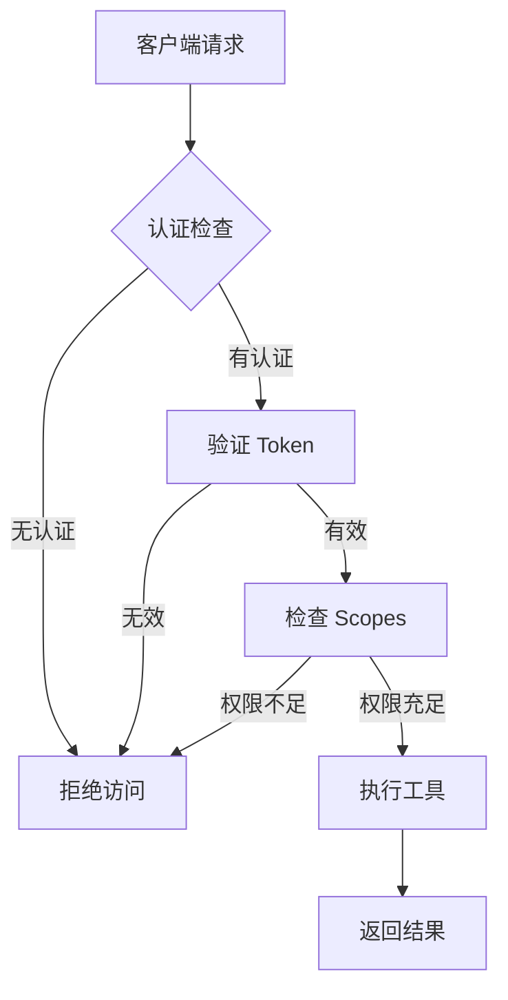
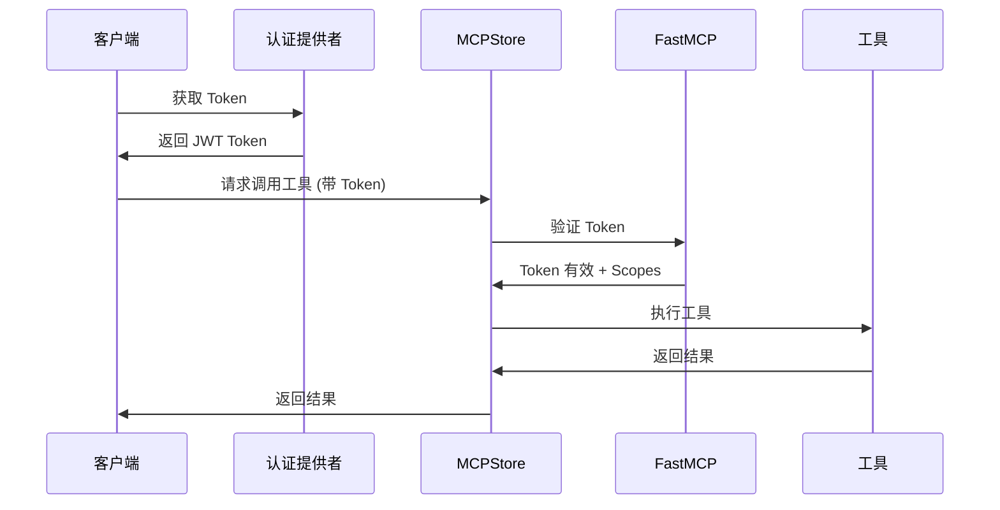

# 🔐 权限认证系统概览

MCPStore 提供了基于 FastMCP 的完整权限认证系统，支持企业级的安全控制和多种认证方式。

## 🎯 核心特性

### ✨ 完全基于 FastMCP
- **无重复实现**: 完全使用 FastMCP 的标准认证机制
- **标准兼容**: 支持 JWT、OAuth 2.0 等行业标准
- **高性能**: 原生 FastMCP 性能，无额外开销

### 🔒 多种认证方式
- **Bearer Token**: JWT 认证，支持 JWKS
- **Google OAuth**: Google 企业认证集成
- **GitHub OAuth**: GitHub 认证支持
- **WorkOS**: 企业级 SSO 解决方案
- **自定义**: 可扩展的认证提供者

### 🎭 灵活的权限控制
- **Scopes 权限**: 基于 FastMCP scopes 的细粒度权限
- **JWT Claims**: 自定义声明支持
- **服务级保护**: 单独配置每个服务的认证
- **Hub 级保护**: 整个 Hub 的统一认证

### 🛡️ 安全特性
- **环境变量**: 敏感信息安全存储
- **Token 过期**: 自动 token 生命周期管理
- **权限验证**: 运行时权限检查
- **审计日志**: 认证操作记录

## 📋 认证流程



## 🏗️ 架构设计

### 认证层级
1. **认证提供者层**: 配置各种认证方式
2. **服务认证层**: 为每个服务配置独立认证
3. **Hub 认证层**: Hub 级别的统一认证
4. **工具保护层**: 细粒度的工具访问控制

### 数据流


## 🚀 快速开始

### 1. 配置 Bearer Token 认证
```python
from mcpstore import MCPStore

store = MCPStore()

# 配置服务认证
auth_config = store.for_store().auth_service("my-api")\
    .require_scopes("read", "write")\
    .use_bearer_auth(
        jwks_uri="https://auth.example.com/.well-known/jwks.json",
        issuer="https://auth.example.com",
        audience="my-service"
    )\
    .generate_fastmcp_config()
```

### 2. 生成用户 JWT Payload
```python
# 为用户生成 JWT payload
user_payload = store.for_store().auth_jwt_payload("user123")\
    .add_scopes("read", "write", "execute")\
    .add_claim("role", "admin")\
    .add_claim("tenant_id", "company_abc")\
    .generate_payload()
```

### 3. 配置 OAuth 认证
```python
# Google OAuth
google_config = store.for_store().auth_provider("google")\
    .set_client_credentials("client_id", "client_secret")\
    .set_base_url("https://myapp.com")\
    .generate_fastmcp_config()
```

## 📚 文档导航

- [认证配置](configuration.md) - 详细配置指南
- [Bearer Token 认证](bearer-token.md) - JWT 认证配置
- [OAuth 集成](oauth-integration.md) - 第三方认证集成
- [权限管理](permissions.md) - Scopes 和权限控制
- [环境变量安全](environment-security.md) - 敏感信息管理
- [Hub 认证](hub-authentication.md) - Hub 级别认证
- [API 参考](api-reference.md) - 完整 API 文档
- [最佳实践](best-practices.md) - 安全最佳实践
- [故障排除](troubleshooting.md) - 常见问题解决

## 💡 使用场景

### 企业应用
- **内部工具保护**: 保护企业内部 MCP 工具
- **多租户支持**: 基于 tenant_id 的隔离
- **角色权限**: 不同角色的差异化权限

### API 服务
- **API 网关**: 作为 MCP 工具的安全网关
- **第三方集成**: 安全的第三方服务调用
- **微服务认证**: 微服务间的安全通信

### 开发测试
- **开发环境**: 开发阶段的认证配置
- **测试隔离**: 测试环境的权限控制
- **调试工具**: 认证相关的调试功能

## ⚠️ 安全提示

!!! warning "安全注意事项"
    - 永远不要在代码中硬编码敏感信息
    - 使用环境变量存储 API 密钥和密钥
    - 定期轮换认证凭据
    - 监控认证日志和异常访问
    - 使用 HTTPS 传输敏感数据

!!! tip "最佳实践"
    - 使用最小权限原则配置 scopes
    - 为不同环境配置不同的认证设置
    - 定期审查和更新权限配置
    - 使用强密码和复杂的 JWT 密钥
