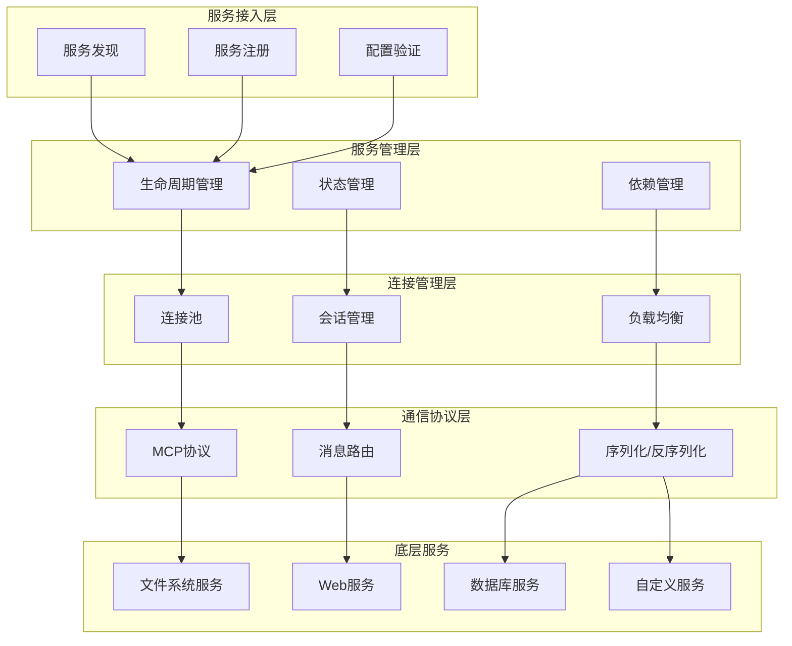

# 服务架构设计

## 📋 概述

MCPStore 的服务架构采用分层设计，提供了灵活、可扩展的 MCP 服务管理框架。本文档详细介绍服务架构的设计原理、组件关系和实现细节。

## 🏗️ 服务架构层次



## 🔧 核心组件架构

### 服务管理器架构

```python
class ServiceManager:
    """服务管理器架构设计"""
    
    def __init__(self):
        # 核心组件
        self.registry = ServiceRegistry()
        self.lifecycle_manager = ServiceLifecycleManager()
        self.dependency_resolver = DependencyResolver()
        self.health_monitor = HealthMonitor()
        
        # 配置管理
        self.config_validator = ConfigValidator()
        self.config_store = ConfigStore()
        
        # 事件系统
        self.event_bus = EventBus()
        self.event_handlers = {}
        
        # 初始化
        self._setup_event_handlers()
    
    def _setup_event_handlers(self):
        """设置事件处理器"""
        self.event_bus.subscribe('service.registered', self._on_service_registered)
        self.event_bus.subscribe('service.started', self._on_service_started)
        self.event_bus.subscribe('service.stopped', self._on_service_stopped)
        self.event_bus.subscribe('service.failed', self._on_service_failed)

class ServiceRegistry:
    """服务注册表"""
    
    def __init__(self):
        self.services = {}  # 服务实例
        self.metadata = {}  # 服务元数据
        self.indexes = {    # 索引
            'by_type': {},
            'by_status': {},
            'by_tags': {}
        }
    
    def register(self, service_name, service_config, metadata=None):
        """注册服务"""
        # 1. 验证服务配置
        # 2. 创建服务实例
        # 3. 建立索引
        # 4. 触发注册事件
        pass
    
    def unregister(self, service_name):
        """注销服务"""
        # 1. 停止服务
        # 2. 清理资源
        # 3. 更新索引
        # 4. 触发注销事件
        pass
    
    def find_services(self, criteria):
        """查找服务"""
        # 支持多种查找条件
        # - 按类型查找
        # - 按状态查找
        # - 按标签查找
        # - 复合条件查找
        pass

class ServiceLifecycleManager:
    """服务生命周期管理器"""
    
    def __init__(self):
        self.state_machine = ServiceStateMachine()
        self.startup_sequence = StartupSequence()
        self.shutdown_sequence = ShutdownSequence()
    
    def start_service(self, service_name):
        """启动服务"""
        # 1. 检查前置条件
        # 2. 执行启动序列
        # 3. 状态转换
        # 4. 后置处理
        pass
    
    def stop_service(self, service_name):
        """停止服务"""
        # 1. 检查依赖关系
        # 2. 执行停止序列
        # 3. 状态转换
        # 4. 资源清理
        pass
```

### 连接管理架构

```python
class ConnectionManager:
    """连接管理器架构"""
    
    def __init__(self):
        # 连接池管理
        self.connection_pools = {}
        self.pool_factory = ConnectionPoolFactory()
        
        # 会话管理
        self.session_manager = SessionManager()
        self.session_store = SessionStore()
        
        # 负载均衡
        self.load_balancer = LoadBalancer()
        self.health_checker = HealthChecker()
        
        # 监控统计
        self.metrics_collector = MetricsCollector()
    
    def get_connection(self, service_name):
        """获取连接"""
        # 1. 从连接池获取
        # 2. 健康检查
        # 3. 负载均衡
        # 4. 会话绑定
        pass
    
    def release_connection(self, connection):
        """释放连接"""
        # 1. 会话清理
        # 2. 连接验证
        # 3. 返回连接池
        # 4. 统计更新
        pass

class ConnectionPool:
    """连接池设计"""
    
    def __init__(self, service_config, pool_config):
        self.service_config = service_config
        self.pool_config = pool_config
        
        # 连接管理
        self.active_connections = set()
        self.idle_connections = queue.Queue()
        self.connection_factory = ConnectionFactory(service_config)
        
        # 池状态
        self.current_size = 0
        self.max_size = pool_config.max_size
        self.min_size = pool_config.min_size
        
        # 监控指标
        self.stats = ConnectionPoolStats()
        
        # 初始化最小连接数
        self._initialize_pool()
    
    def acquire(self, timeout=None):
        """获取连接"""
        # 1. 尝试从空闲连接获取
        # 2. 创建新连接（如果允许）
        # 3. 等待连接释放（如果池满）
        # 4. 超时处理
        pass
    
    def release(self, connection):
        """释放连接"""
        # 1. 验证连接有效性
        # 2. 重置连接状态
        # 3. 返回空闲池
        # 4. 池大小管理
        pass
```

## 🔄 服务通信架构

### MCP 协议适配

```python
class MCPProtocolAdapter:
    """MCP协议适配器"""
    
    def __init__(self):
        self.protocol_version = "1.0"
        self.message_serializer = MessageSerializer()
        self.message_router = MessageRouter()
        self.error_handler = ProtocolErrorHandler()
    
    def send_request(self, connection, method, params):
        """发送请求"""
        # 1. 构造请求消息
        # 2. 序列化消息
        # 3. 发送到连接
        # 4. 等待响应
        pass
    
    def handle_response(self, connection, message):
        """处理响应"""
        # 1. 反序列化消息
        # 2. 验证消息格式
        # 3. 路由到处理器
        # 4. 错误处理
        pass
    
    def handle_notification(self, connection, message):
        """处理通知"""
        # 1. 解析通知类型
        # 2. 触发相应事件
        # 3. 更新服务状态
        pass

class MessageRouter:
    """消息路由器"""
    
    def __init__(self):
        self.routes = {}
        self.middleware = []
        self.default_handler = None
    
    def register_route(self, method, handler):
        """注册路由"""
        self.routes[method] = handler
    
    def route_message(self, message):
        """路由消息"""
        method = message.get('method')
        handler = self.routes.get(method, self.default_handler)
        
        if handler:
            # 应用中间件
            for middleware in self.middleware:
                message = middleware.process(message)
            
            return handler(message)
        else:
            raise Exception(f"No handler for method: {method}")
```

### 服务发现架构

```python
class ServiceDiscovery:
    """服务发现架构"""
    
    def __init__(self):
        self.discovery_strategies = []
        self.service_cache = ServiceCache()
        self.discovery_scheduler = DiscoveryScheduler()
    
    def add_strategy(self, strategy):
        """添加发现策略"""
        self.discovery_strategies.append(strategy)
    
    def discover_services(self):
        """发现服务"""
        discovered_services = []
        
        for strategy in self.discovery_strategies:
            try:
                services = strategy.discover()
                discovered_services.extend(services)
            except Exception as e:
                print(f"Discovery strategy failed: {e}")
        
        # 去重和验证
        unique_services = self._deduplicate_services(discovered_services)
        validated_services = self._validate_services(unique_services)
        
        # 更新缓存
        self.service_cache.update(validated_services)
        
        return validated_services

class FileSystemDiscoveryStrategy:
    """文件系统发现策略"""
    
    def discover(self):
        """从文件系统发现服务"""
        # 扫描配置目录
        # 解析配置文件
        # 验证服务可用性
        pass

class NetworkDiscoveryStrategy:
    """网络发现策略"""
    
    def discover(self):
        """从网络发现服务"""
        # 扫描网络端口
        # 检测MCP服务
        # 获取服务信息
        pass

class RegistryDiscoveryStrategy:
    """注册中心发现策略"""
    
    def discover(self):
        """从注册中心发现服务"""
        # 连接注册中心
        # 查询服务列表
        # 获取服务详情
        pass
```

## 🔐 安全架构

### 服务安全管理

```python
class ServiceSecurityManager:
    """服务安全管理器"""
    
    def __init__(self):
        self.auth_provider = AuthenticationProvider()
        self.authz_manager = AuthorizationManager()
        self.security_policy = SecurityPolicy()
        self.audit_logger = AuditLogger()
    
    def authenticate_service(self, service_name, credentials):
        """服务认证"""
        # 1. 验证服务身份
        # 2. 检查证书有效性
        # 3. 记录认证日志
        pass
    
    def authorize_operation(self, service_name, operation, context):
        """操作授权"""
        # 1. 检查服务权限
        # 2. 验证操作合法性
        # 3. 应用安全策略
        pass
    
    def audit_service_activity(self, service_name, activity, result):
        """审计服务活动"""
        # 1. 记录活动详情
        # 2. 检测异常行为
        # 3. 触发安全告警
        pass

class SecurityPolicy:
    """安全策略"""
    
    def __init__(self):
        self.policies = {}
        self.default_policy = DefaultSecurityPolicy()
    
    def evaluate_policy(self, service_name, operation, context):
        """评估安全策略"""
        policy = self.policies.get(service_name, self.default_policy)
        return policy.evaluate(operation, context)
```

## 📊 监控架构

### 服务监控系统

```python
class ServiceMonitoringSystem:
    """服务监控系统"""
    
    def __init__(self):
        self.metrics_collector = ServiceMetricsCollector()
        self.health_monitor = ServiceHealthMonitor()
        self.alert_manager = ServiceAlertManager()
        self.dashboard = ServiceDashboard()
    
    def start_monitoring(self):
        """启动监控"""
        self.metrics_collector.start()
        self.health_monitor.start()
        self.alert_manager.start()
    
    def stop_monitoring(self):
        """停止监控"""
        self.metrics_collector.stop()
        self.health_monitor.stop()
        self.alert_manager.stop()

class ServiceMetricsCollector:
    """服务指标收集器"""
    
    def __init__(self):
        self.metrics = {}
        self.collectors = []
    
    def collect_metrics(self):
        """收集指标"""
        for collector in self.collectors:
            try:
                metrics = collector.collect()
                self.metrics.update(metrics)
            except Exception as e:
                print(f"Metrics collection failed: {e}")
    
    def get_metrics(self, service_name=None):
        """获取指标"""
        if service_name:
            return self.metrics.get(service_name, {})
        return self.metrics

class ServiceHealthMonitor:
    """服务健康监控器"""
    
    def __init__(self):
        self.health_checks = {}
        self.health_status = {}
        self.check_interval = 30
    
    def add_health_check(self, service_name, check_func):
        """添加健康检查"""
        self.health_checks[service_name] = check_func
    
    def check_service_health(self, service_name):
        """检查服务健康状态"""
        check_func = self.health_checks.get(service_name)
        if check_func:
            try:
                result = check_func()
                self.health_status[service_name] = {
                    'healthy': result,
                    'last_check': time.time()
                }
                return result
            except Exception as e:
                self.health_status[service_name] = {
                    'healthy': False,
                    'error': str(e),
                    'last_check': time.time()
                }
                return False
        return None
```

## 🔧 配置架构

### 配置管理系统

```python
class ConfigurationManager:
    """配置管理系统"""
    
    def __init__(self):
        self.config_sources = []
        self.config_cache = ConfigCache()
        self.config_validator = ConfigValidator()
        self.config_watcher = ConfigWatcher()
    
    def add_config_source(self, source):
        """添加配置源"""
        self.config_sources.append(source)
    
    def load_config(self, service_name):
        """加载配置"""
        config = {}
        
        # 从多个配置源加载
        for source in self.config_sources:
            try:
                source_config = source.load(service_name)
                config.update(source_config)
            except Exception as e:
                print(f"Config source failed: {e}")
        
        # 验证配置
        validated_config = self.config_validator.validate(config)
        
        # 缓存配置
        self.config_cache.set(service_name, validated_config)
        
        return validated_config

class FileConfigSource:
    """文件配置源"""
    
    def load(self, service_name):
        """从文件加载配置"""
        # 读取配置文件
        # 解析配置格式
        # 返回配置字典
        pass

class EnvironmentConfigSource:
    """环境变量配置源"""
    
    def load(self, service_name):
        """从环境变量加载配置"""
        # 读取环境变量
        # 解析配置前缀
        # 构造配置字典
        pass

class RemoteConfigSource:
    """远程配置源"""
    
    def load(self, service_name):
        """从远程源加载配置"""
        # 连接配置服务
        # 获取配置数据
        # 处理配置更新
        pass
```

## 🔗 相关文档

- [系统架构概览](../architecture/overview.md)
- [服务管理概述](management/service-management.md)
- [服务生命周期](lifecycle/service-lifecycle.md)
- [高级监控系统](../advanced/monitoring.md)
- [性能优化指南](../advanced/performance.md)

## 📚 架构设计原则

1. **分层设计**：清晰的层次结构，职责分离
2. **模块化**：高内聚低耦合的模块设计
3. **可扩展性**：支持插件和扩展机制
4. **可靠性**：完善的错误处理和故障恢复
5. **安全性**：全面的安全控制和审计
6. **可观测性**：完整的监控和日志系统
7. **性能优化**：连接池、缓存等性能优化策略

---

**更新时间**: 2025-01-09  
**版本**: 1.0.0
