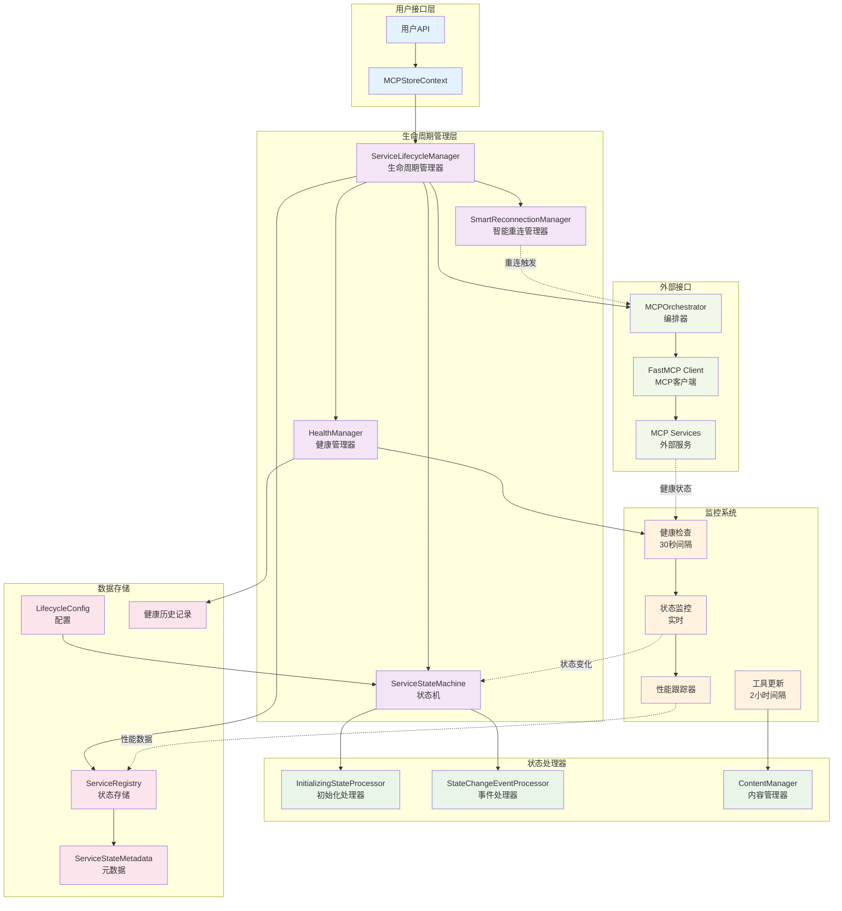
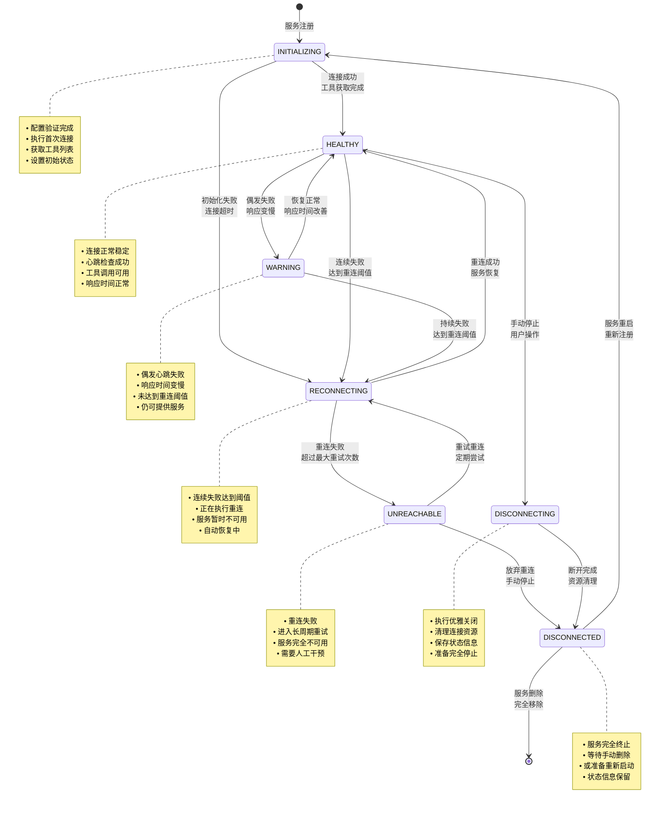
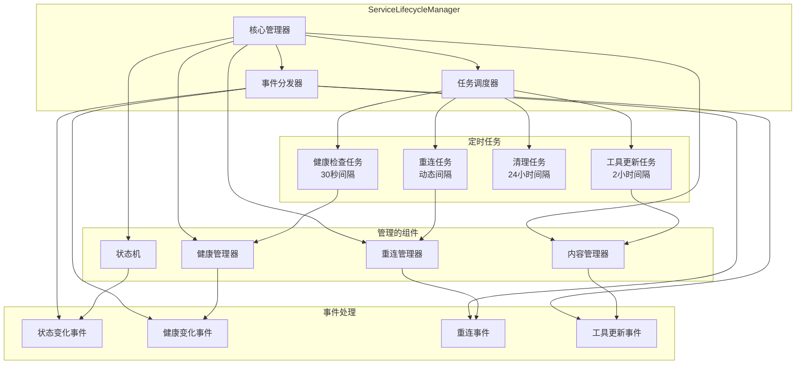
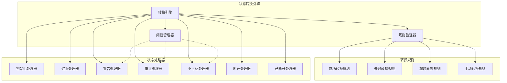
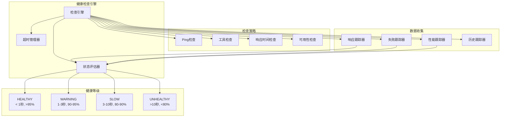
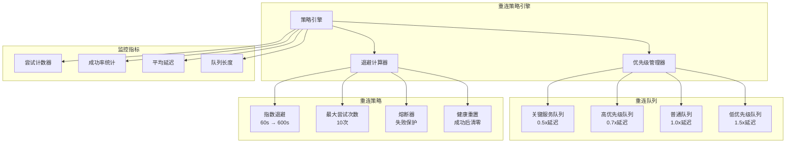
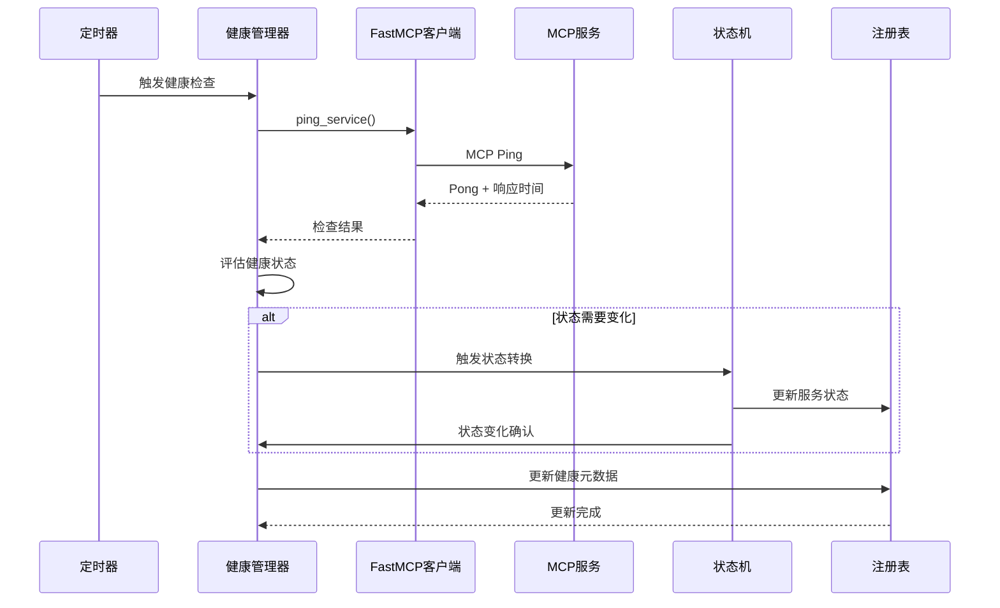
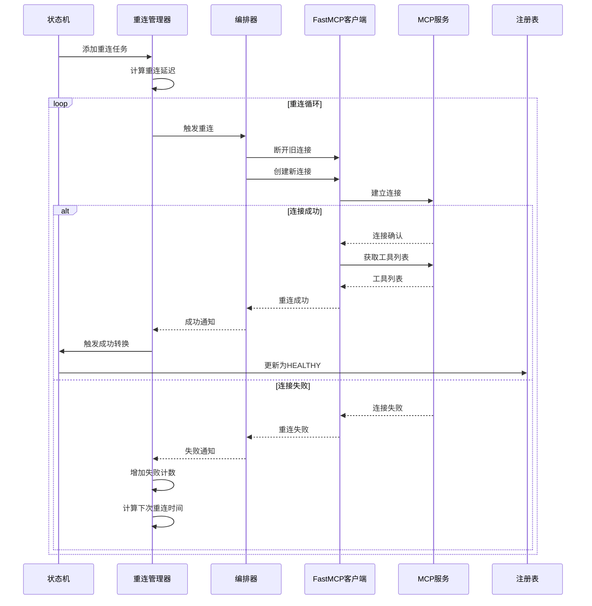
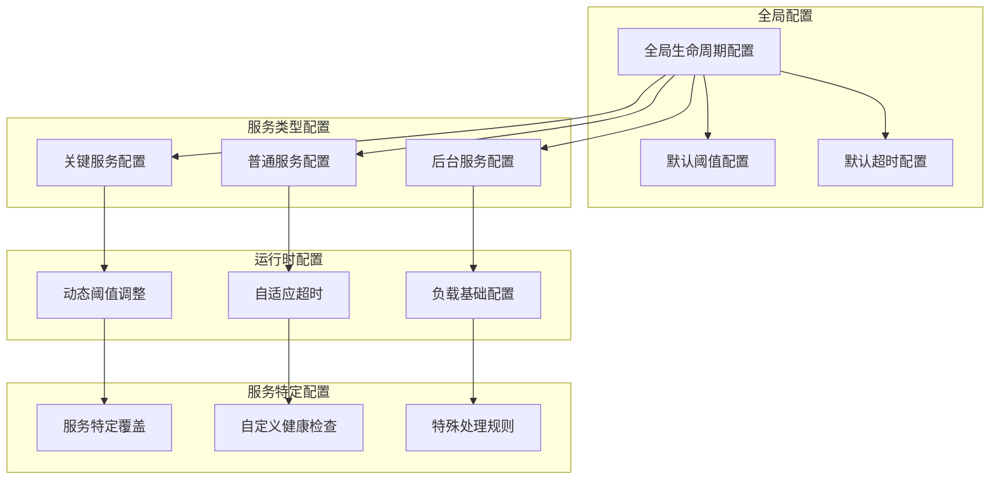
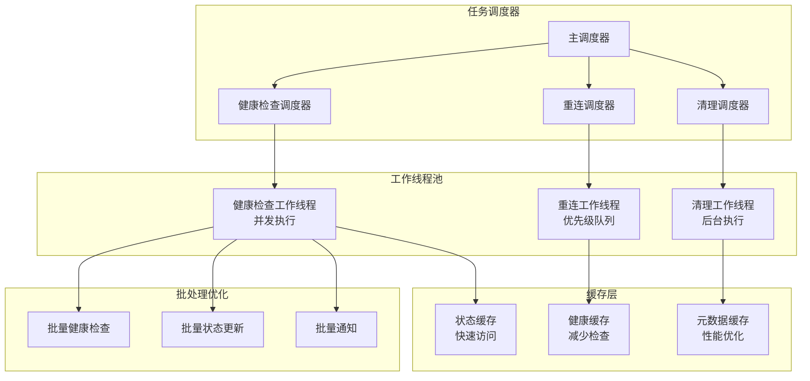

# 生命周期管理架构

本文档详细介绍 MCPStore 生命周期管理的内部架构、组件设计和工作原理。

## 🏗️ 整体架构图

## 🔄 7状态生命周期状态机

## 🧩 核心组件架构

### ServiceLifecycleManager

### ServiceStateMachine

### HealthManager

### SmartReconnectionManager

## 📊 数据流架构

### 健康检查数据流

### 重连流程数据流

## 🔧 配置架构

### 生命周期配置层次

## 📈 性能优化架构

### 并发处理架构

## 🔗 相关文档

- [服务生命周期概览](service-lifecycle.md) - 了解生命周期管理
- [健康检查机制](health-check.md) - 深入了解健康检查
- [完整示例集合](examples.md) - 实际使用示例
- [服务注册架构](../registration/architecture.md) - 注册架构详解

## 🎯 下一步

- 深入了解 [健康检查机制](health-check.md)
- 学习 [实际使用示例](examples.md)
- 掌握 [监控和调试](../../advanced/monitoring.md)
- 查看 [最佳实践](../../advanced/best-practices.md)
