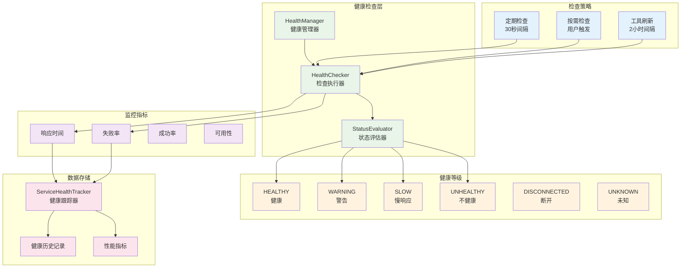

# 健康检查机制

MCPStore 实现了完整的服务健康检查系统，采用**分层健康评估**和**智能监控策略**，确保服务状态的实时监控和自动故障检测。

## 🏥 健康检查架构



## 🎯 健康状态等级

MCPStore 定义了8个健康状态等级：

```python
class HealthStatus(Enum):
    HEALTHY = "healthy"         # 正常响应，快速
    WARNING = "warning"         # 正常响应，但慢
    SLOW = "slow"              # 响应很慢但成功
    UNHEALTHY = "unhealthy"    # 响应失败或超时
    DISCONNECTED = "disconnected"  # 已断开
    RECONNECTING = "reconnecting"  # 重连中
    FAILED = "failed"          # 重连失败，放弃
    UNKNOWN = "unknown"        # 状态未知
```

### 状态判定标准

| 状态 | 响应时间 | 成功率 | 描述 | 图标 |
|------|----------|--------|------|------|
| **HEALTHY** | < 1秒 | > 95% | 服务响应快速，运行正常 | ✅ |
| **WARNING** | 1-3秒 | 90-95% | 服务响应较慢，需要关注 | ⚠️ |
| **SLOW** | 3-10秒 | 80-90% | 服务响应很慢，但仍可用 | 🐌 |
| **UNHEALTHY** | > 10秒或失败 | < 80% | 服务响应失败或超时 | ❌ |
| **DISCONNECTED** | - | 0% | 服务已断开连接 | 🔌 |
| **RECONNECTING** | - | 0% | 服务正在重连 | 🔄 |
| **FAILED** | - | 0% | 重连失败，已放弃 | 💀 |
| **UNKNOWN** | - | - | 状态未知，未检查 | ❓ |

## 🔍 健康检查方法

### check_services()

**功能**: 检查所有服务的健康状态

```python
def check_services(
    self,
    force_refresh: bool = False,
    timeout: float = None,
    include_tools: bool = False
) -> List[ServiceHealthInfo]
```

#### 参数说明

- `force_refresh`: 是否强制刷新（跳过缓存）
- `timeout`: 检查超时时间（秒）
- `include_tools`: 是否包含工具列表检查

#### 返回值

```python
class ServiceHealthInfo:
    name: str                    # 服务名称
    status: HealthStatus         # 健康状态
    response_time: float         # 响应时间（毫秒）
    last_check_time: datetime    # 最后检查时间
    error_message: str           # 错误信息
    success_rate: float          # 成功率
    total_checks: int            # 总检查次数
    consecutive_failures: int    # 连续失败次数
    tools_count: int             # 工具数量
    details: Dict[str, Any]      # 详细信息
```

## 🚀 使用示例

### 基本健康检查

```python
from mcpstore import MCPStore

def basic_health_check():
    """基本健康检查"""
    store = MCPStore.setup_store()
    
    # 检查所有服务健康状态
    health_info = store.for_store().check_services()
    
    print("🏥 服务健康检查报告")
    print("=" * 40)
    
    for service in health_info:
        status_icon = {
            "healthy": "✅",
            "warning": "⚠️",
            "slow": "🐌",
            "unhealthy": "❌",
            "disconnected": "🔌",
            "reconnecting": "🔄",
            "failed": "💀",
            "unknown": "❓"
        }.get(service.status, "❓")
        
        print(f"{status_icon} {service.name}")
        print(f"   状态: {service.status}")
        print(f"   响应时间: {service.response_time:.2f}ms")
        print(f"   成功率: {service.success_rate:.1f}%")
        if service.error_message:
            print(f"   错误: {service.error_message}")
        print()

# 使用
basic_health_check()
```

### Agent 级别健康检查

```python
def agent_health_check():
    """Agent 级别健康检查"""
    store = MCPStore.setup_store()
    
    agent_id = "my_agent"
    
    # 检查特定 Agent 的服务健康状态
    health_info = store.for_agent(agent_id).check_services()
    
    print(f"🤖 Agent '{agent_id}' 健康检查")
    print("=" * 40)
    
    healthy_count = sum(1 for s in health_info if s.status == "healthy")
    total_count = len(health_info)
    health_rate = (healthy_count / total_count * 100) if total_count > 0 else 0
    
    print(f"总体健康率: {health_rate:.1f}% ({healthy_count}/{total_count})")
    print()
    
    for service in health_info:
        if service.status != "healthy":
            print(f"⚠️ {service.name}: {service.status}")
            if service.error_message:
                print(f"   错误: {service.error_message}")

# 使用
agent_health_check()
```

### 详细健康检查

```python
def detailed_health_check():
    """详细健康检查"""
    store = MCPStore.setup_store()
    
    # 执行详细健康检查（包含工具检查）
    health_info = store.for_store().check_services(
        force_refresh=True,
        include_tools=True,
        timeout=10.0
    )
    
    # 统计各状态数量
    status_counts = {}
    total_response_time = 0
    response_count = 0
    
    for service in health_info:
        status = service.status
        status_counts[status] = status_counts.get(status, 0) + 1
        
        if service.response_time > 0:
            total_response_time += service.response_time
            response_count += 1
    
    # 计算平均响应时间
    avg_response_time = total_response_time / response_count if response_count > 0 else 0
    
    print("📊 详细健康检查报告")
    print("=" * 50)
    print(f"总服务数: {len(health_info)}")
    print(f"平均响应时间: {avg_response_time:.2f}ms")
    print()
    
    print("状态分布:")
    for status, count in status_counts.items():
        percentage = count / len(health_info) * 100
        print(f"  {status}: {count} ({percentage:.1f}%)")
    print()
    
    # 显示问题服务
    problem_services = [s for s in health_info if s.status not in ["healthy", "warning"]]
    if problem_services:
        print("🚨 问题服务:")
        for service in problem_services:
            print(f"  ❌ {service.name}: {service.status}")
            print(f"     连续失败: {service.consecutive_failures}")
            print(f"     最后检查: {service.last_check_time}")
            if service.error_message:
                print(f"     错误: {service.error_message}")
            print()

# 使用
detailed_health_check()
```

### 定期健康监控

```python
def continuous_health_monitoring():
    """持续健康监控"""
    import time
    import threading
    
    store = MCPStore.setup_store()
    
    def monitor_loop():
        """监控循环"""
        while True:
            try:
                health_info = store.for_store().check_services()
                
                # 检查是否有新的问题
                for service in health_info:
                    if service.status in ["unhealthy", "disconnected", "failed"]:
                        print(f"🚨 服务异常: {service.name} - {service.status}")
                        
                        # 可以在这里添加告警逻辑
                        # send_alert(service.name, service.status, service.error_message)
                
                # 每30秒检查一次
                time.sleep(30)
                
            except Exception as e:
                print(f"健康监控错误: {e}")
                time.sleep(60)  # 出错时等待更长时间
    
    # 启动监控线程
    monitor_thread = threading.Thread(target=monitor_loop, daemon=True)
    monitor_thread.start()
    
    print("🔍 健康监控已启动")
    return monitor_thread

# 使用
monitor_thread = continuous_health_monitoring()
```

## 🔧 健康检查配置

### ServiceHealthConfig

```python
class ServiceHealthConfig:
    # 超时配置
    ping_timeout: float = 3.0               # Ping超时时间
    startup_wait_time: float = 2.0          # 启动等待时间
    
    # 健康状态阈值
    healthy_threshold: float = 1.0          # 1秒内为健康
    warning_threshold: float = 3.0          # 3秒内为警告
    slow_threshold: float = 10.0            # 10秒内为慢响应
    
    # 智能超时配置
    enable_adaptive_timeout: bool = False   # 启用自适应超时
    adaptive_multiplier: float = 2.0        # 自适应倍数
    history_size: int = 10                  # 历史记录大小
```

### 自定义健康检查配置

```python
def customize_health_config():
    """自定义健康检查配置"""
    from mcpstore.core.lifecycle.health_manager import ServiceHealthConfig
    
    # 创建自定义配置
    config = ServiceHealthConfig(
        ping_timeout=5.0,           # 5秒超时
        healthy_threshold=0.5,      # 0.5秒内为健康
        warning_threshold=2.0,      # 2秒内为警告
        slow_threshold=5.0,         # 5秒内为慢响应
        enable_adaptive_timeout=True, # 启用自适应超时
        history_size=20             # 保留20次历史记录
    )
    
    store = MCPStore.setup_store()
    
    # 应用配置
    health_manager = store._orchestrator.lifecycle_manager.health_manager
    health_manager.update_config(config.__dict__)
    
    print("健康检查配置已更新")

# 使用
customize_health_config()
```
