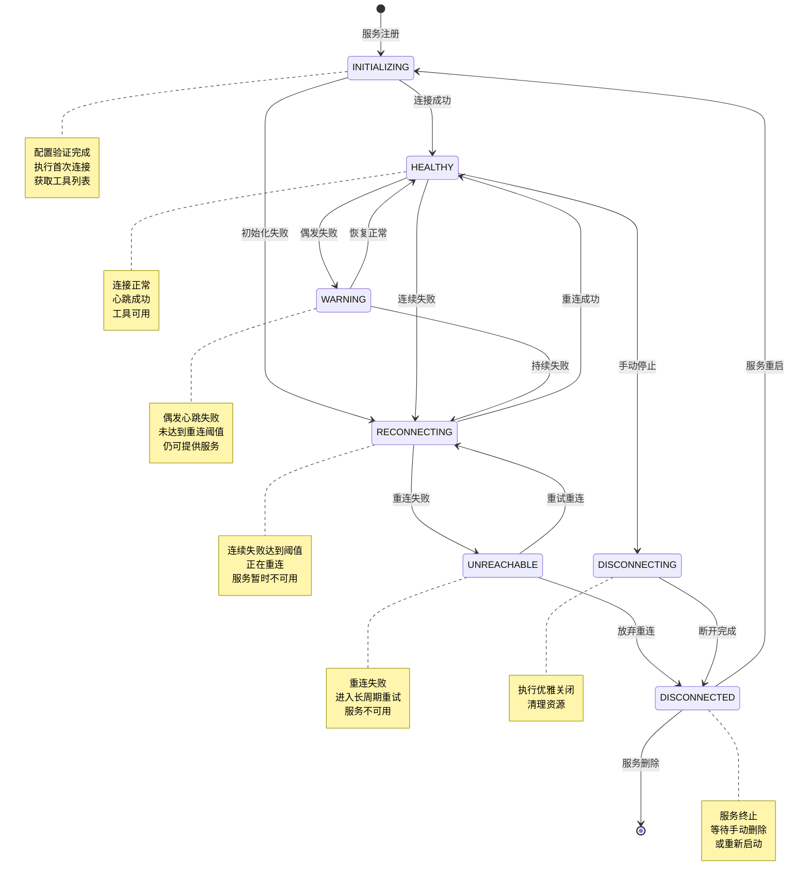
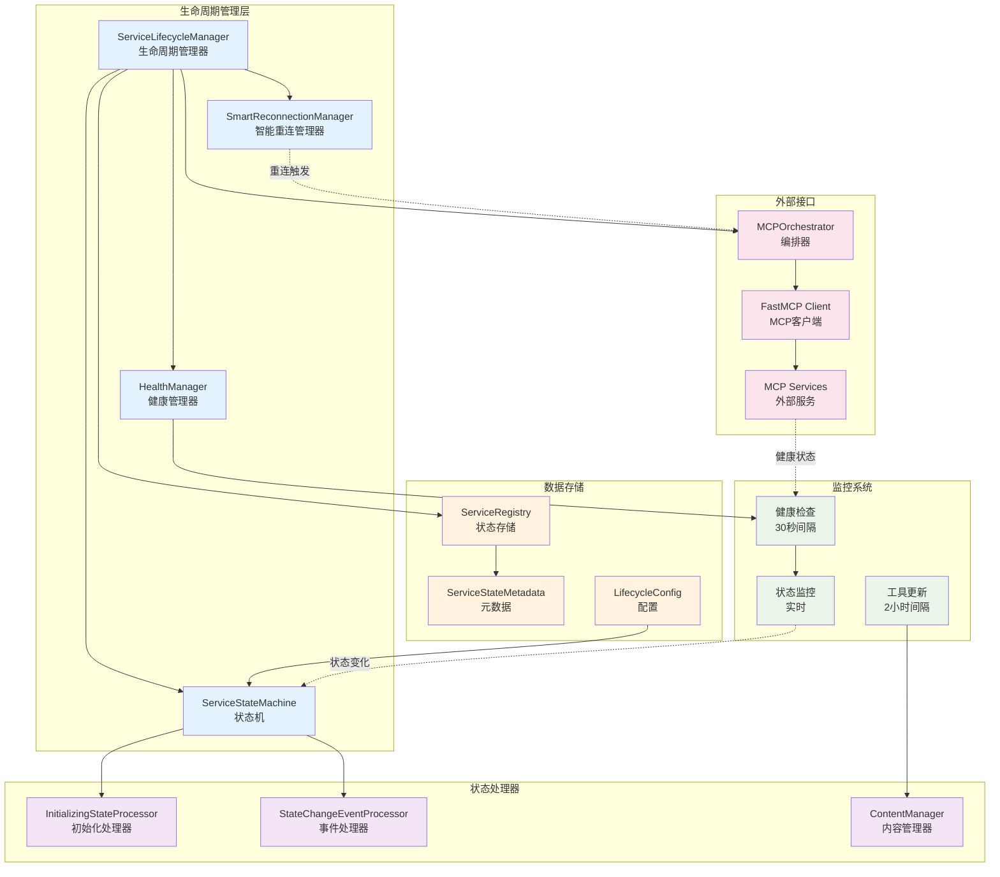
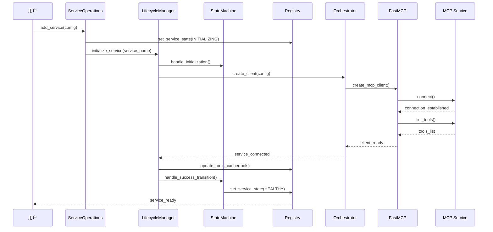
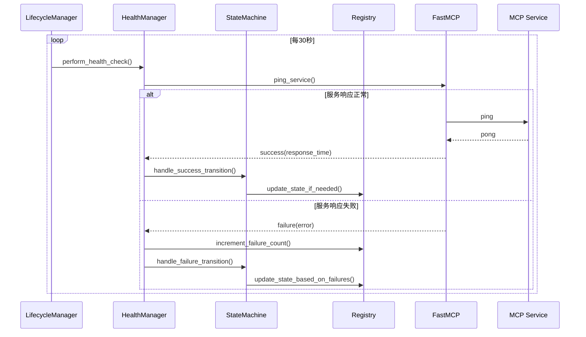
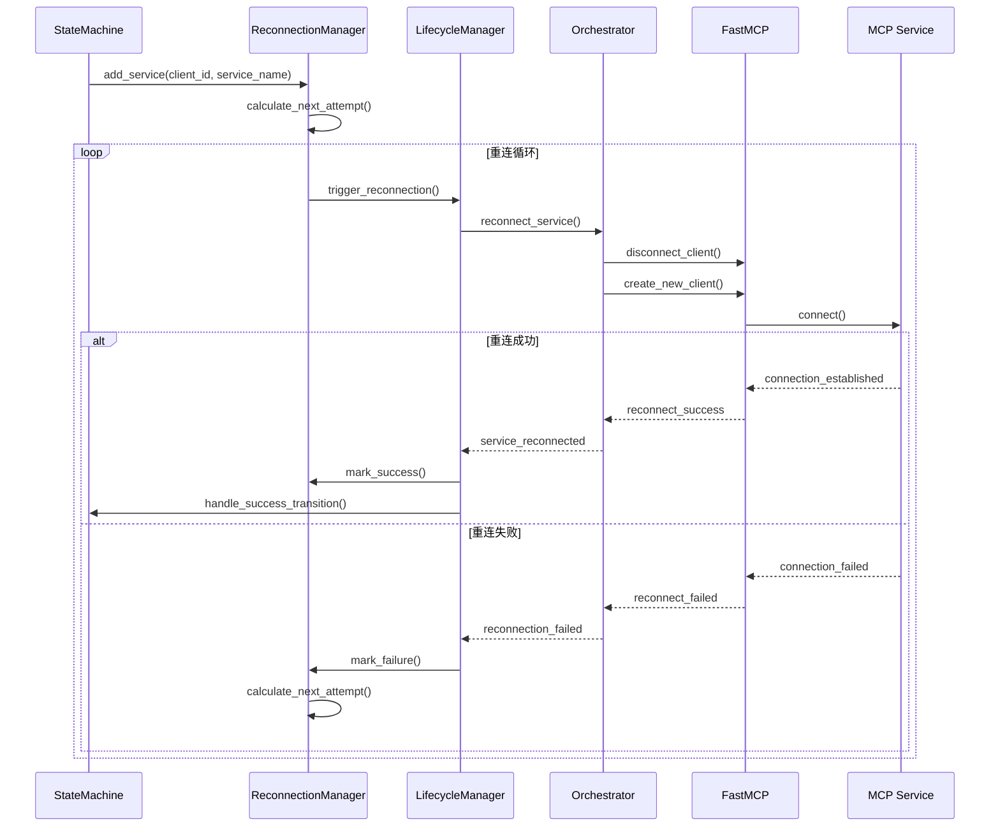

# 服务生命周期管理

MCPStore 实现了完整的服务生命周期管理系统，采用**7状态状态机**和**智能监控策略**，确保服务的高可用性和自动故障恢复。

## 🔄 7状态生命周期模型

MCPStore 定义了完整的服务生命周期状态：



### 状态详解

| 状态 | 描述 | 特征 | 可用性 |
|------|------|------|--------|
| **INITIALIZING** | 初始化中 | 配置验证完成，执行首次连接 | ❌ 不可用 |
| **HEALTHY** | 健康 | 连接正常，心跳成功 | ✅ 完全可用 |
| **WARNING** | 警告 | 偶发心跳失败，未达到重连阈值 | ⚠️ 部分可用 |
| **RECONNECTING** | 重连中 | 连续失败达到阈值，正在重连 | ❌ 不可用 |
| **UNREACHABLE** | 不可达 | 重连失败，进入长周期重试 | ❌ 不可用 |
| **DISCONNECTING** | 断开中 | 执行优雅关闭 | ❌ 不可用 |
| **DISCONNECTED** | 已断开 | 服务终止，等待手动删除 | ❌ 不可用 |

## 🏗️ 生命周期管理架构



## 🔧 核心组件详解

### ServiceLifecycleManager

**职责**: 生命周期管理的核心协调器
- 管理服务状态转换
- 协调各个处理器
- 执行定期健康检查
- 处理状态变化事件

**关键特性**:
- 统一的 Registry 状态管理
- 批处理状态变化队列
- 异步任务管理
- 错误恢复机制

### ServiceStateMachine

**职责**: 状态转换逻辑处理
- 处理成功状态转换
- 处理失败状态转换
- 维护状态转换规则
- 管理转换阈值

**转换规则**:
```python
# 成功转换规则
INITIALIZING/WARNING/RECONNECTING/UNREACHABLE → HEALTHY

# 失败转换规则
HEALTHY → WARNING (达到警告阈值)
WARNING → RECONNECTING (达到重连阈值)
INITIALIZING → RECONNECTING (初始化失败)
RECONNECTING → UNREACHABLE (重连次数超限)
```

### HealthManager

**职责**: 健康状态监控和评估
- 执行定期健康检查
- 评估响应时间
- 跟踪失败率
- 智能超时调整

**健康等级**:
```python
class HealthStatus(Enum):
    HEALTHY = "healthy"         # 正常响应，快速
    WARNING = "warning"         # 正常响应，但慢
    SLOW = "slow"              # 响应很慢但成功
    UNHEALTHY = "unhealthy"    # 响应失败或超时
    DISCONNECTED = "disconnected"  # 已断开
    RECONNECTING = "reconnecting"  # 重连中
    FAILED = "failed"          # 重连失败，放弃
    UNKNOWN = "unknown"        # 状态未知
```

### SmartReconnectionManager

**职责**: 智能重连策略管理
- 指数退避重连
- 优先级重连队列
- 失败计数管理
- 重连时间调度

**重连策略**:
- **基础延迟**: 60秒
- **最大延迟**: 600秒（10分钟）
- **最大失败次数**: 10次
- **优先级权重**: CRITICAL(0.5x) → HIGH(0.7x) → NORMAL(1.0x) → LOW(1.5x)

## ⚙️ 配置参数

### ServiceLifecycleConfig

```python
class ServiceLifecycleConfig:
    # 健康检查配置
    health_check_interval: int = 30          # 健康检查间隔（秒）
    tools_update_interval: int = 7200        # 工具更新间隔（秒，2小时）
    
    # 失败阈值配置
    warning_failure_threshold: int = 3       # 警告失败阈值
    reconnecting_failure_threshold: int = 5  # 重连失败阈值
    max_reconnect_attempts: int = 10         # 最大重连次数
    
    # 超时配置
    ping_timeout: float = 3.0               # Ping超时时间
    startup_wait_time: float = 2.0          # 启动等待时间
    
    # 清理配置
    cleanup_interval_hours: int = 24        # 清理间隔（小时）
    max_disconnected_age_hours: int = 168   # 最大断开保留时间（7天）
```

### ServiceHealthConfig

```python
class ServiceHealthConfig:
    # 超时配置
    ping_timeout: float = 3.0
    startup_wait_time: float = 2.0
    
    # 健康状态阈值
    healthy_threshold: float = 1.0      # 1秒内为健康
    warning_threshold: float = 3.0      # 3秒内为警告
    slow_threshold: float = 10.0        # 10秒内为慢响应
    
    # 智能超时配置
    enable_adaptive_timeout: bool = False
    adaptive_multiplier: float = 2.0
    history_size: int = 10
```

## 📊 状态元数据

每个服务维护详细的状态元数据：

```python
class ServiceStateMetadata:
    consecutive_failures: int = 0           # 连续失败次数
    consecutive_successes: int = 0          # 连续成功次数
    last_ping_time: Optional[datetime]      # 最后Ping时间
    last_success_time: Optional[datetime]   # 最后成功时间
    last_failure_time: Optional[datetime]   # 最后失败时间
    response_time: Optional[float]          # 响应时间
    error_message: Optional[str]            # 错误消息
    reconnect_attempts: int = 0             # 重连尝试次数
    next_retry_time: Optional[datetime]     # 下次重试时间
    state_entered_time: Optional[datetime]  # 状态进入时间
    disconnect_reason: Optional[str]        # 断开原因
    service_config: Dict[str, Any]          # 服务配置
    service_name: Optional[str]             # 服务名称
    agent_id: Optional[str]                 # Agent ID
    last_health_check: Optional[datetime]   # 最后健康检查
    last_response_time: Optional[float]     # 最后响应时间
```

## 🔄 生命周期流程

### 服务初始化流程



### 健康检查流程



### 重连流程



## 🚀 实际使用示例

### 监控服务生命周期

```python
from mcpstore import MCPStore
import time

def monitor_service_lifecycle():
    """监控服务生命周期状态变化"""
    store = MCPStore.setup_store()

    # 注册一个服务
    store.for_store().add_service({
        "name": "test_service",
        "url": "https://api.example.com/mcp"
    })

    # 监控状态变化
    last_states = {}

    for i in range(60):  # 监控60秒
        services = store.for_store().list_services()

        for service in services:
            current_state = service.status
            last_state = last_states.get(service.name)

            if current_state != last_state:
                print(f"🔄 {service.name}: {last_state} → {current_state}")
                last_states[service.name] = current_state

                # 获取详细状态信息
                service_info = store.for_store().get_service_info(service.name)
                if service_info and service_info.state_metadata:
                    metadata = service_info.state_metadata
                    print(f"   失败次数: {metadata.consecutive_failures}")
                    print(f"   重连次数: {metadata.reconnect_attempts}")
                    if metadata.error_message:
                        print(f"   错误信息: {metadata.error_message}")

        time.sleep(1)

# 使用
monitor_service_lifecycle()
```

### 手动触发状态转换

```python
def manual_state_management():
    """手动管理服务状态"""
    store = MCPStore.setup_store()

    # 获取生命周期管理器（内部API）
    lifecycle_manager = store._orchestrator.lifecycle_manager

    service_name = "test_service"
    agent_id = "global_agent_store"

    # 手动设置服务状态
    lifecycle_manager.registry.set_service_state(
        agent_id, service_name, ServiceConnectionState.WARNING
    )

    # 手动触发健康检查
    asyncio.run(lifecycle_manager.perform_health_check(agent_id, service_name))

    # 手动触发重连
    asyncio.run(lifecycle_manager.trigger_reconnection(agent_id, service_name))

    print("手动状态管理完成")

# 使用
manual_state_management()
```

### 配置生命周期参数

```python
def configure_lifecycle():
    """配置生命周期管理参数"""
    from mcpstore.core.lifecycle.config import ServiceLifecycleConfig

    # 创建自定义配置
    config = ServiceLifecycleConfig(
        health_check_interval=15,        # 15秒健康检查
        warning_failure_threshold=2,     # 2次失败进入警告
        reconnecting_failure_threshold=3, # 3次失败开始重连
        max_reconnect_attempts=5,        # 最多重连5次
        ping_timeout=5.0                 # 5秒ping超时
    )

    store = MCPStore.setup_store()

    # 应用配置（需要在服务启动前设置）
    lifecycle_manager = store._orchestrator.lifecycle_manager
    lifecycle_manager.config = config

    print("生命周期配置已更新")

# 使用
configure_lifecycle()
```

## 🛡️ 故障处理和恢复

### 自动故障恢复

MCPStore 实现了多层次的自动故障恢复机制：

#### 1. 即时恢复（WARNING状态）
- **触发条件**: 偶发失败，未达到重连阈值
- **恢复策略**: 继续监控，等待自然恢复
- **服务可用性**: 部分可用，可能有延迟

#### 2. 主动重连（RECONNECTING状态）
- **触发条件**: 连续失败达到阈值
- **恢复策略**: 断开重连，重新建立连接
- **服务可用性**: 暂时不可用

#### 3. 长期重试（UNREACHABLE状态）
- **触发条件**: 重连失败次数超限
- **恢复策略**: 指数退避长期重试
- **服务可用性**: 不可用，等待恢复

### 故障诊断

```python
def diagnose_service_issues():
    """诊断服务问题"""
    store = MCPStore.setup_store()

    services = store.for_store().list_services()

    for service in services:
        if service.status != ServiceConnectionState.HEALTHY:
            print(f"🔍 诊断服务: {service.name}")
            print(f"   当前状态: {service.status}")

            # 获取详细信息
            service_info = store.for_store().get_service_info(service.name)
            if service_info and service_info.state_metadata:
                metadata = service_info.state_metadata

                print(f"   连续失败: {metadata.consecutive_failures}")
                print(f"   重连次数: {metadata.reconnect_attempts}")
                print(f"   最后错误: {metadata.error_message}")
                print(f"   响应时间: {metadata.response_time}ms")

                if metadata.next_retry_time:
                    print(f"   下次重试: {metadata.next_retry_time}")

                # 建议修复措施
                if service.status == ServiceConnectionState.WARNING:
                    print("   💡 建议: 检查网络连接和服务负载")
                elif service.status == ServiceConnectionState.RECONNECTING:
                    print("   💡 建议: 等待自动重连或检查服务配置")
                elif service.status == ServiceConnectionState.UNREACHABLE:
                    print("   💡 建议: 检查服务是否运行，考虑手动重启")

# 使用
diagnose_service_issues()
```

### 手动故障恢复

```python
def manual_recovery():
    """手动故障恢复"""
    store = MCPStore.setup_store()

    # 重启有问题的服务
    problematic_services = []
    services = store.for_store().list_services()

    for service in services:
        if service.status in [
            ServiceConnectionState.UNREACHABLE,
            ServiceConnectionState.RECONNECTING
        ]:
            problematic_services.append(service.name)

    print(f"发现 {len(problematic_services)} 个问题服务")

    for service_name in problematic_services:
        print(f"🔄 重启服务: {service_name}")

        try:
            # 方法1: 重启服务
            success = store.for_store().restart_service(service_name)
            if success:
                print(f"✅ {service_name} 重启成功")
            else:
                print(f"❌ {service_name} 重启失败，尝试重新注册")

                # 方法2: 重新注册服务
                service_info = store.for_store().get_service_info(service_name)
                if service_info:
                    config = service_info.config
                    store.for_store().remove_service(service_name)
                    store.for_store().add_service(config)
                    print(f"🔄 {service_name} 重新注册完成")

        except Exception as e:
            print(f"❌ {service_name} 恢复失败: {e}")

# 使用
manual_recovery()
```

## 📊 监控和指标

### 生命周期指标收集

```python
def collect_lifecycle_metrics():
    """收集生命周期指标"""
    store = MCPStore.setup_store()
    services = store.for_store().list_services()

    metrics = {
        "total_services": len(services),
        "healthy_services": 0,
        "warning_services": 0,
        "reconnecting_services": 0,
        "unreachable_services": 0,
        "average_response_time": 0,
        "total_failures": 0,
        "total_reconnections": 0
    }

    total_response_time = 0
    response_count = 0

    for service in services:
        # 统计状态分布
        if service.status == ServiceConnectionState.HEALTHY:
            metrics["healthy_services"] += 1
        elif service.status == ServiceConnectionState.WARNING:
            metrics["warning_services"] += 1
        elif service.status == ServiceConnectionState.RECONNECTING:
            metrics["reconnecting_services"] += 1
        elif service.status == ServiceConnectionState.UNREACHABLE:
            metrics["unreachable_services"] += 1

        # 收集性能指标
        service_info = store.for_store().get_service_info(service.name)
        if service_info and service_info.state_metadata:
            metadata = service_info.state_metadata
            metrics["total_failures"] += metadata.consecutive_failures
            metrics["total_reconnections"] += metadata.reconnect_attempts

            if metadata.response_time:
                total_response_time += metadata.response_time
                response_count += 1

    if response_count > 0:
        metrics["average_response_time"] = total_response_time / response_count

    # 计算健康率
    metrics["health_rate"] = metrics["healthy_services"] / metrics["total_services"] * 100

    return metrics

# 使用
metrics = collect_lifecycle_metrics()
print(f"服务健康率: {metrics['health_rate']:.1f}%")
print(f"平均响应时间: {metrics['average_response_time']:.2f}ms")
```

### 实时监控面板

```python
def monitoring_dashboard():
    """实时监控面板"""
    import time
    import os

    store = MCPStore.setup_store()

    while True:
        # 清屏
        os.system('clear' if os.name == 'posix' else 'cls')

        print("🔍 MCPStore 服务监控面板")
        print("=" * 50)

        services = store.for_store().list_services()
        metrics = collect_lifecycle_metrics()

        # 总体状态
        print(f"📊 总体状态:")
        print(f"   总服务数: {metrics['total_services']}")
        print(f"   健康率: {metrics['health_rate']:.1f}%")
        print(f"   平均响应时间: {metrics['average_response_time']:.2f}ms")
        print()

        # 状态分布
        print(f"📈 状态分布:")
        print(f"   ✅ 健康: {metrics['healthy_services']}")
        print(f"   ⚠️ 警告: {metrics['warning_services']}")
        print(f"   🔄 重连中: {metrics['reconnecting_services']}")
        print(f"   ❌ 不可达: {metrics['unreachable_services']}")
        print()

        # 服务详情
        print(f"📋 服务详情:")
        for service in services:
            status_icon = {
                ServiceConnectionState.HEALTHY: "✅",
                ServiceConnectionState.WARNING: "⚠️",
                ServiceConnectionState.RECONNECTING: "🔄",
                ServiceConnectionState.UNREACHABLE: "❌",
                ServiceConnectionState.INITIALIZING: "🔧",
                ServiceConnectionState.DISCONNECTING: "⏹️",
                ServiceConnectionState.DISCONNECTED: "💤"
            }.get(service.status, "❓")

            print(f"   {status_icon} {service.name}: {service.status}")

        print("\n按 Ctrl+C 退出监控")
        time.sleep(5)

# 使用
try:
    monitoring_dashboard()
except KeyboardInterrupt:
    print("\n监控已停止")
```

## 🔧 高级配置

### 自定义状态转换阈值

```python
def customize_state_thresholds():
    """自定义状态转换阈值"""
    from mcpstore.core.lifecycle.config import ServiceLifecycleConfig

    # 为不同类型的服务设置不同的阈值
    configs = {
        "critical_services": ServiceLifecycleConfig(
            warning_failure_threshold=1,     # 关键服务：1次失败就警告
            reconnecting_failure_threshold=2, # 2次失败就重连
            max_reconnect_attempts=20,       # 最多重连20次
            health_check_interval=10         # 10秒检查一次
        ),
        "normal_services": ServiceLifecycleConfig(
            warning_failure_threshold=3,     # 普通服务：3次失败警告
            reconnecting_failure_threshold=5, # 5次失败重连
            max_reconnect_attempts=10,       # 最多重连10次
            health_check_interval=30         # 30秒检查一次
        ),
        "background_services": ServiceLifecycleConfig(
            warning_failure_threshold=5,     # 后台服务：5次失败警告
            reconnecting_failure_threshold=10, # 10次失败重连
            max_reconnect_attempts=5,        # 最多重连5次
            health_check_interval=60         # 60秒检查一次
        )
    }

    return configs

# 使用
configs = customize_state_thresholds()
```

### 智能重连策略

```python
def setup_smart_reconnection():
    """设置智能重连策略"""
    from mcpstore.core.lifecycle.smart_reconnection import (
        SmartReconnectionManager,
        ReconnectionPriority
    )

    store = MCPStore.setup_store()
    reconnection_manager = store._orchestrator.lifecycle_manager.reconnection_manager

    # 为不同服务设置不同的重连优先级
    service_priorities = {
        "auth_service": ReconnectionPriority.CRITICAL,    # 认证服务：关键
        "database_service": ReconnectionPriority.HIGH,    # 数据库服务：高优先级
        "weather_api": ReconnectionPriority.NORMAL,       # 天气API：普通
        "backup_service": ReconnectionPriority.LOW        # 备份服务：低优先级
    }

    # 应用优先级设置
    for service_name, priority in service_priorities.items():
        client_id = f"global_agent_store:{service_name}"
        reconnection_manager.add_service(client_id, service_name, priority)

    print("智能重连策略配置完成")

# 使用
setup_smart_reconnection()
```

## 🚨 故障预警系统

### 设置预警规则

```python
def setup_alert_system():
    """设置故障预警系统"""
    import smtplib
    from email.mime.text import MIMEText

    def send_alert(service_name, status, message):
        """发送预警邮件"""
        # 邮件配置（示例）
        smtp_server = "smtp.example.com"
        smtp_port = 587
        username = "alerts@company.com"
        password = "password"
        to_email = "admin@company.com"

        subject = f"MCPStore 服务预警: {service_name}"
        body = f"""
        服务名称: {service_name}
        当前状态: {status}
        预警信息: {message}
        时间: {datetime.now()}

        请及时检查服务状态。
        """

        msg = MIMEText(body)
        msg['Subject'] = subject
        msg['From'] = username
        msg['To'] = to_email

        try:
            server = smtplib.SMTP(smtp_server, smtp_port)
            server.starttls()
            server.login(username, password)
            server.send_message(msg)
            server.quit()
            print(f"预警邮件已发送: {service_name}")
        except Exception as e:
            print(f"发送预警邮件失败: {e}")

    def monitor_with_alerts():
        """带预警的监控"""
        store = MCPStore.setup_store()
        last_states = {}

        while True:
            services = store.for_store().list_services()

            for service in services:
                current_state = service.status
                last_state = last_states.get(service.name)

                # 检查状态变化
                if current_state != last_state:
                    last_states[service.name] = current_state

                    # 触发预警的状态
                    if current_state in [
                        ServiceConnectionState.WARNING,
                        ServiceConnectionState.RECONNECTING,
                        ServiceConnectionState.UNREACHABLE
                    ]:
                        message = f"服务状态从 {last_state} 变为 {current_state}"
                        send_alert(service.name, current_state, message)

                # 检查长时间处于异常状态
                if current_state == ServiceConnectionState.UNREACHABLE:
                    service_info = store.for_store().get_service_info(service.name)
                    if service_info and service_info.state_metadata:
                        metadata = service_info.state_metadata
                        if metadata.state_entered_time:
                            duration = datetime.now() - metadata.state_entered_time
                            if duration.total_seconds() > 300:  # 5分钟
                                message = f"服务已不可达超过 {duration.total_seconds():.0f} 秒"
                                send_alert(service.name, current_state, message)

            time.sleep(30)  # 30秒检查一次

    return monitor_with_alerts

# 使用
monitor_func = setup_alert_system()
# monitor_func()  # 启动监控（在生产环境中运行）
```

## 🔗 相关文档

- [服务注册](../registration/add-service.md) - 了解服务注册流程
- [服务管理](../management/service-management.md) - 学习服务管理操作
- [等待服务状态](wait-service.md) - 掌握服务状态等待功能
- [健康检查](check-services.md) - 深入了解健康检查机制
- [重启服务](restart-service.md) - 掌握服务重启方法
- [监控系统](../../advanced/monitoring.md) - 完整的监控解决方案

## 🎯 下一步

- 学习 [等待服务状态](wait-service.md) - 确保服务就绪
- 了解 [健康检查机制](check-services.md)
- 掌握 [服务重启方法](restart-service.md)
- 学习 [监控和调试](../../advanced/monitoring.md)
- 查看 [最佳实践](../../advanced/best-practices.md)
```
