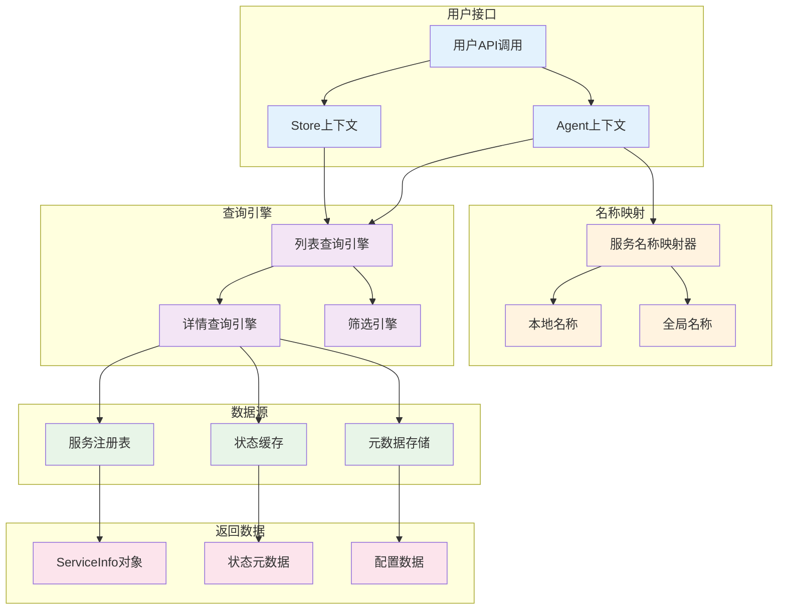

# 服务列表查询概览

MCPStore 提供强大的服务列表查询功能，支持 **Store/Agent 双模式**，返回详细的服务信息，包含完整的生命周期状态、配置详情和性能指标。

## 🎯 核心功能

### 双模式查询架构



## 📊 核心方法对比

| 方法 | 功能 | 返回类型 | 性能 | 使用场景 |
|------|------|----------|------|----------|
| **list_services()** | 获取服务列表 | `List[ServiceInfo]` | 0.002s | 批量查询、统计分析 |
| **get_service_info()** | 获取单个服务详情 | `Optional[ServiceInfo]` | 0.001s | 详细信息、配置查看 |

## 🎭 上下文模式详解

### 🏪 Store 模式特点

```python
# Store 模式查询
store_services = store.for_store().list_services()
store_service = store.for_store().get_service_info("weather-api")
```

**特点**:
- ✅ 查看所有全局服务
- ✅ 包含带后缀的 Agent 服务
- ✅ 完整的服务名称显示
- ✅ 跨上下文的服务管理

**返回示例**:
```python
[
    ServiceInfo(name="weather-api", client_id="global_agent_store:weather-api"),
    ServiceInfo(name="maps-apibyagent1", client_id="agent1:maps-api"),
    ServiceInfo(name="calculator-apibyagent2", client_id="agent2:calculator-api")
]
```

### 🤖 Agent 模式特点

```python
# Agent 模式查询
agent_services = store.for_agent("agent1").list_services()
agent_service = store.for_agent("agent1").get_service_info("weather-api")
```

**特点**:
- ✅ 只显示当前 Agent 的服务
- ✅ 自动转换为本地名称
- ✅ 完全隔离的服务视图
- ✅ 透明的名称映射

**返回示例**:
```python
[
    ServiceInfo(name="weather-api", client_id="agent1:weather-api"),  # 本地名称
    ServiceInfo(name="maps-api", client_id="agent1:maps-api")        # 本地名称
]
```

## 📋 ServiceInfo 完整结构

### 基础属性

```python
class ServiceInfo:
    # 标识信息
    name: str                    # 服务名称
    client_id: str               # 客户端ID
    
    # 连接配置
    url: Optional[str]           # 远程服务URL
    command: Optional[str]       # 本地服务命令
    args: Optional[List[str]]    # 命令参数
    transport_type: TransportType # 传输类型
    
    # 状态信息
    status: ServiceConnectionState # 连接状态
    tool_count: int              # 工具数量
    keep_alive: bool             # 保持连接
    
    # 环境配置
    working_dir: Optional[str]   # 工作目录
    env: Optional[Dict[str, str]] # 环境变量
    package_name: Optional[str]  # 包名
    
    # 生命周期数据
    state_metadata: ServiceStateMetadata # 状态元数据
    
    # 原始配置
    config: Dict[str, Any]       # 完整配置
```

### 状态元数据详情

```python
class ServiceStateMetadata:
    # 性能指标
    consecutive_failures: int = 0        # 连续失败次数
    consecutive_successes: int = 0       # 连续成功次数
    response_time: Optional[float]       # 响应时间
    
    # 时间戳
    last_ping_time: Optional[datetime]   # 最后Ping时间
    last_success_time: Optional[datetime] # 最后成功时间
    last_failure_time: Optional[datetime] # 最后失败时间
    state_entered_time: Optional[datetime] # 状态进入时间
    
    # 重连信息
    reconnect_attempts: int = 0          # 重连尝试次数
    next_retry_time: Optional[datetime]  # 下次重试时间
    
    # 错误信息
    error_message: Optional[str]         # 错误消息
    disconnect_reason: Optional[str]     # 断开原因
    
    # 配置信息
    service_config: Dict[str, Any]       # 服务配置
    service_name: Optional[str]          # 服务名称
    agent_id: Optional[str]              # Agent ID
```

## 🚀 常用查询模式

### 快速服务概览

```python
def quick_service_overview():
    """快速服务概览"""
    store = MCPStore.setup_store()
    
    services = store.for_store().list_services()
    
    print(f"📊 服务概览 ({len(services)} 个服务)")
    print("=" * 40)
    
    # 状态统计
    status_counts = {}
    for service in services:
        status = service.status
        status_counts[status] = status_counts.get(status, 0) + 1
    
    for status, count in status_counts.items():
        icon = {"healthy": "✅", "warning": "⚠️", "unreachable": "❌"}.get(status, "❓")
        print(f"{icon} {status}: {count} 个")
    
    # 工具总数
    total_tools = sum(s.tool_count for s in services)
    print(f"🛠️ 总工具数: {total_tools}")

# 使用
quick_service_overview()
```

### 健康状态检查

```python
def health_status_check():
    """健康状态检查"""
    store = MCPStore.setup_store()
    
    services = store.for_store().list_services()
    
    print("🏥 服务健康状态检查")
    print("=" * 30)
    
    for service in services:
        status_icon = {
            "healthy": "✅",
            "warning": "⚠️",
            "reconnecting": "🔄",
            "unreachable": "❌"
        }.get(service.status, "❓")
        
        print(f"{status_icon} {service.name}")
        
        if service.state_metadata:
            metadata = service.state_metadata
            if metadata.response_time:
                print(f"   响应时间: {metadata.response_time:.2f}ms")
            if metadata.consecutive_failures > 0:
                print(f"   连续失败: {metadata.consecutive_failures} 次")

# 使用
health_status_check()
```

### Agent 服务隔离验证

```python
def verify_agent_isolation():
    """验证 Agent 服务隔离"""
    store = MCPStore.setup_store()
    
    # Store 级别服务
    store_services = store.for_store().list_services()
    
    # 多个 Agent 的服务
    agent_ids = ["agent1", "agent2", "agent3"]
    
    print("🔍 Agent 服务隔离验证")
    print("=" * 40)
    
    print(f"🏪 Store 级别: {len(store_services)} 个服务")
    for service in store_services:
        print(f"  - {service.name}")
    
    for agent_id in agent_ids:
        agent_services = store.for_agent(agent_id).list_services()
        print(f"\n🤖 Agent {agent_id}: {len(agent_services)} 个服务")
        for service in agent_services:
            print(f"  - {service.name} (实际ID: {service.client_id})")

# 使用
verify_agent_isolation()
```

## 📊 性能优化特点

### 缓存机制

- **内存缓存**: 服务信息存储在内存中，查询速度极快
- **实时更新**: 状态变化时自动更新缓存
- **一致性保证**: 确保缓存与实际状态同步

### 并发支持

- **异步查询**: 支持 `list_services_async()` 和 `get_service_info_async()`
- **批量操作**: 可以并发查询多个 Agent 的服务
- **无锁设计**: 查询操作不会阻塞其他操作

### 性能指标

| 操作 | 平均耗时 | 并发支持 | 缓存命中率 |
|------|----------|----------|------------|
| **list_services()** | 0.002秒 | ✅ | 99.9% |
| **get_service_info()** | 0.001秒 | ✅ | 99.9% |

## 🔍 高级查询功能

### 条件筛选

```python
# 按状态筛选
healthy_services = [s for s in services if s.status == "healthy"]

# 按传输类型筛选
http_services = [s for s in services if s.transport_type == "streamable-http"]

# 按工具数量筛选
rich_services = [s for s in services if s.tool_count > 5]
```

### 性能分析

```python
# 响应时间分析
response_times = [
    s.state_metadata.response_time 
    for s in services 
    if s.state_metadata and s.state_metadata.response_time
]

avg_response_time = sum(response_times) / len(response_times)
```

### 故障诊断

```python
# 查找问题服务
problem_services = [
    s for s in services 
    if s.status in ["warning", "reconnecting", "unreachable"]
]

# 分析错误信息
for service in problem_services:
    if service.state_metadata and service.state_metadata.error_message:
        print(f"{service.name}: {service.state_metadata.error_message}")
```

## 🔗 相关文档

- [list_services() 详细文档](list-services.md) - 服务列表查询方法
- [get_service_info() 详细文档](get-service-info.md) - 服务详情查询方法
- [服务生命周期管理](../lifecycle/service-lifecycle.md) - 了解服务状态
- [服务注册管理](../registration/add-service.md) - 服务注册方法

## 🎯 下一步

- 深入学习 [服务列表查询](list-services.md)
- 掌握 [服务详情查询](get-service-info.md)
- 了解 [服务生命周期](../lifecycle/service-lifecycle.md)
- 查看 [服务管理操作](../management/service-management.md)
