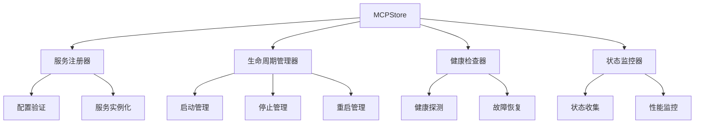
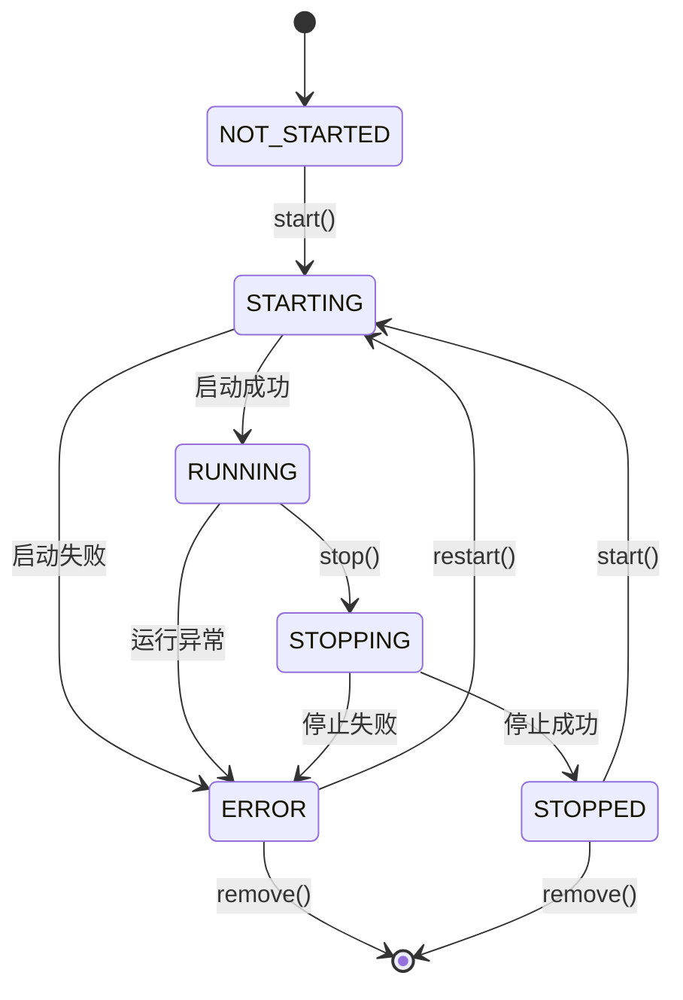

# 服务管理概述

## 📋 概述

服务管理是 MCPStore 的核心功能之一，提供了完整的 MCP 服务生命周期管理能力。从服务注册、启动、监控到停止，MCPStore 提供了一套完整的服务管理解决方案。

## 🔧 核心功能

### 服务注册管理
- **动态注册**：支持运行时动态添加新服务
- **配置验证**：自动验证服务配置的正确性
- **多格式支持**：支持多种配置格式和来源

### 生命周期管理
- **启动控制**：智能服务启动和依赖管理
- **状态监控**：实时监控服务运行状态
- **优雅停止**：支持优雅停止和强制终止
- **自动重启**：故障检测和自动恢复

### 健康检查
- **定期检查**：定时检查服务健康状态
- **故障检测**：及时发现服务异常
- **告警机制**：服务故障时的通知机制

## 🏗️ 服务管理架构



## 📊 服务状态模型

### 状态定义

```python
class ServiceStatus:
    NOT_STARTED = "not_started"    # 未启动
    STARTING = "starting"          # 启动中
    RUNNING = "running"            # 运行中
    STOPPING = "stopping"         # 停止中
    STOPPED = "stopped"            # 已停止
    ERROR = "error"                # 错误状态
    UNKNOWN = "unknown"            # 未知状态
```

### 状态转换



## 💡 基础使用示例

### 完整的服务管理流程

```python
from mcpstore import MCPStore

# 初始化 MCPStore
store = MCPStore()

# 1. 注册服务
service_config = {
    "mcpServers": {
        "filesystem": {
            "command": "npx",
            "args": ["-y", "@modelcontextprotocol/server-filesystem", "/tmp"]
        },
        "web_search": {
            "command": "python",
            "args": ["-m", "web_search_server"]
        }
    }
}

store.add_service(service_config)
print("✅ 服务注册完成")

# 2. 启动服务
services = ["filesystem", "web_search"]
for service_name in services:
    try:
        success = store.start_service(service_name)
        print(f"{'✅' if success else '❌'} {service_name}: {'启动成功' if success else '启动失败'}")
    except Exception as e:
        print(f"❌ {service_name}: 启动异常 - {e}")

# 3. 检查服务状态
print("\n📊 服务状态检查:")
for service_name in services:
    try:
        status = store.get_service_status(service_name)
        info = store.get_service_info(service_name)
        print(f"🔍 {service_name}: {status} (工具数: {len(info.get('tools', []))})")
    except Exception as e:
        print(f"⚠️ {service_name}: 状态检查失败 - {e}")

# 4. 使用服务工具
try:
    tools = store.list_tools()
    print(f"\n🛠️ 可用工具总数: {len(tools)}")
    
    # 调用工具示例
    if tools:
        result = store.call_tool(tools[0]['name'], {})
        print(f"🔧 工具调用示例: {tools[0]['name']}")
except Exception as e:
    print(f"⚠️ 工具操作失败: {e}")

# 5. 健康检查
print("\n🏥 执行健康检查:")
health_results = store.check_services()
for service_name, health in health_results.items():
    status_icon = "✅" if health['healthy'] else "❌"
    print(f"{status_icon} {service_name}: {health['status']}")

# 6. 停止服务
print("\n🛑 停止服务:")
for service_name in reversed(services):  # 逆序停止
    try:
        success = store.stop_service(service_name)
        print(f"{'✅' if success else '❌'} {service_name}: {'停止成功' if success else '停止失败'}")
    except Exception as e:
        print(f"❌ {service_name}: 停止异常 - {e}")
```

## 🔍 高级管理功能

### 服务依赖管理

```python
class ServiceDependencyManager:
    def __init__(self, store):
        self.store = store
        self.dependencies = {}
    
    def add_dependency(self, service, depends_on):
        """添加服务依赖关系"""
        if service not in self.dependencies:
            self.dependencies[service] = []
        self.dependencies[service].extend(depends_on)
    
    def get_start_order(self):
        """获取启动顺序"""
        # 拓扑排序
        visited = set()
        order = []
        
        def visit(service):
            if service in visited:
                return
            visited.add(service)
            
            for dep in self.dependencies.get(service, []):
                visit(dep)
            
            order.append(service)
        
        for service in self.dependencies:
            visit(service)
        
        return order
    
    def start_all_services(self):
        """按依赖顺序启动所有服务"""
        start_order = self.get_start_order()
        results = {}
        
        for service in start_order:
            try:
                success = self.store.start_service(service)
                results[service] = success
                print(f"{'✅' if success else '❌'} 启动 {service}")
            except Exception as e:
                results[service] = False
                print(f"❌ 启动 {service} 失败: {e}")
        
        return results

# 使用依赖管理
dep_manager = ServiceDependencyManager(store)
dep_manager.add_dependency("api", ["database", "auth"])
dep_manager.add_dependency("auth", ["database"])
dep_manager.add_dependency("web", ["api"])

results = dep_manager.start_all_services()
```

### 服务性能监控

```python
import time
import threading
from collections import defaultdict

class ServicePerformanceMonitor:
    def __init__(self, store):
        self.store = store
        self.metrics = defaultdict(list)
        self.monitoring = False
        self.monitor_thread = None
    
    def start_monitoring(self, interval=10):
        """开始性能监控"""
        self.monitoring = True
        self.monitor_thread = threading.Thread(
            target=self._monitor_loop, 
            args=(interval,)
        )
        self.monitor_thread.start()
        print(f"📊 开始性能监控 (间隔: {interval}s)")
    
    def stop_monitoring(self):
        """停止性能监控"""
        self.monitoring = False
        if self.monitor_thread:
            self.monitor_thread.join()
        print("📊 性能监控已停止")
    
    def _monitor_loop(self, interval):
        """监控循环"""
        while self.monitoring:
            try:
                services = self.store.list_services()
                timestamp = time.time()
                
                for service in services:
                    service_name = service['name']
                    
                    # 收集性能指标
                    start_time = time.time()
                    try:
                        status = self.store.get_service_status(service_name)
                        response_time = time.time() - start_time
                        
                        self.metrics[service_name].append({
                            'timestamp': timestamp,
                            'status': status,
                            'response_time': response_time,
                            'healthy': status == 'running'
                        })
                        
                        # 保留最近100个数据点
                        if len(self.metrics[service_name]) > 100:
                            self.metrics[service_name] = self.metrics[service_name][-100:]
                            
                    except Exception as e:
                        self.metrics[service_name].append({
                            'timestamp': timestamp,
                            'status': 'error',
                            'response_time': None,
                            'healthy': False,
                            'error': str(e)
                        })
                
                time.sleep(interval)
                
            except Exception as e:
                print(f"⚠️ 监控过程中发生错误: {e}")
                time.sleep(interval)
    
    def get_service_metrics(self, service_name, duration=300):
        """获取服务指标"""
        if service_name not in self.metrics:
            return None
        
        current_time = time.time()
        recent_metrics = [
            m for m in self.metrics[service_name]
            if current_time - m['timestamp'] <= duration
        ]
        
        if not recent_metrics:
            return None
        
        # 计算统计信息
        response_times = [m['response_time'] for m in recent_metrics if m['response_time'] is not None]
        healthy_count = sum(1 for m in recent_metrics if m['healthy'])
        
        return {
            'service_name': service_name,
            'total_checks': len(recent_metrics),
            'healthy_checks': healthy_count,
            'availability': healthy_count / len(recent_metrics) * 100,
            'avg_response_time': sum(response_times) / len(response_times) if response_times else None,
            'max_response_time': max(response_times) if response_times else None,
            'min_response_time': min(response_times) if response_times else None
        }
    
    def print_summary(self):
        """打印监控摘要"""
        print("\n📊 服务性能摘要:")
        print("-" * 60)
        
        for service_name in self.metrics:
            metrics = self.get_service_metrics(service_name)
            if metrics:
                print(f"🔍 {service_name}:")
                print(f"   可用性: {metrics['availability']:.1f}%")
                if metrics['avg_response_time']:
                    print(f"   平均响应时间: {metrics['avg_response_time']*1000:.1f}ms")
                print(f"   检查次数: {metrics['total_checks']}")
                print()

# 使用性能监控
monitor = ServicePerformanceMonitor(store)
monitor.start_monitoring(interval=5)

# 运行一段时间后查看结果
time.sleep(30)
monitor.print_summary()
monitor.stop_monitoring()
```

### 自动故障恢复

```python
class ServiceAutoRecovery:
    def __init__(self, store):
        self.store = store
        self.recovery_policies = {}
        self.recovery_attempts = defaultdict(int)
        self.max_attempts = 3
        self.recovery_delay = 5.0
    
    def add_recovery_policy(self, service_name, policy):
        """添加恢复策略"""
        self.recovery_policies[service_name] = policy
    
    def check_and_recover(self):
        """检查并恢复故障服务"""
        services = self.store.list_services()
        
        for service in services:
            service_name = service['name']
            
            try:
                status = self.store.get_service_status(service_name)
                
                if status in ['error', 'stopped'] and service_name in self.recovery_policies:
                    self._attempt_recovery(service_name)
                    
            except Exception as e:
                print(f"⚠️ 检查服务 {service_name} 时发生错误: {e}")
                if service_name in self.recovery_policies:
                    self._attempt_recovery(service_name)
    
    def _attempt_recovery(self, service_name):
        """尝试恢复服务"""
        attempts = self.recovery_attempts[service_name]
        
        if attempts >= self.max_attempts:
            print(f"💥 服务 {service_name} 恢复尝试次数已达上限")
            return False
        
        print(f"🔄 尝试恢复服务 {service_name} (第 {attempts + 1} 次)")
        
        try:
            # 停止服务
            self.store.stop_service(service_name, force=True)
            time.sleep(self.recovery_delay)
            
            # 重新启动
            success = self.store.start_service(service_name)
            
            if success:
                print(f"✅ 服务 {service_name} 恢复成功")
                self.recovery_attempts[service_name] = 0  # 重置计数
                return True
            else:
                self.recovery_attempts[service_name] += 1
                print(f"❌ 服务 {service_name} 恢复失败")
                return False
                
        except Exception as e:
            self.recovery_attempts[service_name] += 1
            print(f"💥 恢复服务 {service_name} 时发生异常: {e}")
            return False

# 使用自动恢复
recovery = ServiceAutoRecovery(store)

# 添加恢复策略
recovery.add_recovery_policy("filesystem", {"restart_on_error": True})
recovery.add_recovery_policy("web_search", {"restart_on_error": True})

# 定期检查和恢复
recovery.check_and_recover()
```

## 🔗 相关文档

### 服务注册
- [服务注册概览](../registration/register-service.md)
- [add_service() 完整指南](../registration/add-service.md)
- [配置格式速查表](../registration/config-formats.md)

### 生命周期管理
- [生命周期概览](../lifecycle/service-lifecycle.md)
- [启动服务](../lifecycle/start-service.md)
- [停止服务](../lifecycle/stop-service.md)
- [重启服务](../lifecycle/restart-service.md)

### 监控和检查
- [健康检查机制](../lifecycle/health-check.md)
- [check_services()](../lifecycle/check-services.md)

### 服务列表
- [服务列表概览](../listing/service-listing-overview.md)
- [list_services()](../listing/list-services.md)
- [get_service_info()](../listing/get-service-info.md)

## 📚 最佳实践

1. **服务设计**：设计无状态、可重启的服务
2. **依赖管理**：明确定义服务间的依赖关系
3. **健康检查**：实现有效的健康检查机制
4. **错误处理**：提供完善的错误处理和恢复机制
5. **监控告警**：建立完整的监控和告警体系
6. **资源管理**：合理分配和管理系统资源
7. **文档维护**：保持服务文档的及时更新

---

**更新时间**: 2025-01-09  
**版本**: 1.0.0
