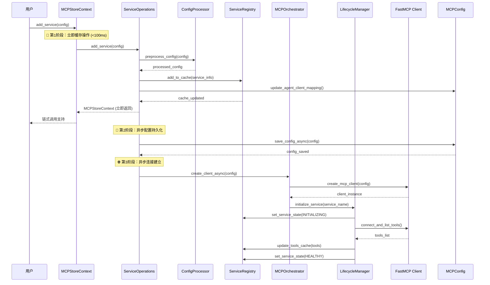

# add_service() - 服务注册

MCPStore 通过 `add_service()` 来注册服务，支持多种灵活的配置格式和使用场景。

## 🚀 缓存优先



### 三阶段详解

#### 🔄 第1阶段：立即缓存操作 (<100ms)
- 立即添加到 Registry 缓存
- 更新 Agent-Client 映射缓存
- 立即返回上下文实例（支持链式调用）
- **用户体验**: 无感知延迟，立即可用

#### 🔧 第2阶段：异步配置持久化
- 异步保存到配置文件
- 更新 mcp.json、agent_clients.json、client_services.json
- **数据一致性**: 确保配置持久化

#### 🌐 第3阶段：异步连接建立
- 异步创建 FastMCP 客户端
- 建立实际连接并获取工具列表
- 更新服务状态为 HEALTHY
- **功能完整性**: 服务完全可用


### 市场安装（from_market）

MCPStore 内置“市场”支持，允许用户仅凭服务名直接安装，无需手动拼装配置。

- 同步用法：
  ```python
  store.for_store().add_service(from_market="quickchart")
  ```

- 异步用法：
  ```python
  await store.for_store().add_service_async(
      from_market="firecrawl",
      market_env={"FIRECRAWL_API_KEY": "your_key"}  # 可选，透传给服务
  )
  ```

- 行为说明：
  - 自动从本地市场 JSON 查询服务定义，必要时可触发远程刷新
  - 自动转换为 FastMCP 兼容配置并走统一注册流程（缓存→持久化→生命周期初始化）
  - 支持与 `wait_service()` 搭配：
    ```python
    store.for_store().add_service(from_market="quickchart")
    store.for_store().wait_service("quickchart", status="healthy", timeout=20)
    ```

## 📋 方法签名和参数

### add_service()

```python
def add_service(
    self,
    config: Union[ServiceConfigUnion, List[str], None] = None,
    json_file: str = None,
    source: str = "manual",
    wait: Union[str, int, float] = "auto"
) -> MCPStoreContext
```

#### 参数说明

##### 1. `config` 参数
- **类型**: `Union[ServiceConfigUnion, List[str], None]`
- **作用**: 服务配置，支持多种格式
- **默认值**: `None`

##### 2. `json_file` 参数
- **类型**: `str`
- **作用**: JSON文件路径，如果指定则读取该文件作为配置
- **默认值**: `None`
- **优先级**: 如果同时指定`config`和`json_file`，优先使用`json_file`

##### 3. `source` 参数
- **类型**: `str`
- **作用**: 调用来源标识，用于日志追踪
- **默认值**: `"manual"`

##### 4. `wait` 参数
- **类型**: `Union[str, int, float]`
- **作用**: 等待连接完成的时间

## 🤖 Agent 模式支持

### 支持状态
- ✅ **完全支持** - `add_service()` 在 Agent 模式下完全可用，支持自动名称后缀

### Agent 模式调用
```python
# Agent 模式调用
store.for_agent("research_agent").add_service({
    "name": "weather-api",  # 原始服务名
    "url": "https://weather.example.com/mcp"
})

# 对比 Store 模式调用
store.for_store().add_service({
    "name": "weather-api",  # 全局服务名
    "url": "https://weather.example.com/mcp"
})
```

### 模式差异说明
- **Store 模式**: 服务注册为全局服务，使用原始名称
- **Agent 模式**: 服务注册为 Agent 专属服务，自动添加名称后缀
- **主要区别**: Agent 模式自动进行服务隔离，确保不同 Agent 之间的服务独立

### 自动名称后缀机制

#### Store 模式注册
```python
# Store 模式：服务名保持原样
store.for_store().add_service({
    "name": "weather-api",
    "url": "https://weather.example.com/mcp"
})
# 注册结果：服务名 = "weather-api"
# 客户端ID = "global_agent_store:weather-api"
```

#### Agent 模式注册
```python
# Agent 模式：自动添加后缀
store.for_agent("research_agent").add_service({
    "name": "weather-api",  # 用户提供的原始名称
    "url": "https://weather.example.com/mcp"
})
# 注册结果：服务名 = "weather-apibyresearch_agent"
# 客户端ID = "research_agent:weather-api"
# Agent 视图：仍然看到 "weather-api"
```

### 服务隔离效果

#### 多 Agent 注册相同服务
```python
# Agent1 注册天气服务
store.for_agent("agent1").add_service({
    "name": "weather-api",
    "url": "https://weather1.example.com/mcp"
})

# Agent2 注册天气服务（不冲突）
store.for_agent("agent2").add_service({
    "name": "weather-api",
    "url": "https://weather2.example.com/mcp"
})

# 实际注册结果：
# - 服务1：weather-apibyagent1 (agent1 专用)
# - 服务2：weather-apibyagent2 (agent2 专用)
# - 两个 Agent 都看到本地名称 "weather-api"
```

### 配置文件处理
```python
# Agent 模式支持所有配置格式
agent_context = store.for_agent("data_agent")

# 1. 字典配置
agent_context.add_service({
    "name": "database-api",
    "command": "python",
    "args": ["database_server.py"]
})

# 2. JSON 文件配置
agent_context.add_service(json_file="agent_services.json")

# 3. 批量配置
agent_context.add_service([
    {"name": "service1", "url": "https://api1.example.com"},
    {"name": "service2", "url": "https://api2.example.com"}
])
```

### 使用建议
- **Agent 开发**: 强烈推荐使用 Agent 模式，自动实现服务隔离
- **系统管理**: 使用 Store 模式注册全局共享服务
- **服务命名**: Agent 模式下使用简洁的原始服务名，系统自动处理后缀
- **配置管理**: Agent 模式支持所有配置格式，与 Store 模式完全兼容
- **默认值**: `"auto"`
- **选项**:
  - `"auto"`: 自动根据服务类型判断（远程2s，本地4s）
  - 数字: 等待时间（毫秒）

#### 返回值
- **类型**: `MCPStoreContext`
- **作用**: 当前上下文实例，支持链式调用

## 🎯 支持的配置格式

MCPStore 支持 **8种** 不同的配置格式，满足各种使用场景：

### 1. 单个服务配置（字典格式）

#### URL 方式（远程服务）
```python
# 基础 HTTP 服务
store.for_store().add_service({
    "name": "weather",
    "url": "https://weather-api.example.com/mcp"
})

# 带认证的 HTTP 服务
store.for_store().add_service({
    "name": "secure-api",
    "url": "https://secure-api.example.com/mcp",
    "transport": "streamable-http",
    "headers": {
        "Authorization": "Bearer YOUR_API_TOKEN",
        "User-Agent": "MCPStore/1.0"
    }
})

# SSE 传输方式
store.for_store().add_service({
    "name": "realtime-api",
    "url": "https://realtime.example.com/sse",
    "transport": "sse"
})
```

#### 本地命令方式
```python
# Python 服务
store.for_store().add_service({
    "name": "assistant",
    "command": "python",
    "args": ["./assistant_server.py"],
    "env": {"DEBUG": "true"}
})

# NPM 包服务
store.for_store().add_service({
    "name": "filesystem",
    "command": "npx",
    "args": ["-y", "@modelcontextprotocol/server-filesystem", "/workspace"],
    "working_dir": "/workspace"
})

# Shell 脚本服务
store.for_store().add_service({
    "name": "custom-tools",
    "command": "bash",
    "args": ["./start_tools.sh"],
    "env": {
        "TOOLS_CONFIG": "/etc/tools.conf",
        "LOG_LEVEL": "info"
    }
})
```

### 2. MCPConfig 字典方式

```python
# 标准 MCPConfig 格式
store.for_store().add_service({
    "mcpServers": {
        "weather": {
            "url": "https://weather-api.example.com/mcp",
            "transport": "streamable-http"
        },
        "maps": {
            "url": "https://maps-api.example.com/mcp",
            "transport": "sse"
        },
        "calculator": {
            "command": "python",
            "args": ["calculator_server.py"]
        }
    }
})
```

### 3. 服务名称列表方式

```python
# 从现有配置中选择服务
store.for_store().add_service(['weather', 'maps', 'assistant'])

# 单个服务名称
store.for_store().add_service(['weather'])
```

### 4. 批量服务列表方式

```python
# 服务配置列表
services = [
    {
        "name": "weather",
        "url": "https://weather.example.com/mcp"
    },
    {
        "name": "maps",
        "url": "https://maps.example.com/mcp"
    },
    {
        "name": "calculator",
        "command": "python",
        "args": ["calc_server.py"]
    }
]

store.for_store().add_service(services)
```

### 5. JSON 文件方式

#### 格式1: 标准 MCPConfig 格式
```json
{
  "mcpServers": {
    "weather": {
      "url": "https://weather.example.com/mcp",
      "transport": "streamable-http",
      "headers": {
        "Authorization": "Bearer YOUR_TOKEN"
      }
    },
    "filesystem": {
      "command": "npx",
      "args": ["-y", "@modelcontextprotocol/server-filesystem", "/workspace"]
    }
  }
}
```

#### 格式2: 服务列表格式
```json
[
  {
    "name": "weather",
    "url": "https://weather.example.com/mcp"
  },
  {
    "name": "maps",
    "url": "https://maps.example.com/mcp"
  }
]
```

#### 格式3: 单个服务格式
```json
{
  "name": "weather",
  "url": "https://weather.example.com/mcp",
  "transport": "streamable-http"
}
```

#### 使用 JSON 文件
```python
# 从 JSON 文件读取配置
store.for_store().add_service(json_file="config/services.json")

# 同时指定备用配置（优先使用 json_file）
store.for_store().add_service(
    config=backup_config,
    json_file="primary.json"
)
```

### 6. 无参数方式（仅 Store 级别）

```python
# 注册所有配置文件中的服务
store.for_store().add_service()
```

### 7. 混合配置方式

```python
# 字典 + 列表混合
mixed_config = {
    "mcpServers": {
        "weather": {"url": "https://weather.com/mcp"}
    },
    "service_names": ["existing_service1", "existing_service2"]
}

store.for_store().add_service(mixed_config)
```

### 8. 动态配置方式

```python
# 运行时动态构建配置
def create_dynamic_config(env: str):
    base_url = "https://api-dev.com" if env == "dev" else "https://api-prod.com"
    return {
        "name": f"{env}-api",
        "url": f"{base_url}/mcp",
        "headers": {"Environment": env}
    }

store.for_store().add_service(create_dynamic_config("production"))
```

## 🎭 使用场景对比

| 使用场景 | Store级别 (`global_agent_store`) | Agent级别 (独立Agent) |
|---------|-----------|-----------|
| **全局服务** | ✅ 所有Agent可访问 | ❌ 仅当前Agent可访问 |
| **服务隔离** | ❌ 全局共享 | ✅ 完全隔离 |
| **配置持久化** | ✅ 保存到mcp.json | ✅ 保存到agent配置 |
| **同名服务处理** | 完全替换（新Client ID） | 精确替换（保持Client ID） |
| **文件操作方式** | 只影响mcp.json → 自动同步 | 直接操作所有配置文件 |
| **agent_clients.json标识** | `global_agent_store` | 具体的agent_id |
| **适用场景** | 共享基础服务、全局工具 | 专属服务、隔离环境 |

## 🔧 智能配置处理

MCPStore 内置智能配置处理器，自动处理用户配置：

### 自动 Transport 推断

```python
# 自动推断为 streamable-http
store.for_store().add_service({
    "name": "api1",
    "url": "https://api.example.com/mcp"
})

# 自动推断为 sse
store.for_store().add_service({
    "name": "api2",
    "url": "https://api.example.com/sse"
})
```

### 配置验证和清理

```python
# 输入配置（包含非标准字段）
user_config = {
    "name": "weather",
    "url": "https://weather.com/mcp",
    "custom_field": "value",  # 非标准字段
    "description": "Weather API"  # 非标准字段
}

# MCPStore 自动清理，只保留 FastMCP 支持的字段
store.for_store().add_service(user_config)
```

### 错误友好处理

```python
# 配置错误时的友好提示
try:
    store.for_store().add_service({
        "name": "invalid",
        "url": "https://invalid.com",
        "command": "python"  # 冲突：同时指定 url 和 command
    })
except Exception as e:
    print(f"配置错误: {e}")
    # 输出: "配置错误: Cannot specify both url and command"
```

## 🚀 实际使用示例

### Store 级别服务注册

```python
from mcpstore import MCPStore

store = MCPStore.setup_store()

# 基础注册
store.for_store().add_service({
    "name": "weather",
    "url": "https://weather.example.com/mcp"
})

# 链式调用
(store.for_store()
 .add_service({"name": "weather", "url": "https://weather.example.com/mcp"})
 .add_service({"name": "maps", "url": "https://maps.example.com/mcp"}))

# 验证注册结果
services = store.for_store().list_services()
print(f"已注册 {len(services)} 个服务")
```

### Agent 级别服务注册

```python
# 为特定Agent注册服务
agent_context = store.for_agent("my_agent")
agent_context.add_service({
    "name": "agent_service",
    "url": "https://agent-api.example.com/mcp"
})

# Agent级别链式调用
(store.for_agent("my_agent")
 .add_service({"name": "service1", "url": "https://api1.example.com/mcp"})
 .add_service({"name": "service2", "url": "https://api2.example.com/mcp"}))

# 验证Agent服务
agent_services = store.for_agent("my_agent").list_services()
print(f"Agent 'my_agent' 有 {len(agent_services)} 个服务")
```

### 复杂配置示例

```python
# 企业级配置示例
enterprise_config = {
    "mcpServers": {
        "auth_service": {
            "url": "https://auth.company.com/mcp",
            "transport": "streamable-http",
            "headers": {
                "Authorization": "Bearer ${AUTH_TOKEN}",
                "X-Company-ID": "12345"
            }
        },
        "database_service": {
            "command": "python",
            "args": ["db_server.py", "--config", "/etc/db.conf"],
            "env": {
                "DB_HOST": "localhost",
                "DB_PORT": "5432",
                "LOG_LEVEL": "INFO"
            },
            "working_dir": "/opt/services"
        },
        "file_processor": {
            "command": "npx",
            "args": ["-y", "@company/file-processor", "/data"],
            "env": {
                "PROCESSOR_MODE": "production",
                "MAX_FILE_SIZE": "100MB"
            }
        }
    }
}

store.for_store().add_service(enterprise_config)
```

### JSON 文件批量导入

```python
# 创建服务配置文件
import json

services_config = {
    "mcpServers": {
        "weather": {
            "url": "https://weather.example.com/mcp",
            "headers": {"API-Key": "your-key"}
        },
        "maps": {
            "url": "https://maps.example.com/mcp"
        },
        "calculator": {
            "command": "python",
            "args": ["calculator.py"]
        }
    }
}

# 保存到文件
with open("services.json", "w") as f:
    json.dump(services_config, f, indent=2)

# 从文件导入
store.for_store().add_service(json_file="services.json")

print("批量导入完成")
```

## ⚡ 等待策略

MCPStore 提供灵活的等待策略，平衡响应速度和连接可靠性：

### 自动等待（推荐）

```python
# 自动根据服务类型判断等待时间
store.for_store().add_service({
    "name": "remote_api",
    "url": "https://api.example.com/mcp"
}, wait="auto")  # 远程服务等待2秒

store.for_store().add_service({
    "name": "local_service",
    "command": "python",
    "args": ["server.py"]
}, wait="auto")  # 本地服务等待4秒
```

### 自定义等待时间

```python
# 快速返回（不等待连接）
store.for_store().add_service(config, wait=0)

# 等待5秒
store.for_store().add_service(config, wait=5000)

# 长时间等待（适用于慢启动服务）
store.for_store().add_service(config, wait=10000)
```

### 等待状态检查

```python
# 添加服务后检查状态
store.for_store().add_service(config, wait=3000)

# 检查服务状态
service_info = store.for_store().get_service_info("service_name")
print(f"服务状态: {service_info.state}")

# 等待服务完全就绪
if service_info.state == "initializing":
    print("服务正在初始化...")
elif service_info.state == "healthy":
    print("服务已就绪")
```

## 🛡️ 错误处理

### 常见错误类型

```python
from mcpstore.core.exceptions import (
    ServiceNotFoundError,
    InvalidConfigError,
    ConnectionError
)

try:
    store.for_store().add_service({
        "name": "test_service",
        "url": "https://invalid-url.com/mcp"
    })
except InvalidConfigError as e:
    print(f"配置错误: {e}")
except ConnectionError as e:
    print(f"连接错误: {e}")
except Exception as e:
    print(f"未知错误: {e}")
```

### 配置验证

```python
# 预验证配置
def validate_service_config(config):
    """验证服务配置"""
    if not config.get("name"):
        raise ValueError("服务名称不能为空")

    if not config.get("url") and not config.get("command"):
        raise ValueError("必须指定 url 或 command")

    if config.get("url") and config.get("command"):
        raise ValueError("不能同时指定 url 和 command")

    return True

# 使用验证
config = {
    "name": "weather",
    "url": "https://weather.example.com/mcp"
}

try:
    validate_service_config(config)
    store.for_store().add_service(config)
    print("服务注册成功")
except ValueError as e:
    print(f"配置验证失败: {e}")
```

### 批量注册错误处理

```python
# 批量注册时的错误处理
services = [
    {"name": "valid1", "url": "https://api1.com/mcp"},
    {"name": "invalid", "url": "invalid-url"},  # 无效配置
    {"name": "valid2", "url": "https://api2.com/mcp"}
]

successful = []
failed = []

for service_config in services:
    try:
        store.for_store().add_service(service_config)
        successful.append(service_config["name"])
    except Exception as e:
        failed.append({
            "name": service_config["name"],
            "error": str(e)
        })

print(f"成功注册: {successful}")
print(f"注册失败: {failed}")
```

## 📚 最佳实践

### 1. 配置管理

```python
# ✅ 推荐：使用环境变量管理敏感信息
import os

config = {
    "name": "secure_api",
    "url": "https://api.example.com/mcp",
    "headers": {
        "Authorization": f"Bearer {os.getenv('API_TOKEN')}",
        "X-Client-ID": os.getenv('CLIENT_ID')
    }
}

store.for_store().add_service(config)
```

### 2. 服务命名规范

```python
# ✅ 推荐：使用描述性名称
store.for_store().add_service({
    "name": "weather_openweather_api",  # 清晰的服务标识
    "url": "https://api.openweathermap.org/mcp"
})

# ❌ 避免：模糊的名称
store.for_store().add_service({
    "name": "api1",  # 不清晰
    "url": "https://api.openweathermap.org/mcp"
})
```

### 3. 配置文件组织

```python
# ✅ 推荐：按环境组织配置
def load_config_by_environment(env: str):
    config_files = {
        "development": "config/dev-services.json",
        "staging": "config/staging-services.json",
        "production": "config/prod-services.json"
    }

    return config_files.get(env, config_files["development"])

# 使用
env = os.getenv("ENVIRONMENT", "development")
config_file = load_config_by_environment(env)
store.for_store().add_service(json_file=config_file)
```

### 4. 链式调用最佳实践

```python
# ✅ 推荐：逻辑分组的链式调用
(store.for_store()
 # 基础服务
 .add_service({"name": "auth", "url": "https://auth.com/mcp"})
 .add_service({"name": "user", "url": "https://user.com/mcp"})
 # 业务服务
 .add_service({"name": "order", "url": "https://order.com/mcp"})
 .add_service({"name": "payment", "url": "https://payment.com/mcp"}))

# ❌ 避免：过长的链式调用
# (store.for_store().add_service(...).add_service(...).add_service(...) # 太长
```

### 5. 服务健康检查

```python
# ✅ 推荐：注册后验证服务状态
def register_and_verify_service(store, config, max_retries=3):
    """注册服务并验证状态"""
    service_name = config["name"]

    # 注册服务
    store.for_store().add_service(config, wait=5000)

    # 验证服务状态
    for attempt in range(max_retries):
        service_info = store.for_store().get_service_info(service_name)

        if service_info.state == "healthy":
            print(f"✅ 服务 {service_name} 注册成功")
            return True
        elif service_info.state == "unreachable":
            print(f"❌ 服务 {service_name} 不可达")
            return False
        else:
            print(f"⏳ 服务 {service_name} 状态: {service_info.state}, 重试 {attempt + 1}/{max_retries}")
            time.sleep(2)

    print(f"⚠️ 服务 {service_name} 注册超时")
    return False

# 使用
config = {"name": "weather", "url": "https://weather.com/mcp"}
register_and_verify_service(store, config)
```

## 🔍 调试和监控

### 启用调试日志

```python
# 启用详细日志
store = MCPStore.setup_store(debug=True)

# 注册服务时查看详细日志
store.for_store().add_service({
    "name": "debug_service",
    "url": "https://api.example.com/mcp"
})
```

### 监控服务状态

```python
# 获取所有服务状态
services = store.for_store().list_services()
for service in services:
    print(f"服务: {service.name}, 状态: {service.state}")

# 获取特定服务详细信息
service_info = store.for_store().get_service_info("weather")
print(f"服务详情: {service_info}")

# 获取服务工具列表
tools = store.for_store().list_tools()
weather_tools = [tool for tool in tools if tool.service_name == "weather"]
print(f"Weather 服务工具: {[tool.name for tool in weather_tools]}")
```

## 🚨 注意事项

### 1. 服务名称唯一性
- 同一上下文中服务名称必须唯一
- Store 级别和 Agent 级别可以有同名服务（完全隔离）
- 重复注册同名服务会替换原有服务

### 2. 配置文件权限
- 确保配置文件有适当的读写权限
- 敏感信息使用环境变量而非硬编码
- 定期备份配置文件

### 3. 网络和防火墙
- 确保远程服务 URL 可访问
- 检查防火墙设置
- 考虑使用代理或 VPN

### 4. 资源管理
- 本地服务注意资源占用
- 及时清理不需要的服务
- 监控服务健康状态

## 📖 相关文档

- [服务列表查询](../listing/list-services.md) - 查看已注册的服务
- [服务管理](../management/service-management.md) - 管理服务生命周期
- [工具调用](../../tools/usage/call-tool.md) - 调用服务工具
- [配置文件管理](../../cli/configuration.md) - 配置文件操作
- [错误处理](../../advanced/error-handling.md) - 错误处理指南
- [最佳实践](../../advanced/best-practices.md) - 使用最佳实践

## 🎯 下一步

- 学习 [工具调用方法](../../tools/usage/call-tool.md)
- 了解 [服务状态监控](../management/service-management.md)
- 掌握 [链式调用技巧](../../advanced/chaining.md)
- 查看 [完整示例](../../examples/complete-examples.md)
```
```
