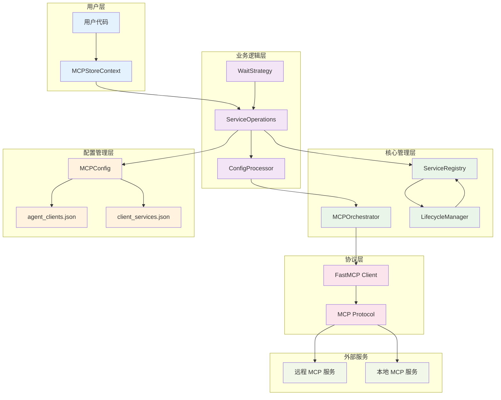
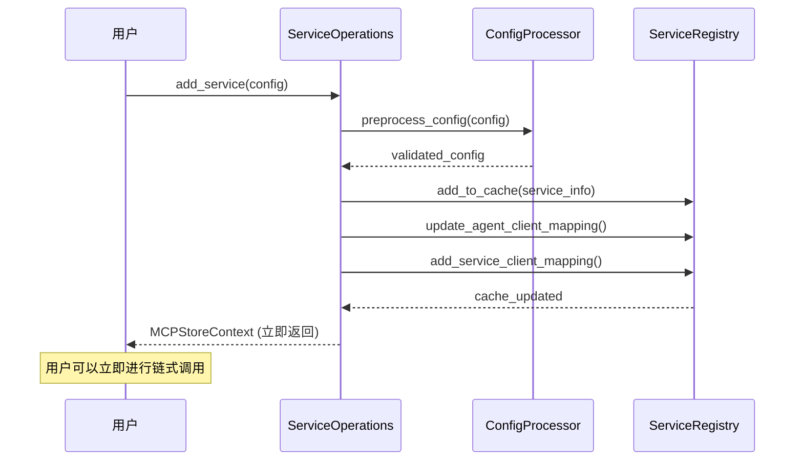
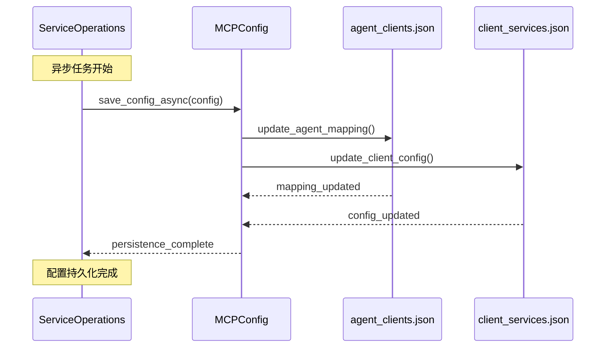
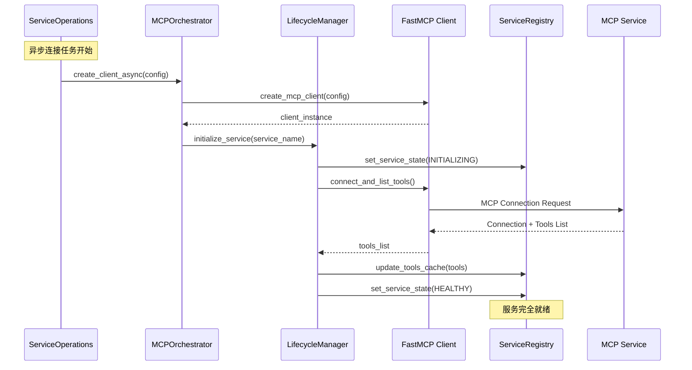
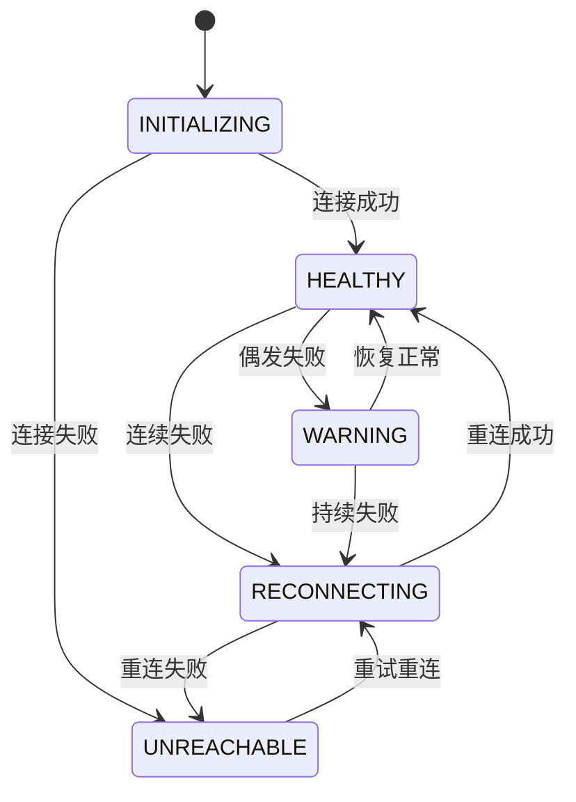
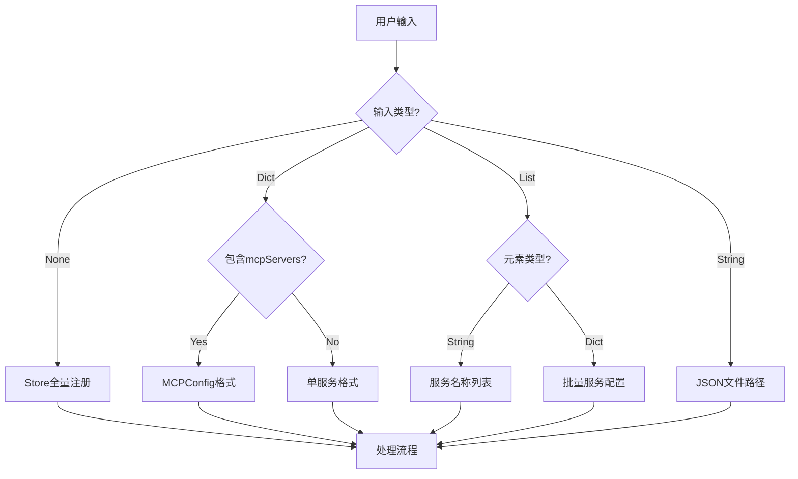
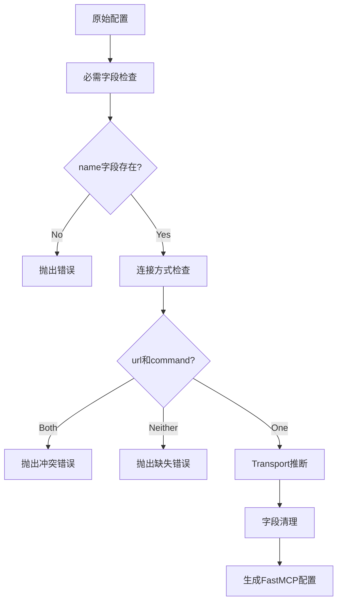
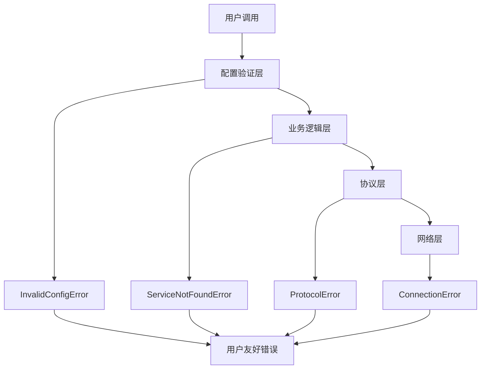

# 服务注册架构

本文档详细介绍 MCPStore 服务注册的内部架构和工作原理。

## 🏗️ 整体架构图



## 🔄 三阶段注册流程

### 阶段1: 立即缓存操作 (<100ms)



### 阶段2: 异步配置持久化



### 阶段3: 异步连接建立



## 🧩 核心组件详解

### ServiceOperations

**职责**: 服务操作的业务逻辑层
- 处理用户输入的各种配置格式
- 协调三阶段注册流程
- 管理等待策略
- 提供链式调用支持

**关键方法**:
- `add_service()` - 主要注册方法
- `_preprocess_service_config()` - 配置预处理
- `_add_service_cache_first()` - 缓存优先流程
- `_wait_for_services_ready()` - 等待服务就绪

### ConfigProcessor

**职责**: 配置格式转换和验证
- 将用户配置转换为 FastMCP 兼容格式
- 自动推断 transport 类型
- 验证配置完整性
- 清理非标准字段

**处理流程**:


### ServiceRegistry

**职责**: 服务状态和缓存管理
- 维护服务注册表
- 管理 Agent-Client 映射
- 缓存工具列表
- 跟踪服务状态

**数据结构**:
```python
{
    "sessions": {
        "agent_id": {
            "service_name": session_object
        }
    },
    "tool_cache": {
        "agent_id": {
            "tool_name": tool_definition
        }
    },
    "service_states": {
        "agent_id": {
            "service_name": ServiceConnectionState
        }
    }
}
```

### LifecycleManager

**职责**: 服务生命周期管理
- 管理服务状态转换
- 执行健康检查
- 处理重连逻辑
- 监控服务健康

**状态机**:


## 🔧 配置处理流程

### 输入格式识别



### 配置验证流程



## 📊 性能优化策略

### 缓存优先架构

**优势**:
- 用户操作响应时间 <100ms
- 支持立即链式调用
- 异步处理不阻塞用户

**实现**:
```python
async def _add_service_cache_first(self, config, agent_id, wait):
    # 第1阶段：立即缓存 (<100ms)
    cache_results = await self._add_to_cache_immediately(config)
    
    # 立即返回，支持链式调用
    context = self._return_context()
    
    # 第2阶段：异步持久化
    asyncio.create_task(self._persist_config_async(config))
    
    # 第3阶段：异步连接
    asyncio.create_task(self._connect_service_async(config))
    
    return context
```

### 并发处理

**批量注册优化**:
```python
# 并发处理多个服务
tasks = []
for service_config in services:
    task = asyncio.create_task(
        self._process_single_service(service_config)
    )
    tasks.append(task)

results = await asyncio.gather(*tasks, return_exceptions=True)
```

**连接等待优化**:
```python
# 并发等待多个服务就绪
async def wait_for_services(service_names, timeout):
    tasks = [
        wait_single_service(name, timeout) 
        for name in service_names
    ]
    return await asyncio.gather(*tasks)
```

## 🛡️ 错误处理机制

### 分层错误处理



### 错误恢复策略

**配置错误**:
- 提供详细的错误信息
- 建议正确的配置格式
- 支持配置验证预检

**连接错误**:
- 自动重试机制
- 智能退避策略
- 状态降级处理

**部分失败处理**:
- 批量操作中的部分成功
- 详细的失败报告
- 支持重试失败的服务

## 📈 监控和观测

### 关键指标

- **注册延迟**: 第1阶段响应时间
- **连接成功率**: 服务连接成功比例
- **状态转换**: 服务状态变化统计
- **错误率**: 各类错误的发生频率

### 日志记录

```python
# 结构化日志
logger.info("🔄 [ADD_SERVICE] 开始注册服务", extra={
    "source": source,
    "config_type": type(config).__name__,
    "context_type": self._context_type.name,
    "agent_id": agent_id
})
```

## 🔗 相关文档

- [add_service() 完整指南](add-service.md) - 详细使用文档
- [配置格式速查表](config-formats.md) - 配置格式参考
- [服务生命周期](../lifecycle/service-lifecycle.md) - 生命周期管理
- [错误处理指南](../../advanced/error-handling.md) - 错误处理最佳实践

## 🎯 下一步

- 深入了解 [服务生命周期管理](../lifecycle/service-lifecycle.md)
- 学习 [监控和调试](../../advanced/monitoring.md)
- 掌握 [性能优化](../../advanced/performance.md)
