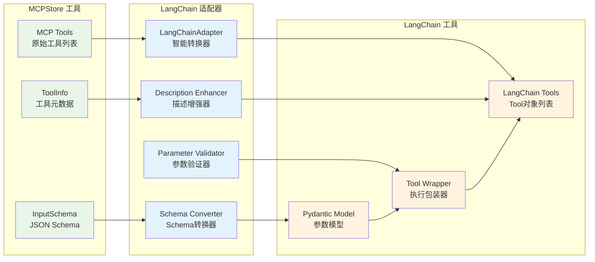

# for_langchain().list_tools()

将 MCPStore 工具转换为 LangChain Tool 对象，实现无缝集成。

## 语法

```python
store.for_store().for_langchain().list_tools() -> List[Tool]
store.for_agent(agent_id).for_langchain().list_tools() -> List[Tool]
```

## 参数

无参数

## 返回值

- **类型**: `List[Tool]`
- **说明**: LangChain Tool 对象列表，可直接用于 LangChain Agent

## LangChainAdapter 核心特性



### 🧠 **智能转换**
- 自动将 MCP 工具转换为 LangChain Tool 对象
- 智能参数 schema 转换和验证
- 增强工具描述，指导 LLM 正确使用参数

### 🛡️ **前端防护**
- 参数验证和类型转换
- 错误处理和异常捕获
- 调用结果格式化

### ⚡ **性能优化**
- 支持同步和异步调用
- 智能缓存机制
- 批量转换优化

## 使用示例

### 基本 LangChain 集成

```python
from mcpstore import MCPStore
from langchain_openai import ChatOpenAI
from langchain.agents import AgentExecutor, create_openai_tools_agent
from langchain_core.prompts import ChatPromptTemplate, MessagesPlaceholder

# 1. 初始化Store并获取LangChain工具（链式调用）
store = MCPStore.setup_store()
tools = (store.for_store()
         .add_service({"name": "高德", "url": "https://mcp.amap.com/sse?key=YOUR_KEY"})
         .for_langchain()
         .list_tools())

# 2. 创建LLM和Agent
llm = ChatOpenAI(model="gpt-3.5-turbo", temperature=0)

prompt = ChatPromptTemplate.from_messages([
    ("system", "你是一个有用的助手，可以使用提供的工具来帮助用户。"),
    ("user", "{input}"),
    MessagesPlaceholder(variable_name="agent_scratchpad"),
])

agent = create_openai_tools_agent(llm, tools, prompt)
agent_executor = AgentExecutor(agent=agent, tools=tools, verbose=True)

# 3. 使用Agent
response = agent_executor.invoke({"input": "北京今天的天气怎么样？"})
print(response["output"])
```

### Store 级别 LangChain 工具

```python
from mcpstore import MCPStore

store = MCPStore.setup_store()

# Store 级别获取所有 LangChain 工具
langchain_tools = store.for_store().for_langchain().list_tools()

print(f"🏪 Store 级别 LangChain 工具:")
print(f"总计: {len(langchain_tools)} 个工具")

for tool in langchain_tools:
    print(f"🛠️ {tool.name}")
    print(f"   描述: {tool.description}")
    print(f"   参数: {tool.args_schema.__fields__.keys() if hasattr(tool, 'args_schema') else '无'}")
    print()
```

### Agent 级别 LangChain 工具

```python
from mcpstore import MCPStore

store = MCPStore.setup_store()

agent_id = "navigation_agent"

# 为特定Agent添加专属服务
store.for_agent(agent_id).add_service({
    "name": "专属地图服务",
    "url": "https://maps.example.com/mcp"
})

# 获取Agent专属的LangChain工具
agent_tools = store.for_agent(agent_id).for_langchain().list_tools()

print(f"🤖 Agent {agent_id} 专属工具:")
for tool in agent_tools:
    print(f"- {tool.name}: {tool.description}")
```

## 异步版本

```python
import asyncio
from mcpstore import MCPStore

async def langchain_async_example():
    store = MCPStore.setup_store()

    # 异步获取 LangChain 工具
    tools = await store.for_store().for_langchain().list_tools_async()

    print(f"📊 异步获取 LangChain 工具:")
    print(f"工具数量: {len(tools)}")

    for tool in tools:
        print(f"🛠️ {tool.name}: {tool.description}")

# 运行异步示例
asyncio.run(langchain_async_example())
```

## 混合工具使用（MCP + 自定义）

```python
from mcpstore import MCPStore
from langchain_core.tools import tool
from datetime import date

# 自定义 LangChain 工具
@tool
def get_current_date() -> str:
    """返回今天的日期"""
    return date.today().isoformat()

# 获取MCP工具
store = MCPStore.setup_store()
store.for_store().add_service()  # 注册所有配置的服务
mcp_tools = store.for_store().for_langchain().list_tools()

# 合并工具
all_tools = mcp_tools + [get_current_date]

print(f"🔧 工具总数: {len(all_tools)}")
print(f"  MCP工具: {len(mcp_tools)} 个")
print(f"  自定义工具: {len(all_tools) - len(mcp_tools)} 个")
```

## 注意事项

1. **自动转换**: MCPStore 工具会自动转换为 LangChain Tool 格式
2. **描述增强**: 工具描述会自动添加参数说明，帮助 LLM 理解
3. **Schema 转换**: inputSchema 会转换为 Pydantic 模型
4. **Agent 隔离**: Agent 模式下只转换该 Agent 可访问的工具

## 相关方法

- [list_tools()](../listing/list-tools.md) - 获取原始工具列表
- [call_tool()](../usage/call-tool.md) - 直接调用工具
- [add_service()](../../services/registration/register-service.md) - 注册服务

## 下一步

- 了解 [LangChain 集成示例](examples.md)
- 学习 [工具直接调用](../usage/call-tool.md)
- 查看 [服务注册方法](../../services/registration/register-service.md)
```
