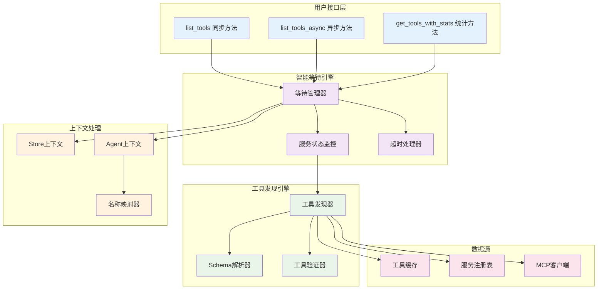

# 工具列表查询概览

MCPStore 提供强大的工具列表查询功能，支持 **Store/Agent 双模式**、**智能等待机制**和**详细的工具信息**，让工具发现和管理变得简单高效。

## 🎯 核心功能架构



## 📊 方法功能对比

| 方法 | 返回类型 | 功能 | 性能 | 使用场景 |
|------|----------|------|------|----------|
| **list_tools()** | `List[ToolInfo]` | 获取工具列表 | 0.001s | 基础工具查询 |
| **list_tools_async()** | `List[ToolInfo]` | 异步获取工具列表 | 0.001s | 异步环境 |
| **get_tools_with_stats()** | `Dict[str, Any]` | 获取工具和统计信息 | 0.002s | 详细分析 |

## 🎭 双模式工具发现

### 🏪 Store 模式特点

```python
# Store 模式工具列表
tools = store.for_store().list_tools()
```

**特点**:
- ✅ 返回所有全局工具
- ✅ 包含带后缀的 Agent 服务工具
- ✅ 显示完整的工具名称和服务名称
- ✅ 跨服务的工具发现

**工具信息示例**:
```python
[
    ToolInfo(
        name="weather_get_current",
        service_name="weather-api",
        client_id="global_agent_store:weather-api"
    ),
    ToolInfo(
        name="maps_search_locationbyagent1",
        service_name="maps-apibyagent1",
        client_id="agent1:maps-api"
    )
]
```

### 🤖 Agent 模式特点

```python
# Agent 模式工具列表
tools = store.for_agent(agent_id).list_tools()
```

**特点**:
- ✅ 只返回当前 Agent 的工具
- ✅ 自动转换为本地名称
- ✅ 完全隔离的工具视图
- ✅ 透明的名称映射

**工具信息示例**:
```python
[
    ToolInfo(
        name="weather_get_current",
        service_name="weather-api",  # 本地名称
        client_id="agent1:weather-api"
    ),
    ToolInfo(
        name="maps_search_location",
        service_name="maps-api",     # 本地名称
        client_id="agent1:maps-api"
    )
]
```

## 🔧 智能等待机制

MCPStore 实现了智能等待机制，确保工具列表的完整性：

### 等待策略

```mermaid
graph TB
    subgraph "等待决策"
        CheckServices[检查服务状态]
        HasInitializing{有初始化中的服务?}
        SkipWait[跳过等待]
        StartWait[开始等待]
    end
    
    subgraph "等待执行"
        RemoteWait[远程服务等待<br/>最多1.5秒]
        LocalWait[本地服务等待<br/>最多5秒]
        StatusCheck[状态检查循环]
    end
    
    subgraph "等待结束"
        AllReady[所有服务就绪]
        Timeout[等待超时]
        ReturnTools[返回工具列表]
    end
    
    CheckServices --> HasInitializing
    HasInitializing -->|否| SkipWait
    HasInitializing -->|是| StartWait
    
    StartWait --> RemoteWait
    StartWait --> LocalWait
    
    RemoteWait --> StatusCheck
    LocalWait --> StatusCheck
    
    StatusCheck --> AllReady
    StatusCheck --> Timeout
    
    AllReady --> ReturnTools
    Timeout --> ReturnTools
    SkipWait --> ReturnTools
    
    %% 样式
    classDef decision fill:#e3f2fd
    classDef wait fill:#f3e5f5
    classDef end fill:#e8f5e8
    
    class CheckServices,HasInitializing,SkipWait,StartWait decision
    class RemoteWait,LocalWait,StatusCheck wait
    class AllReady,Timeout,ReturnTools end
```

### 等待参数

- **远程服务**: 最多等待 1.5 秒
- **本地服务**: 最多等待 5 秒
- **检查间隔**: 每 0.1 秒检查一次
- **快速路径**: 无 INITIALIZING 服务时跳过等待

## 🚀 使用示例

### 基础工具列表查询

```python
from mcpstore import MCPStore

def basic_tool_listing():
    """基础工具列表查询"""
    store = MCPStore.setup_store()
    
    # 获取工具列表
    tools = store.for_store().list_tools()
    
    print(f"📋 发现 {len(tools)} 个工具:")
    for tool in tools:
        print(f"  🔧 {tool.name}")
        print(f"     服务: {tool.service_name}")
        print(f"     描述: {tool.description}")
        
        # 显示参数信息
        if tool.inputSchema and "properties" in tool.inputSchema:
            params = list(tool.inputSchema["properties"].keys())
            print(f"     参数: {params}")
        print()

# 使用
basic_tool_listing()
```

### 带统计信息的工具查询

```python
def tools_with_statistics():
    """带统计信息的工具查询"""
    store = MCPStore.setup_store()
    
    # 获取工具和统计信息
    result = store.for_store().get_tools_with_stats()
    
    tools = result["tools"]
    metadata = result["metadata"]
    
    print("📊 工具统计信息:")
    print(f"  总工具数: {metadata['total_tools']}")
    print(f"  服务数: {metadata['services_count']}")
    print(f"  平均每服务工具数: {metadata['total_tools'] / metadata['services_count']:.1f}")
    print()
    
    # 按服务分组统计
    service_stats = {}
    for tool in tools:
        service = tool.service_name
        if service not in service_stats:
            service_stats[service] = 0
        service_stats[service] += 1
    
    print("📈 服务工具分布:")
    for service, count in sorted(service_stats.items()):
        percentage = count / metadata['total_tools'] * 100
        print(f"  {service}: {count} ({percentage:.1f}%)")

# 使用
tools_with_statistics()
```

### Agent 工具隔离验证

```python
def verify_agent_tool_isolation():
    """验证 Agent 工具隔离"""
    store = MCPStore.setup_store()
    
    # Store 级别工具
    store_tools = store.for_store().list_tools()
    
    # 多个 Agent 的工具
    agent_ids = ["agent1", "agent2", "agent3"]
    
    print("🔍 Agent 工具隔离验证")
    print("=" * 50)
    
    print(f"🏪 Store 级别: {len(store_tools)} 个工具")
    for tool in store_tools[:3]:  # 显示前3个
        print(f"  - {tool.name} ({tool.service_name})")
    
    for agent_id in agent_ids:
        agent_tools = store.for_agent(agent_id).list_tools()
        print(f"\n🤖 Agent {agent_id}: {len(agent_tools)} 个工具")
        for tool in agent_tools[:2]:  # 显示前2个
            print(f"  - {tool.name} ({tool.service_name})")
            print(f"    实际ID: {tool.client_id}")
    
    # 分析隔离效果
    print(f"\n📊 隔离分析:")
    for agent_id in agent_ids:
        agent_tools = store.for_agent(agent_id).list_tools()
        agent_names = {t.name for t in agent_tools}
        store_names = {t.name for t in store_tools}
        
        overlap = len(agent_names & store_names)
        print(f"  Agent {agent_id} 与 Store 重叠工具: {overlap} 个")

# 使用
verify_agent_tool_isolation()
```

### 异步工具发现

```python
import asyncio

async def async_tool_discovery():
    """异步工具发现"""
    store = MCPStore.setup_store()
    
    # 异步获取工具列表
    tools = await store.for_store().list_tools_async()
    
    print(f"🔄 异步发现 {len(tools)} 个工具")
    
    # 并发获取多个 Agent 的工具
    agent_ids = ["agent1", "agent2", "agent3"]
    
    tasks = [
        store.for_agent(agent_id).list_tools_async()
        for agent_id in agent_ids
    ]
    
    agent_tools_list = await asyncio.gather(*tasks)
    
    print("\n🤖 Agent 工具发现结果:")
    for i, agent_tools in enumerate(agent_tools_list):
        agent_id = agent_ids[i]
        print(f"  Agent {agent_id}: {len(agent_tools)} 个工具")
        
        # 显示工具类型分布
        tool_types = {}
        for tool in agent_tools:
            service = tool.service_name
            tool_types[service] = tool_types.get(service, 0) + 1
        
        for service, count in tool_types.items():
            print(f"    {service}: {count} 个")

# 使用
# asyncio.run(async_tool_discovery())
```

### 工具搜索和筛选

```python
def tool_search_and_filter():
    """工具搜索和筛选"""
    store = MCPStore.setup_store()
    
    tools = store.for_store().list_tools()
    
    def search_tools(keyword):
        """搜索工具"""
        results = []
        for tool in tools:
            if (keyword.lower() in tool.name.lower() or
                keyword.lower() in tool.description.lower() or
                keyword.lower() in tool.service_name.lower()):
                results.append(tool)
        return results
    
    def filter_by_service(service_name):
        """按服务筛选"""
        return [t for t in tools if t.service_name == service_name]
    
    def filter_by_complexity():
        """按复杂度筛选"""
        simple_tools = []
        complex_tools = []
        
        for tool in tools:
            if tool.inputSchema and "properties" in tool.inputSchema:
                param_count = len(tool.inputSchema["properties"])
                if param_count <= 2:
                    simple_tools.append(tool)
                else:
                    complex_tools.append(tool)
            else:
                simple_tools.append(tool)
        
        return simple_tools, complex_tools
    
    # 搜索示例
    print("🔍 搜索包含 'weather' 的工具:")
    weather_tools = search_tools("weather")
    for tool in weather_tools:
        print(f"  - {tool.name} ({tool.service_name})")
    
    # 筛选示例
    print(f"\n🔍 按复杂度筛选:")
    simple, complex = filter_by_complexity()
    print(f"  简单工具 (≤2参数): {len(simple)} 个")
    print(f"  复杂工具 (>2参数): {len(complex)} 个")
    
    # 显示复杂工具
    for tool in complex[:3]:  # 显示前3个复杂工具
        param_count = len(tool.inputSchema.get("properties", {}))
        print(f"    - {tool.name}: {param_count} 个参数")

# 使用
tool_search_and_filter()
```

### 工具详细分析

```python
def detailed_tool_analysis():
    """工具详细分析"""
    store = MCPStore.setup_store()
    
    tools = store.for_store().list_tools()
    
    # 分析工具特征
    analysis = {
        "total_tools": len(tools),
        "services": set(),
        "parameter_stats": {
            "no_params": 0,
            "simple": 0,      # 1-2 参数
            "moderate": 0,    # 3-5 参数
            "complex": 0      # >5 参数
        },
        "schema_types": {},
        "required_params": []
    }
    
    for tool in tools:
        # 服务统计
        analysis["services"].add(tool.service_name)
        
        # 参数统计
        if not tool.inputSchema or "properties" not in tool.inputSchema:
            analysis["parameter_stats"]["no_params"] += 1
        else:
            param_count = len(tool.inputSchema["properties"])
            if param_count <= 2:
                analysis["parameter_stats"]["simple"] += 1
            elif param_count <= 5:
                analysis["parameter_stats"]["moderate"] += 1
            else:
                analysis["parameter_stats"]["complex"] += 1
            
            # 分析参数类型
            for param_name, param_info in tool.inputSchema["properties"].items():
                param_type = param_info.get("type", "unknown")
                analysis["schema_types"][param_type] = analysis["schema_types"].get(param_type, 0) + 1
            
            # 必需参数统计
            required = tool.inputSchema.get("required", [])
            analysis["required_params"].extend(required)
    
    # 输出分析结果
    print("📊 工具详细分析报告")
    print("=" * 40)
    print(f"总工具数: {analysis['total_tools']}")
    print(f"服务数: {len(analysis['services'])}")
    print(f"平均每服务工具数: {analysis['total_tools'] / len(analysis['services']):.1f}")
    print()
    
    print("参数复杂度分布:")
    for category, count in analysis["parameter_stats"].items():
        percentage = count / analysis['total_tools'] * 100
        print(f"  {category}: {count} ({percentage:.1f}%)")
    print()
    
    print("参数类型分布:")
    for param_type, count in sorted(analysis["schema_types"].items()):
        print(f"  {param_type}: {count} 次")
    print()
    
    # 最常用的必需参数
    from collections import Counter
    common_required = Counter(analysis["required_params"]).most_common(5)
    print("最常用的必需参数:")
    for param, count in common_required:
        print(f"  {param}: {count} 次")

# 使用
detailed_tool_analysis()
```

## 📊 API 响应格式

### 基础工具列表响应

```json
{
  "success": true,
  "data": [
    {
      "name": "weather_get_current",
      "description": "获取当前天气信息",
      "service_name": "weather-api",
      "client_id": "global_agent_store:weather-api",
      "inputSchema": {
        "type": "object",
        "properties": {
          "location": {
            "type": "string",
            "description": "城市名称"
          }
        },
        "required": ["location"]
      }
    }
  ],
  "metadata": {
    "total_tools": 1,
    "services_count": 1
  },
  "message": "Retrieved 1 tools from 1 services"
}
```

### 带统计信息的响应

```json
{
  "success": true,
  "data": {
    "tools": [...],
    "metadata": {
      "total_tools": 15,
      "services_count": 3,
      "avg_tools_per_service": 5.0,
      "parameter_distribution": {
        "no_params": 2,
        "simple": 8,
        "moderate": 4,
        "complex": 1
      },
      "service_distribution": {
        "weather-api": 5,
        "maps-api": 7,
        "calculator-api": 3
      }
    }
  },
  "message": "Retrieved tools with detailed statistics"
}
```

## 🎯 性能特点

- **平均耗时**: 0.001秒（缓存命中）
- **智能等待**: 自动等待服务初始化完成
- **缓存机制**: 内存缓存，实时更新
- **并发支持**: 支持异步并发查询
- **数据一致性**: 实时反映工具状态

## 🔗 相关文档

- [list_tools() 详细文档](list-tools.md) - 工具列表查询方法
- [工具使用概览](../usage/tool-usage-overview.md) - 工具使用概览
- [call_tool() 详细文档](../usage/call-tool.md) - 工具调用方法
- [服务列表概览](../../services/listing/service-listing-overview.md) - 服务列表概览

## 🎯 下一步

- 深入学习 [list_tools() 方法](list-tools.md)
- 了解 [工具使用概览](../usage/tool-usage-overview.md)
- 掌握 [工具调用方法](../usage/call-tool.md)
- 查看 [服务管理操作](../../services/management/service-management.md)
