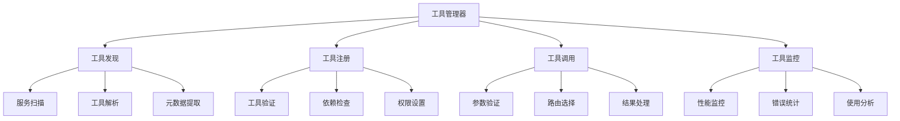

# 工具管理系统

## 📋 概述

MCPStore 的工具管理系统提供了完整的工具生命周期管理功能，包括工具发现、注册、调用、监控和维护。通过统一的工具管理接口，用户可以轻松管理来自不同 MCP 服务的工具。

## 🏗️ 工具管理架构



## 🔧 工具发现机制

### 自动工具发现

```python
from mcpstore import MCPStore

class ToolDiscovery:
    """工具发现器"""
    
    def __init__(self, store):
        self.store = store
        self.discovered_tools = {}
        self.discovery_cache = {}
    
    def discover_all_tools(self, force_refresh=False):
        """发现所有服务的工具"""
        all_tools = {}
        services = self.store.list_services()
        
        for service in services:
            service_name = service['name']
            
            try:
                # 检查缓存
                if not force_refresh and service_name in self.discovery_cache:
                    tools = self.discovery_cache[service_name]
                else:
                    tools = self._discover_service_tools(service_name)
                    self.discovery_cache[service_name] = tools
                
                all_tools[service_name] = tools
                print(f"✅ 发现服务 {service_name} 的 {len(tools)} 个工具")
                
            except Exception as e:
                print(f"❌ 发现服务 {service_name} 工具失败: {e}")
                all_tools[service_name] = []
        
        self.discovered_tools = all_tools
        return all_tools
    
    def _discover_service_tools(self, service_name):
        """发现单个服务的工具"""
        try:
            # 获取服务工具列表
            tools = self.store.list_tools(service_name=service_name)
            
            # 获取每个工具的详细信息
            detailed_tools = []
            for tool in tools:
                try:
                    tool_info = self.store.get_tool_info(
                        tool['name'], 
                        service_name=service_name
                    )
                    detailed_tools.append(tool_info)
                except Exception as e:
                    print(f"⚠️ 获取工具 {tool['name']} 详情失败: {e}")
            
            return detailed_tools
            
        except Exception as e:
            print(f"❌ 发现服务 {service_name} 工具时发生错误: {e}")
            return []
    
    def search_tools(self, query, category=None, service_name=None):
        """搜索工具"""
        results = []
        
        for svc_name, tools in self.discovered_tools.items():
            # 服务名称过滤
            if service_name and svc_name != service_name:
                continue
            
            for tool in tools:
                # 类别过滤
                if category and tool.get('category') != category:
                    continue
                
                # 关键词搜索
                if self._match_tool(tool, query):
                    results.append({
                        **tool,
                        'service_name': svc_name
                    })
        
        return results
    
    def _match_tool(self, tool, query):
        """匹配工具"""
        query_lower = query.lower()
        
        # 搜索工具名称
        if query_lower in tool.get('name', '').lower():
            return True
        
        # 搜索工具描述
        if query_lower in tool.get('description', '').lower():
            return True
        
        # 搜索工具标签
        tags = tool.get('tags', [])
        for tag in tags:
            if query_lower in tag.lower():
                return True
        
        return False
    
    def get_tool_statistics(self):
        """获取工具统计信息"""
        stats = {
            'total_tools': 0,
            'tools_by_service': {},
            'tools_by_category': {},
            'tools_by_tags': {}
        }
        
        for service_name, tools in self.discovered_tools.items():
            tool_count = len(tools)
            stats['total_tools'] += tool_count
            stats['tools_by_service'][service_name] = tool_count
            
            for tool in tools:
                # 按类别统计
                category = tool.get('category', 'uncategorized')
                stats['tools_by_category'][category] = stats['tools_by_category'].get(category, 0) + 1
                
                # 按标签统计
                tags = tool.get('tags', [])
                for tag in tags:
                    stats['tools_by_tags'][tag] = stats['tools_by_tags'].get(tag, 0) + 1
        
        return stats

# 使用工具发现
store = MCPStore()

# 添加一些服务
store.add_service({
    "mcpServers": {
        "filesystem": {
            "command": "npx",
            "args": ["-y", "@modelcontextprotocol/server-filesystem", "/tmp"]
        }
    }
})

# 发现工具
discovery = ToolDiscovery(store)
all_tools = discovery.discover_all_tools()

# 搜索工具
file_tools = discovery.search_tools("file", service_name="filesystem")
print(f"🔍 找到 {len(file_tools)} 个文件相关工具")

# 获取统计信息
stats = discovery.get_tool_statistics()
print(f"📊 工具统计: 总计 {stats['total_tools']} 个工具")
```

### 工具分类管理

```python
class ToolCategorizer:
    """工具分类器"""
    
    def __init__(self):
        self.categories = {
            'file_operations': {
                'name': '文件操作',
                'description': '文件和目录相关操作',
                'keywords': ['file', 'directory', 'read', 'write', 'delete', 'copy', 'move']
            },
            'web_operations': {
                'name': 'Web操作',
                'description': 'Web搜索和网络相关操作',
                'keywords': ['web', 'search', 'http', 'url', 'download', 'api']
            },
            'data_processing': {
                'name': '数据处理',
                'description': '数据转换和处理操作',
                'keywords': ['convert', 'transform', 'parse', 'format', 'encode', 'decode']
            },
            'system_operations': {
                'name': '系统操作',
                'description': '系统管理和监控操作',
                'keywords': ['system', 'process', 'monitor', 'status', 'info', 'stats']
            },
            'database_operations': {
                'name': '数据库操作',
                'description': '数据库查询和管理操作',
                'keywords': ['database', 'query', 'select', 'insert', 'update', 'delete', 'sql']
            }
        }
    
    def categorize_tool(self, tool):
        """为工具分类"""
        tool_name = tool.get('name', '').lower()
        tool_desc = tool.get('description', '').lower()
        tool_text = f"{tool_name} {tool_desc}"
        
        # 计算每个类别的匹配分数
        category_scores = {}
        for category_id, category_info in self.categories.items():
            score = 0
            for keyword in category_info['keywords']:
                if keyword in tool_text:
                    score += 1
            
            if score > 0:
                category_scores[category_id] = score
        
        # 返回最高分的类别
        if category_scores:
            best_category = max(category_scores, key=category_scores.get)
            return best_category
        
        return 'uncategorized'
    
    def categorize_tools(self, tools):
        """批量分类工具"""
        categorized = {}
        
        for tool in tools:
            category = self.categorize_tool(tool)
            
            if category not in categorized:
                categorized[category] = []
            
            categorized[category].append({
                **tool,
                'category': category
            })
        
        return categorized
    
    def get_category_info(self, category_id):
        """获取类别信息"""
        return self.categories.get(category_id, {
            'name': '未分类',
            'description': '未能自动分类的工具'
        })

# 使用工具分类
categorizer = ToolCategorizer()

# 对发现的工具进行分类
for service_name, tools in all_tools.items():
    categorized_tools = categorizer.categorize_tools(tools)
    
    print(f"\n🏷️ 服务 {service_name} 的工具分类:")
    for category_id, category_tools in categorized_tools.items():
        category_info = categorizer.get_category_info(category_id)
        print(f"   {category_info['name']}: {len(category_tools)} 个工具")
```

## 🔧 工具调用管理

### 智能工具路由

```python
class ToolRouter:
    """工具路由器"""
    
    def __init__(self, store):
        self.store = store
        self.routing_rules = {}
        self.load_balancer = LoadBalancer()
        self.circuit_breaker = CircuitBreaker()
    
    def add_routing_rule(self, tool_pattern, service_priority):
        """添加路由规则"""
        self.routing_rules[tool_pattern] = service_priority
    
    def route_tool_call(self, tool_name, arguments):
        """路由工具调用"""
        # 1. 查找可用的服务
        available_services = self._find_available_services(tool_name)
        
        if not available_services:
            raise Exception(f"没有找到提供工具 {tool_name} 的服务")
        
        # 2. 应用路由规则
        prioritized_services = self._apply_routing_rules(tool_name, available_services)
        
        # 3. 负载均衡选择
        selected_service = self.load_balancer.select_service(prioritized_services)
        
        # 4. 熔断检查
        if self.circuit_breaker.is_open(selected_service):
            # 尝试备用服务
            for backup_service in prioritized_services[1:]:
                if not self.circuit_breaker.is_open(backup_service):
                    selected_service = backup_service
                    break
            else:
                raise Exception(f"所有服务都不可用")
        
        # 5. 执行调用
        try:
            result = self.store.call_tool(
                f"{selected_service}_{tool_name}",
                arguments
            )
            
            # 记录成功
            self.circuit_breaker.record_success(selected_service)
            self.load_balancer.record_success(selected_service)
            
            return result
            
        except Exception as e:
            # 记录失败
            self.circuit_breaker.record_failure(selected_service)
            self.load_balancer.record_failure(selected_service)
            raise e
    
    def _find_available_services(self, tool_name):
        """查找提供指定工具的服务"""
        available_services = []
        
        for service in self.store.list_services():
            service_name = service['name']
            
            try:
                tools = self.store.list_tools(service_name=service_name)
                tool_names = [tool['name'] for tool in tools]
                
                if tool_name in tool_names:
                    available_services.append(service_name)
                    
            except Exception as e:
                print(f"⚠️ 检查服务 {service_name} 工具时失败: {e}")
        
        return available_services
    
    def _apply_routing_rules(self, tool_name, services):
        """应用路由规则"""
        # 检查是否有匹配的路由规则
        for pattern, priority in self.routing_rules.items():
            if pattern in tool_name or tool_name in pattern:
                # 按优先级排序服务
                prioritized = []
                for service in priority:
                    if service in services:
                        prioritized.append(service)
                
                # 添加未在优先级中的服务
                for service in services:
                    if service not in prioritized:
                        prioritized.append(service)
                
                return prioritized
        
        # 没有匹配的规则，返回原始列表
        return services

class LoadBalancer:
    """负载均衡器"""
    
    def __init__(self, strategy='round_robin'):
        self.strategy = strategy
        self.counters = {}
        self.weights = {}
        self.response_times = {}
    
    def select_service(self, services):
        """选择服务"""
        if not services:
            return None
        
        if len(services) == 1:
            return services[0]
        
        if self.strategy == 'round_robin':
            return self._round_robin_select(services)
        elif self.strategy == 'weighted':
            return self._weighted_select(services)
        elif self.strategy == 'least_response_time':
            return self._least_response_time_select(services)
        else:
            return services[0]
    
    def _round_robin_select(self, services):
        """轮询选择"""
        key = ','.join(sorted(services))
        counter = self.counters.get(key, 0)
        selected = services[counter % len(services)]
        self.counters[key] = counter + 1
        return selected
    
    def _weighted_select(self, services):
        """加权选择"""
        # 根据权重选择（权重越高，被选中概率越大）
        import random
        
        total_weight = sum(self.weights.get(s, 1) for s in services)
        random_value = random.uniform(0, total_weight)
        
        current_weight = 0
        for service in services:
            current_weight += self.weights.get(service, 1)
            if random_value <= current_weight:
                return service
        
        return services[0]
    
    def _least_response_time_select(self, services):
        """最少响应时间选择"""
        best_service = services[0]
        best_time = self.response_times.get(best_service, float('inf'))
        
        for service in services[1:]:
            response_time = self.response_times.get(service, float('inf'))
            if response_time < best_time:
                best_service = service
                best_time = response_time
        
        return best_service
    
    def record_success(self, service):
        """记录成功"""
        # 增加权重
        self.weights[service] = self.weights.get(service, 1) + 0.1
    
    def record_failure(self, service):
        """记录失败"""
        # 降低权重
        self.weights[service] = max(0.1, self.weights.get(service, 1) - 0.2)

class CircuitBreaker:
    """熔断器"""
    
    def __init__(self, failure_threshold=5, timeout=60):
        self.failure_threshold = failure_threshold
        self.timeout = timeout
        self.failure_counts = {}
        self.last_failure_times = {}
        self.states = {}  # 'closed', 'open', 'half_open'
    
    def is_open(self, service):
        """检查熔断器是否打开"""
        state = self.states.get(service, 'closed')
        
        if state == 'closed':
            return False
        elif state == 'open':
            # 检查是否可以转为半开状态
            last_failure = self.last_failure_times.get(service, 0)
            if time.time() - last_failure > self.timeout:
                self.states[service] = 'half_open'
                return False
            return True
        elif state == 'half_open':
            return False
    
    def record_success(self, service):
        """记录成功"""
        self.failure_counts[service] = 0
        self.states[service] = 'closed'
    
    def record_failure(self, service):
        """记录失败"""
        self.failure_counts[service] = self.failure_counts.get(service, 0) + 1
        self.last_failure_times[service] = time.time()
        
        if self.failure_counts[service] >= self.failure_threshold:
            self.states[service] = 'open'
            print(f"🔥 服务 {service} 熔断器打开")

# 使用工具路由
router = ToolRouter(store)

# 添加路由规则
router.add_routing_rule("file", ["filesystem", "backup_filesystem"])
router.add_routing_rule("search", ["web_search", "backup_search"])

# 路由工具调用
try:
    result = router.route_tool_call("read_file", {"path": "/tmp/test.txt"})
    print(f"✅ 路由调用成功: {result}")
except Exception as e:
    print(f"❌ 路由调用失败: {e}")
```

## 📊 工具监控和分析

### 工具使用统计

```python
class ToolUsageAnalyzer:
    """工具使用分析器"""
    
    def __init__(self):
        self.usage_stats = {}
        self.performance_stats = {}
        self.error_stats = {}
    
    def record_tool_usage(self, tool_name, service_name, execution_time, success=True, error=None):
        """记录工具使用"""
        key = f"{service_name}:{tool_name}"
        
        # 使用统计
        if key not in self.usage_stats:
            self.usage_stats[key] = {
                'total_calls': 0,
                'successful_calls': 0,
                'failed_calls': 0,
                'first_used': time.time(),
                'last_used': time.time()
            }
        
        stats = self.usage_stats[key]
        stats['total_calls'] += 1
        stats['last_used'] = time.time()
        
        if success:
            stats['successful_calls'] += 1
        else:
            stats['failed_calls'] += 1
        
        # 性能统计
        if key not in self.performance_stats:
            self.performance_stats[key] = {
                'total_time': 0,
                'min_time': float('inf'),
                'max_time': 0,
                'response_times': deque(maxlen=100)
            }
        
        perf_stats = self.performance_stats[key]
        perf_stats['total_time'] += execution_time
        perf_stats['min_time'] = min(perf_stats['min_time'], execution_time)
        perf_stats['max_time'] = max(perf_stats['max_time'], execution_time)
        perf_stats['response_times'].append(execution_time)
        
        # 错误统计
        if not success and error:
            if key not in self.error_stats:
                self.error_stats[key] = {}
            
            error_type = type(error).__name__ if isinstance(error, Exception) else str(error)
            self.error_stats[key][error_type] = self.error_stats[key].get(error_type, 0) + 1
    
    def get_usage_report(self, top_n=10):
        """获取使用报告"""
        # 按调用次数排序
        sorted_tools = sorted(
            self.usage_stats.items(),
            key=lambda x: x[1]['total_calls'],
            reverse=True
        )
        
        report = {
            'top_used_tools': [],
            'performance_summary': {},
            'error_summary': {}
        }
        
        # 最常用工具
        for tool_key, stats in sorted_tools[:top_n]:
            service_name, tool_name = tool_key.split(':', 1)
            
            # 计算平均响应时间
            perf_stats = self.performance_stats.get(tool_key, {})
            avg_time = 0
            if stats['total_calls'] > 0 and perf_stats.get('total_time'):
                avg_time = perf_stats['total_time'] / stats['total_calls']
            
            # 计算成功率
            success_rate = 0
            if stats['total_calls'] > 0:
                success_rate = stats['successful_calls'] / stats['total_calls'] * 100
            
            report['top_used_tools'].append({
                'service_name': service_name,
                'tool_name': tool_name,
                'total_calls': stats['total_calls'],
                'success_rate': success_rate,
                'avg_response_time': avg_time,
                'last_used': stats['last_used']
            })
        
        # 性能摘要
        total_calls = sum(stats['total_calls'] for stats in self.usage_stats.values())
        total_time = sum(stats['total_time'] for stats in self.performance_stats.values())
        
        report['performance_summary'] = {
            'total_calls': total_calls,
            'total_execution_time': total_time,
            'average_call_time': total_time / total_calls if total_calls > 0 else 0
        }
        
        # 错误摘要
        total_errors = sum(
            sum(errors.values()) for errors in self.error_stats.values()
        )
        
        report['error_summary'] = {
            'total_errors': total_errors,
            'error_rate': total_errors / total_calls * 100 if total_calls > 0 else 0,
            'common_errors': self._get_common_errors()
        }
        
        return report
    
    def _get_common_errors(self):
        """获取常见错误"""
        error_counts = {}
        
        for tool_errors in self.error_stats.values():
            for error_type, count in tool_errors.items():
                error_counts[error_type] = error_counts.get(error_type, 0) + count
        
        # 按错误次数排序
        sorted_errors = sorted(
            error_counts.items(),
            key=lambda x: x[1],
            reverse=True
        )
        
        return sorted_errors[:5]  # 返回前5个最常见错误

# 使用工具分析
analyzer = ToolUsageAnalyzer()

# 模拟一些工具使用记录
import random

for _ in range(100):
    tool_name = random.choice(['read_file', 'write_file', 'list_directory'])
    service_name = 'filesystem'
    execution_time = random.uniform(0.1, 2.0)
    success = random.random() > 0.1  # 90% 成功率
    
    analyzer.record_tool_usage(
        tool_name, 
        service_name, 
        execution_time, 
        success=success,
        error="FileNotFoundError" if not success else None
    )

# 生成使用报告
report = analyzer.get_usage_report()

print("📊 工具使用报告:")
print(f"总调用次数: {report['performance_summary']['total_calls']}")
print(f"平均调用时间: {report['performance_summary']['average_call_time']:.3f}s")
print(f"错误率: {report['error_summary']['error_rate']:.1f}%")

print("\n🔥 最常用工具:")
for tool in report['top_used_tools'][:5]:
    print(f"  {tool['tool_name']}: {tool['total_calls']} 次调用, {tool['success_rate']:.1f}% 成功率")
```

## 🔗 相关文档

- [工具概览](../overview.md)
- [工具调用](../usage/call-tool.md)
- [批量调用](../usage/batch-call.md)
- [工具列表](../listing/list-tools.md)
- [服务管理](../../services/management/service-management.md)

## 📚 最佳实践

1. **工具发现**：定期刷新工具列表，保持工具信息最新
2. **智能路由**：根据服务性能和可用性智能选择服务
3. **负载均衡**：合理分配工具调用负载
4. **监控分析**：持续监控工具使用情况和性能
5. **错误处理**：实现熔断机制，防止级联故障
6. **缓存策略**：缓存工具信息和调用结果，提高性能

---

**更新时间**: 2025-01-09  
**版本**: 1.0.0
