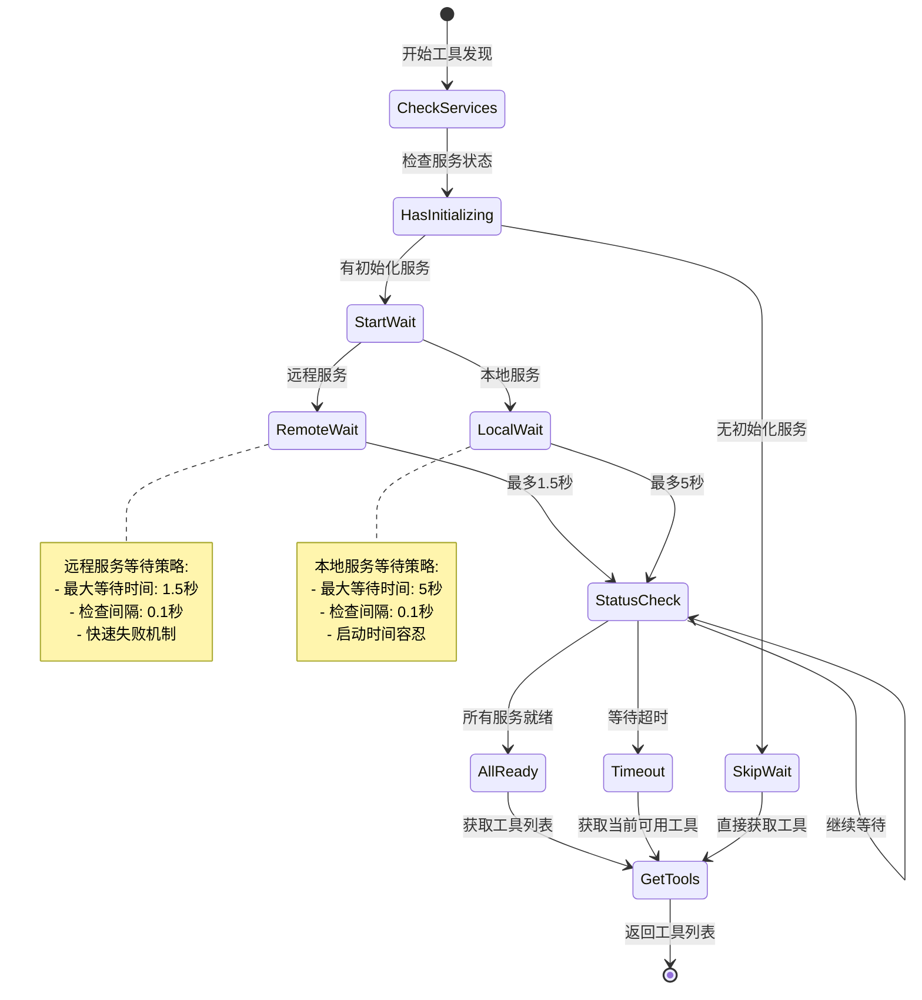
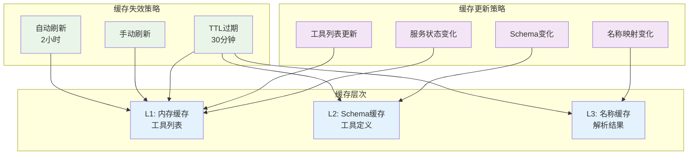
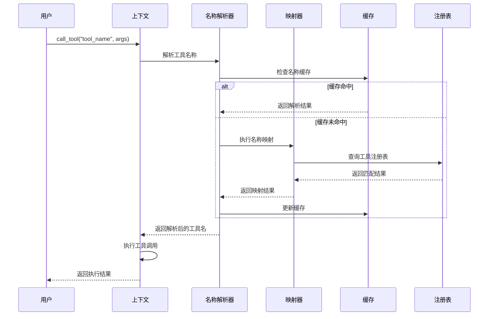
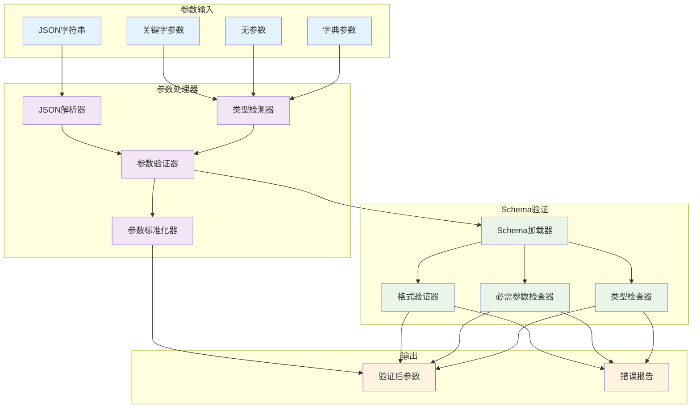
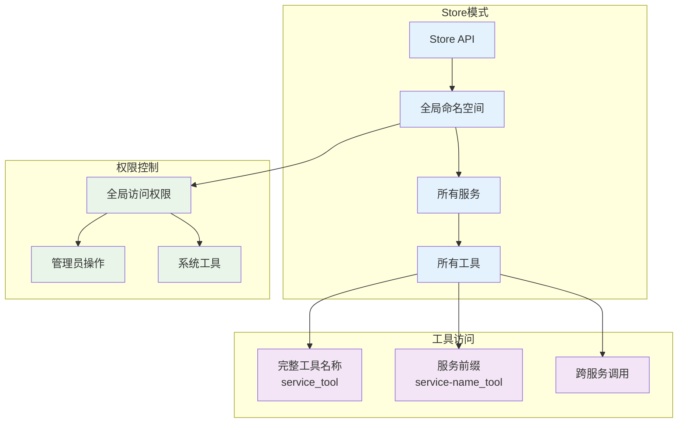
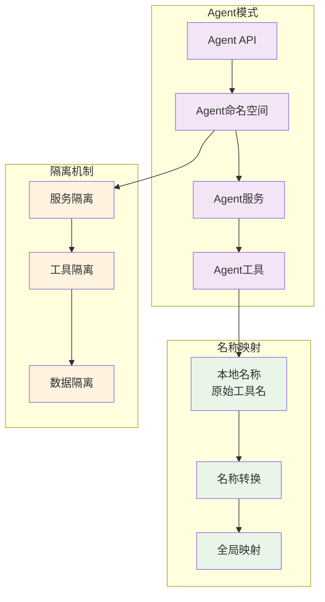
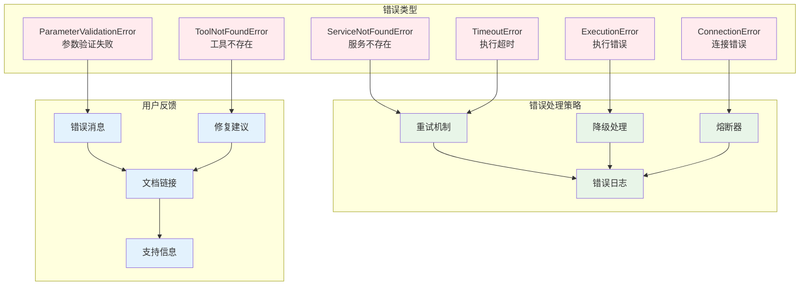
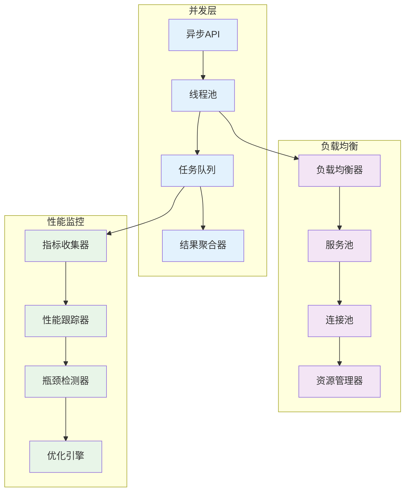
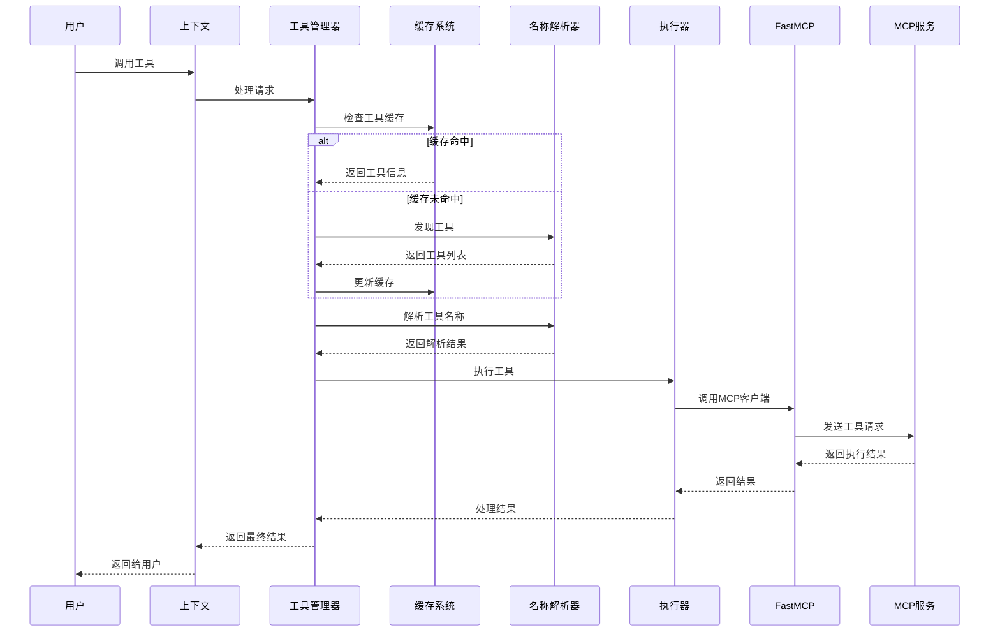

# 工具管理架构

MCPStore 的工具管理系统采用**分层架构设计**，提供完整的工具发现、调用和管理功能，支持 Store/Agent 双模式和智能名称解析机制。

## 🏗️ 整体架构图

```mermaid
graph TB
    subgraph "用户接口层"
        UserAPI[用户API]
        StoreContext[Store上下文]
        AgentContext[Agent上下文]
    end
    
    subgraph "工具管理层"
        ToolManager[工具管理器]
        ToolDiscovery[工具发现器]
        ToolExecutor[工具执行器]
        NameResolver[名称解析器]
    end
    
    subgraph "智能等待系统"
        WaitManager[等待管理器]
        ServiceMonitor[服务监控器]
        TimeoutHandler[超时处理器]
        StateTracker[状态跟踪器]
    end
    
    subgraph "缓存系统"
        ToolCache[工具缓存]
        SchemaCache[Schema缓存]
        NameCache[名称缓存]
        ResultCache[结果缓存]
    end
    
    subgraph "名称映射系统"
        ServiceMapper[服务映射器]
        ToolNameMapper[工具名映射器]
        AgentNamespace[Agent命名空间]
        GlobalNamespace[全局命名空间]
    end
    
    subgraph "执行引擎"
        ParameterProcessor[参数处理器]
        SchemaValidator[Schema验证器]
        ErrorHandler[错误处理器]
        ResultProcessor[结果处理器]
    end
    
    subgraph "底层服务"
        FastMCP[FastMCP客户端]
        MCPServices[MCP服务]
        ServiceRegistry[服务注册表]
    end
    
    %% 用户接口流
    UserAPI --> StoreContext
    UserAPI --> AgentContext
    
    %% 工具管理流
    StoreContext --> ToolManager
    AgentContext --> ToolManager
    
    ToolManager --> ToolDiscovery
    ToolManager --> ToolExecutor
    ToolManager --> NameResolver
    
    %% 智能等待流
    ToolDiscovery --> WaitManager
    WaitManager --> ServiceMonitor
    WaitManager --> TimeoutHandler
    WaitManager --> StateTracker
    
    %% 缓存流
    ToolDiscovery --> ToolCache
    NameResolver --> NameCache
    ToolExecutor --> ResultCache
    
    %% 名称映射流
    NameResolver --> ServiceMapper
    NameResolver --> ToolNameMapper
    AgentContext --> AgentNamespace
    StoreContext --> GlobalNamespace
    
    %% 执行流
    ToolExecutor --> ParameterProcessor
    ToolExecutor --> SchemaValidator
    ToolExecutor --> ErrorHandler
    ToolExecutor --> ResultProcessor
    
    %% 底层服务流
    ToolExecutor --> FastMCP
    ToolDiscovery --> ServiceRegistry
    FastMCP --> MCPServices
    
    %% 样式
    classDef user fill:#e3f2fd
    classDef manager fill:#f3e5f5
    classDef wait fill:#e8f5e8
    classDef cache fill:#fff3e0
    classDef mapper fill:#fce4ec
    classDef executor fill:#f1f8e9
    classDef service fill:#fafafa
    
    class UserAPI,StoreContext,AgentContext user
    class ToolManager,ToolDiscovery,ToolExecutor,NameResolver manager
    class WaitManager,ServiceMonitor,TimeoutHandler,StateTracker wait
    class ToolCache,SchemaCache,NameCache,ResultCache cache
    class ServiceMapper,ToolNameMapper,AgentNamespace,GlobalNamespace mapper
    class ParameterProcessor,SchemaValidator,ErrorHandler,ResultProcessor executor
    class FastMCP,MCPServices,ServiceRegistry service
```

## 🔍 工具发现架构

### 智能等待机制

### 工具缓存策略

## 🎯 工具调用架构

### 名称解析流程

### 参数处理流程

## 🎭 双模式架构

### Store 模式架构

### Agent 模式架构

## 🔧 错误处理架构

### 错误分类和处理

## 📊 性能优化架构

### 并发处理架构

## 🔄 数据流架构

### 完整数据流

## 🎯 架构特点

### 核心优势

1. **分层设计**: 清晰的架构层次，职责分离
2. **智能等待**: 自动等待服务初始化，确保工具完整性
3. **双模式支持**: Store/Agent 模式完全隔离
4. **名称解析**: 智能的工具名称解析和映射
5. **缓存优化**: 多层缓存机制，提升性能
6. **错误处理**: 完整的错误分类和处理策略
7. **并发支持**: 异步并发执行，提高吞吐量
8. **性能监控**: 实时性能监控和优化

### 扩展性

- **插件化架构**: 支持自定义工具处理器
- **中间件支持**: 可插入自定义中间件
- **协议扩展**: 支持多种MCP协议版本
- **存储后端**: 可配置不同的缓存存储

## 🔗 相关文档

- [工具列表概览](listing/tool-listing-overview.md) - 工具发现机制
- [工具使用概览](usage/tool-usage-overview.md) - 工具调用机制
- [服务生命周期](../services/lifecycle/service-lifecycle.md) - 服务管理
- [最佳实践](../advanced/best-practices.md) - 架构最佳实践

## 🎯 下一步

- 深入了解 [工具列表概览](listing/tool-listing-overview.md)
- 学习 [工具使用概览](usage/tool-usage-overview.md)
- 掌握 [服务管理架构](../services/architecture.md)
- 查看 [性能优化指南](../advanced/performance-optimization.md)
