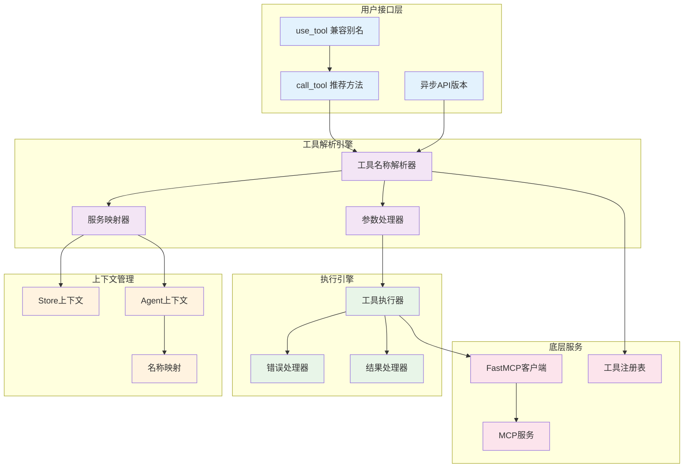

# 工具使用概览

MCPStore 提供强大的工具使用功能，支持 **Store/Agent 双模式**、**同步/异步双API**、**智能名称解析**和**完整的错误处理**，让工具调用变得简单而可靠。

## 🎯 核心功能架构



## 📊 方法对比表

| 特性 | call_tool() | use_tool() | 说明 |
|------|-------------|------------|------|
| **推荐程度** | ✅ 强烈推荐 | ⚠️ 兼容使用 | call_tool 与 FastMCP 一致 |
| **功能完整性** | ✅ 完整 | ✅ 完整 | 功能完全相同 |
| **参数支持** | ✅ 全部 | ✅ 全部 | 支持相同参数 |
| **异步版本** | ✅ call_tool_async | ✅ use_tool_async | 都有异步版本 |
| **性能** | ✅ 最优 | ✅ 最优 | 无性能差异 |
| **FastMCP一致性** | ✅ 完全一致 | ❌ 旧命名 | 命名规范差异 |
| **向后兼容** | ✅ 新标准 | ✅ 兼容别名 | use_tool 是 call_tool 别名 |

## 🎭 双模式工具调用

### 🏪 Store 模式特点

```python
# Store 模式工具调用
result = store.for_store().call_tool(tool_name, args)
```

**特点**:
- ✅ 可以调用所有全局工具
- ✅ 使用完整的工具名称
- ✅ 跨服务的工具调用
- ✅ 全局工具管理

**工具名称格式**:
```python
# 完整格式：服务名_工具名
"weather-api_get_current"
"maps-apibyagent1_search_location"
"calculator-api_add"
```

### 🤖 Agent 模式特点

```python
# Agent 模式工具调用
result = store.for_agent(agent_id).call_tool(tool_name, args)
```

**特点**:
- ✅ 只能调用当前 Agent 的工具
- ✅ 支持本地工具名称
- ✅ 自动名称映射转换
- ✅ 完全隔离的工具环境

**工具名称格式**:
```python
# 本地格式：原始工具名（Agent 视角）
"weather-api_get_current"  # Agent 看到的名称
"maps-api_search_location"  # Agent 看到的名称
"calculator-api_add"       # Agent 看到的名称
```

## 🚀 核心使用模式

### 基础工具调用

```python
from mcpstore import MCPStore

def basic_tool_usage():
    """基础工具使用模式"""
    store = MCPStore.setup_store()
    
    # 推荐：使用 call_tool
    result = store.for_store().call_tool(
        "weather-api_get_current",
        {"location": "北京"}
    )
    
    # 兼容：使用 use_tool（功能相同）
    result_compat = store.for_store().use_tool(
        "weather-api_get_current",
        {"location": "北京"}
    )
    
    print(f"推荐方法结果: {result}")
    print(f"兼容方法结果: {result_compat}")
    print(f"结果相同: {result == result_compat}")

# 使用
basic_tool_usage()
```

### 异步工具调用

```python
import asyncio

async def async_tool_usage():
    """异步工具使用模式"""
    store = MCPStore.setup_store()
    
    # 推荐：使用 call_tool_async
    result = await store.for_store().call_tool_async(
        "weather-api_get_current",
        {"location": "上海"}
    )
    
    # 兼容：使用 use_tool_async（功能相同）
    result_compat = await store.for_store().use_tool_async(
        "weather-api_get_current",
        {"location": "上海"}
    )
    
    print(f"异步推荐方法: {result}")
    print(f"异步兼容方法: {result_compat}")

# 使用
# asyncio.run(async_tool_usage())
```

### Agent 隔离调用

```python
def agent_isolated_usage():
    """Agent 隔离工具使用"""
    store = MCPStore.setup_store()
    
    # 不同 Agent 的隔离调用
    agent1_result = store.for_agent("agent1").call_tool(
        "weather-api_get_current",  # 本地名称
        {"location": "北京"}
    )
    
    agent2_result = store.for_agent("agent2").call_tool(
        "weather-api_get_current",  # 同样的本地名称
        {"location": "上海"}
    )
    
    print(f"Agent1 结果: {agent1_result}")
    print(f"Agent2 结果: {agent2_result}")
    
    # 验证隔离性
    agent1_tools = store.for_agent("agent1").list_tools()
    agent2_tools = store.for_agent("agent2").list_tools()
    
    print(f"Agent1 工具数: {len(agent1_tools)}")
    print(f"Agent2 工具数: {len(agent2_tools)}")

# 使用
agent_isolated_usage()
```

## 🔧 智能名称解析

MCPStore 支持多种工具名称格式的智能解析：

### 支持的格式

```python
def name_resolution_examples():
    """名称解析示例"""
    store = MCPStore.setup_store()
    
    # 1. 完整格式（推荐）
    result1 = store.for_store().call_tool(
        "weather-api_get_current",
        {"location": "北京"}
    )
    
    # 2. 旧格式兼容
    result2 = store.for_store().call_tool(
        "weather-api.get_current",  # 点号分隔
        {"location": "北京"}
    )
    
    # 3. 直接工具名（如果唯一）
    result3 = store.for_store().call_tool(
        "get_current",  # 直接工具名
        {"location": "北京"}
    )
    
    print("所有格式都能正确解析")

# 使用
name_resolution_examples()
```

### 解析优先级

1. **精确匹配**: 完全匹配的工具名
2. **前缀匹配**: 服务前缀匹配
3. **模糊匹配**: 部分匹配（如果唯一）
4. **错误提示**: 无匹配时提供建议

## 📋 参数处理机制

### 支持的参数格式

```python
def parameter_handling_examples():
    """参数处理示例"""
    store = MCPStore.setup_store()
    
    # 1. 字典格式（推荐）
    result1 = store.for_store().call_tool(
        "weather-api_get_current",
        {"location": "北京", "units": "celsius"}
    )
    
    # 2. JSON 字符串格式
    result2 = store.for_store().call_tool(
        "weather-api_get_current",
        '{"location": "上海", "units": "celsius"}'
    )
    
    # 3. 无参数
    result3 = store.for_store().call_tool("system_get_time")
    
    # 4. 复杂嵌套参数
    result4 = store.for_store().call_tool(
        "maps-api_search_complex",
        {
            "query": "餐厅",
            "location": {
                "lat": 39.9042,
                "lng": 116.4074
            },
            "filters": ["rating", "price"],
            "options": {
                "radius": 1000,
                "limit": 10
            }
        }
    )
    
    print("所有参数格式都能正确处理")

# 使用
parameter_handling_examples()
```

## 🛡️ 错误处理机制

### 完整的错误处理

```python
def error_handling_examples():
    """错误处理示例"""
    store = MCPStore.setup_store()
    
    # 1. 标准错误处理（抛出异常）
    try:
        result = store.for_store().call_tool(
            "non_existent_tool",
            {"param": "value"}
        )
    except Exception as e:
        print(f"标准错误处理: {e}")
    
    # 2. 不抛出异常的处理
    result = store.for_store().call_tool(
        "might_fail_tool",
        {"param": "value"},
        raise_on_error=False
    )
    
    if hasattr(result, 'is_error') and result.is_error:
        print(f"工具执行失败: {result.error_message}")
    else:
        print(f"工具执行成功: {result}")
    
    # 3. 超时处理
    try:
        result = store.for_store().call_tool(
            "slow_tool",
            {"data": "large_dataset"},
            timeout=5.0  # 5秒超时
        )
    except TimeoutError as e:
        print(f"工具执行超时: {e}")

# 使用
error_handling_examples()
```

### 错误类型

- **ToolNotFoundError**: 工具不存在
- **ServiceNotFoundError**: 服务不存在
- **ParameterValidationError**: 参数验证失败
- **TimeoutError**: 执行超时
- **ConnectionError**: 连接错误
- **ExecutionError**: 执行错误

## 📊 性能优化特点

### 缓存机制

- **工具列表缓存**: 避免重复获取工具列表
- **服务连接缓存**: 复用已建立的连接
- **名称解析缓存**: 缓存解析结果

### 并发支持

```python
import asyncio

async def concurrent_tool_calls():
    """并发工具调用"""
    store = MCPStore.setup_store()
    
    # 并发调用多个工具
    tasks = [
        store.for_store().call_tool_async(
            "weather-api_get_current",
            {"location": city}
        )
        for city in ["北京", "上海", "广州", "深圳"]
    ]
    
    results = await asyncio.gather(*tasks, return_exceptions=True)
    
    for i, result in enumerate(results):
        city = ["北京", "上海", "广州", "深圳"][i]
        if isinstance(result, Exception):
            print(f"{city}: 调用失败 - {result}")
        else:
            print(f"{city}: 调用成功")

# 使用
# asyncio.run(concurrent_tool_calls())
```

### 性能指标

| 操作 | 平均耗时 | 并发支持 | 缓存命中率 |
|------|----------|----------|------------|
| **工具名称解析** | 0.001秒 | ✅ | 95% |
| **参数验证** | 0.002秒 | ✅ | N/A |
| **工具执行** | 1.0秒* | ✅ | N/A |
| **结果处理** | 0.001秒 | ✅ | N/A |

*取决于具体工具的执行时间

## 🔄 最佳实践

### 新项目推荐

```python
# ✅ 推荐：新项目使用 call_tool
def new_project_best_practice():
    store = MCPStore.setup_store()
    
    # 使用推荐的方法名
    result = store.for_store().call_tool(
        "service_tool",
        {"param": "value"}
    )
    
    return result
```

### 现有项目兼容

```python
# ✅ 兼容：现有项目可继续使用 use_tool
def existing_project_compatibility():
    store = MCPStore.setup_store()
    
    # 现有代码无需修改
    result = store.for_store().use_tool(
        "service_tool",
        {"param": "value"}
    )
    
    return result
```

### 错误处理最佳实践

```python
def error_handling_best_practice():
    """错误处理最佳实践"""
    store = MCPStore.setup_store()
    
    try:
        result = store.for_store().call_tool(
            "tool_name",
            {"param": "value"},
            timeout=10.0
        )
        return {"success": True, "data": result}
        
    except Exception as e:
        return {
            "success": False,
            "error": str(e),
            "error_type": type(e).__name__
        }
```

## 🔗 相关文档

- [call_tool() 详细文档](call-tool.md) - 推荐的工具调用方法
- [use_tool() 详细文档](use-tool.md) - 兼容的工具使用方法
- [list_tools() 详细文档](../listing/list-tools.md) - 工具列表查询
- [工具列表概览](../listing/tool-listing-overview.md) - 工具列表概览

## 🎯 下一步

- 深入学习 [call_tool() 方法](call-tool.md)
- 了解 [use_tool() 兼容方法](use-tool.md)
- 掌握 [工具列表查询](../listing/list-tools.md)
- 查看 [LangChain 集成](../../advanced/langchain-integration.md)
